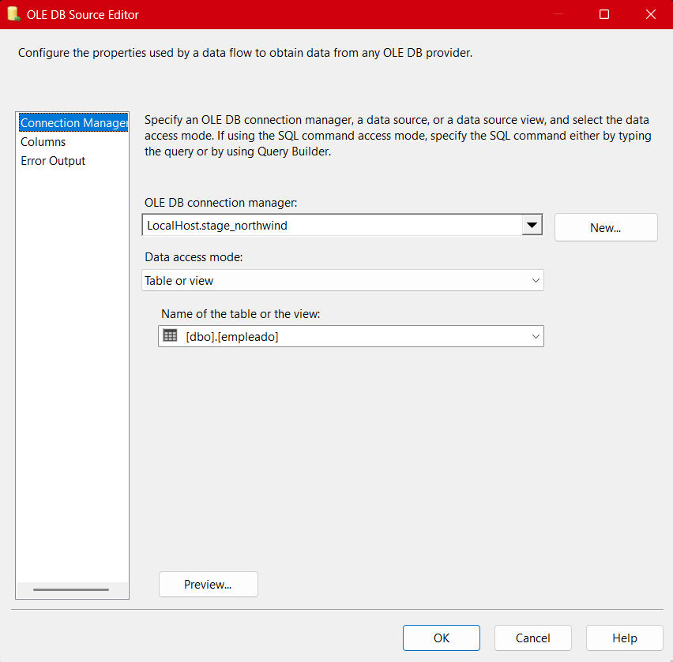
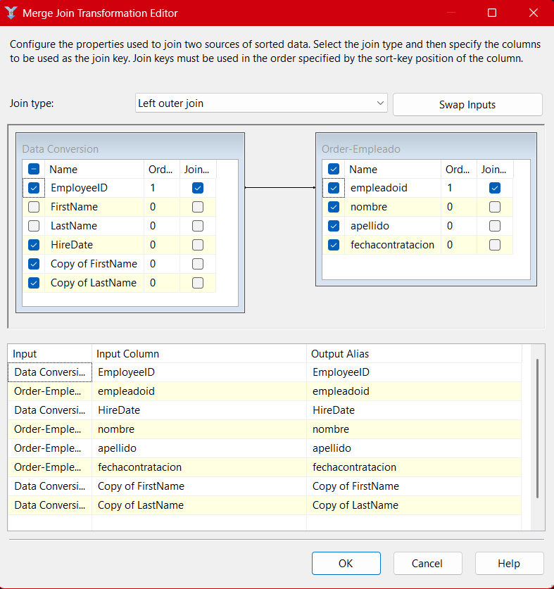
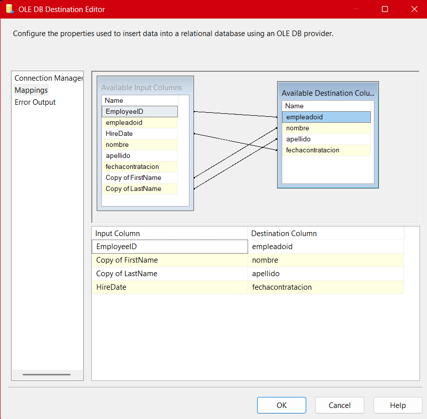

# **Documentación del Proceso ETL para la Tabla de Empleados (Package-01)**

## **Descripción general**

El paquete **01-stage-employee.dtsx** es el primer eslabón en la secuencia de procesos ETL implementados para el proyecto Northwind. En este documento se detalla **todo el flujo ETL aplicado a la tabla de empleados**, desde la extracción hasta la carga en la base de datos intermedia, explicando cada componente, su función, la lógica aplicada y los retos que enfrentamos al construir este flujo.

El diseño de este flujo ETL se utilizó para entender conceptos como integración de datos heterogéneos, conversiones de tipo, manejo de duplicados, aplicación de joins, filtrado de datos y automatización de cargas incrementales.

---

## Arquitectura General del Paquete (SSIS)

El flujo de datos de este paquete sigue un diseño estándar y didáctico, pensado para enseñar las mejores prácticas de ETL. Los pasos clave son:

1. **Extracción de datos desde dos orígenes** (OLE DB Source)
2. **Conversión de tipos de datos** (Data Conversion)
3. **Ordenamiento de datos** (Sort, si es necesario para el Merge Join)
4. **Comparación con la tabla destino usando Join** (Merge Join)
5. **Filtrado de nuevos registros** (Conditional Split)
6. **Carga de datos en la tabla Stage** (OLE DB Destination)


A continuación, explico cada componente y etapa del flujo, integrando la lógica, buenas prácticas y problemas comunes.

---

## 1. Extracción de datos (OLE DB Source)

### a) Conexión al origen Northwind

Se utiliza un **OLE DB Source** conectado a la base de datos **Northwind** para extraer los registros de empleados. Aquí se configura una consulta SQL personalizada:

```sql
SELECT EmployeeID, FirstName, LastName, HireDate
FROM Northwind.dbo.Employees;
```

- **¿Por qué una consulta?** Permite elegir sólo las columnas necesarias, optimizando el rendimiento y el ancho de banda.
- **Errores comunes:** No filtrar columnas puede traer datos innecesarios y afectar la velocidad del ETL.


### b) Conexión al destino Stage_Northwind

El segundo **OLE DB Source** se conecta a la tabla `empleado` de **Stage_Northwind**, obteniendo el estado actual de la tabla destino.

- **¿Por qué?** Esto permite comparar los datos de origen con los existentes y evitar duplicados en la carga.
- **Práctica recomendada:** Seleccionar las mismas columnas clave y de control.

## 

## 2. Conversión de Tipos de Datos (Data Conversion)

En este paso, se utiliza el componente **Data Conversion** para convertir los tipos de datos del origen a los requeridos por el destino. Por ejemplo, convertir `nvarchar` a `varchar`, o ajustar la longitud de campos string.

- **¿Por qué es importante?** Si los tipos no coinciden, el paquete fallará al intentar insertar los datos en el destino.
- **Aprendizaje en clase:** Los profesores deliberadamente pusieron tipos distintos para enseñarnos la importancia y la técnica de las conversiones.
- **Errores comunes:** No mapear adecuadamente los tipos o la longitud de cadenas, lo que genera truncamientos o errores de incompatibilidad.

## 

## 3. Ordenamiento de Datos (Sort, opcional pero recomendado)

El **Merge Join** requiere que ambas fuentes de datos estén ordenadas por las claves que se usarán para hacer la unión. Si las fuentes no están ordenadas, se debe agregar un componente **Sort** antes del Merge Join.

- **¿Por qué ordenar?** Sin orden, el Merge Join arrojará error y no funcionará.
- **Recomendación:** Ordenar por `EmployeeID` o la clave primaria relevante.

---

## 4. Comparación y Unión de Datos (Merge Join / Left Join)

El componente **Merge Join** es fundamental para comparar los registros del origen con los existentes en la Stage. En este caso, se suele utilizar un **Left Outer Join** para identificar nuevos registros.

- **Motivo:** Nos interesa saber qué empleados existen en Northwind que aún **no** están en Stage.
- **Aplicación de conocimientos:** En clase aprendimos a usar left, right e inner joins para diferentes casos. Aquí, el left join nos ayuda a distinguir los registros nuevos.
- **Errores comunes:** No ordenar las fuentes previamente, no mapear correctamente las columnas de unión.



---

## 5. Filtrado de Nuevos Registros (Conditional Split)

Una vez combinados los datos, se utiliza el **Conditional Split** para filtrar **sólo** los registros nuevos (por ejemplo, aquellos donde el `empleadoid` en Stage es `NULL`).

- **Ejemplo de condición:**
  `ISNULL(empleadoid)`
- **¿Por qué hacerlo?** Así evitamos sobrescribir registros existentes y sólo insertamos los nuevos.
- **Mejor práctica:** Documentar siempre la lógica de tus splits para facilitar mantenimiento futuro.


---

## 6. Carga de Datos en Stage (OLE DB Destination)

Finalmente, los registros filtrados como nuevos se cargan en la tabla `empleado` de **Stage_Northwind** usando un **OLE DB Destination**.

- **Mapeo de columnas:** Debes asegurarte de que cada campo del flujo de datos corresponda al campo correcto en la tabla destino.
- **Validación:** Es recomendable ejecutar primero en modo test (Data Viewer o modo debug) para confirmar que los registros se insertan correctamente.




---

## 7. Resumen Visual del Flujo Completo

El **Data Flow** del paquete se puede visualizar en SSIS, mostrando cada componente y la ruta de los datos desde el origen hasta el destino.

**Imagen sugerida:**


---

## Buenas Prácticas y Observaciones

- **Control de errores:** Configura salidas de error en los componentes críticos (Data Conversion, Merge Join) para capturar y analizar posibles fallos de datos.
- **Documentación:** Usa los descriptores y notas en cada componente dentro de SSIS para dejar clara la intención de cada paso.
- **Reusabilidad:** La arquitectura de este paquete es una plantilla que puedes replicar en otros paquetes de Stage (productos, clientes, ventas, etc.).
- **Optimización:** Si el volumen de datos es grande, analiza la posibilidad de particionar cargas o usar Bulk Insert.

---

## Consideraciones Didácticas y Experiencia de Aprendizaje

- **Diferencias de tipos de datos:** La intención didáctica de poner tipos incompatibles es que los estudiantes comprendan la importancia de planear y documentar la estructura de sus bases de datos desde el diseño.
- **Uso de SQL para consultas:** Realizar las extracciones mediante consultas SQL permite personalizar los datos, agregar filtros y reducir el consumo de recursos.
- **Merge Join como ejercicio práctico:** Aprender a usar distintos tipos de join (left, right, inner) es clave para el manejo avanzado de datos.
- **Conditional Split y cargas incrementales:** El filtrado incremental es una habilidad crítica en ETL real, donde rara vez se desea sobrescribir tablas completas.

---

## Conclusión

El paquete **01-stage-employee.dtsx** es representativo del flujo ETL típico de todo el proyecto Northwind. Su objetivo es **asegurar la integridad, consistencia y actualización de los datos de empleados en la base Stage**, aplicando técnicas fundamentales de integración de datos que podrás reutilizar y adaptar en cualquier entorno profesional de analítica y gestión empresarial.

---
