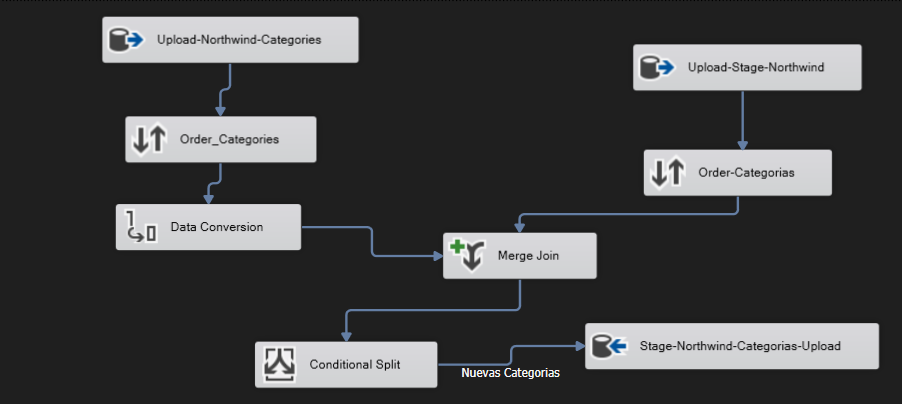
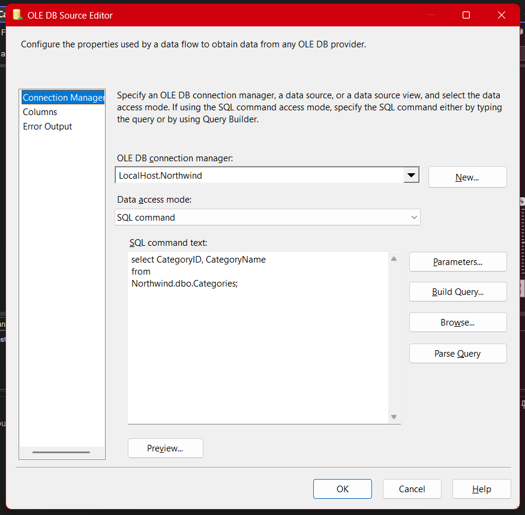
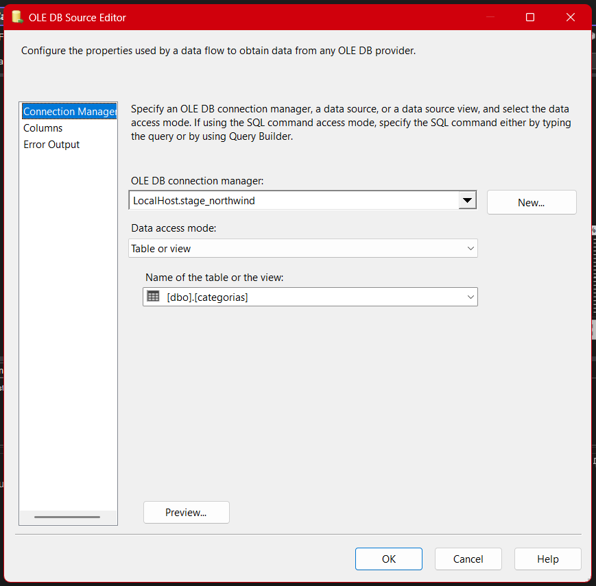
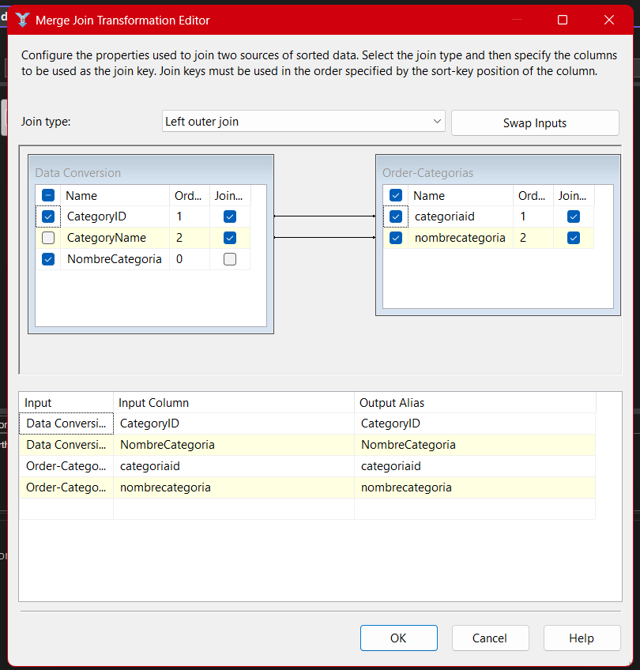
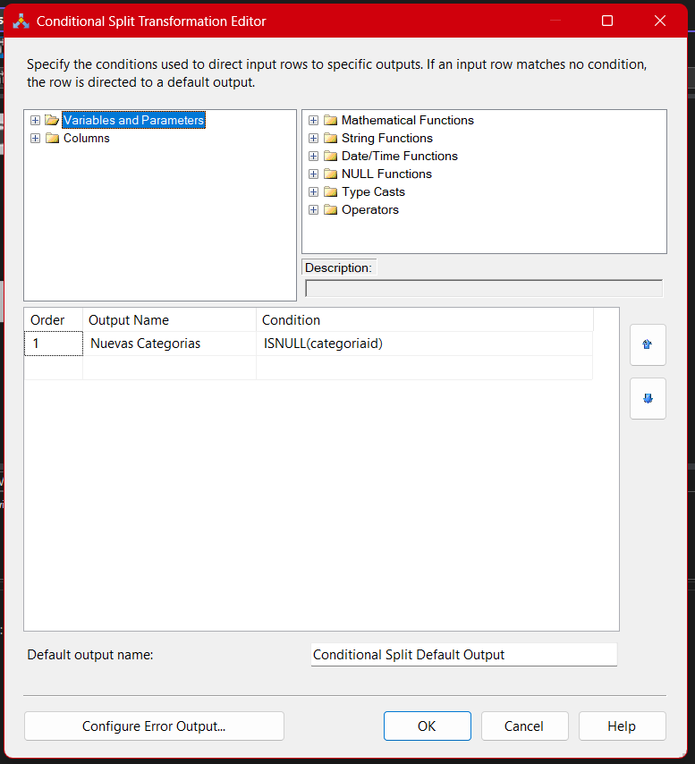
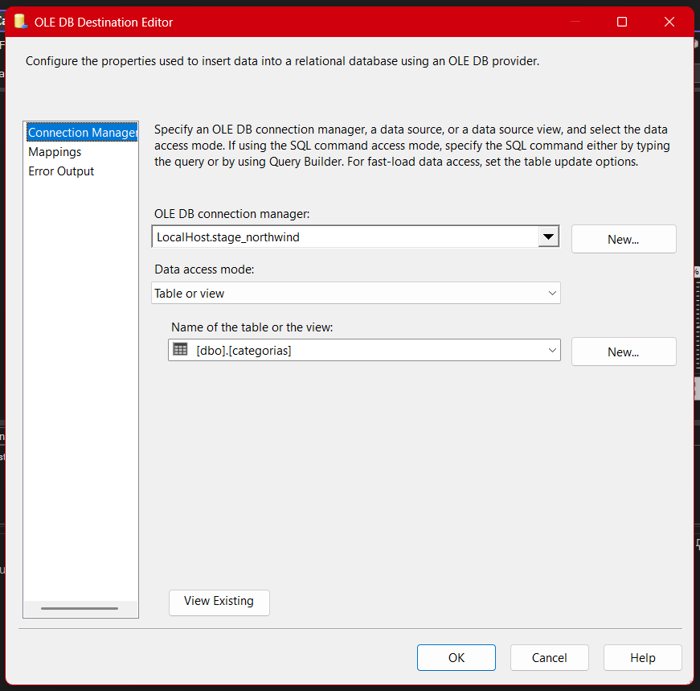
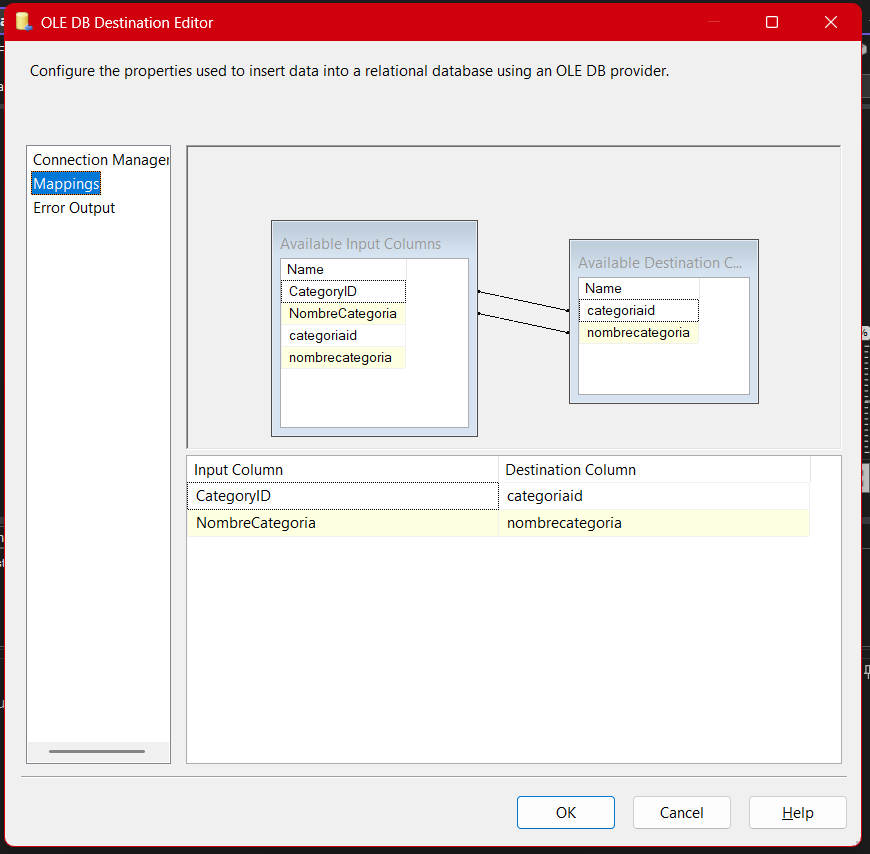

# **Documentación del Proceso ETL para la Tabla de Categorías (Package-02)**

## **Descripción general**

El paquete **02-stage-categoria.dtsx** representa el proceso ETL aplicado a la tabla de **Categorías** dentro del proyecto Northwind. Aquí se describe a detalle el flujo desde la extracción, transformación y carga de datos en la base intermedia, enfatizando la lógica de integración, comparación de registros y buenas prácticas específicas para la migración de datos de categorías.

---

## Arquitectura General del Paquete (SSIS)

El flujo de datos de este paquete sigue la plantilla estándar aprendida en clase, asegurando integridad y claridad en cada paso. Los pasos clave son:

1. **Extracción de datos desde dos orígenes** (OLE DB Source)
2. **Conversión de tipos de datos** (Data Conversion)
3. **Ordenamiento de datos** (Sort, si es necesario para el Merge Join)
4. **Comparación con la tabla destino usando Join** (Merge Join)
5. **Filtrado de nuevos registros** (Conditional Split)
6. **Carga de datos en la tabla Stage** (OLE DB Destination)



---

## 1. Extracción de datos (OLE DB Source)

### a) Conexión al origen Northwind

Se utiliza un **OLE DB Source** conectado a **Northwind** para extraer los registros actuales de categorías.
Aquí se configura la siguiente consulta SQL:

```sql
SELECT CategoryID, CategoryName
FROM Northwind.dbo.Categories;
```

- **¿Por qué una consulta?** Permite traer sólo los campos relevantes, haciendo el flujo más eficiente.
- **Errores comunes:** Traer columnas innecesarias puede complicar la transformación y enlentecer el flujo.



### b) Conexión al destino Stage_Northwind

El segundo **OLE DB Source** se conecta a la tabla `[categorias]` de **Stage_Northwind**, obteniendo el estado actual de la tabla destino.

- **¿Por qué?** Esto permite comparar los datos nuevos contra los ya existentes y así evitar duplicados.
- **Práctica recomendada:** Seleccionar siempre los mismos campos clave para la comparación.



---

## 2. Conversión de Tipos de Datos (Data Conversion)

Se utiliza **Data Conversion** para convertir los tipos de datos provenientes del origen al formato requerido por la tabla de destino.
En este caso, por ejemplo, se convierte el `CategoryName` para que coincida en longitud y tipo con el destino.

- **¿Por qué?** Si el tipo no coincide exactamente, la inserción puede fallar o truncar datos.
- **Errores comunes:** No ajustar el tamaño de los strings puede cortar nombres largos o generar incompatibilidad.


---

## 3. Ordenamiento de Datos (Sort, opcional pero recomendado)

El **Merge Join** requiere que ambas fuentes estén ordenadas por la(s) clave(s) de unión, normalmente `CategoryID`.

- **¿Por qué ordenar?** Es requisito del Merge Join en SSIS.
- **Recomendación:** Asegúrate de que ambas fuentes usen el mismo criterio de orden.

---

## 4. Comparación y Unión de Datos (Merge Join / Left Join)

El componente **Merge Join** se utiliza aquí con un **Left Outer Join** para comparar los registros extraídos de Northwind contra los de Stage y así identificar cuáles son nuevos.

- **Motivo:** Insertar solo las nuevas categorías, evitando duplicados.
- **Experiencia en clase:** El uso de Left Join permite detectar los registros que están en Northwind y no en Stage.
- **Errores comunes:** No ordenar las fuentes, o mapear mal los campos clave.



---

## 5. Filtrado de Nuevos Registros (Conditional Split)

Se emplea **Conditional Split** para filtrar solo las categorías nuevas, es decir, donde el campo clave `categoriaid` en Stage es NULL.

- **Ejemplo de condición:**
  `ISNULL(categoriaid)`
- **¿Por qué?** Para no sobrescribir categorías existentes y solo insertar las que realmente son nuevas.
- **Tip:** Documenta la lógica de cada split para facilitar el mantenimiento futuro.



---

## 6. Carga de Datos en Stage (OLE DB Destination)

Las nuevas categorías se cargan en la tabla `[categorias]` de **Stage_Northwind** usando un **OLE DB Destination**.

- **Mapeo de columnas:** Asegura que cada campo en el flujo vaya a la columna correcta en destino.
- **Validación:** Se recomienda probar con pocos registros antes de cargar en producción.



## 

## 7. Resumen Visual del Flujo Completo

El **Data Flow** de este paquete en SSIS muestra todos los componentes conectados, facilitando la comprensión del proceso.


---

## Buenas Prácticas y Observaciones

- **Control de errores:** Usa las salidas de error de los componentes (especialmente Data Conversion y Merge Join) para capturar datos problemáticos.
- **Documenta tus flujos:** Escribe comentarios o notas en los componentes de SSIS.
- **Reutiliza la estructura:** Esta plantilla de paquete es útil para cualquier dimensión con lógica de actualización incremental.
- **Prueba incremental:** Antes de correr el paquete en masa, prueba la lógica con un subconjunto de registros.

---

## Consideraciones Didácticas y Experiencia de Aprendizaje

- **Conversión de tipos:** Te ayudará a comprender los problemas típicos de integración de datos entre sistemas distintos.
- **Left Join vs Inner Join:** Aprenderás a seleccionar la mejor unión según el objetivo (detección de nuevos, actualización, eliminación lógica).
- **Uso de Conditional Split:** Es clave para realizar cargas incrementales, evitando sobrescribir o duplicar datos.

---

## Conclusión

El paquete **02-stage-categoria.dtsx** ilustra perfectamente la lógica de integración incremental y controlada para la dimensión de categorías. Es un ejemplo de cómo puedes automatizar la migración y actualización de información esencial, asegurando calidad y evitando redundancias.

---
