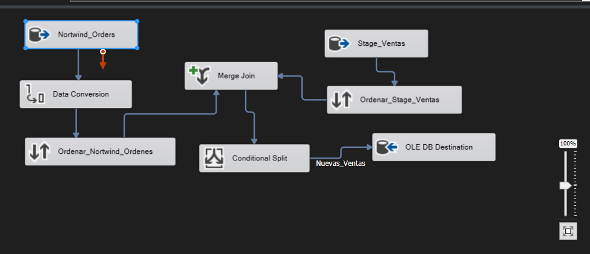
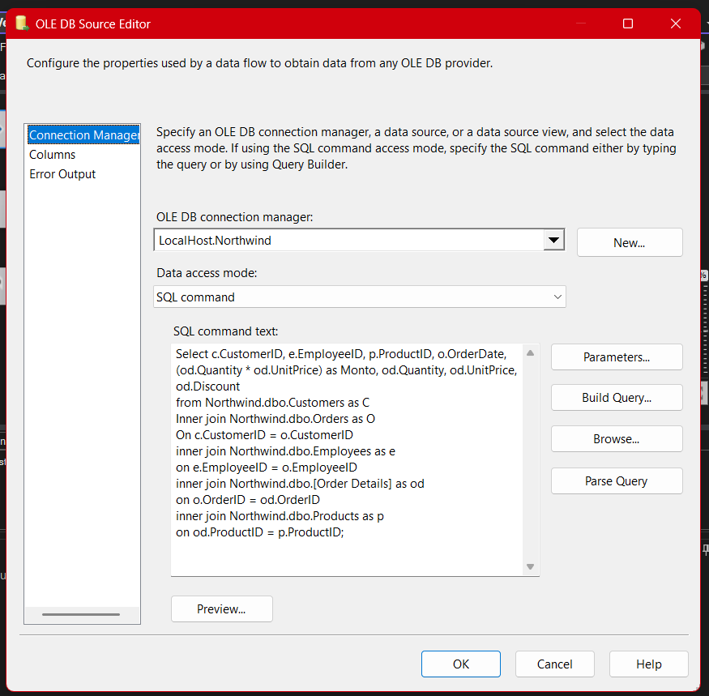
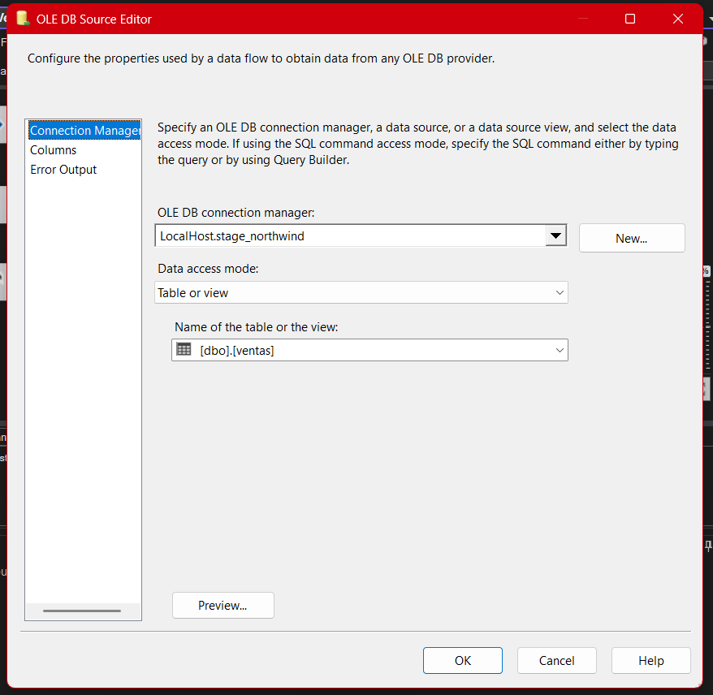
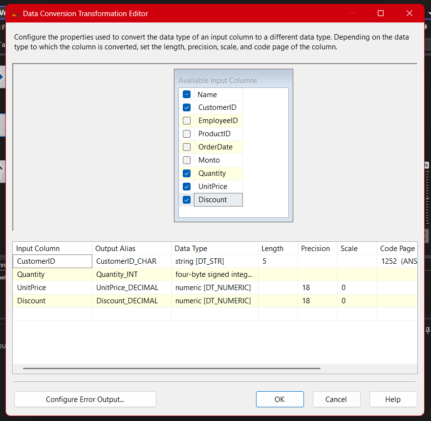
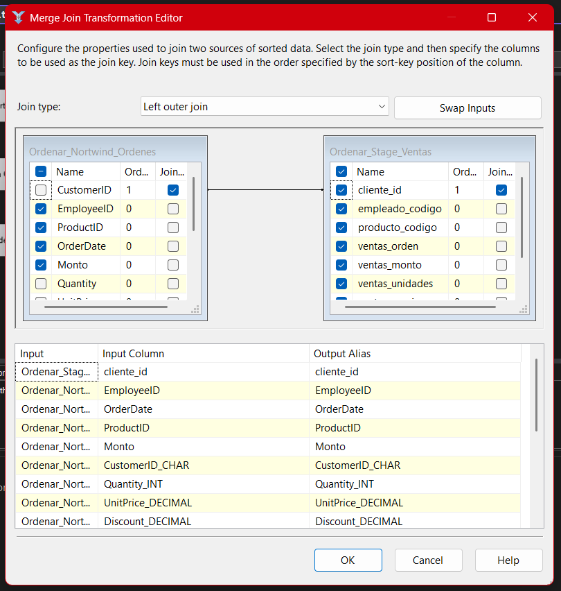
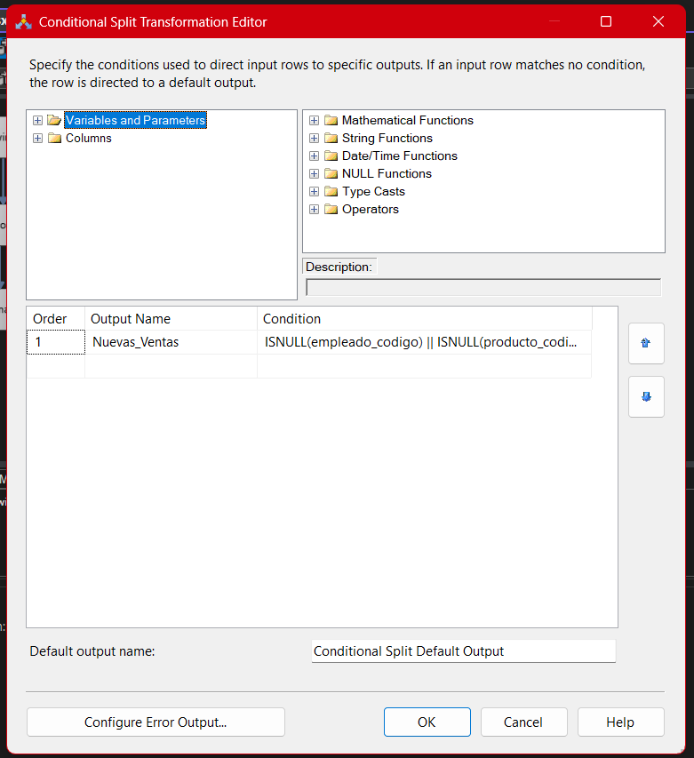
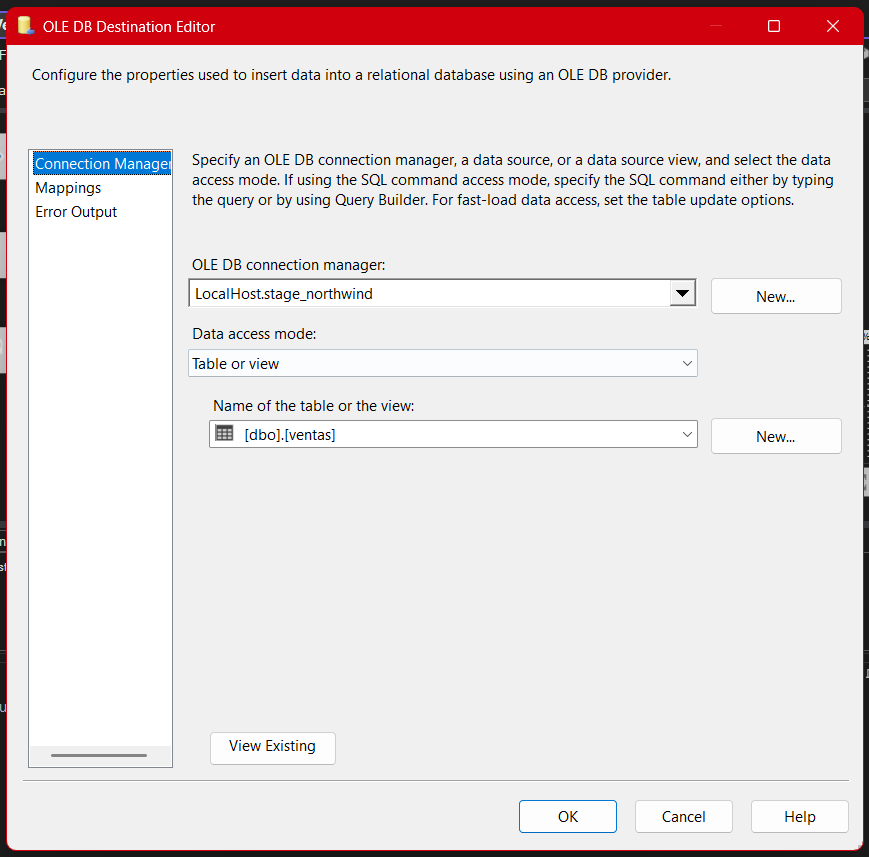
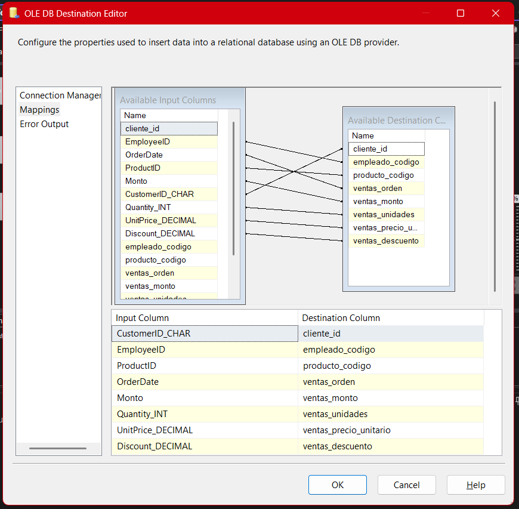

# **Documentación del Proceso ETL para la Tabla de Ventas (Package-04)**

## **Descripción general**

El paquete **04-Stage-Ventas.dtsx** implementa el flujo ETL para la integración y carga incremental de los datos de ventas en el proyecto Northwind. Este flujo está orientado a la extracción de información de ventas distribuida en múltiples tablas del origen transaccional, la transformación de tipos de datos y la detección precisa de nuevas ventas, para su carga en la base intermedia de Stage.

En este documento se explican **todas las etapas y componentes** del flujo de datos, desde la consulta SQL de extracción hasta el mapeo final en la tabla destino, así como los aprendizajes y retos clave del proceso.

---

## Arquitectura General del Paquete (SSIS)

La arquitectura de este paquete sigue el diseño estándar didáctico para cargas incrementales:

1. **Extracción de datos combinados del origen (OLE DB Source con SQL personalizado)**
2. **Conversión de tipos de datos (Data Conversion)**
3. **Ordenamiento previo a la unión (Sort)**
4. **Comparación con la tabla destino mediante Join (Merge Join)**
5. **Filtrado de nuevas ventas (Conditional Split)**
6. **Carga en la tabla Stage (OLE DB Destination)**



A continuación se explica el rol y detalle de cada componente, incluyendo buenas prácticas y errores frecuentes a evitar.

---

## 1. Extracción de datos (OLE DB Source)

### a) Conexión al origen Northwind - Ventas

Se utiliza un **OLE DB Source** para conectar a la base de datos Northwind y extraer la información de ventas mediante una consulta SQL avanzada que realiza varios joins. Así obtenemos un dataset enriquecido con información de clientes, empleados, productos y detalle de cada venta.

```sql
SELECT
  c.CustomerID,
  e.EmployeeID,
  p.ProductID,
  o.OrderDate,
  (od.Quantity * od.UnitPrice) as Monto,
  od.Quantity,
  od.UnitPrice,
  od.Discount
FROM Northwind.dbo.Customers as c
INNER JOIN Northwind.dbo.Orders as o ON c.CustomerID = o.CustomerID
INNER JOIN Northwind.dbo.Employees as e ON e.EmployeeID = o.EmployeeID
INNER JOIN Northwind.dbo.[Order Details] as od ON o.OrderID = od.OrderID
INNER JOIN Northwind.dbo.Products as p ON od.ProductID = p.ProductID;
```

- **Ventaja:** Nos permite extraer todos los datos relevantes de una venta en un solo paso, optimizando la transformación posterior.
- **Aprendizaje:** Se refuerza el uso de SQL para explotar relaciones y reducir la complejidad dentro de SSIS.
- **Error común:** Malos joins pueden provocar duplicados o pérdidas de información.



### b) Conexión al destino Stage_Northwind - Ventas

Un segundo **OLE DB Source** se conecta a la tabla `ventas` en la base intermedia de Stage. Esto es clave para realizar la comparación y así identificar ventas nuevas y evitar duplicados en la carga.

- **Práctica recomendada:** Extraer solo las columnas clave de la tabla destino para una comparación eficiente.



---

## 2. Conversión de Tipos de Datos (Data Conversion)

En este paso se realiza la conversión de los tipos de datos provenientes del origen a los formatos requeridos por la tabla destino. Por ejemplo:

- `CustomerID` a string de longitud fija
- `Quantity` a entero
- `UnitPrice` y `Discount` a decimal con la precisión necesaria

Esto evita errores de incompatibilidad al momento de la carga.

- **Errores comunes:** Truncamiento de datos por longitudes insuficientes, errores por diferencias de tipo numérico.
- **Aprendizaje:** La práctica de conversión es esencial para garantizar integridad y compatibilidad entre sistemas heterogéneos.

## 

## 3. Ordenamiento de Datos (Sort, indispensable para Merge Join)

El componente **Sort** ordena los datos por las columnas clave antes de realizar el join. Esto es un requerimiento para que el **Merge Join** funcione correctamente.

- **Recomendación:** Ordenar siempre por las claves de comparación (`CustomerID`, `ProductID`, `OrderDate`, etc.).
- **Error frecuente:** No ordenar provoca que el Merge Join arroje error o resultados inconsistentes.

---

## 4. Comparación y Unión de Datos (Merge Join / Left Join)

El **Merge Join** implementa un **left outer join** entre los datos recién extraídos y los existentes en la tabla Stage. Esto permite comparar ambos conjuntos y encontrar las ventas nuevas que aún no han sido cargadas.

- **Ventaja:** El left join garantiza que solo se identifiquen y carguen registros nuevos.
- **Error común:** No mapear correctamente las columnas de unión lleva a falsos positivos o negativos en la detección de cambios.



---

## 5. Filtrado de Nuevas Ventas (Conditional Split)

El **Conditional Split** filtra los registros que corresponden a nuevas ventas, normalmente utilizando una condición sobre columnas nulas (por ejemplo, cuando alguna clave en el Stage es NULL, indica que el registro es nuevo):

```
ISNULL(empleado_codigo) || ISNULL(producto_codigo)
```

- **Motivo:** Así se asegura que sólo se insertarán ventas no existentes previamente, evitando duplicados.
- **Aprendizaje:** Filtrado incremental, esencial para ETLs robustos y eficientes.



---

## 6. Carga de Datos en Stage (OLE DB Destination)

Los registros nuevos identificados se cargan en la tabla `ventas` de **Stage_Northwind** utilizando el componente **OLE DB Destination**. Es crucial mapear correctamente cada columna de entrada con la correspondiente columna de destino.

- **Sugerencia:** Siempre validar el mapeo y hacer pruebas con pocos registros antes de procesar cargas masivas.





---

## 7. Resumen Visual del Flujo Completo

El flujo general es visualizado directamente en SSIS, mostrando claramente cómo fluyen los datos a través de cada transformación hasta llegar a la tabla destino.


---

## Buenas Prácticas y Observaciones

- **Control de errores:** Configura rutas de error en Data Conversion y Merge Join para capturar filas problemáticas.
- **Documentación interna:** Usa descripciones en los componentes para facilitar el mantenimiento y auditoría.
- **Reusabilidad:** El diseño modular permite replicar el flujo para otras tablas transaccionales o dimensiones.
- **Optimización:** Analiza el uso de índices en las tablas de origen y destino para acelerar el proceso ETL.

---

## Consideraciones Didácticas y Experiencia de Aprendizaje

- **Consultas SQL complejas:** Aprender a combinar múltiples tablas y entender la relación entre entidades es esencial para procesos ETL avanzados.
- **Conversión de tipos:** La variedad de tipos en los orígenes obliga a dominar la conversión y validación de datos.
- **Carga incremental:** El uso de joins y splits incrementales es clave en ambientes reales donde no se pueden sobrescribir datos constantemente.

---

## Conclusión

El paquete **04-stage-ventas.dtsx** es un ejemplo completo de integración y transformación de datos complejos en un entorno empresarial. Este proceso asegura la **actualización eficiente y confiable** de la información de ventas en la base Stage, permitiendo análisis precisos y soporte a la toma de decisiones.
