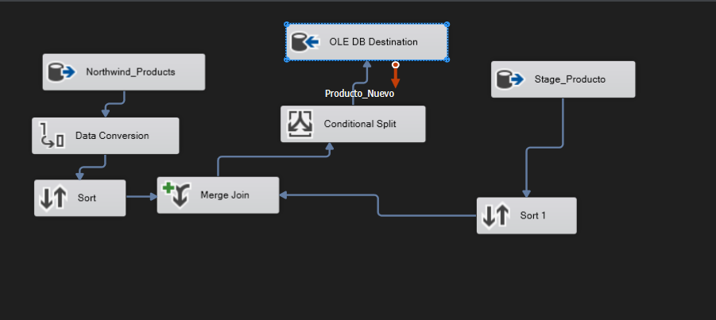
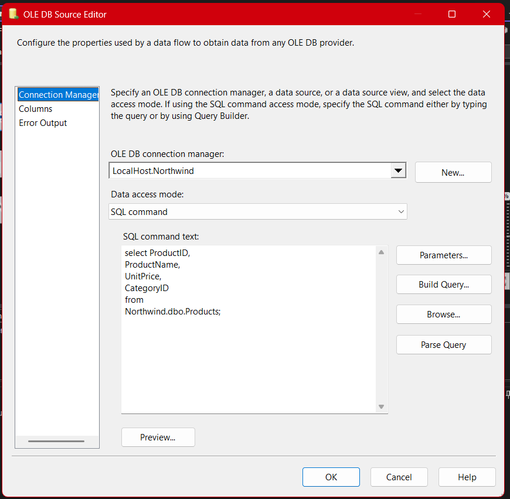
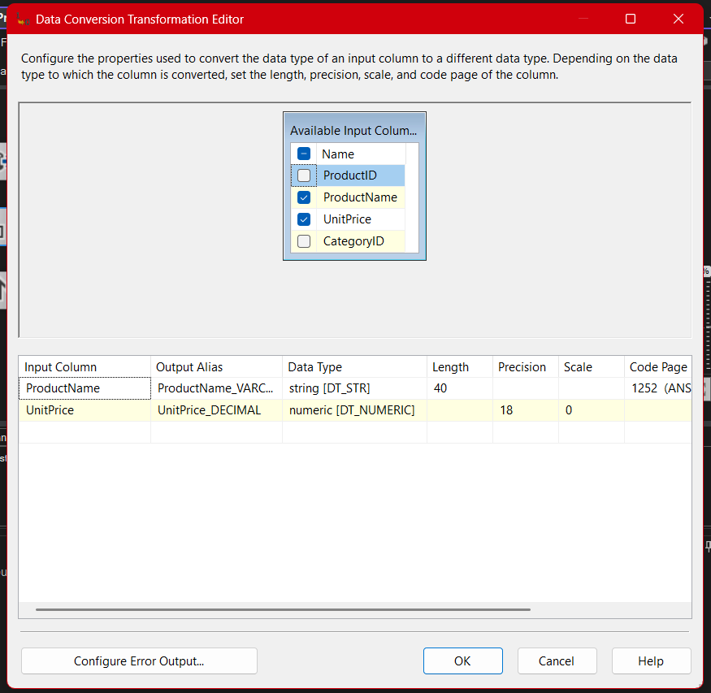
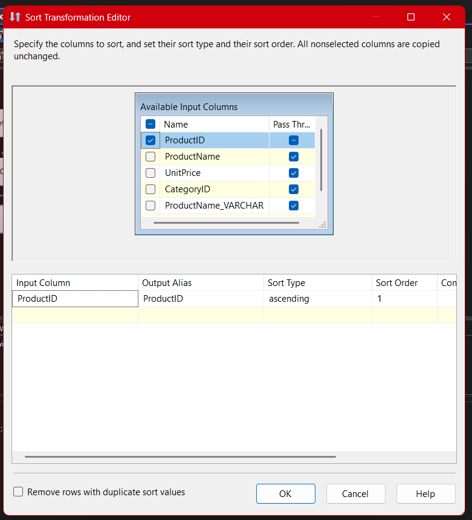
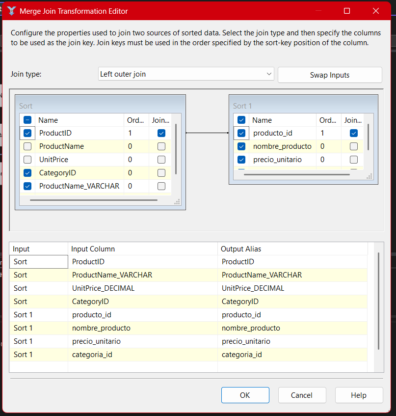
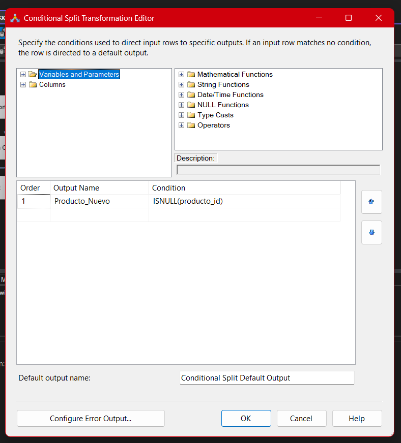
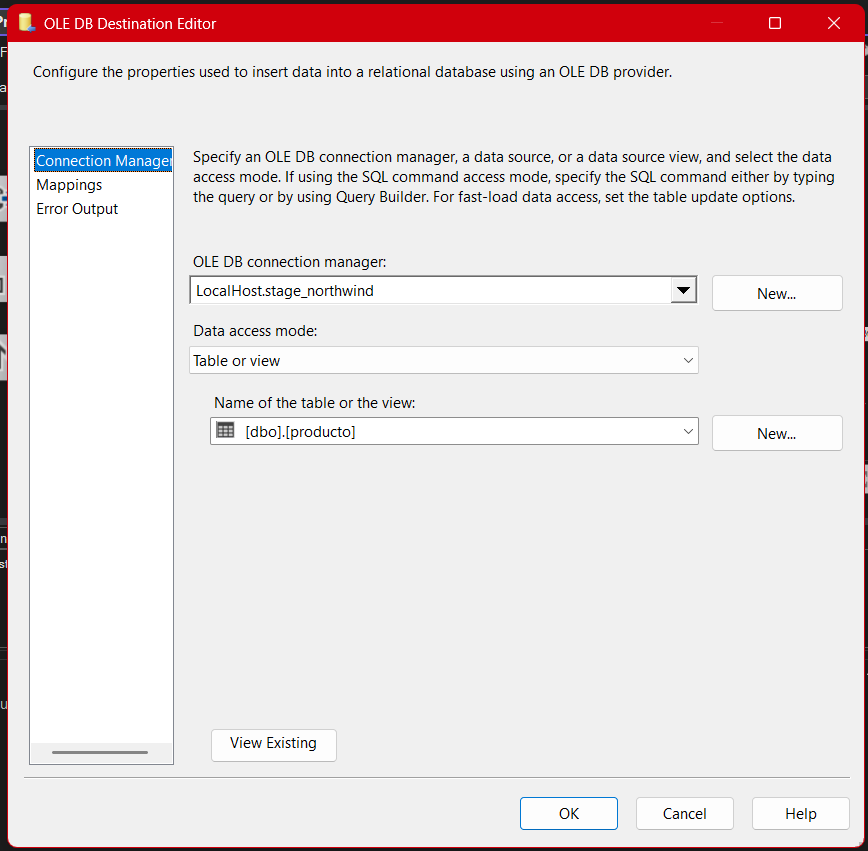
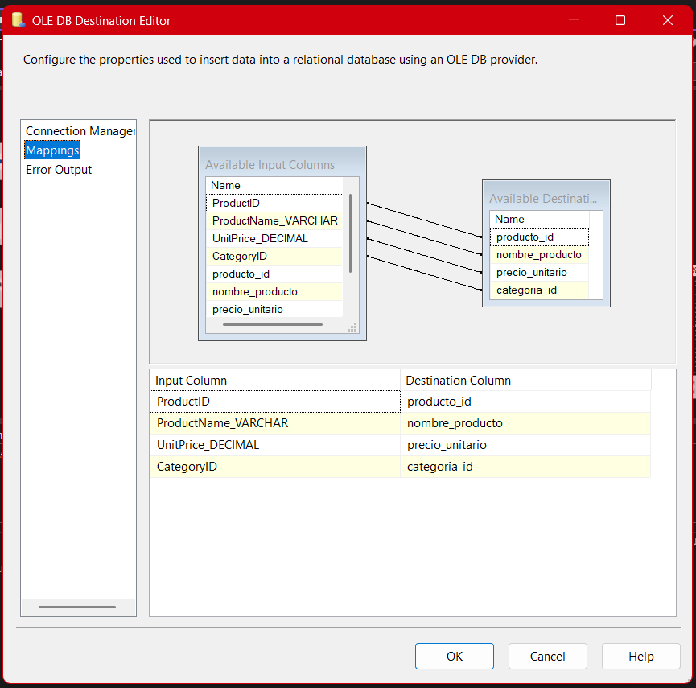

# **Documentación del Proceso ETL para la Tabla de Poducto (Package 05-Stage-Producto)**

## **Descripción general**

El paquete **05-Stage-Pro.dtsx** es parte fundamental en la cadena de integración de datos del proyecto Northwind. En este documento se explica, paso a paso, **cómo se realiza el flujo ETL sobre la tabla de productos**, desde la extracción hasta la carga en la base intermedia (Stage), detallando la lógica de cada componente, retos comunes, buenas prácticas y aprendizajes clave del proceso.

Este paquete se diseñó para consolidar la información relevante de los productos, manejar conversiones de datos, prevenir duplicados y garantizar la integridad de la información al ser cargada en la Stage, permitiendo un análisis confiable y estructurado para futuros procesos.

---

## Arquitectura General del Paquete (SSIS)

El flujo de datos sigue una arquitectura clara, modular y basada en buenas prácticas de ETL, lo que facilita su comprensión, auditoría y reutilización. Los pasos esenciales son:

1. **Extracción de datos desde el origen principal** (OLE DB Source - Northwind)
2. **Extracción del estado actual de Stage** (OLE DB Source - Stage_Northwind)
3. **Conversión de tipos de datos** (Data Conversion)
4. **Ordenamiento previo al Merge Join** (Sort)
5. **Comparación de registros entre origen y Stage** (Merge Join)
6. **Filtrado de nuevos productos** (Conditional Split)
7. **Carga de nuevos registros en Stage** (OLE DB Destination)

---

### Esquema visual general del paquete

## 

## 1. Extracción de Datos (OLE DB Source)

### a) Origen Northwind (productos)

Se utiliza un **OLE DB Source** para conectarse a la base Northwind y extraer sólo las columnas relevantes de la tabla de productos.

**Consulta SQL utilizada:**

```sql
SELECT SupplierID, CompanyName, ContactName, ContactTitle, Country
FROM Northwind.dbo.Suppliers;
```

- **¿Por qué una consulta específica?** Limitar las columnas extraídas reduce el volumen de datos, mejora el desempeño y simplifica los siguientes pasos del flujo.
- **Errores frecuentes:** Olvidar filtrar columnas puede traer información irrelevante o hacer más lento el ETL.



### b) Origen Stage_Northwind (productos)

Un segundo **OLE DB Source** obtiene el estado actual de la tabla `producto` en la base intermedia, para permitir la comparación y prevención de duplicados.

- **Práctica recomendada:** Seleccionar las columnas clave necesarias para identificar registros únicos.


---

## 2. Conversión de Tipos de Datos (Data Conversion)

En este paso, el componente **Data Conversion** transforma los tipos de datos obtenidos del origen a los requeridos por la tabla destino en Stage. Esto puede incluir cambios de `nvarchar` a `varchar`, limitaciones de longitud o conversión de tipos numéricos.

- **Importancia:** Las diferencias de tipos entre origen y destino son una de las causas más frecuentes de errores de carga.
- **Aprendizaje clave:** Los profesores insisten en practicar conversiones para desarrollar el criterio técnico necesario y prever errores en ambientes productivos.



---

## 3. Ordenamiento de Datos (Sort)

El componente **Sort** es fundamental antes de aplicar un **Merge Join**, ya que ambos flujos de datos deben llegar ordenados por la(s) clave(s) principal(es), en este caso, probablemente `SupplierID`.

- **Motivo técnico:** El Merge Join falla si no encuentra ambos flujos ordenados de forma idéntica.
- **Recomendación:** Asegura siempre el orden en ambos lados y documenta el campo de ordenación.



---

## 4. Comparación de Datos (Merge Join / Left Outer Join)

Mediante el **Merge Join**, se comparan los productos extraídos del origen con los ya existentes en Stage, utilizando un **Left Outer Join**. Esto permite identificar qué registros son nuevos (existen en el origen pero no en Stage).

- **Claves para unir:** Se utiliza la clave primaria (`SupplierID`) y, si es necesario, columnas de control adicionales.
- **Errores comunes:** No mapear correctamente las columnas de unión, o tener diferencias en la capitalización/nombres.



---

## 5. Filtrado de Nuevos productos (Conditional Split)

El **Conditional Split** filtra aquellos registros que **no existen en Stage**, es decir, donde la clave en Stage es `NULL`. De este modo, se evitan duplicados y sólo se insertan productos realmente nuevos.

- **Condición ejemplo:** `ISNULL(producto_id)`
- **Importancia:** Así aseguramos que la Stage sólo crece con datos nuevos, manteniendo la integridad y evitando redundancia.



---

## 6. Carga de Datos en Stage (OLE DB Destination)

Finalmente, los productos filtrados como nuevos se insertan en la tabla `producto` de Stage_Northwind mediante un **OLE DB Destination**.

- **Mapeo de columnas:** Es clave validar que cada campo del flujo corresponde exactamente al campo en la tabla de destino.
- **Validación previa:** Se recomienda hacer pruebas con el Data Viewer para verificar que sólo llegan los registros esperados.





---

## 7. Resumen Visual del Flujo Completo

El **Data Flow** del paquete puede observarse claramente en SSIS, mostrando cada etapa desde la extracción hasta la carga:

**Imagen sugerida:**


---

## Buenas Prácticas y Observaciones

- **Gestión de errores:** Configura las salidas de error en Data Conversion y Merge Join para detectar filas con problemas y analizar la causa.
- **Documentación en SSIS:** Agrega descripciones y notas en cada componente, especialmente en los splits y joins.
- **Plantilla reutilizable:** El flujo y lógica de este paquete son una plantilla perfecta para otros flujos de Stage con estructura similar (categorías, productos, clientes, etc.).
- **Optimización:** Para grandes volúmenes de productos, considera particionar o aplicar cargas en bloques.

---

## Consideraciones Didácticas y Experiencia de Aprendizaje

- **Importancia de conversiones:** El proceso intencional de trabajar con tipos incompatibles refuerza la planeación previa del modelo de datos.
- **SQL personalizado:** Permite extraer datos limpios y filtrados, agilizando el flujo.
- **Uso de joins:** Dominar left/right/inner joins es vital para manejar comparaciones avanzadas de datos.
- **Conditional Split:** Filtrar por existencia de datos previos es la clave para cargas incrementales reales en ETL profesional.

---

## Conclusión

El paquete **05-Stage-producto.dtsx** es representativo de los flujos ETL modernos, enfocándose en la limpieza, integración y actualización incremental de datos. Aplicando estas técnicas, aseguramos que la tabla Stage de productos siempre contenga información precisa y útil para análisis posteriores y toma de decisiones empresariales.

---
