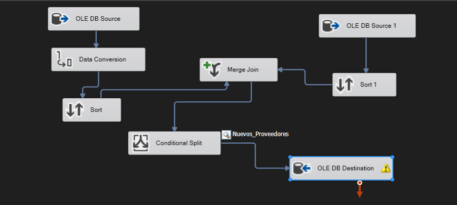
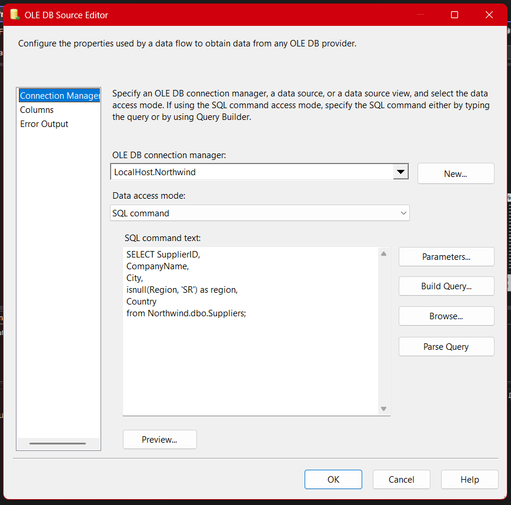
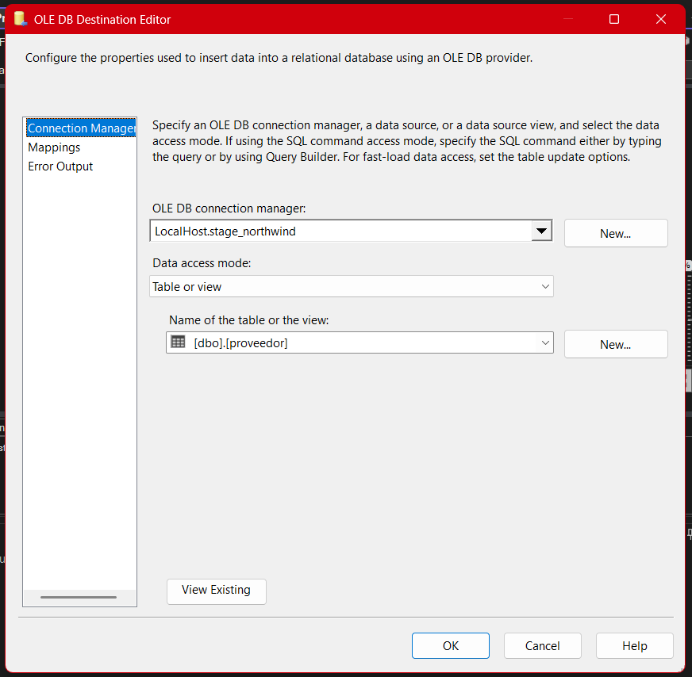

# **Documentación del Proceso ETL para la Tabla de Proveedores (Package 06-Stage-Proveedor)**

## **Arquitectura General del Paquete**



El paquete **06-Stage-Proveedor.dtsx** es responsable de la integración y sincronización incremental de los registros de proveedores entre la base transaccional Northwind y el entorno de staging. Su objetivo es identificar nuevos proveedores, normalizar los datos y alimentar la tabla `proveedor` en la base de staging solo con registros inexistentes previamente, garantizando calidad y consistencia.

---

## **1. OLE DB Source — Extracción de Proveedores Northwind**



- **Conexión:** `LocalHost.Northwind`
- **Modo de acceso:** SQL Command
- **Consulta SQL:**

  ```sql
  SELECT SupplierID,
         CompanyName,
         City,
         ISNULL(Region, 'SR') as region,
         Country
  FROM Northwind.dbo.Suppliers;
  ```

- **Propósito:** Extrae todos los proveedores actuales, asegurando que la columna `region` nunca sea nula (rellenando con 'SR' si está vacía). Esto estandariza los datos para los procesos posteriores.

---

## **2. OLE DB Source 1 — Extracción de Proveedores Stage**


- **Conexión:** `LocalHost.stage_northwind`
- **Modo de acceso:** Table or view
- **Tabla:** `[dbo].[proveedor]`
- **Propósito:** Obtiene todos los proveedores almacenados en la tabla de staging para detectar duplicados y realizar el merge incremental.

---

## **3. Data Conversion — Normalización de Tipos de Dato**


- **Propósito:** Convierte tipos de dato provenientes de Northwind a formatos compatibles con la tabla de destino. Evita errores por diferencias de longitud, codificación o formato.
- **Campos:**

  - `CompanyName` → `CompanyName_VARCHAR` (`string[DT_STR]`, 40)
  - `City` → `City_VARCHAR` (`string[DT_STR]`, 50)
  - `region` → `region_VARCHAR` (`string[DT_STR]`, 15)
  - `Country` → `Country_VARCHAR` (`string[DT_STR]`, 15)

- **Justificación:** En staging, los nombres y ciudades pueden requerir mayor longitud, y el encoding ANSI 1252 asegura compatibilidad.

---

## **4. Sort — Ordenamiento para el Merge**


- **Sort (Northwind):** Ordena los proveedores extraídos por `SupplierID`.
- **Sort 1 (Stage):** Ordena los proveedores de staging por `proveedor_id`.
- **Propósito:** El operador **Merge Join** de SSIS exige que ambos flujos estén previamente ordenados por la clave de unión para poder realizar el join correctamente.

---

## **5. Merge Join — Detección de Registros Nuevos**


- **Tipo:** Left Outer Join (de Northwind a Stage)
- **Claves de unión:** `SupplierID` ↔ `proveedor_id`
- **Campos de salida:** Todos los datos del proveedor extraído, más los equivalentes de staging.
- **Propósito:** Detecta proveedores que existen en Northwind pero no en Stage, permitiendo así identificar solo los nuevos.

---

## **6. Conditional Split — Filtrado de Nuevos Proveedores**


- **Condición:**

  ```sql
  ISNULL(proveedor_id)
  ```

- **Salida:** `Nuevos_Proveedores`
- **Propósito:** Solo se seleccionan para carga los registros de proveedores que no existen en la tabla de staging (es decir, aquellos cuyo `proveedor_id` resultó nulo tras el left join).

---

## **7. OLE DB Destination — Carga de Nuevos Proveedores**




- **Conexión:** `LocalHost.stage_northwind`
- **Tabla de destino:** `[dbo].[proveedor]`
- **Mapeo de columnas:**

  - `SupplierID` → `proveedor_id`
  - `CompanyName_VARCHAR` → `proveedor_nombre`
  - `City_VARCHAR` → `ciudad`
  - `region_VARCHAR` → `region`
  - `Country_VARCHAR` → `pais`

- **Propósito:** Inserta únicamente los proveedores detectados como nuevos en la tabla de staging, evitando duplicados.

---

## **8. Lógica y Mejoras Clave**

- **Incrementalidad:** Al comparar contra stage, nunca se insertan duplicados.
- **Normalización:** Se estandarizan nombres, ciudades y regiones, reduciendo problemas de calidad de datos aguas abajo.
- **Rendimiento:** El ordenamiento previo es obligatorio para eficiencia y correcto funcionamiento del `Merge Join`.
- **Flexibilidad:** Si en el futuro se agregan campos extra en el origen, solo basta ampliar el Data Conversion y los mapeos.

---
