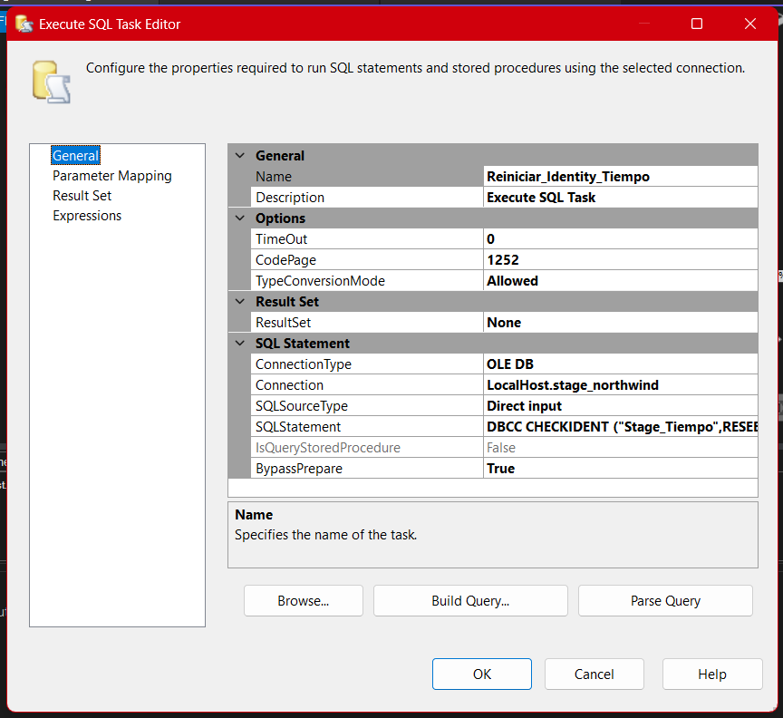
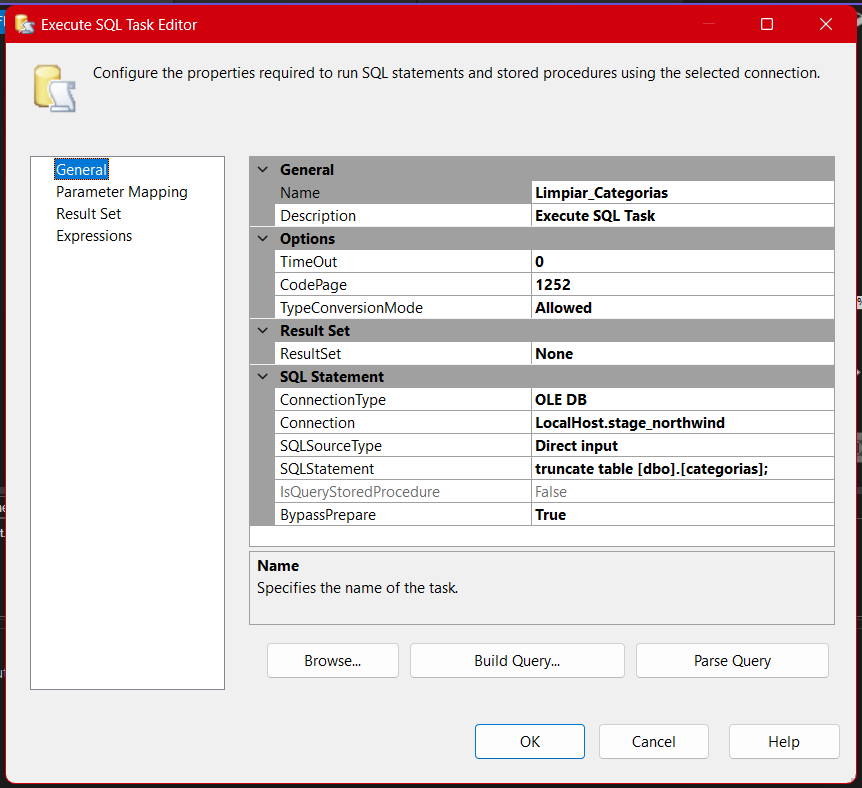
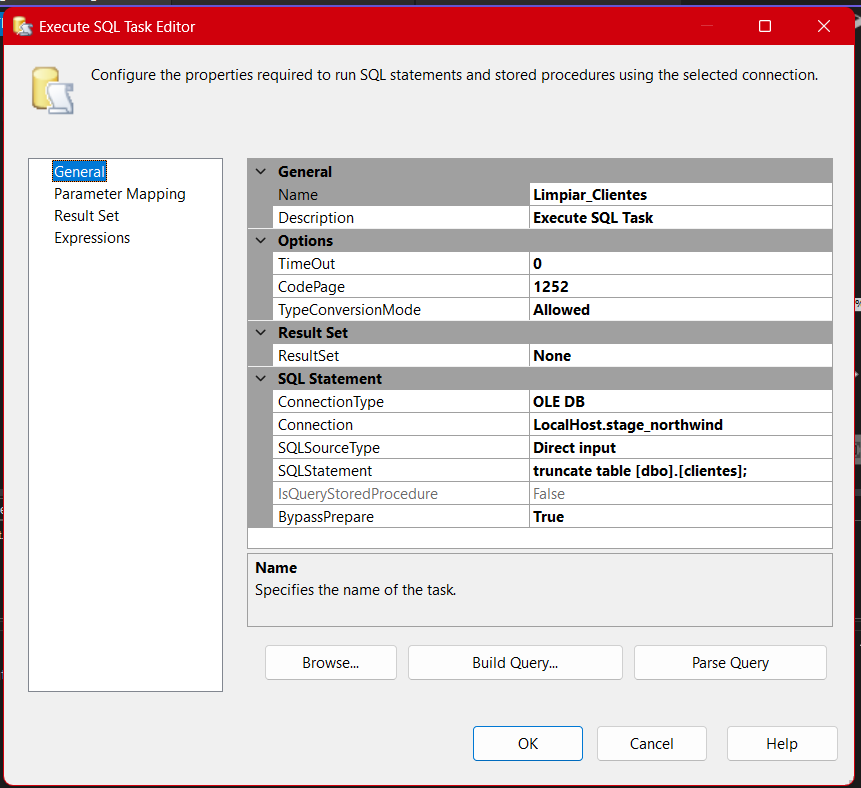
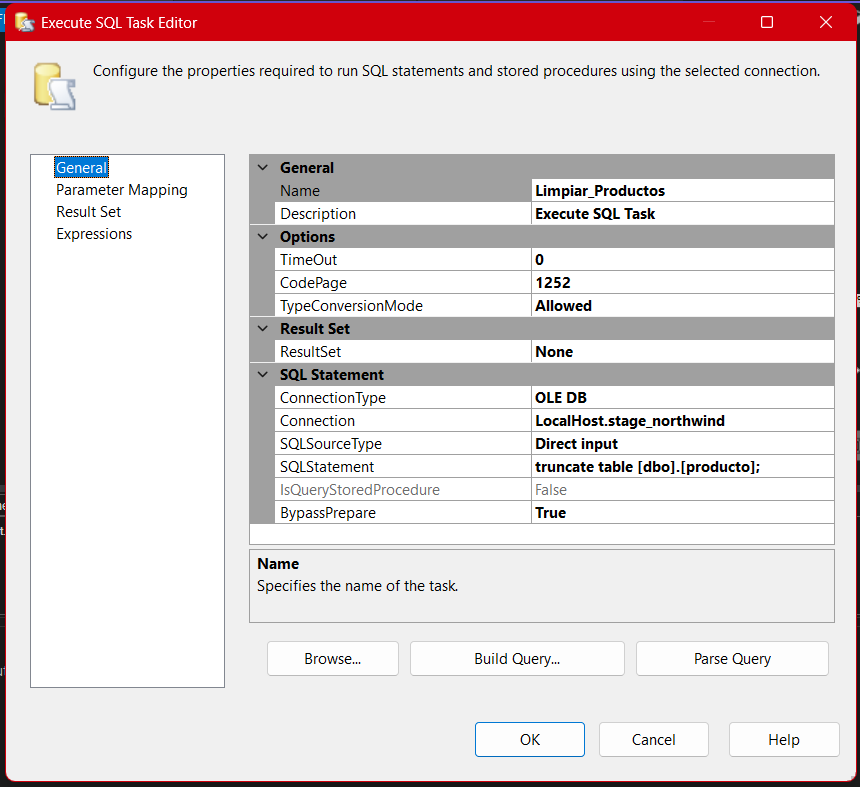

# **Documentación del Proceso ETL para el Paquete Limpiar-Stage**

## Paquete: Limpiar Stage

### 1. Propósito General del Paquete

El paquete **Limpiar Stage** tiene como función principal **eliminar todos los registros** existentes en las tablas de la base de datos _stage_, devolviéndolas a un estado vacío y reiniciando los identificadores automáticos (_identities_) en las tablas donde aplica. Este procedimiento es **crítico en arquitecturas ETL** porque asegura la **integridad, consistencia y repetibilidad** de los procesos de carga, permitiendo múltiples ejecuciones controladas y garantizando que los datos a analizar o transferir sean siempre el resultado de la última ejecución de carga.

---

### 2. Justificación y Contexto

**¿Por qué es necesario un paquete de limpieza como este?**

- **Ambientes de staging**: En ETL, la capa _stage_ es un área temporal donde los datos son depositados antes de ser transformados o cargados al destino final (Data Warehouse, Data Mart, etc). Si estos datos persisten entre ejecuciones, existe el riesgo de:

  - **Duplicidad de registros**
  - **Errores de integridad** (por referencias cruzadas)
  - **Resultados inconsistentes** al comparar ejecuciones

- **Automatización y pruebas**: El paquete permite que los procesos de carga sean **repetibles y testeables** desde cero, sin residuos de ejecuciones anteriores.

- **Control en pipelines orquestados**: Al ejecutar el proceso de limpieza justo antes de la carga principal (por ejemplo, desde el _paquete maestro "Carga Master"_), se garantiza un **ciclo de carga limpio** y auditado, facilitando la trazabilidad y recuperación ante errores.

---

### 3. Arquitectura Visual del Paquete

---

### 4. Descripción Detallada de Componentes

| Tarea (Task)              | Tipo             | Propósito                                                                       | Comando SQL o Acción Principal                 |
| ------------------------- | ---------------- | ------------------------------------------------------------------------------- | ---------------------------------------------- |
| Limpiar_Tiempo            | Execute SQL Task | Elimina todos los registros de la tabla Stage_Tiempo                            | `TRUNCATE TABLE Stage_Tiempo;`                 |
| Reiniciar_Identity_Tiempo | Execute SQL Task | Reinicia el contador de identidad (ID autoincremental) en la tabla Stage_Tiempo | `DBCC CHECKIDENT ("Stage_Tiempo", RESEED, 0);` |
| Limpiar_Categorias        | Execute SQL Task | Elimina todos los registros de la tabla \[categorias]                           | `TRUNCATE TABLE [dbo].[categorias];`           |
| Limpiar_Empleado          | Execute SQL Task | Elimina todos los registros de la tabla \[empleado]                             | `TRUNCATE TABLE [dbo].[empleado];`             |
| Limpiar_Clientes          | Execute SQL Task | Elimina todos los registros de la tabla \[clientes]                             | `TRUNCATE TABLE [dbo].[clientes];`             |
| Limpiar_Ventas            | Execute SQL Task | Elimina todos los registros de la tabla \[ventas]                               | `TRUNCATE TABLE [dbo].[ventas];`               |
| Limpiar_Productos         | Execute SQL Task | Elimina todos los registros de la tabla \[producto]                             | `TRUNCATE TABLE [dbo].[producto];`             |
| Limpiar_Proveedores       | Execute SQL Task | Elimina todos los registros de la tabla \[proveedor]                            | `TRUNCATE TABLE [dbo].[proveedor];`            |

> [!NOTE]
>
> La secuencia y dependencias de ejecución garantizan que primero se limpian tablas sin dependencias y se reinician los IDs antes de limpiar aquellas con referencias.

---

### 5. Secuencia de Ejecución

- El flujo del paquete sigue una lógica **jerárquica** y de **dependencias**.
- Comienza limpiando la tabla de tiempo, resetea su identity, y luego limpia las tablas dependientes (_categorías_, _empleado_, _clientes_, _ventas_, _productos_, _proveedores_).
- Esto evita conflictos por claves foráneas en tablas relacionadas.

---

### 6. Razones de Diseño y Mejores Prácticas

- **Uso de TRUNCATE**: El comando `TRUNCATE` es preferible sobre `DELETE` para limpieza total, ya que es más eficiente y reinicia los _identities_ automáticamente (salvo excepciones como la tabla tiempo donde se hace explícito).
- **Reset de identidad**: Es fundamental para evitar que los identificadores crezcan innecesariamente con pruebas o cargas repetidas.
- **No deja residuos**: La limpieza completa elimina cualquier residuo de pruebas, datos corruptos o inconsistentes.

---

### 7. Escenarios de Uso

- **Antes de ejecutar una nueva carga completa (full load)** para garantizar que solo se tengan datos actualizados.
- **Durante pruebas de desarrollo**, para verificar la funcionalidad repetida del ETL.
- **Como paso previo en pipelines orquestados** para asegurar consistencia en entornos de QA o producción.

---

### 8. Riesgos y Consideraciones

- **Irreversibilidad:** El proceso borra todos los datos de las tablas _stage_. Asegúrate de tener respaldos o mecanismos de recuperación si fuera necesario.
- **Dependencias:** Si existen restricciones de integridad referencial, el orden de limpieza debe respetar la jerarquía de dependencias entre tablas.
- **Bloqueos:** Si hay cargas concurrentes, este proceso puede provocar bloqueos de tabla mientras se ejecuta.

---

### 9. Relación con Otros Paquetes

- Este paquete **no transfiere datos**, solo limpia y reinicia tablas de _stage_.
- Es **complementario al "Carga Master"** que orquesta la ejecución de todos los paquetes de carga, pero lo hace sobre una base limpia.

---

### 10. Referencias Visuales y de Código

- **Diagrama del paquete:**
  
- **Evidencia visual de configuración de cada tarea:**

  - Limpiar_Tiempo: 

  - Reiniciar_Identity_Tiempo: 

  - Limpiar_Categorias: 

  - Limpiar_Empleado: 

  - Limpiar_Clientes: 

  - Limpiar_Ventas: 

  - Limpiar_Productos: 

  - Limpiar_Proveedores: 

---

## Conclusión

El paquete **Limpiar Stage** es un componente **fundamental en cualquier arquitectura ETL profesional** orientada a mantener la calidad y confiabilidad de los datos durante ciclos repetidos de carga. Su correcta implementación permite que el entorno de staging cumpla con su propósito: ser **transitorio, confiable y siempre preparado** para recibir datos frescos, eliminando riesgos de corrupción, duplicidad o contaminación de información.

---
