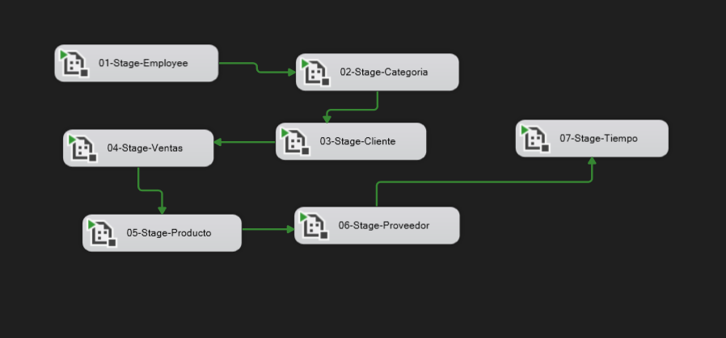
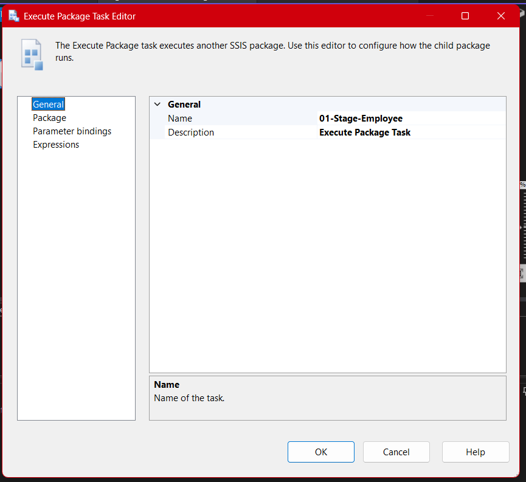

# **Documentación del Proceso ETL para el Paquete Carga-Master**

## Descripción General

El paquete **Carga-Master** es la orquestación central dentro de la solución `Stage_Northwind`. Este paquete actúa como el controlador principal encargado de ejecutar, en el orden correcto y de manera automatizada, todos los paquetes de carga a las tablas de staging (`stage`) del modelo Northwind. Su objetivo es garantizar la correcta secuenciación de las cargas, respetando dependencias lógicas y relaciones entre los distintos dominios de datos (empleados, categorías, clientes, ventas, productos, proveedores y tiempo).

El diseño de este paquete responde a la necesidad de **automatizar la carga completa** del entorno de staging, permitiendo realizar pruebas integrales, cargas iniciales, recargas masivas o mantener la consistencia de datos cuando se requieren procesos de ETL (Extract, Transform, Load) robustos y repetibles.

---

## Estructura del Paquete

### Diagrama de Flujo de Control

### Flujo Secuencial

El flujo de trabajo se compone de una serie de tareas del tipo **Execute Package Task**, cada una encargada de llamar y ejecutar secuencialmente los paquetes individuales de carga de cada entidad. El orden se determina considerando las dependencias lógicas entre las entidades de datos:

1. **01-Stage-Employee**: Los empleados suelen ser una dimensión fundamental; algunas ventas y otras entidades pueden referenciar empleados, por lo que se cargan primero.
2. **02-Stage-Categoria**: Las categorías deben existir antes de que se carguen productos asociados.
3. **03-Stage-Cliente**: Los clientes se cargan para que posteriormente las ventas puedan asociar correctamente las claves foráneas.
4. **04-Stage-Ventas**: Depende de empleados y clientes. Las ventas referencian entidades previamente cargadas.
5. **05-Stage-Producto**: Los productos requieren categorías ya existentes.
6. **06-Stage-Proveedor**: Se cargan los proveedores para asociar productos o facilitar reportes posteriores.
7. **07-Stage-Tiempo**: Finalmente, la dimensión tiempo se puede poblar una vez que se conoce el rango de fechas necesario.

Esta secuencia garantiza la **integridad referencial** y reduce los riesgos de fallos por claves foráneas ausentes en las tablas destino.

---

## Componentes y Configuración

### 1. **Tareas Execute Package Task**

Cada tarea del flujo de control utiliza la referencia interna al proyecto para ejecutar el paquete correspondiente. Las propiedades principales son:

- **ReferenceType:** `Project Reference` (garantiza integración y mantenimiento centralizado).
- **PackageNameFromProjectReference:** Nombre del paquete SSIS a ejecutar (ejemplo: `01-stage-employee.dtsx`).
- **ExecuteOutOfProcess:** `False` (por defecto, ejecuta en el mismo proceso para mayor eficiencia y control).

Ejemplo de configuración:

### 2. **Manejo de Errores y Registro**

- Es recomendable configurar el logging (registro) del paquete maestro para detectar rápidamente en qué etapa ocurre un fallo y facilitar la depuración.
- Se puede emplear la integración con **Event Handlers** de SSIS para notificaciones automáticas, manejo de errores personalizados y rollback de procesos si fuera necesario.

---

## Justificación de la Estrategia de Orquestación

### ¿Por qué centralizar la carga con un paquete maestro?

- **Automatización total:** Facilita la ejecución con un solo clic/comando, ideal para tareas programadas (SQL Agent o Azure Data Factory).
- **Reducción de errores humanos:** Se elimina la necesidad de ejecutar manualmente cada paquete en orden.
- **Mantenimiento y escalabilidad:** Es sencillo modificar el orden o agregar nuevas entidades de datos.
- **Consistencia transaccional:** Aunque SSIS no maneja transacciones distribuidas por defecto, este enfoque reduce el riesgo de inconsistencias parciales al forzar una secuencia lógica y controlada.

### Integración con el Paquete Limpiar-Stage

Antes de ejecutar el **Carga-Master**, es buena práctica ejecutar el paquete **Limpiar-Stage**, asegurando que todas las tablas estén vacías y listas para la carga masiva de datos, evitando duplicados y manteniendo la integridad del entorno de staging.

---

## Buenas Prácticas Implementadas

- **Uso de referencias de proyecto** para asegurar portabilidad y evitar problemas de rutas absolutas.
- **Separación de preocupaciones**: cada paquete hace una tarea específica (Single Responsibility Principle).
- **Estandarización de nombres**: todos los paquetes y tareas siguen una nomenclatura clara, uniforme y autodescriptiva.
- **Documentación visual**: se incluyen diagramas y capturas de configuración.
- **Preparado para integración continua**: el flujo facilita la automatización y pruebas integrales.
- **Escalabilidad**: fácilmente adaptable a nuevos requerimientos o entidades.

---

## Capturas de Referencia

### Flujo General del Paquete Carga-Master

### Configuración de Ejecución de un Paquete Hijo

---

## Conclusión

El paquete **Carga-Master** es el pilar operativo que garantiza la sincronización completa y coherente de los datos de staging del modelo Northwind. Este diseño, además de seguir estándares profesionales de ingeniería de datos, habilita la operación eficiente tanto en ambientes de desarrollo como de producción, optimizando los procesos de prueba, migración y mantenimiento evolutivo del Data Warehouse.

---
