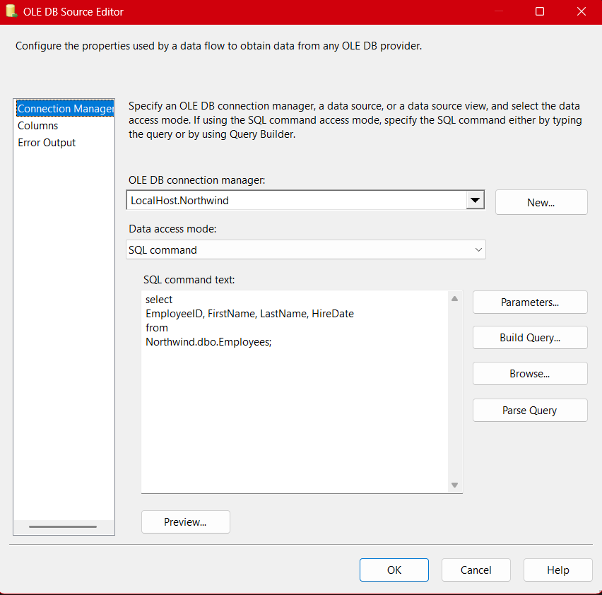
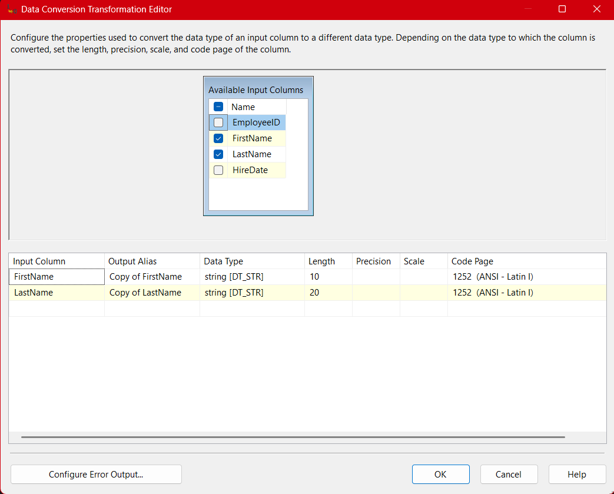
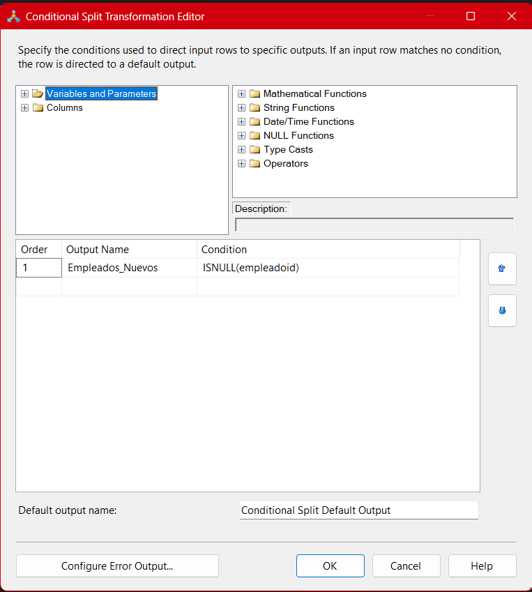
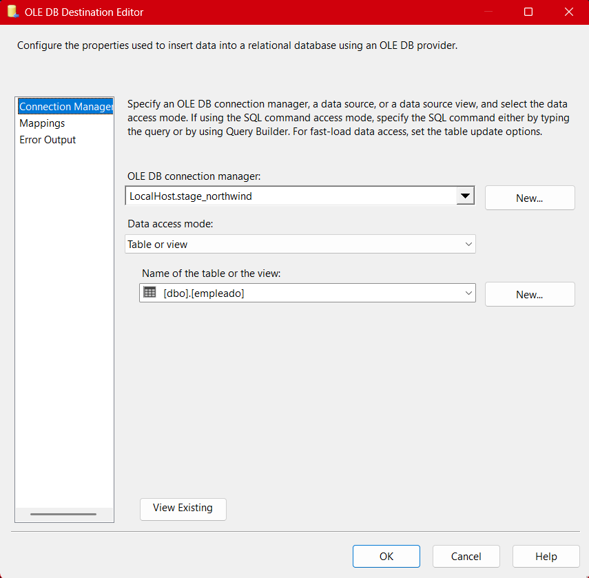

# **Documentación del Proceso ETL para la Tabla de Empleados (Package-01)**

## **Descripción general**

El paquete **01-stage-employee.dtsx** marca el inicio de la cadena de procesos ETL implementada para el proyecto Northwind. En este documento se describe en detalle **todo el flujo ETL aplicado a la tabla de empleados**, abarcando desde la extracción inicial hasta la carga final en la base intermedia. Se explica la función de cada componente, la lógica empleada y los desafíos encontrados durante el diseño de este flujo.

El diseño de este flujo ETL se utilizó para entender conceptos como integración de datos heterogéneos, conversiones de tipo, manejo de duplicados, aplicación de joins, filtrado de datos y automatización de cargas incrementales.

---

## Arquitectura General del Paquete (SSIS)

El flujo de datos de este paquete fue concebido con un enfoque didáctico, buscando ilustrar las mejores prácticas del desarrollo ETL en SSIS. A continuación, se describen los pasos principales:

1. **Extracción de datos desde dos orígenes** (OLE DB Source)
2. **Conversión de tipos de datos** (Data Conversion)
3. **Ordenamiento de datos** (Sort, si es necesario para el Merge Join)
4. **Comparación con la tabla destino usando Join** (Merge Join)
5. **Filtrado de nuevos registros** (Conditional Split)
6. **Carga de datos en la tabla Stage** (OLE DB Destination)


A continuación, explico cada componente y etapa del flujo, integrando la lógica, buenas prácticas y problemas comunes.

---

## 1. Extracción de datos (OLE DB Source)

### a) Conexión al origen Northwind

Se utiliza un **OLE DB Source** conectado a la base de datos **Northwind** para extraer los registros de empleados. Aquí se configura una consulta SQL personalizada:

```sql
SELECT EmployeeID, FirstName, LastName, HireDate
FROM Northwind.dbo.Employees;
```

- **¿Por qué se usa una consulta personalizada?** Esto permite seleccionar únicamente las columnas que realmente se necesitan, lo cual mejora el rendimiento del proceso, reduce la carga sobre la red y evita el procesamiento innecesario de datos irrelevantes.
- **Errores comunes:** No filtrar columnas puede traer datos innecesarios y afectar la velocidad del ETL.



### b) Conexión al destino Stage_Northwind

El segundo **OLE DB Source** se conecta a la tabla `empleado` de **Stage_Northwind**, obteniendo el estado actual de la tabla destino.

- **¿Por qué?** Esto permite comparar los datos de origen con los existentes y evitar duplicados en la carga.
- **Práctica recomendada:** Seleccionar las mismas columnas clave y de control.

## 

## 2. Conversión de Tipos de Datos (Data Conversion)

En esta etapa, el componente **Data Conversion** se emplea para transformar los tipos de datos provenientes de la fuente al formato exacto que requiere la tabla destino. Un ejemplo común es la conversión de campos `nvarchar` a `varchar`, o el ajuste de la longitud de cadenas de texto para que coincidan con la definición en la base de destino.

- **¿Por qué es importante?** Si los tipos no coinciden, el paquete fallará al intentar insertar los datos en el destino.
- **Aprendizaje en clase:** Los profesores deliberadamente pusieron tipos distintos para enseñarnos la importancia y la técnica de las conversiones.
- **Errores comunes:** No mapear adecuadamente los tipos o la longitud de cadenas, lo que genera truncamientos o errores de incompatibilidad.

## 

## 3. Ordenamiento de Datos (Sort, opcional pero recomendado)

Para que el componente **Merge Join** funcione correctamente, ambas fuentes de datos deben estar ordenadas por las claves que se utilizarán en la unión. Si alguna fuente no llega ordenada, es necesario incluir un componente **Sort** antes del Merge Join para garantizar la integridad del proceso.

- **¿Por qué ordenar?** Sin orden, el Merge Join arrojará error y no funcionará.
- **Recomendación:** Ordenar por `EmployeeID` o la clave primaria relevante.

---

## 4. Comparación y Unión de Datos (Merge Join / Left Join)

El componente **Merge Join** es fundamental para comparar los registros del origen con los existentes en la Stage. En este caso, se suele utilizar un **Left Outer Join** para identificar nuevos registros.

- **Motivo:** Nos interesa saber qué empleados existen en Northwind que aún **no** están en Stage.
- **Aplicación de conocimientos:** Durante las prácticas en clase, experimentamos con distintos tipos de joins (left, right e inner) para cubrir diversos escenarios. En este caso particular, el left join resulta fundamental para detectar y cargar únicamente los registros nuevos. Tambien aplicamos los conocimientos obtenidos en el curso anterior (Base de Datos para Negocios Digitales).
- **Errores comunes:** No ordenar las fuentes previamente, no mapear correctamente las columnas de unión.


---

## 5. Filtrado de Nuevos Registros (Conditional Split)

Una vez combinados los datos, se utiliza el **Conditional Split** para filtrar **sólo** los registros nuevos (por ejemplo, aquellos donde el `empleadoid` en Stage es `NULL`).

- **Ejemplo de condición:**
  `ISNULL(Stage_empleadoid)`
  > [!Note]
  > Asegúrate que el campo corresponda al del Stage; especificar el prefijo puede evitar confusiones si las columnas tienen el mismo nombre en ambos orígenes
- **¿Por qué hacerlo?** Así evitamos sobrescribir registros existentes y sólo insertamos los nuevos.
- **Mejor práctica:** Documentar siempre la lógica de tus splits para facilitar mantenimiento futuro.



---

## 6. Carga de Datos en Stage (OLE DB Destination)

Finalmente, los registros filtrados como nuevos se cargan en la tabla `empleado` de **Stage_Northwind** usando un **OLE DB Destination**.

- **Mapeo de columnas:** Debes asegurarte de que cada campo del flujo de datos corresponda al campo correcto en la tabla destino.
- **Validación:** Es recomendable probar el proceso primero en modo test (utilizando Data Viewer o el modo de depuración de SSIS), para asegurarte de que los registros se insertan correctamente y que los datos mapeados coinciden con la estructura de la tabla destino.




---

## 7. Resumen Visual del Flujo Completo

El **Data Flow** completo del paquete, tal como se visualiza en SSIS, permite apreciar de un vistazo cada uno de los componentes y la trayectoria que sigue la información desde el origen hasta el destino:


---

## Buenas Prácticas y Observaciones

- **Control de errores:** Configura salidas de error en los componentes críticos (Data Conversion, Merge Join) para capturar y analizar posibles fallos de datos.
- **Documentación:** Usa los descriptores y notas en cada componente dentro de SSIS para dejar clara la intención de cada paso.
- **Reusabilidad:** La estructura de este paquete puede servir como modelo para desarrollar otros flujos ETL similares (por ejemplo, para las tablas de productos, clientes o ventas), facilitando la estandarización y mantenimiento del proyecto.
- **Optimización:** Si el volumen de datos es grande, analiza la posibilidad de particionar cargas o usar Bulk Insert.

---

## Mental Notes

- **Diferencias de tipos de datos:** La intención didáctica de poner tipos incompatibles es que los estudiantes comprendan la importancia de planear y documentar la estructura de sus bases de datos desde el diseño.
- **Uso de SQL para consultas:** Realizar las extracciones mediante consultas SQL permite personalizar los datos, agregar filtros y reducir el consumo de recursos.
- **Merge Join como ejercicio práctico:** Aprender a usar distintos tipos de join (left, right, inner) es clave para el manejo avanzado de datos.
- **Conditional Split y cargas incrementales:** Aprender a implementar cargas incrementales mediante filtrado condicional es fundamental en entornos de ETL profesional, ya que permite mantener las tablas actualizadas sin necesidad de sobrescribir todo su contenido en cada ciclo de carga.

---

## **Resumen Técnico**

El paquete **01-stage-employee.dtsx** ejemplifica el flujo ETL que caracteriza todo el proyecto Northwind. Su objetivo principal es **garantizar la integridad, consistencia y actualización de los datos de empleados en la base Stage**, aplicando técnicas fundamentales de integración y manejo de datos, útiles y adaptables para cualquier entorno profesional de analítica o gestión empresarial.

---
