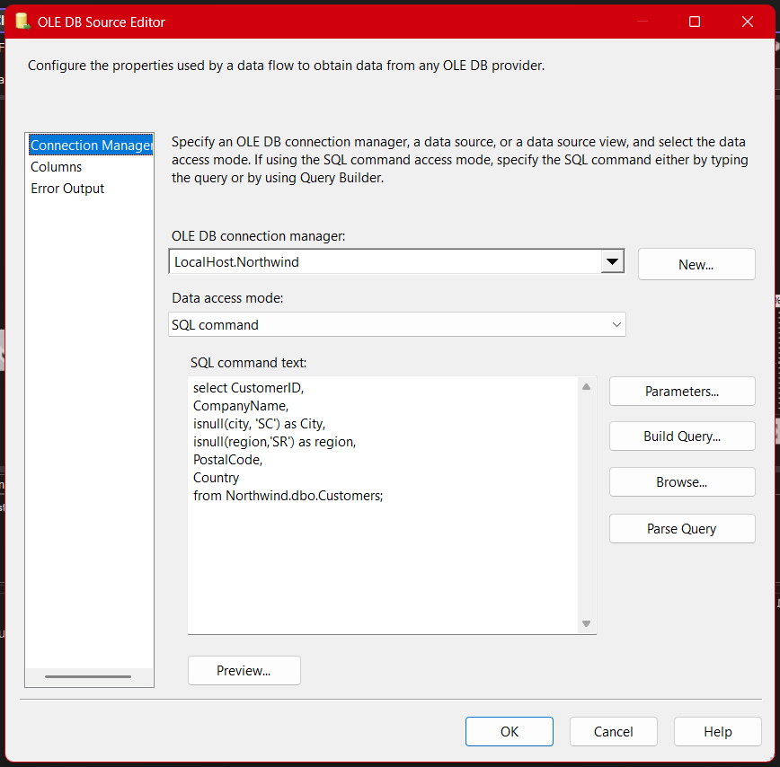
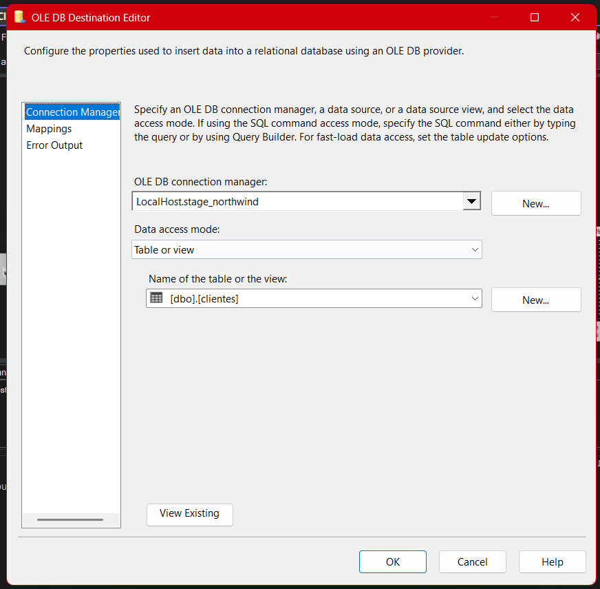
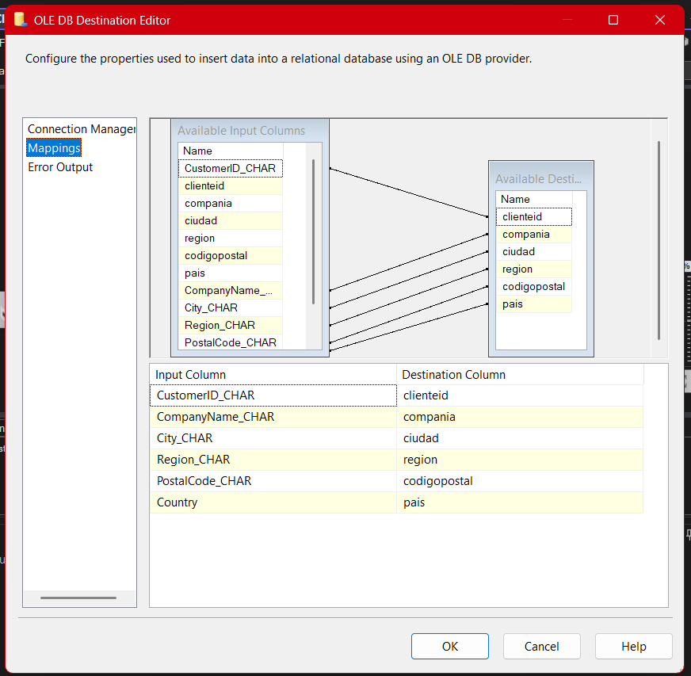

# **Documentación del Proceso ETL para la Tabla de Clientes (Package 03)**

## **Descripción general**

El paquete **03-Stage-Cliente.dtsx** corresponde al proceso ETL para la tabla de **clientes**, y su objetivo es extraer los registros actualizados desde la base de datos Northwind, limpiar y transformar los datos necesarios, identificar los registros nuevos y cargarlos en la tabla intermedia de Stage. Este proceso, además de consolidar buenas prácticas de integración de datos, ilustra técnicas clave como la conversión de tipos de datos, manejo de valores nulos y cargas incrementales de información.

---

## Arquitectura General del Paquete (SSIS)

El flujo de este paquete sigue la arquitectura didáctica estándar:

1. **Extracción de datos desde dos orígenes** (OLE DB Source)
2. **Conversión de tipos de datos** (Data Conversion)
3. **Ordenamiento de datos** (Sort)
4. **Comparación y unión de datos** (Merge Join)
5. **Filtrado de nuevos registros** (Conditional Split)
6. **Carga en la tabla destino Stage** (OLE DB Destination)


---

## 1. Extracción de Datos (OLE DB Source)

### a) Conexión al origen Northwind

Se utiliza un componente **OLE DB Source** para extraer los datos de la tabla `Customers` en Northwind. Aquí, además de seleccionar los campos clave (CustomerID, CompanyName, City, Region, PostalCode, Country), se realiza un manejo de valores nulos usando `ISNULL` para asignar valores por defecto en los campos `City` y `Region`.

```sql
SELECT CustomerID, CompanyName, ISNULL(City, 'SC') AS City, ISNULL(Region, 'SR') AS region, PostalCode, Country
FROM Northwind.dbo.Customers;
```

- **Motivación didáctica:** El uso de `ISNULL` enseña cómo evitar problemas de nulos en los siguientes pasos del flujo ETL.



### b) Conexión al destino Stage_Northwind

El segundo **OLE DB Source** se conecta a la tabla `clientes` en Stage_Northwind, para obtener el estado actual y comparar si existen clientes nuevos que aún no han sido cargados.


---

## 2. Conversión de Tipos de Datos (Data Conversion)

El componente **Data Conversion** convierte los campos del origen a los tipos requeridos por el destino (por ejemplo, de `nvarchar` a `char`, ajuste de longitud de cadenas, etc.).
En este paquete se hace una conversión explícita en los siguientes campos:

- CustomerID → CustomerID_CHAR (string de 5)
- CompanyName → CompanyName_CHAR (string de 40)
- City → City_CHAR (string de 15)
- Region → Region_CHAR (string de 15)
- PostalCode → PostalCode_CHAR (string de 10)

Esto es fundamental para evitar incompatibilidades y errores en la carga.


---

## 3. Ordenamiento de Datos (Sort)

Para poder realizar correctamente el **Merge Join**, ambos conjuntos de datos deben estar ordenados por la clave primaria (`CustomerID`/`clienteid`). Por ello, se utiliza un componente **Sort** para ordenar los datos antes de unirlos.

---

## 4. Comparación y Unión de Datos (Merge Join)

Se utiliza un **Merge Join** tipo **Left Outer Join** para comparar los registros del origen Northwind con los ya existentes en Stage.

- **Objetivo:** Detectar clientes nuevos que aún no existen en la tabla destino.
- **Uniones:** Se unen por `CustomerID_CHAR` (origen) con `clienteid` (destino).

Este paso es clave para garantizar cargas incrementales, evitando duplicados y sobrescritura de datos.

## 

## 5. Filtrado de Nuevos Registros (Conditional Split)

Con el **Conditional Split** se filtran aquellos registros donde el cliente no existe todavía en Stage, es decir, donde el campo `clienteid` es NULL tras el Merge Join.

- **Condición utilizada:** `ISNULL(clienteid)`
- **Resultado:** Solo los clientes nuevos pasan al siguiente paso del flujo.

---

## 6. Carga de Datos en Stage (OLE DB Destination)

Los registros nuevos se insertan en la tabla `clientes` de **Stage_Northwind** a través de un componente **OLE DB Destination**.

- **Mapeo:** Es imprescindible mapear correctamente cada campo transformado hacia su destino correspondiente para evitar errores en la carga.



## 

## 7. Resumen Visual del Flujo Completo

El flujo completo del paquete puede visualizarse en SSIS, mostrando la secuencia de componentes y el trayecto de los datos:


---

## Buenas Prácticas y Observaciones

- **Manejo de nulos y tipos:** Utilizar funciones SQL (`ISNULL`) y conversiones explícitas previene fallos durante la carga y mantiene la calidad de los datos.
- **Documentación interna:** Aprovechar los descriptores en cada componente para que cualquier persona pueda entender la lógica del flujo.
- **Cargas incrementales:** Implementar filtrado mediante joins y splits permite actualizar solo los datos nuevos o modificados, aumentando eficiencia y evitando sobrescritura.
- **Depuración:** Es recomendable probar cada componente por separado antes de ejecutar el flujo completo, para detectar problemas en conversiones o mapeos.

---

## Consideraciones Didácticas y Experiencia de Aprendizaje

- **Ejemplo realista:** El proceso integra buenas prácticas utilizadas en entornos empresariales reales, como la normalización, limpieza y carga incremental de clientes.
- **Manejo de valores faltantes:** Aprender a prevenir problemas futuros de calidad de datos desde el ETL.
- **Flexibilidad del paquete:** Esta plantilla puede adaptarse fácilmente para otras tablas, cambiando las columnas, claves y condiciones de comparación.

---

## **Resumen Técnico**

El paquete **03-Stage-Cliente.dtsx** ejemplifica el proceso ETL ideal para la tabla de clientes: desde la extracción, limpieza, comparación y carga incremental, garantizando datos precisos y actualizados en el entorno de Stage. Esta arquitectura es fundamental en cualquier proyecto profesional de integración de datos y analítica para negocios digitales.

---
