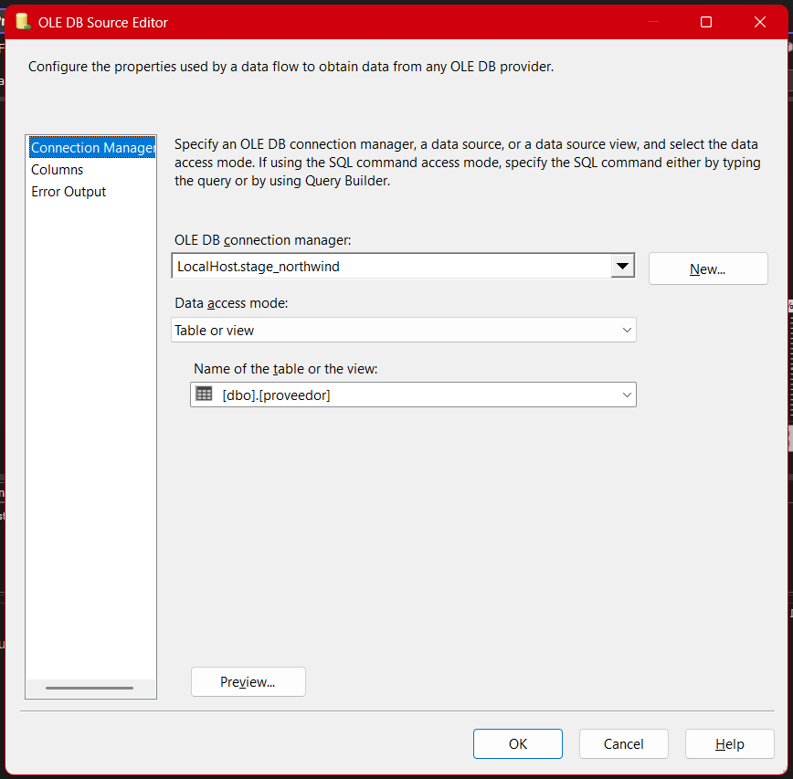
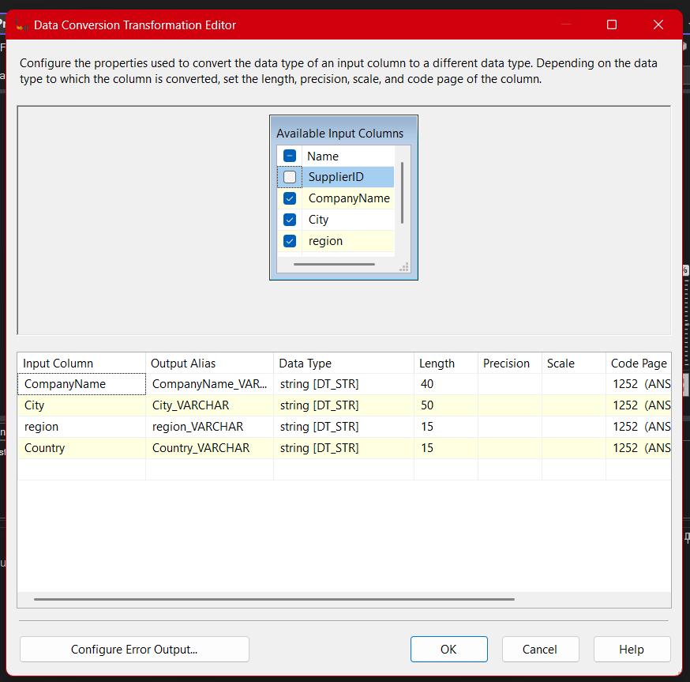
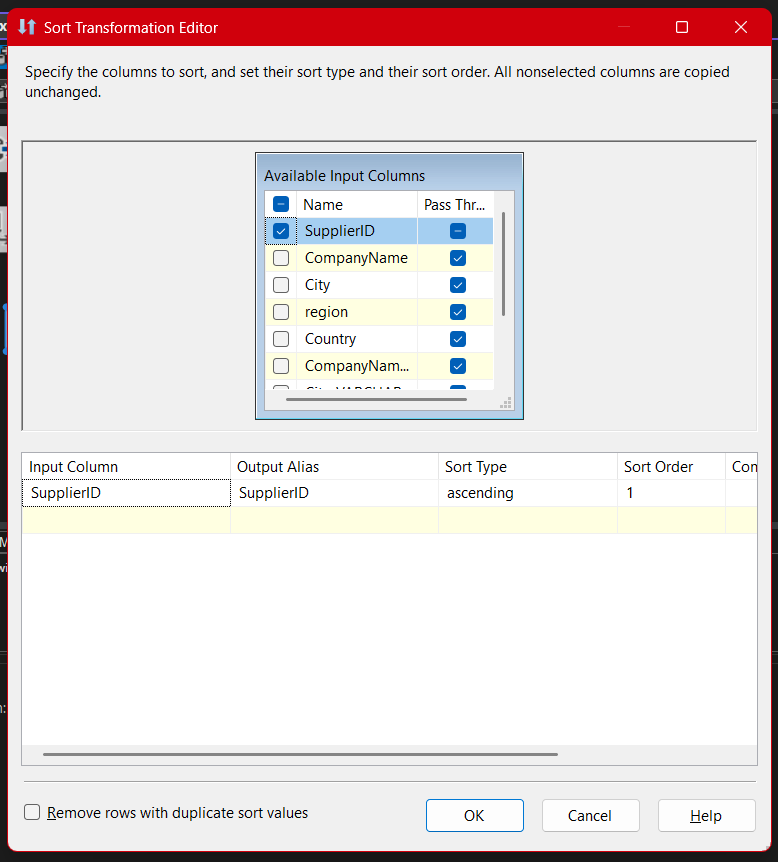
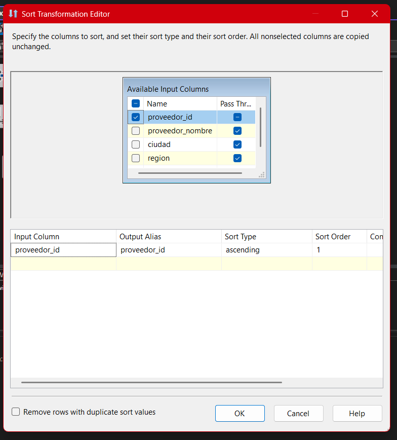
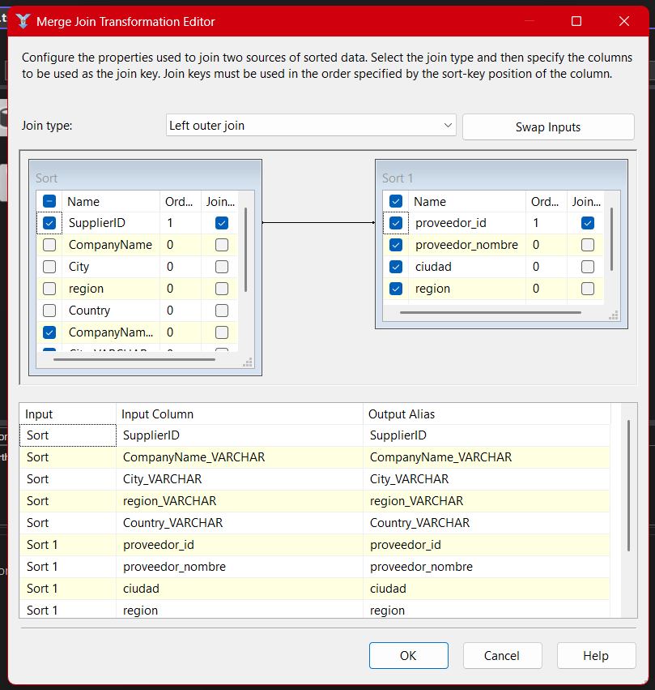

# **Documentación del Proceso ETL para la Tabla de Proveedores (Package 06-Stage-Proveedor)**

## **Descripción general**

El paquete **06-Stage-Proveedor.dtsx** es el encargado de garantizar la integración incremental, la calidad y la estandarización de los datos de proveedores desde Northwind hacia el entorno de staging. Su arquitectura está diseñada para asegurar idempotencia, escalabilidad y trazabilidad, permitiendo una carga robusta, libre de duplicados y alineada a las mejores prácticas de modelado dimensional.

- **Carga incremental:** Solo se insertan nuevos proveedores, preservando la integridad y evitando sobreescrituras.
- **Normalización:** Todos los campos relevantes se estandarizan en formato, longitud y codificación.
- **Escalabilidad:** Adaptable para agregar nuevos atributos y validaciones.
- **Trazabilidad:** Permite auditoría de cambios y troubleshooting eficiente gracias a su estructura modular y pasos documentados.

---

## **Arquitectura General del Paquete**


La correcta gestión ETL de proveedores es crítica para mantener la integridad referencial y la calidad analítica del datamart.
El diseño incremental —basado en comparación de orígenes y staging, con detección y carga de solo registros nuevos— es fundamental en entornos donde los proveedores pueden cambiar, actualizarse o ser agregados frecuentemente, y donde la robustez frente a duplicados es esencial para análisis posteriores y cumplimiento de normativas de calidad de datos.

---

## **1. OLE DB Source — Extracción de Proveedores Northwind**


- **Conexión:** `LocalHost.Northwind`
- **Consulta SQL:**

  ```sql
  SELECT SupplierID,
         CompanyName,
         City,
         ISNULL(Region, 'SR') as region,
         Country
  FROM Northwind.dbo.Suppliers;
  ```

- **Propósito estratégico:**
  Se extraen todos los proveedores actuales, garantizando que ningún campo relevante (como `region`) quede nulo, lo que protege la integridad y previene rechazos o inconsistencias aguas abajo.

> [!NOTE]
> La normalización inmediata (relleno de nulos con ‘SR’) reduce la necesidad de validaciones posteriores y acelera la integración de datos en sistemas productivos.

---

## **2. OLE DB Source 1 — Extracción de Proveedores Stage**



- **Conexión:** `LocalHost.stage_northwind`
- **Tabla:** `[dbo].[proveedor]`
- **Propósito:**
  Permite comparar el universo actual de proveedores ya cargados en staging para asegurar cargas estrictamente incrementales (evitando duplicados).

---

## **3. Data Conversion — Normalización de Tipos de Dato**



- **Propósito técnico:**
  Convierte los campos extraídos a tipos y longitudes compatibles con la tabla de staging, previniendo errores de formato, encoding o truncamiento.
- **Campos clave:**

  - `CompanyName` → `CompanyName_VARCHAR` (`string[DT_STR]`, 40)
  - `City` → `City_VARCHAR` (`string[DT_STR]`, 50)
  - `region` → `region_VARCHAR` (`string[DT_STR]`, 15)
  - `Country` → `Country_VARCHAR` (`string[DT_STR]`, 15)

- **Riesgo mitigado:**
  Las diferencias en longitud/codificación entre origen y destino son causa común de rechazos y errores silenciosos en cargas masivas. Normalizar desde el origen asegura robustez.

---

## **4. Sort — Ordenamiento para el Merge**





- **Sort (Northwind):** Ordena por `SupplierID`.
- **Sort 1 (Stage):** Ordena por `proveedor_id`.
- **Justificación:**
  El **Merge Join** en SSIS requiere conjuntos ordenados por la clave de unión para garantizar comparaciones válidas y reproducibles.
- **Recomendación avanzada:**
  Para grandes volúmenes, considera ordenar desde SQL para optimizar rendimiento y memoria.

---

## **5. Merge Join — Detección de Registros Nuevos**



- **Tipo:** Left Outer Join (de Northwind a Stage)
- **Claves de unión:** `SupplierID` ↔ `proveedor_id`
- **Propósito clave:**
  Detectar registros presentes en Northwind pero ausentes en staging, permitiendo cargas realmente incrementales.
- **Valor agregado:**
  La idempotencia de este flujo garantiza que la integración pueda ejecutarse múltiples veces sin crear duplicados ni perder trazabilidad.

---

## **6. Conditional Split — Filtrado de Nuevos Proveedores**


- **Condición:**

  ```sql
  ISNULL(proveedor_id)
  ```

- **Salida:** `Nuevos_Proveedores`

* **Propósito:**
  Solo se seleccionan para carga aquellos proveedores que no existen aún en la tabla de staging (detectados por la ausencia de `proveedor_id` tras el join).

---

## **7. OLE DB Destination — Carga de Nuevos Proveedores**


- **Conexión:** `LocalHost.stage_northwind`
- **Tabla de destino:** `[dbo].[proveedor]`
- **Mapeo de columnas:**

  - `SupplierID` → `proveedor_id`
  - `CompanyName_VARCHAR` → `proveedor_nombre`
  - `City_VARCHAR` → `ciudad`
  - `region_VARCHAR` → `region`
  - `Country_VARCHAR` → `pais`

- **Propósito:** Inserta únicamente los proveedores detectados como nuevos en la tabla de staging, evitando duplicados.

---

## **8. Buenas Prácticas, Riesgos y Escenarios de Mejora**

### Buenas Prácticas:

- **Carga estrictamente incremental:** Solo se insertan proveedores nuevos.
- **Normalización inmediata:** Evita errores por nulos o diferencias de formato.
- **Documentación visual y técnica:** Facilita el mantenimiento y auditoría.

### Riesgos y cómo mitigarlos:

- **Cambios de estructura:** Si el modelo de proveedor cambia en origen o destino, actualiza de inmediato las conversiones y mapeos para evitar rechazos silenciosos.
- **Performance:** Ordena en SQL para grandes volúmenes y monitorea la carga para prevenir cuellos de botella.
- **Errores de mapeo:** Realiza pruebas unitarias de inserción y valida la unicidad de la clave primaria.

## **Resumen Técnico Final**

El proceso ETL implementado en el paquete **06-Stage-Proveedor** asegura la integración incremental y la calidad de los datos de proveedores, alineando el entorno de staging con el origen transaccional Northwind bajo criterios de eficiencia, idempotencia y trazabilidad.
Mediante la comparación ordenada de registros, la normalización temprana de datos y la carga exclusiva de proveedores nuevos, el flujo minimiza riesgos de duplicidad y errores de formato, a la vez que prepara la infraestructura para una futura evolución del modelo (como el manejo de actualizaciones, bajas o metadata avanzada).
