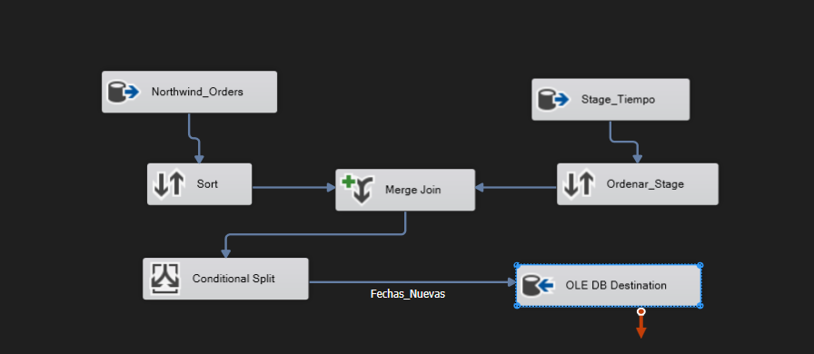
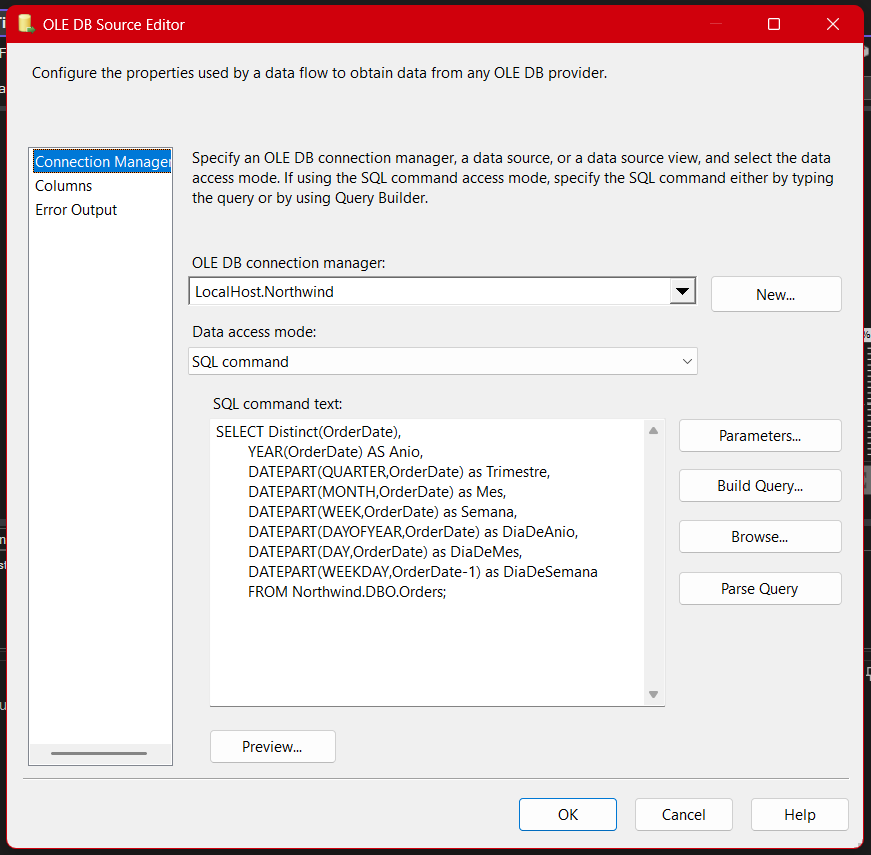
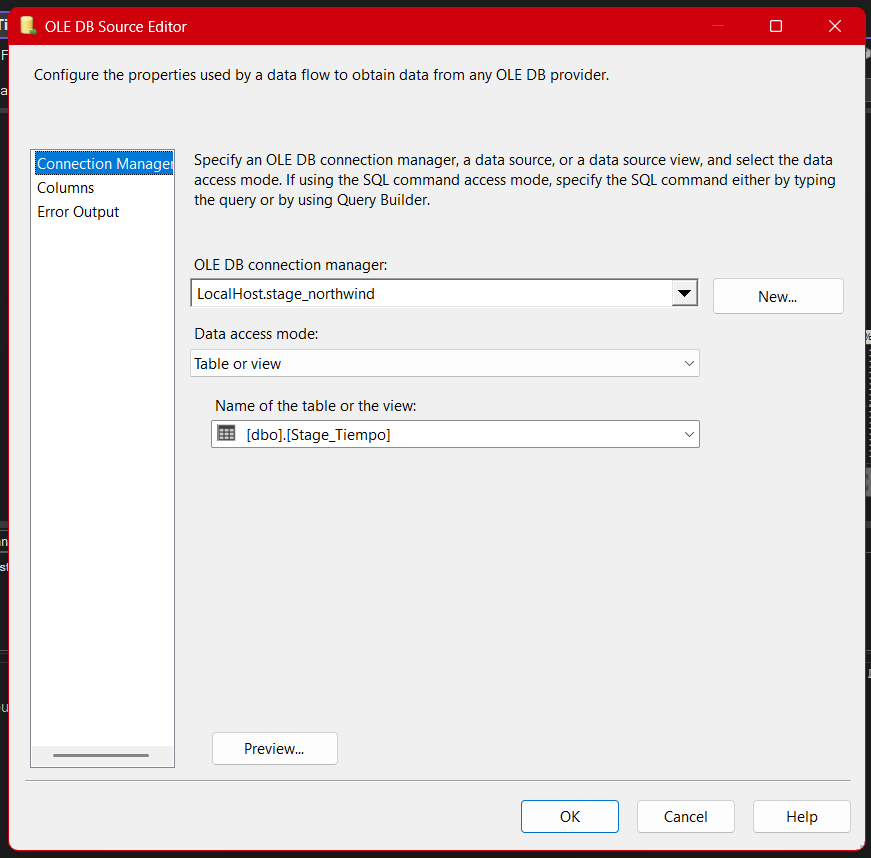
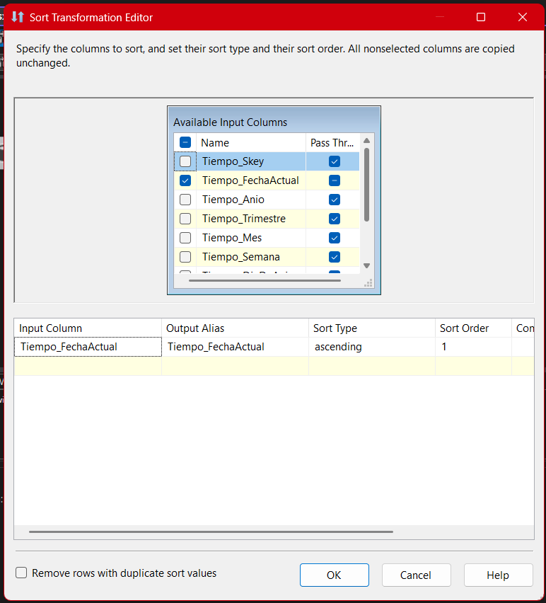
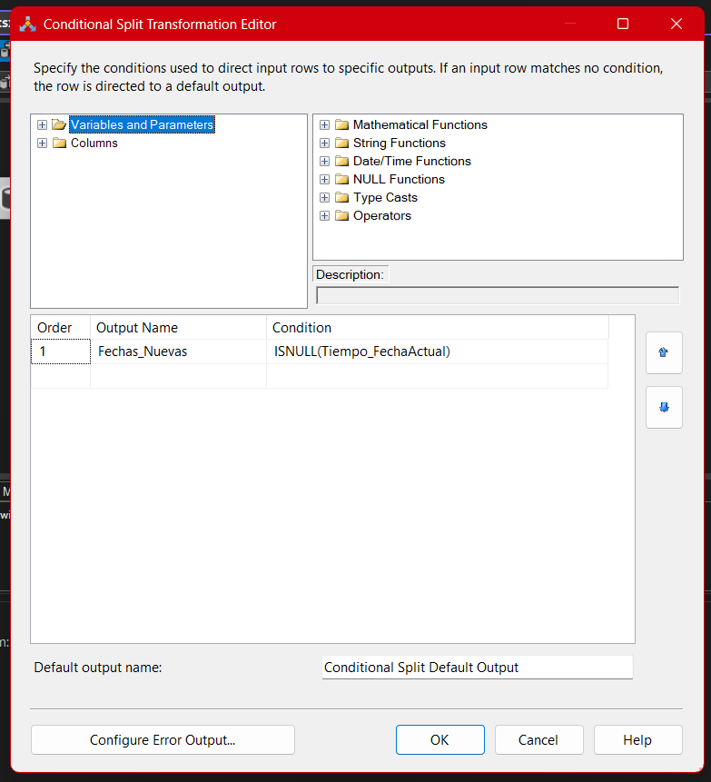
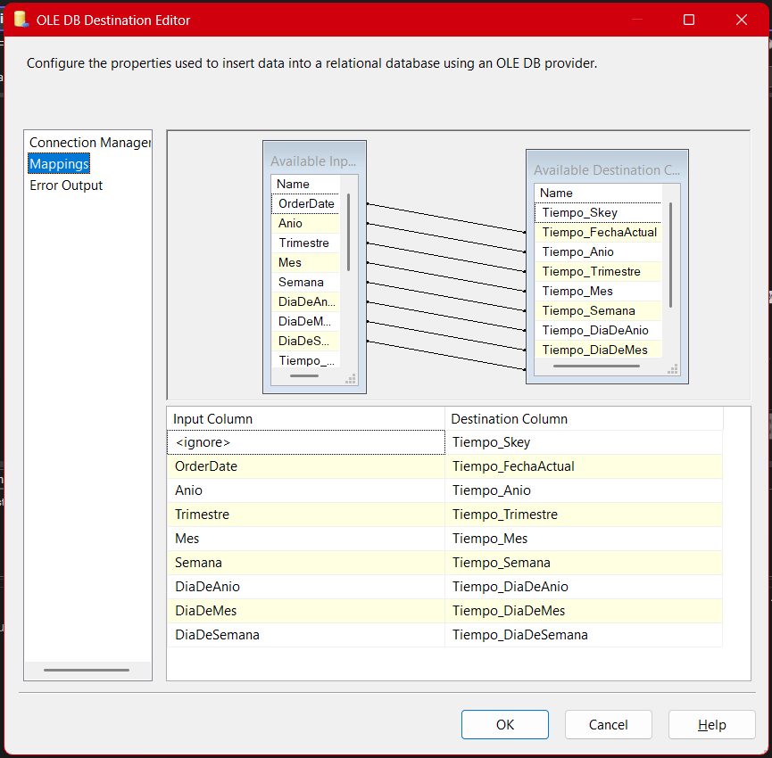

# **Documentación Detallada del Proceso ETL para la Tabla de Dimensión Tiempo (Package 07 - Stage_Tiempo)**

## **Descripción general**

El paquete **07-Stage-Tiempo.dtsx** implementa el flujo ETL para la dimensión temporal, uno de los ejes transversales de todo análisis de datos profesional. La existencia de una tabla de tiempo bien poblada y estructurada permite análisis comparativos, generación de tendencias, periodización flexible y la correcta integración de toda la información transaccional de Northwind, garantizando escalabilidad y profundidad en el Business Intelligence.

Este paquete asegura la actualización incremental de la dimensión tiempo en el entorno de **Stage**, evitando duplicados, permitiendo integraciones futuras, y preparando el terreno para una analítica temporal sólida.

---

## Arquitectura General del Paquete (SSIS)

El flujo sigue la metodología estándar de integración para dimensiones tipo 0 (estáticas e incrementales).
Los pasos clave son:

1. **Extracción de fechas de las órdenes (Northwind)**
2. **Desglose de atributos temporales relevantes**
3. **Obtención del catálogo actual de fechas en Stage**
4. **Ordenamiento para operaciones de comparación**
5. **Comparación incremental (Merge Join)**
6. **Filtrado de fechas nuevas (Conditional Split)**
7. **Carga incremental a la dimensión tiempo en Stage**



---

## 1. Extracción y Desglose de Fechas Únicas (OLE DB Source Northwind_Orders)



- **Consulta SQL utilizada:**

  ```sql
  SELECT DISTINCT(OrderDate) AS Fecha,
      YEAR(OrderDate) AS Anio,
      DATEPART(QUARTER, OrderDate) AS Trimestre,
      DATEPART(MONTH, OrderDate) AS Mes,
      DATEPART(WEEK, OrderDate) AS Semana,
      DATEPART(DAYOFYEAR, OrderDate) AS DiaDeAnio,
      DATEPART(DAY, OrderDate) AS DiaDeMes,
      DATEPART(WEEKDAY, OrderDate) - 1 AS DiaDeSemana
  FROM Northwind.DBO.Orders;
  ```

- **Propósito:**

  - Extraer **todas las fechas de órdenes** de manera única (DISTINCT), desglosando cada fecha en sus atributos temporales clásicos.
  - Permite crear una dimensión tiempo granular, capaz de soportar análisis por año, trimestre, mes, semana, día, y día de la semana.

- **Valor empresarial:**

  - Sin una dimensión tiempo robusta, los informes pierden capacidad de segmentación temporal y se limita la comparabilidad histórica.

---

## 2. Consulta de Fechas Existentes en Stage (OLE DB Source Stage_Tiempo)



- **Propósito:**

  - Obtener todas las fechas ya presentes en la dimensión tiempo de Stage, para evitar duplicados y garantizar cargas incrementales idempotentes.
  - Facilita auditoría y control de calidad.

---

## 3. Ordenamiento de Fechas (Sort)

- **Ambos datasets (Northwind y Stage) deben ser ordenados por la clave de comparación (fecha)**.
- **Importancia:**

  - El componente `Merge Join` requiere que ambas fuentes estén perfectamente ordenadas para comparar correctamente los registros.
  - Minimiza riesgos de errores silenciosos en la carga.



---

## 4. Comparación de Fechas - Merge Join


- **Tipo de unión:** Left Outer Join (todas las fechas de Northwind y las correspondientes de Stage si existen).

- **Claves de comparación:** Fecha (OrderDate) ↔ Tiempo_FechaActual.

- **Propósito:**

  - Identificar fechas presentes en Northwind pero no en Stage.
  - Permitir la actualización incremental de la dimensión.

- **Errores comunes:**

  - No alinear el tipo de datos o formato de fecha causa que el join falle silenciosamente.
  - Olvidar el orden previo impide el correcto funcionamiento del Merge Join.

---

## 5. Filtrado de Fechas Nuevas - Conditional Split



- **Condición de filtrado:**

  ```
  ISNULL(Tiempo_FechaActual)
  ```

  Solo las fechas no presentes en Stage avanzan en el flujo.

- **Justificación profesional:**

  - Evita cargas duplicadas, asegura integridad, mantiene la dimensión limpia y actualizada.
  - Permite que el proceso sea ejecutado repetidamente sin riesgo de sobrescritura o inconsistencias.

---

## 6. Carga Incremental a la Dimensión Tiempo - OLE DB Destination




- **Propósito:**

  - Insertar solo fechas nuevas en la tabla `[Stage_Tiempo]`.
  - Mantener la integridad y evolución cronológica de la dimensión.

- **Buenas prácticas:**

  - Valida el mapeo de cada columna (FechaActual, Anio, Trimestre, Mes, Semana, Día del Año, Día del Mes, Día de la Semana).
  - Configura el destino para manejo eficiente de errores y bulk insert si el volumen lo requiere.

---

## 7. Valor Añadido y Buenas Prácticas

- **Idempotencia y control:**

  - Este patrón de comparación y filtrado asegura que nunca existan duplicados, independientemente de cuántas veces se ejecute el ETL.

- **Flexibilidad y escalabilidad:**

  - El diseño permite añadir nuevos atributos temporales en el futuro (semestre, fin de semana, festivo, etc.) sin rediseñar el flujo.

- **Valor empresarial:**

  - Habilita análisis como ventas por mes, por trimestre, estacionalidad, días laborables vs. fin de semana, tendencias a lo largo del año, y más.

- **Recomendación:**

  - Documenta cada cambio o ampliación futura (ejemplo: nuevos cálculos de atributos temporales), para mantener el flujo transparente y auditable.

---

## 8. Errores frecuentes y troubleshooting

- **Error:** Fechas no insertadas aunque sean nuevas.

  - _Solución:_ Revisa tipos de dato, formato y timezone en ambos orígenes.

- **Error:** Merge Join muestra filas inesperadas.

  - _Solución:_ Verifica el ordenamiento previo y que las claves estén alineadas.

- **Error:** Columnas en destino desordenadas o sin mapear.

  - _Solución:_ Revisa y valida el mapeo columna a columna antes de correr el ETL en producción.

---

## **Resumen Técnico**

El paquete **07-Stage-Tiempo** es la base de cualquier análisis temporal dentro del ecosistema Northwind y un estándar que puedes replicar para cualquier dimensión de tipo estático en futuros proyectos de analítica empresarial. Su diseño incremental, su foco en la calidad y su facilidad de extensión lo convierten en una pieza clave tanto para aprendizaje como para ambientes productivos.

---
