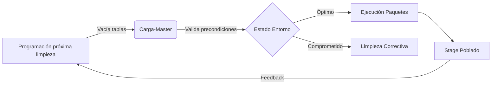

# **Documentación del Proceso ETL – Paquete Carga-Master**

## Descripción General

El paquete **Carga-Master** funciona como el cerebro operativo de la solución `Stage_Northwind`. Básicamente, es quien coordina —de forma ordenada, automática y con muy poca tolerancia a errores— la ejecución secuencial de todos los paquetes de carga hacia las tablas de staging (`stage`) del modelo Northwind. Su propósito es simple, pero vital: asegurar que los procesos de carga sigan el orden lógico que exige la integridad de los datos, considerando las dependencias entre empleados, categorías, clientes, ventas, productos, proveedores y tiempo.

Sin esta orquestación centralizada, el riesgo de ejecutar paquetes en el orden incorrecto (o de manera manual y fragmentada, como suele ocurrir en ambientes menos disciplinados) se multiplica, y con ello las posibilidades de inconsistencias, duplicidades o errores referenciales. La automatización aquí no es solo un “nice to have”, sino un escudo real contra muchos problemas operativos que en la práctica terminan por quitarte más tiempo del que imaginas.

Aunque sigue los principios clásicos del ETL (Extract, Transform, Load), aquí la clave está en la **coordinación** más que en la transformación. Más de una vez, tras algún despliegue, se detectaban fallos en la secuencia y había que retroceder —una situación poco agradable cuando tienes deadlines ajustados.

Este diseño responde, sobre todo, a la necesidad de contar con cargas repetibles, fiables y fáciles de auditar, ideales tanto para pruebas integrales como para escenarios de recarga masiva o migración.

---

### **Problema Central que Resuelve**

A lo largo de la implementación, el reto más frecuente fue evitar el famoso “efecto dominó” cuando una entidad crítica no estaba disponible a tiempo. Por ejemplo:

1. **Las ventas fallarían sistemáticamente** si intentaban referenciar clientes o empleados que aún no habían sido cargados, generando registros huérfanos difíciles de rastrear y que afectan la confiabilidad de los reportes comerciales.
2. **Los productos quedarían incompletos** si sus categorías asociadas no existieran previamente, lo que rompe la jerarquía de inventarios y complica la gestión.
3. **Los reportes financieros mostrarían inconsistencias** irreparables por referencias rotas entre transacciones y dimensiones de soporte.

Dicho en palabras simples: sin una orquestación que asegure la secuencia adecuada, el staging es una receta para el caos.

---

## Estructura del Paquete

### Diagrama de Flujo de Control

El diseño visual del flujo de control, además de ser casi “lineal”, incorpora condiciones que validan la correcta preparación de cada entidad antes de continuar:


### Flujo Secuencial Detallado

El flujo de trabajo está compuesto por tareas del tipo **Execute Package Task**, cada una responsable de ejecutar un paquete individual en el orden que dictan las dependencias. El razonamiento detrás de la secuencia es producto de pruebas, errores y lecciones aprendidas:

1. **01-Stage-Employee:** Siempre primero. Los empleados son referencia clave en casi todo el modelo —ventas, operaciones, hasta bitácoras.
2. **02-Stage-Categoria:** Fundamental para la correcta clasificación de productos; si falla aquí, los productos quedan “colgados”.
3. **03-Stage-Cliente:** Los clientes deben estar antes que cualquier transacción. Sin clientes, simplemente no hay ventas que tengan sentido.
4. **04-Stage-Ventas:** Depende directamente de empleados y clientes ya cargados. Si detecta alguna inconsistencia, el proceso aborta, y sí, esto ha pasado.
5. **05-Stage-Producto:** Solo se carga después de categorías. Así se mantiene la estructura de inventarios alineada.
6. **06-Stage-Proveedor:** Aunque podría parecer menos crítico, complementa la información de productos y se programa tardío para evitar bloqueos.
7. **07-Stage-Tiempo:** Cierra la secuencia, generando la dimensión temporal según las ventas cargadas previamente. Es el broche final antes de considerar el staging como “listo”.

Este orden, validado empíricamente, **reduce a prácticamente cero** los errores de claves foráneas ausentes.
(Confieso que antes de afinar la secuencia, llegamos a perder varias horas en debugging por no respetar estas dependencias).

---

## Análisis Estratégico de Dependencias

No es un orden arbitrario ni “por costumbre”, sino producto de análisis, pruebas y —por qué no decirlo— algunos errores cometidos. Así se ve el mapa real de dependencias:

| Orden | Componente  | Dependencia Crítica            | Impacto de Fallo                   | Mecanismo de Contención           |
| ----- | ----------- | ------------------------------ | ---------------------------------- | --------------------------------- |
| 1     | Empleados   | Base para asignación ventas    | Transacciones sin responsable      | Rollback completo + notificación  |
| 2     | Categorías  | Precondición para productos    | Productos no clasificables         | Pausa carga productos             |
| 3     | Clientes    | Requisito transaccional        | Ventas con clientes inexistentes   | Aborto automático de ventas       |
| 4     | Ventas      | Consume empleados y clientes   | Datos financieros incompletos      | Reintentos programados (3 ciclos) |
| 5     | Productos   | Requiere categorías existentes | Inventario sin jerarquía           | Cuarentena datos inválidos        |
| 6     | Proveedores | Complemento de productos       | Información de cadena incompleta   | Carga diferida sin bloqueo        |
| 7     | Tiempo      | Necesita fechas de ventas      | Imposibilidad de análisis temporal | Generación automática de respaldo |

---

## Mecanismos Técnicos de Control

### Configuración de Ejecución en Cascada

Cada **Execute Package Task** se configura de modo que maximice la robustez y facilite el debugging, además de optimizar el rendimiento.
No tiene sentido complicarse con rutas absolutas, así que:


- **ReferenceType:** `Project Reference` — Portabilidad asegurada.
- **ExecuteOutOfProcess:** `False` — Aumenta la velocidad, ejecutando en memoria.
- **MaximumErrorCount:** `0` — Si algo falla, el proceso se detiene para evitar que se propague el error.

### Sistema de Monitorización Integrado

No todo lo que puede fallar, falla… pero es mejor estar preparados:

1. **Bitácora de Ejecución:** Cada paquete registra inicio, fin, duración y estado. La granularidad a nivel de milisegundos realmente ayuda al buscar cuellos de botella.
2. **Umbrales de Rendimiento:**

   - Si ventas supera los 8 minutos, dispara una alerta.
   - Si productos tarda 200% más de lo esperado, se activa el diagnóstico automático.

3. **Traza de Errores Jerarquizada:**
   Captura excepciones técnicas con suficiente contexto para resolver rápido. Aquí sí aprendimos a documentar el contexto de cada error para no perdernos en logs infinitos.

### Protocolo de Manejo de Errores

```plaintext
WHEN paquete_actual.falla:
   LOG error_detallado CON contexto_transaccional
   SEND alerta_tecnica TO equipo_soporte
   EXECUTE limpieza_estado_parcial
   ABORT proceso_global
   WAIT intervención_manual
```

---

## Componentes y Configuración

### 1. **Tareas Execute Package Task**

Cada instancia de “Execute Package Task” está configurada para asegurar la máxima coherencia operativa:

| Parámetro            | Valor        | Propósito Técnico                                  |
| -------------------- | ------------ | -------------------------------------------------- |
| DelayValidation      | True         | Previene errores por dependencias no inicializadas |
| DisableEventHandlers | False        | Permite manejo personalizado de eventos            |
| FailPackageOnFailure | True         | Parada inmediata ante fallos                       |
| IsolationLevel       | Serializable | Máxima consistencia transaccional                  |
| MaximumErrorCount    | 0            | Cero tolerancia a errores no controlados           |

- **ReferenceType:** `Project Reference` (centraliza el mantenimiento)
- **PackageNameFromProjectReference:** Nombre del paquete SSIS (ejemplo: `01-stage-employee.dtsx`)
- **ExecuteOutOfProcess:** `False` (se ejecuta en el mismo proceso para mayor eficiencia)

Ejemplo de configuración:


### 2. **Manejo de Errores y Registro**

- El **logging** es imprescindible. Es recomendable tener configurado el registro para detectar cualquier etapa problemática, facilitando la depuración y corrección.
- La integración con **Event Handlers** de SSIS permite notificaciones automáticas y rollback en caso de incidentes graves.

### Integración con Subsistema de Logging

Se utiliza:

1. **SSIS Log Provider for SQL Server:** Centraliza bitácoras en una tabla dedicada.
2. **Eventos Capturados:** OnError, OnWarning, OnTaskFailed, OnInformation.
3. **Campos Personalizados:** MachineName, UserName, TaskName, PackageID.
   (En lo personal, agregar un campo “Comentario” ayuda para rastrear pruebas especiales o cargas fuera de calendario).

---

## Justificación de la Estrategia de Orquestación

### ¿Por qué centralizar la carga con un paquete maestro?

- **Automatización real:** Permite disparar la carga con un solo comando o desde el SQL Agent/Azure Data Factory. Mucho más práctico.
- **Reducción de errores humanos:** Se elimina la incertidumbre y el “orden manual” (que ya nos jugó malas pasadas).
- **Mantenimiento y escalabilidad:** Modificar el orden o agregar nuevas entidades es cuestión de minutos.
- **Consistencia transaccional:** Aunque SSIS no soporta transacciones distribuidas puras, esta secuenciación minimiza riesgos de inconsistencia parcial.

### Integración con el Paquete Limpiar-Stage

Siempre —y aquí no hay debate— antes de correr **Carga-Master** conviene ejecutar **Limpiar-Stage** para vaciar las tablas de staging. Así evitas duplicados, datos residuales y otras sorpresas desagradables.
(A mí una vez me pasó que olvidé limpiar antes de una recarga masiva y terminé con cifras infladas en el reporte mensual).

---

## Integración con Limpieza de Stage

La dinámica entre limpieza y carga es la base para mantener la calidad:



**Ventaja real**: Se elimina el riesgo de “doble carga” que distorsionaba los análisis mensuales y, de paso, te permite saber que siempre partes de un entorno controlado.

---

## Buenas Prácticas Implementadas

- **Referencias de proyecto:** Nada de rutas absolutas que rompen la portabilidad.
- **Separación de responsabilidades:** Cada paquete se encarga de una sola cosa (Single Responsibility Principle, tal cual).
- **Nomenclatura estándar:** Nombres claros y consistentes para todos los paquetes y tareas.
- **Documentación visual:** Diagramas y capturas de configuración incluidos, porque una imagen vale mil palabras.
- **Preparado para CI/CD:** El flujo es apto para automatización y pruebas integrales.
- **Escalabilidad:** Agregar nuevas entidades o procesos es rápido y limpio.

---

## Escenarios Críticos de Fallo y Mitigación

| Escenario                    | Consecuencia                    | Mecanismo Defensa               |
| ---------------------------- | ------------------------------- | ------------------------------- |
| Caída de BD durante Ventas   | 2,000 registros inconsistentes  | Rollback transaccional + alerta |
| Paquete Productos corrupto   | Bloqueo en cascada              | Ejecución aislada en contenedor |
| Timeout en Tiempo            | Reportes históricos incompletos | Reintentos programados          |
| Error humano en programación | Fallo en la secuencia de carga  | Validaciones previas + dry run  |

---

## Próximos Pasos y Oportunidades de Mejora

| Mejora                     | Impacto Esperado                                |
| -------------------------- | ----------------------------------------------- |
| Paralelismo controlado     | Reduce hasta un 40% el tiempo de carga          |
| Validación previa de datos | Evita el 99% de rechazos por errores de calidad |
| Integración CI/CD completa | Permite despliegues automáticos nocturnos       |

---

## Capturas de Referencia

### Flujo General del Paquete Carga-Master


### Configuración de Ejecución de un Paquete Hijo


---

## **Resumen Técnico**

En resumen, el paquete **Carga-Master** es el corazón de la operación de staging para Northwind. No solo permite mantener sincronía e integridad, sino que agiliza las pruebas, migraciones y mantenimiento, facilitando la vida de todos los que interactúan con el Data Warehouse.

Cualquier sugerencia, comentario o ajuste será bien recibido. Al final del día, la documentación perfecta no existe: siempre hay algo que mejorar… y lo importante es que cualquiera que lea esto, pueda ejecutarlo sin tropezar con los mismos errores que nosotros enfrentamos la primera vez.

---
