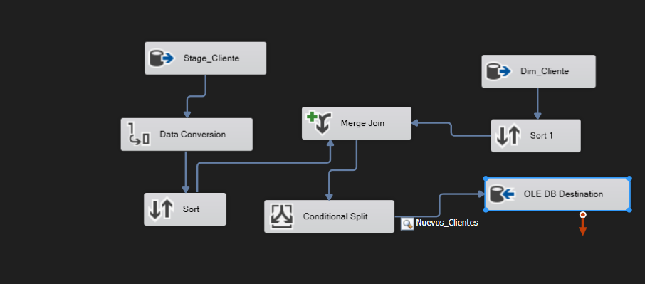
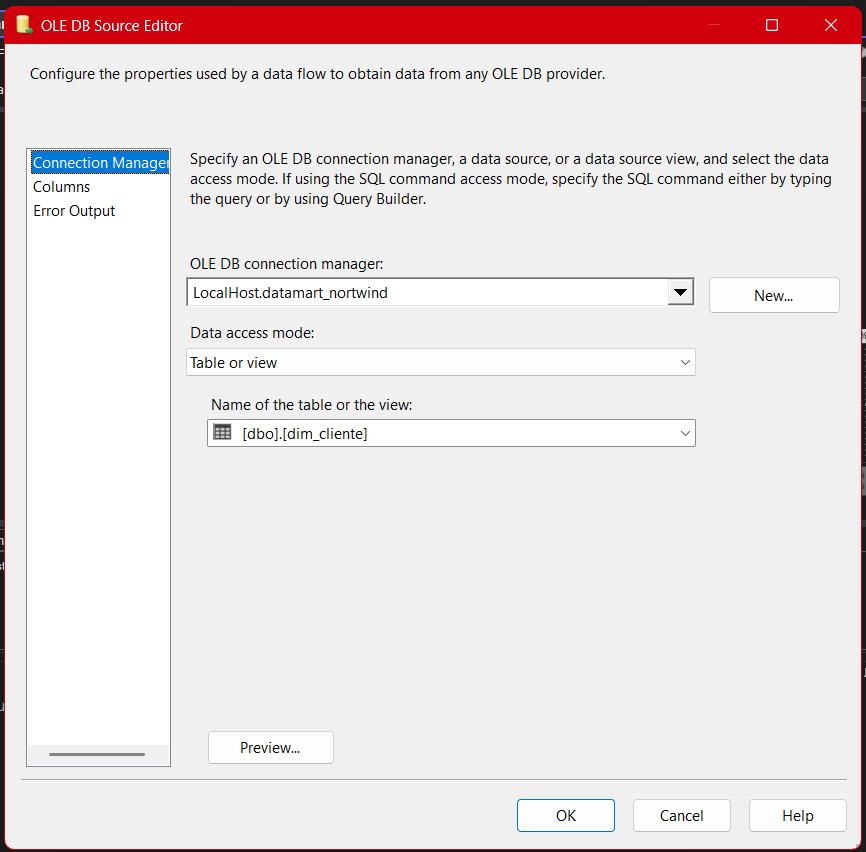
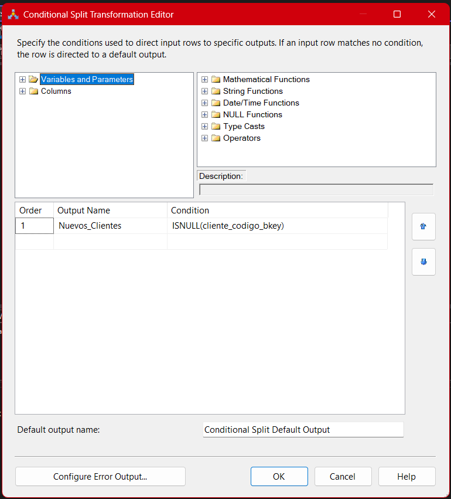
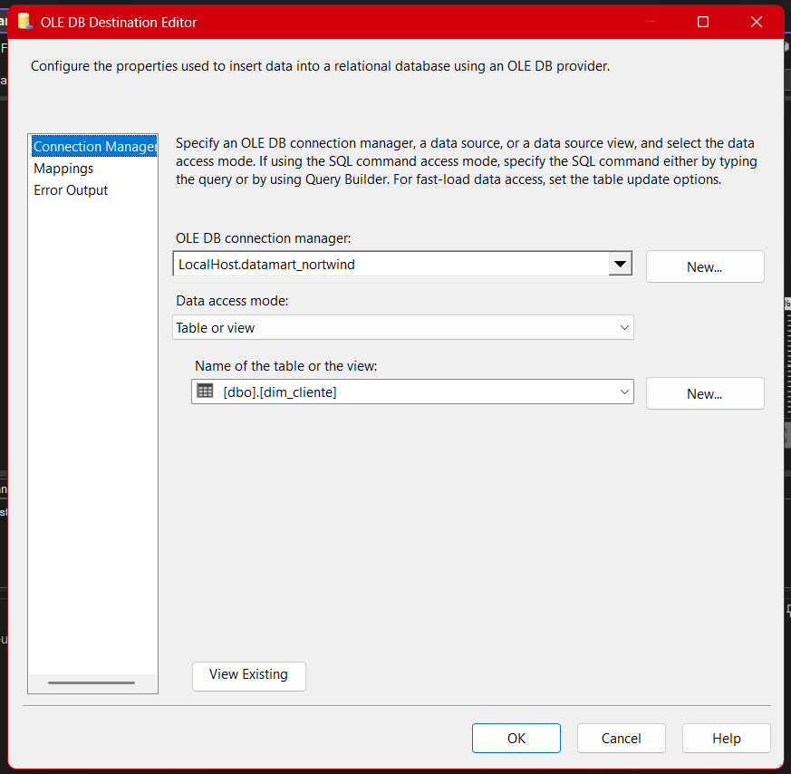

# **Documentación del Proceso ETL para el Paquete Datamart-Cliente**

## Propósito y Rol Estratégico

El **paquete "01-Datamart-Cliente"** es el primer componente de la arquitectura Datamart del proyecto Northwind ETL. Su función principal es transformar y cargar la información de clientes desde el área de staging hacia la dimensión cliente del datamart, bajo un modelo robusto y preparado para análisis avanzado.

Esto permite garantizar un entorno de **datos confiables y consistentes**, clave para la toma de decisiones empresariales, generación de reportes, segmentación, análisis de comportamiento de clientes y construcción de tableros ejecutivos. La dimensión de clientes es, junto con la de productos, una de las piedras angulares en cualquier proyecto de analítica de negocios.

---

## Visión General del Flujo ETL



El flujo de este paquete sigue los principios **Extract-Transform-Load (ETL)** de manera orquestada y con controles de calidad de datos, distribuidos en varias etapas críticas:

1. **Extracción:** Lectura de datos “crudos” desde la zona de staging, asegurando disponibilidad y exactitud de la información base.
2. **Transformación:** Limpieza, tipificación y estandarización de atributos, garantizando calidad y alineación con el modelo de la dimensión destino.
3. **Enriquecimiento y Control de Incrementalidad:** Identificación de registros nuevos o modificados respecto a la tabla destino, usando lógica de joins y splits condicionales para eficiencia y precisión.
4. **Carga Controlada:** Inserción eficiente y segura en la dimensión cliente (`dim_cliente`), con mapeos explícitos y mecanismos para manejar errores y rechazos.

---

## 1. Extracción: Conexión y Consulta al Área de Staging

### Objetivo Técnico

Se utiliza una fuente OLE DB para conectar con la base de staging, específicamente sobre la tabla `stage_northwind.dbo.clientes`. En esta área, los datos ya han pasado por procesos previos de depuración y homogenización, pero **no necesariamente tienen la estructura ni los tipos de la dimensión analítica**.


#### Consulta SQL Ejecutada

```sql
SELECT
    sc.clienteid,
    sc.compania,
    sc.ciudad,
    sc.region,
    sc.pais
FROM stage_northwind.dbo.clientes AS sc;
```

#### Detalles a Resaltar

- **No hay filtrado por fechas ni restricciones:** Se busca obtener todo el set de clientes, para garantizar que la tabla de dimensión refleje la base de clientes completa y actualizada.
- **Estrategia incremental:** En flujos posteriores se filtran los registros ya existentes, optimizando la carga.
- **Posibles mejoras:** Si la tabla de staging contiene registros históricos, sería ideal incluir columnas de auditoría (fecha de carga, estatus) para estrategias de control más avanzadas.

---

## 2. Conversión y Normalización de Tipos de Datos

### Justificación

El área de staging puede contener tipos de datos heterogéneos o definidos para operatividad, pero el datamart debe ser **estrictamente tipado**. Por ejemplo, la columna `pais` debe adaptarse a un formato estándar definido en la tabla destino.


- **Tipo de conversión aplicado:** Se transforma `pais` a `string [DT_STR]` de longitud 15. Esto se realiza para asegurar compatibilidad con el modelo dimensional y evitar rechazos en la carga.
- **Prevención de errores:** Este paso previene errores de truncamiento, incompatibilidad de caracteres o problemas de collation al insertar en SQL Server.
- **Validación de datos:** Se recomienda (como mejora) implementar lógicas de validación de nulos o valores atípicos en esta etapa.

---

## 3. Extracción de Dimensión de Clientes en el DataMart

### Fundamento

Para evitar duplicidades y permitir cargas incrementales, es fundamental extraer el estado actual de la dimensión en el DataMart.



- **Conexión a DataMart:** `LocalHost.datamart_northwind`
- **Consulta:** `SELECT * FROM [dbo].[dim_cliente]`
- **Propósito:** Habilitar una comparación efectiva mediante un `Merge Join` y así solo insertar registros que sean realmente nuevos.

---

## 4. Enriquecimiento y Comparación con Merge Join

### Explicación de la Estrategia


- **Tipo de Join:** `Left Outer Join` entre los datos del staging y la dimensión de clientes.
- **Clave de Unión:** `clienteid` (en staging) vs `cliente_codigo_bkey` (en la dimensión).
- **Atributos de Comparación:** Se pueden usar también compañía, ciudad, región y país para estrategias de control de cambios en atributos no clave (ideal para SCD tipo 2 en implementaciones más avanzadas).
- **Resultado:** Todos los clientes de staging, junto con los datos equivalentes (si existen) en la dimensión. Esto permite identificar cuáles registros aún no están presentes en el datamart.

#### Detalles Técnicos

- **Ordenamiento:** Antes del merge join, ambos conjuntos deben estar ordenados por la clave de unión para cumplir con los requerimientos de SSIS.
- **Prevención de duplicidad:** Si un registro ya existe (la clave está presente en la dimensión), no se vuelve a cargar.

---

## 5. Identificación de Nuevos Registros (Conditional Split)

### Detalle y Justificación



- **Condición usada:** `ISNULL(cliente_codigo_bkey)`
- **Salida:** Solo pasan los clientes que no existen en la tabla destino, es decir, clientes realmente nuevos o que han cambiado su clave.
- **Prevención de cargas innecesarias:** Esta lógica reduce el uso de recursos y mejora la eficiencia, además de mantener la integridad de la tabla de dimensiones.

#### Mejora sugerida

- Para una implementación tipo Slowly Changing Dimension (SCD), podría agregarse lógica para actualizar atributos cambiantes, no solo nuevos registros.

---

## 6. Carga de Datos en la Dimensión

### Configuración Detallada

#### OLE DB Destination



- **Destino:** `datamart_northwind.dbo.dim_cliente`
- **Modo de carga:** `Table or View - Fast Load` (altamente recomendado para cargas masivas).

#### Mapeo de Columnas


| Input Column | Destination Column  | Descripción                     |
| ------------ | ------------------- | ------------------------------- |
| clienteid    | cliente_codigo_bkey | Identificador único del cliente |
| compania     | cliente_compania    | Nombre o razón social           |
| ciudad       | cliente_ciudad      | Ciudad del cliente              |
| region       | cliente_region      | Región o estado                 |
| pais_VARCHAR | cliente_pais        | País (tipificado y normalizado) |

- **Prevención de errores:** El mapeo explícito garantiza integridad de datos y previene errores comunes de carga, como “truncamiento” o “conversion failed”.

---

## 7. Gestión de Errores y Buenas Prácticas

- **Manejo de Errores:** Se recomienda configurar el flujo para redirigir errores a un destino alternativo, permitiendo la revisión de registros problemáticos sin interrumpir todo el proceso.
- **Auditoría:** Agregar logs sobre el número de registros insertados, errores y advertencias para facilitar la trazabilidad.
- **Automatización y Modularidad:** Este paquete está diseñado para ser ejecutado de forma autónoma o como parte de un proceso maestro (por ejemplo, un “Carga-Master”), lo que permite flexibilidad y escalabilidad.
- **Control de Versiones:** Se recomienda versionar los scripts SQL y plantillas SSIS para garantizar replicabilidad y facilitar la recuperación ante fallos.

---

## 8. Consideraciones Avanzadas

- **Estrategias SCD (Slowly Changing Dimensions):** En implementaciones futuras, se podría añadir lógica para detectar y manejar cambios en atributos no clave mediante SCD tipo 1 o 2, enriqueciendo el análisis histórico.
- **Integridad referencial:** Validar que los clientes cargados mantengan consistencia con otras dimensiones (países, regiones, ciudades).
- **Pruebas y QA:** Ejecutar pruebas de integración y validación después de cada carga para asegurar que no hay duplicidades ni pérdidas de información.

---

## **Resumen Técnico**

El **paquete 01-Datamart-Cliente** no solo implementa un flujo de ETL eficiente y escalable, sino que también incorpora controles de calidad y buenas prácticas para asegurar que la información de clientes, clave para cualquier análisis de negocio, sea confiable y esté siempre actualizada. Es un componente fundamental para la **inteligencia de negocios y la analítica avanzada** en la organización, facilitando desde reportes ejecutivos hasta análisis predictivo y segmentaciones.
