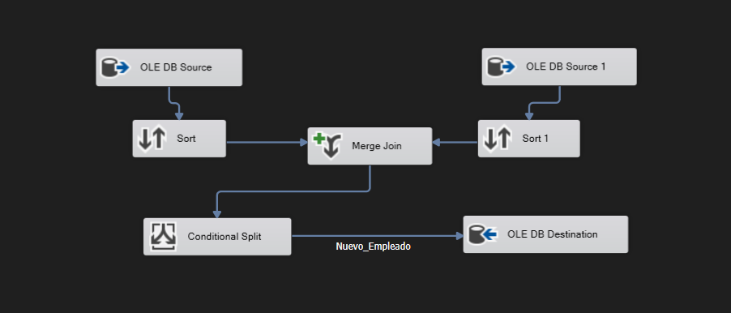
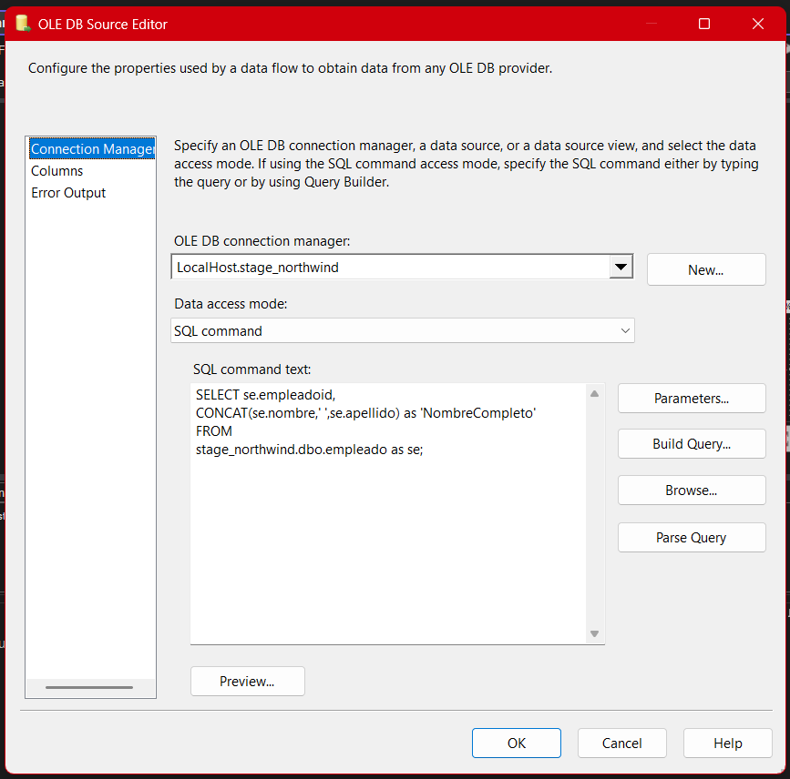
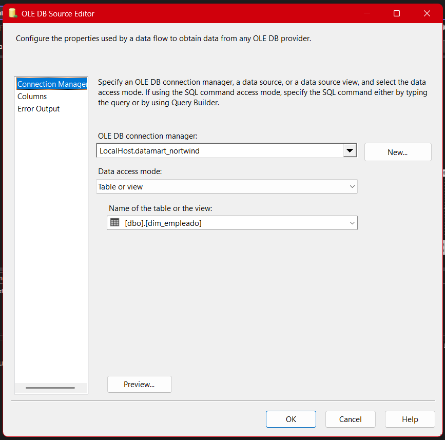
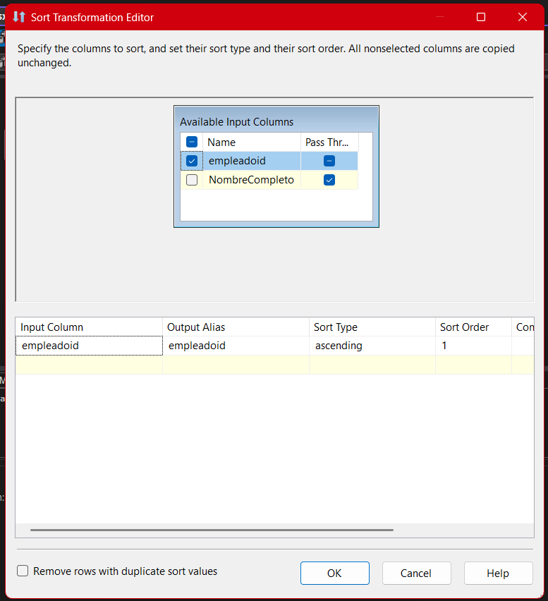
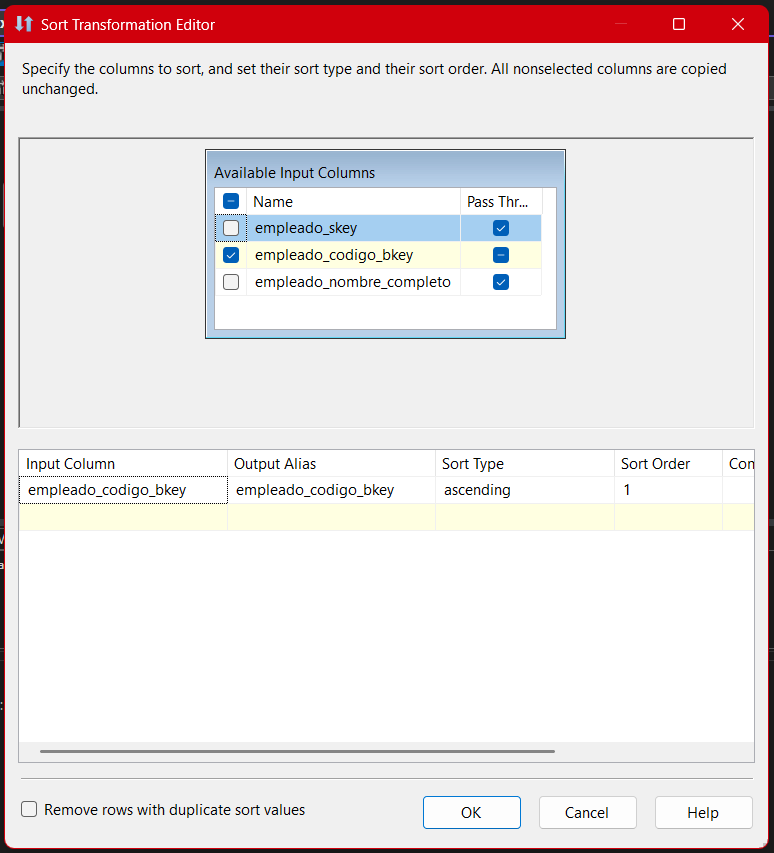
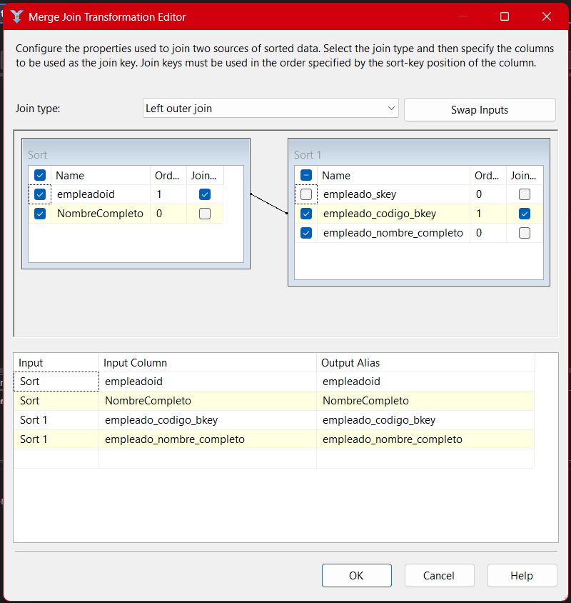
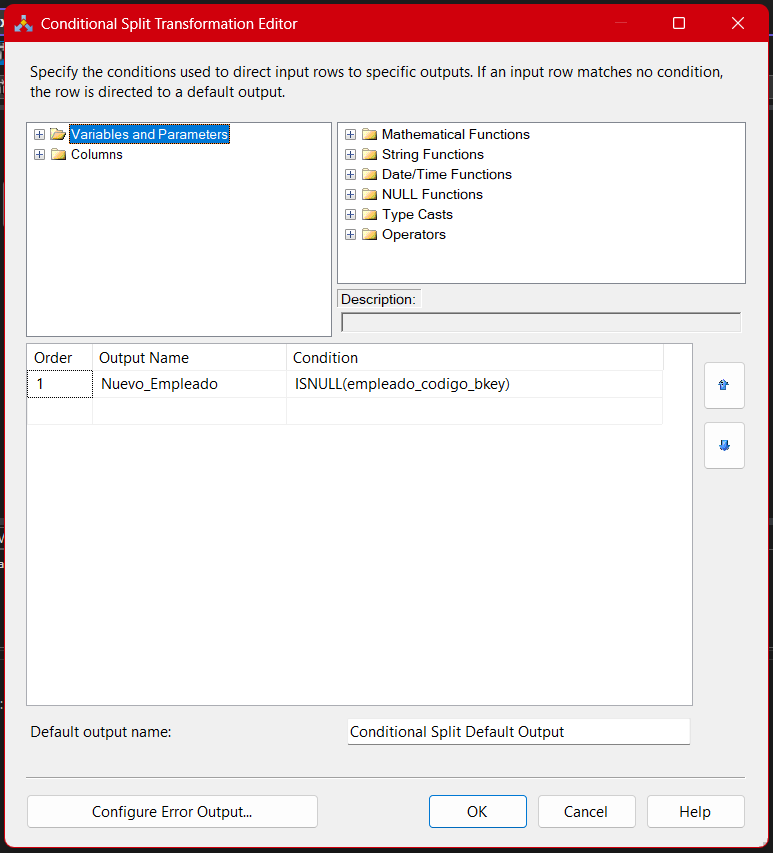
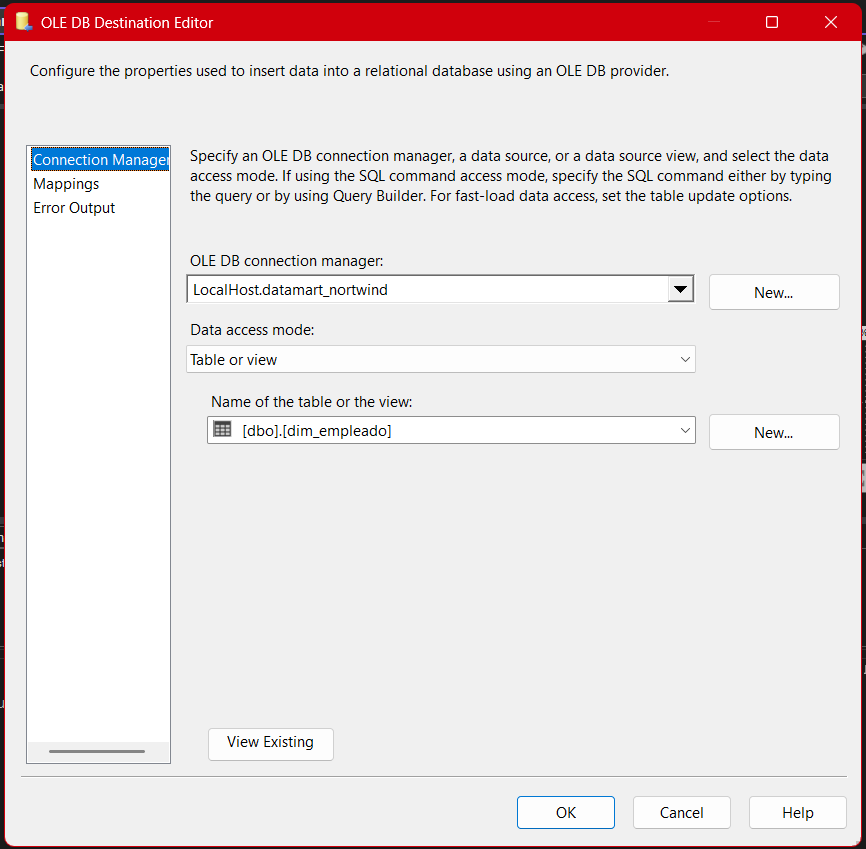
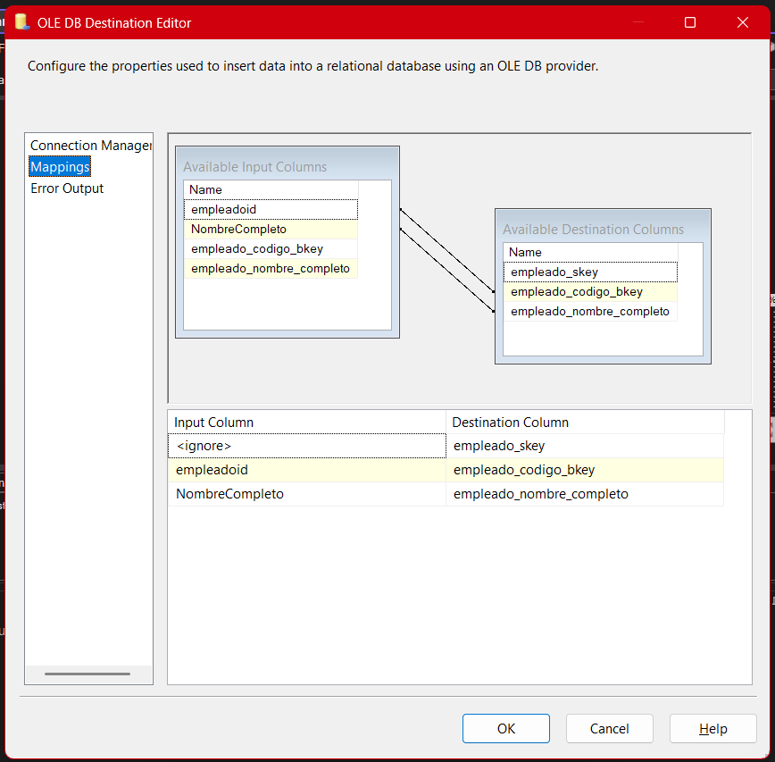

# **Documentación Detallada del Proceso ETL para el Paquete Datamart-Empleado**

---

## 1. Rol Estratégico y Propósito del Paquete

El paquete **02-Datamart-Empleado.dtsx** cumple una función fundamental en la arquitectura del datamart: **transformar y poblar la dimensión de empleados (`dim_empleado`)** de manera incremental, confiable y alineada a las mejores prácticas de ingeniería de datos. Esta dimensión es esencial para el análisis avanzado de recursos humanos, desempeño organizacional, generación de KPIs y cruce de información transaccional, como ventas o incidencias.

- **Importancia analítica:** Permite analizar el desempeño por empleado, identificar tendencias internas, correlacionar resultados con periodos, y facilita la segmentación de reportes por áreas, cargos o equipos.
- **Integración:** Sirve como nexo entre el área operativa (Stage) y el modelo analítico final (Datamart), garantizando que sólo los registros válidos, nuevos y bien estructurados se inserten en el sistema.

---

## 2. Arquitectura General y Flujo Lógico

El diseño de este paquete sigue un flujo **ETL incremental y controlado**, minimizando riesgos de duplicidad y degradación de datos. El proceso puede visualizarse de la siguiente manera:



### **Resumen del Flujo:**

1. **Extracción:** Recupera empleados desde Stage y la dimensión destino en Datamart.
2. **Preparación:** Ordena los datasets para garantizar una comparación eficiente.
3. **Comparación (Merge Join):** Detecta registros ya existentes vs. nuevos.
4. **Filtrado:** Identifica empleados que aún no existen en la dimensión.
5. **Carga controlada:** Inserta únicamente los nuevos empleados en `dim_empleado`.

---

## 3. Desglose Paso a Paso

### 3.1. Extracción desde Stage

**Fuente:** `stage_northwind.dbo.empleado`
**Consulta utilizada:**

```sql
SELECT empleadoid, CONCAT(nombre, ' ', apellido) AS NombreCompleto
FROM stage_northwind.dbo.empleado;
```



- **Racionalidad:** Se unifican nombre y apellido en un solo campo (`NombreCompleto`) desde el origen, centralizando la lógica de negocio y manteniendo la flexibilidad analítica en la dimensión destino.
- **Mejores prácticas:** Si existen reglas de normalización o limpieza (acentos, mayúsculas, caracteres especiales), es preferible aplicarlas aquí para evitar errores posteriores en el datamart.

---

### 3.2. Extracción desde la Dimensión Empleado (Datamart)

**Fuente:** `datamart_northwind.dbo.dim_empleado`
**Propósito:**
Permite comparar y detectar únicamente los empleados que aún no están presentes, **evitando duplicados y asegurando cargas incrementales idempotentes**.



- **Buenas prácticas:** Esta consulta debe extraer tanto la clave de negocio (`empleado_codigo_bkey`) como el nombre completo, permitiendo posibles controles adicionales para Slowly Changing Dimensions en el futuro.

---

### 3.3. Ordenamiento para Merge Join

Ambos conjuntos de datos (Stage y Datamart) deben ser ordenados por la clave de unión (`empleadoid` y `empleado_codigo_bkey` respectivamente), pues SSIS requiere datasets ordenados para realizar el Merge Join.

- **Imagen - Ordenamiento Stage:**
  
- **Imagen - Ordenamiento Datamart:**
  

---

### 3.4. Comparación y Unión de Datos (Merge Join)

**Tipo de unión:** Left Outer Join
**Claves:** `empleadoid` (Stage) ↔ `empleado_codigo_bkey` (Datamart)



- **Objetivo:** Identificar los empleados que están en Stage pero no en el Datamart.
- **Valor agregado:** Se puede expandir esta lógica para detectar cambios en otros atributos y así implementar SCD (Slowly Changing Dimensions) en futuras versiones.

---

### 3.5. Filtrado de Nuevos Registros (Conditional Split)

**Condición utilizada:**

```sql
ISNULL(empleado_codigo_bkey)
```



- **Lógica:** Solo pasan los empleados que no existen en la dimensión de destino, evitando duplicidades.
- **Relevancia profesional:** Esta lógica asegura la calidad y escalabilidad del datamart, ya que previene la generación de “ruido” analítico y facilita auditoría y control de versiones.

---

### 3.6. Carga de Datos a la Dimensión (`OLE DB Destination`)

**Destino:** `datamart_northwind.dbo.dim_empleado`
**Modo de carga:** `Table or View - Fast Load`

- **Columnas mapeadas:**

  - `empleado_codigo_bkey` ← `empleadoid`
  - `empleado_nombre_completo` ← `NombreCompleto`




- **Control de calidad:** Siempre validar que el mapeo de columnas sea exacto, para evitar errores de carga o truncamiento de datos.
- **Recomendaciones:** Configurar la salida de errores para registrar filas con problemas y facilitar troubleshooting.

---

## 4. Buenas Prácticas, Aprendizajes y Retos del Proyecto

- **Idempotencia:** El patrón de comparación y filtrado garantiza que el ETL puede ejecutarse múltiples veces sin generar duplicados.
- **Flexibilidad:** Si se requieren futuras ampliaciones (manejo de cambios históricos, campos adicionales), la arquitectura permite adaptaciones rápidas.
- **Trazabilidad y auditoría:** Se recomienda documentar cada cambio y registrar los resultados de cada ejecución para mantener el flujo transparente y auditable.
- **Prevención de errores frecuentes:**

  - No ordenar correctamente los datasets provoca errores silenciosos en el Merge Join.
  - Cambios en los metadatos de Stage deben replicarse en el datamart para evitar incompatibilidades.
  - Mantener la consistencia de nombres y claves entre fuentes es fundamental para evitar corrupción de datos.

- **Optimización:** Para grandes volúmenes, realizar profiling previo y analizar la posibilidad de índices o particionamiento en la base de datos destino.

---

## 5. Valor Empresarial y Ejemplo Práctico

**Ejemplo real:**
Un nuevo empleado es contratado y su información se ingresa al sistema operativo.

- En la siguiente ejecución del paquete, el ETL detecta que `empleadoid` no existe en la dimensión y sólo este nuevo registro es insertado, asegurando la integridad del historial de empleados.

**Beneficio:**
Esto permite analizar el crecimiento del personal, identificar rotaciones, evaluar desempeño por periodo y construir tableros que integren datos de empleados con ventas, incidencias, o campañas.

---

## 6. Imágenes Referenciadas

- [Diagrama General del Paquete](../../../Imgs/02-Datamart/Diagrama_Flujo_Empleado.png)
- [OLE DB Source - Stage](../../../Imgs/02-Datamart/OLEDBSource_Stage.png)
- [OLE DB Source - Datamart](../../../Imgs/02-Datamart/OLEDBSource_Datamart.png)
- [Sort - Stage](../../../Imgs/02-Datamart/Sort_Stage.png)
- [Sort - Datamart](../../../Imgs/02-Datamart/Sort_Datamart.png)
- [Merge Join Empleado](../../../Imgs/02-Datamart/Merge_Join_Empleado.png)
- [Conditional Split Empleado](../../../Imgs/02-Datamart/Conditional_Split_Empleado.png)
- [OLE DB Destination General](../../../Imgs/02-Datamart/OLEDBDestination_Empleado.png)
- [Mapping Empleado](../../../Imgs/02-Datamart/Mapping_Empleado.png)

---

## 7. Recomendaciones y Sugerencias de Mejora

- **Implementar Slowly Changing Dimensions (SCD)** en futuras iteraciones para registrar cambios históricos relevantes (por ejemplo, cambios de nombre, puesto, área, etc.).
- **Automatizar el monitoreo de errores y métricas** para facilitar la operación en ambientes de producción.
- **Expandir la auditoría** incluyendo logs de ejecuciones, usuarios y conteo de registros afectados en cada corrida.

---

## **Resumen Técnico**

El **paquete Datamart-Empleado** implementa un flujo ETL robusto, escalable y alineado a las mejores prácticas de la analítica empresarial, asegurando la calidad, confiabilidad y crecimiento ordenado de la dimensión empleado en el modelo Datamart_Northwind. Su diseño modular y documentado facilita la adaptación y extensión futura conforme las necesidades de la organización evolucionan.
