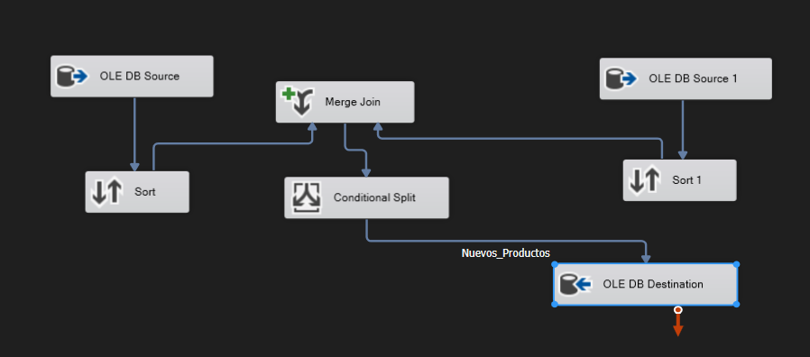
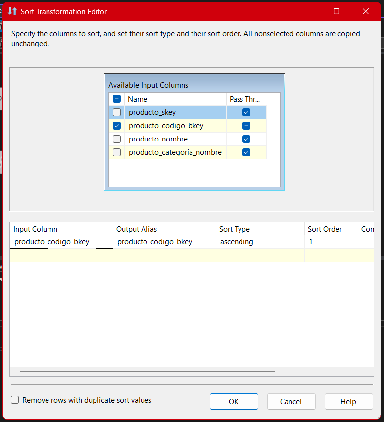
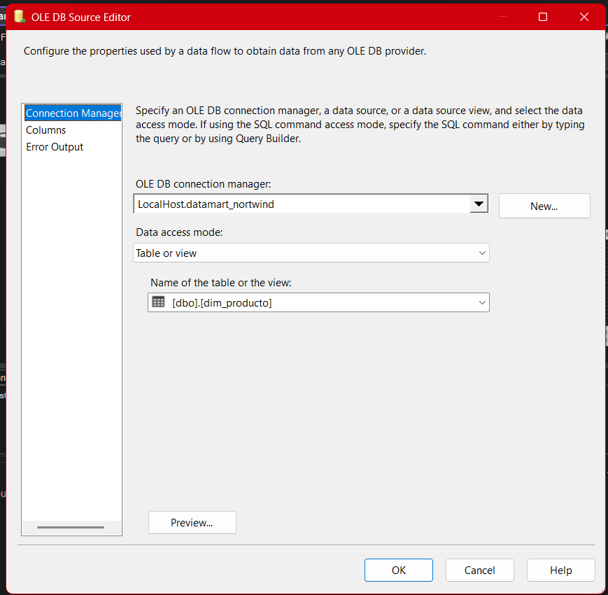
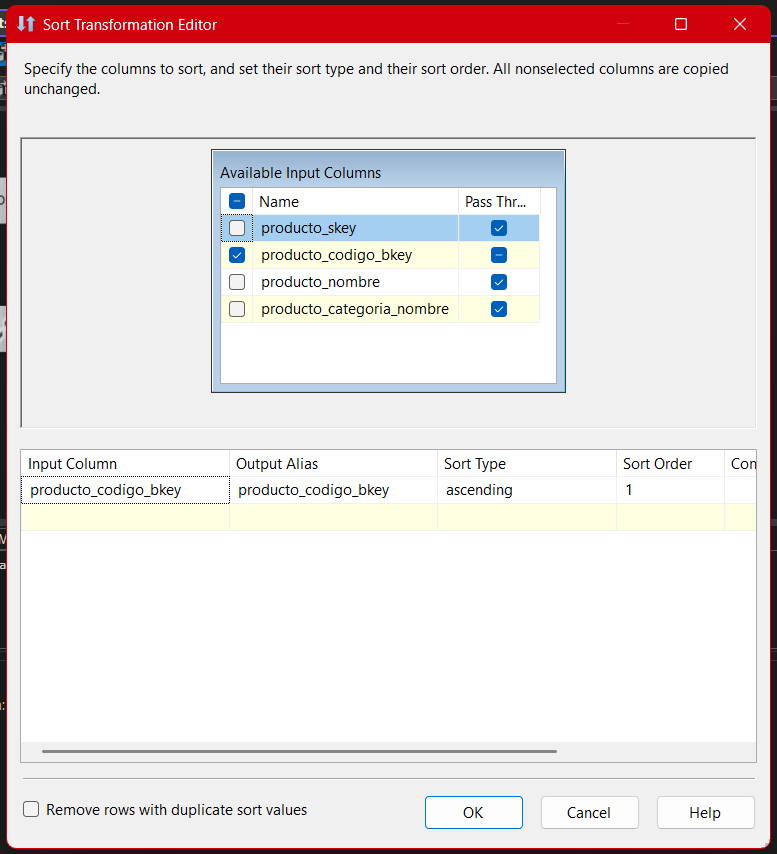
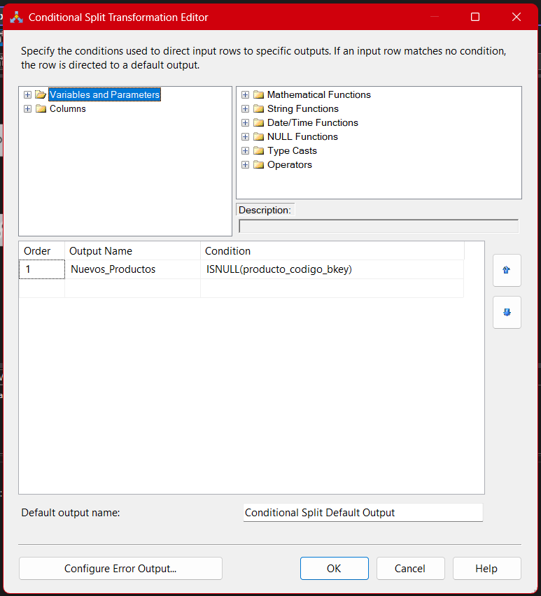
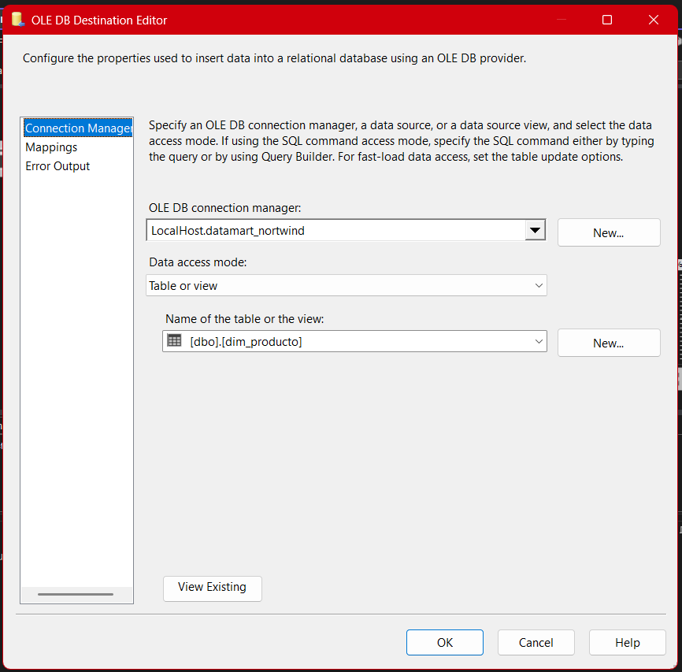

# **Documentación del Proceso ETL para el Paquete Datamart-Producto**

## Objetivo General

El objetivo principal de este paquete es garantizar la construcción y la carga de la dimensión `dim_producto` en el modelo `Datamart_Northwind` bajo un enfoque que privilegia la precisión, la integridad referencial y la capacidad de evolución. La dimensión producto no es solo una lista de artículos o bienes, sino el eje estructural que vincula inventarios, ventas, rentabilidad y análisis por categoría.
Por lo tanto, cada decisión de diseño en este flujo ETL —desde la extracción hasta la validación final— está alineada con el objetivo de mantener una base de productos consistente, auditable y alineada a los estándares de calidad de datos requeridos en ambientes empresariales.

El flujo se diseña para que cada producto cargado tenga correspondencia clara con su categoría, evitando registros huérfanos y minimizando el riesgo de duplicidades. Esta arquitectura soporta la escalabilidad, permite realizar análisis históricos y contribuye directamente a la confiabilidad de los tableros ejecutivos y modelos predictivos en el negocio.

## Descripción General del Proceso

El flujo que implementa este paquete dentro de SSIS (SQL Server Integration Services) se basa en una arquitectura de integración incremental y modular, construida bajo el principio de que cada paso agrega una capa adicional de calidad y control a los datos que transitan desde el área de staging hasta el datamart.
A diferencia de una simple migración masiva, aquí se busca que **solo los productos que no existen en la dimensión, o que han sido modificados de forma relevante, sean incorporados o actualizados**, lo que garantiza eficiencia, minimiza tiempos de proceso y permite auditoría de los cambios.

La arquitectura se estructura de la siguiente forma:


### **Pasos principales del proceso:**

**Extracción de productos y categorías desde Stage:**
El primer paso consiste en obtener los datos brutos tanto de productos como de sus categorías asociadas desde el entorno de staging. La extracción está diseñada para que cada producto solo se considere si tiene una categoría válida y existente.
Esto no solo protege la integridad del modelo relacional, sino que es un filtro esencial para la calidad de los análisis posteriores. Por ejemplo, si un producto no tiene categoría o la categoría no está registrada, podría quedar fuera de agrupaciones en los reportes o incluso generar errores en modelos de BI avanzados.

**Ordenamiento previo para combinación (Merge Join):**
Antes de poder comparar productos nuevos contra los ya existentes, es obligatorio que los conjuntos de datos estén perfectamente ordenados por su clave principal.
Este ordenamiento no es un mero requerimiento técnico de SSIS: asegura que las comparaciones sean válidas y reproducibles.
Ordenar por `producto_id` garantiza que cada registro de producto se pueda mapear uno a uno con su contraparte, minimizando riesgos de desfases o emparejamientos erróneos.

**Extracción de la dimensión producto en el Datamart:**
Aquí se consulta el estado actual de la dimensión de producto en el datamart. Esta operación permite identificar el universo de productos ya registrados y sirve como base para la comparación incremental.
El objetivo es detectar solo productos nuevos, evitando la sobreescritura o el ingreso redundante de registros existentes. Esto es crítico para la idempotencia, asegurando que el proceso pueda ejecutarse múltiples veces sin alterar indebidamente los datos.

**Ordenamiento de la dimensión destino:**
Al igual que con los productos extraídos desde el Stage, los datos de la dimensión producto deben ser ordenados por la clave primaria.
Esto es indispensable para la correcta operación del Merge Join, y su omisión puede llevar a errores sutiles pero devastadores en los resultados.
Mantener este orden es uno de los pasos más importantes para garantizar integridad en los procesos de comparación.

**Comparación e identificación de registros nuevos (Merge Join):**
La transformación Merge Join permite unir, comparar y analizar los productos provenientes del Stage con los ya presentes en la dimensión destino, utilizando un Left Outer Join para asegurar que todos los productos del Stage sean analizados, independientemente de si ya existen o no en la dimensión.
El propósito de este paso es, de manera explícita y controlada, determinar cuáles productos requieren ser cargados y cuáles deben ser omitidos por ya existir en la dimensión.

**Filtrado y carga final (Conditional Split y OLE DB Destination):**
El resultado de la comparación se filtra usando un Conditional Split, que únicamente selecciona los productos no encontrados en la dimensión destino, es decir, aquellos que realmente deben insertarse.
Finalmente, los productos filtrados se cargan a la dimensión producto a través del componente OLE DB Destination, con el mapeo adecuado de columnas y bajo las restricciones de unicidad necesarias.

**Validación, control de errores y mejores prácticas:**
Al finalizar la carga, se implementan mecanismos de validación que revisan la cantidad de registros cargados, la correspondencia de claves, la integridad referencial y posibles errores o rechazos durante el proceso.
Esto puede incluir revisión de logs, auditoría de errores, comparaciones entre Stage y Datamart, y la aplicación de pruebas unitarias sobre los registros nuevos.

## **Componentes y Detalle Técnico**

### 1. **OLE DB Source: Extracción de Productos y Categorías**

El primer paso del flujo ETL consiste en obtener la información relevante de productos y sus respectivas categorías desde el entorno de staging. Para ello se hace uso de una fuente OLE DB configurada para consultar dos tablas principales: `stage_northwind.dbo.producto` y `stage_northwind.dbo.categorias`.

La consulta SQL utilizada establece una relación explícita entre productos y categorías por medio de un **INNER JOIN**. El objetivo de esta consulta no es únicamente combinar datos, sino garantizar que **solo se seleccionen productos que tengan una categoría válida y registrada**. Esto responde a un principio fundamental del modelado dimensional: **toda clave foránea en una dimensión o tabla de hechos debe existir previamente en la dimensión referenciada**, para evitar registros huérfanos, inconsistencias en reportes y quiebres en la navegación de datos de BI.

**Consulta SQL:**

```sql
SELECT
    sp.producto_id,
    sp.nombre_producto,
    sc.nombrecategoria
FROM
    stage_northwind.dbo.categorias AS sc
INNER JOIN
    stage_northwind.dbo.producto AS sp
    ON sp.categoria_id = sc.categoriaid
```


**Justificación técnica:**
Se utiliza un `INNER JOIN` para asegurar que **solo se integren productos con categoría válida**. Esto evita la carga de registros huérfanos y garantiza integridad referencial desde la extracción.
Este JOIN fuerza la correspondencia entre productos y categorías. Si un producto tuviera una categoría no registrada, simplemente no aparecería en la extracción y, por lo tanto, tampoco en la dimensión producto.
La razón de esta estrategia es doble: primero, previene la creación de registros que puedan romper la lógica de análisis por categoría (por ejemplo, sumar ventas por categoría o calcular rentabilidad por línea de producto); segundo, garantiza que cualquier análisis posterior que dependa de jerarquías o agrupaciones esté basado en datos completos y confiables.

- Si por error administrativo en el área de staging se insertan productos con categorías nulas o mal referenciadas, esos productos se excluirán del análisis.
  Por eso, **antes de cada carga** es importante validar la consistencia de las relaciones en staging, asegurándose que todos los productos tengan categoría y que todas las categorías estén actualizadas.
- En el contexto de modelos de BI y reportes empresariales, la ausencia de productos por falta de categoría puede causar distorsiones en indicadores clave, ya que algunos artículos quedarían fuera de los agregados o segmentaciones.

**Relevancia para BI y auditoría:**
Implementar la validación desde la extracción te permite garantizar que cualquier inconsistencia detectada en reportes (como ventas que no cuadran por categoría) pueda rastrearse hasta el origen, facilitando la depuración de errores y el cierre del ciclo de calidad de datos.

### 2. **Sort: Ordenamiento Previo al Merge Join**

El segundo componente del flujo es el **ordenamiento de los productos extraídos** antes de ser comparados contra la dimensión destino. Este paso es crucial, ya que el componente Merge Join de SSIS requiere que ambos conjuntos de datos (Stage y Datamart) estén ordenados exactamente por la(s) clave(s) de unión.

La lógica de negocio aquí es simple pero poderosa: **el ordenamiento previo es lo que garantiza que la comparación entre productos sea válida y reproducible**.
En ambientes empresariales con grandes volúmenes de datos, un desfase en el orden puede significar uniones incorrectas, productos emparejados erróneamente o incluso la omisión inadvertida de registros relevantes.

En este caso, el ordenamiento se realiza sobre la columna `producto_id`, que es la clave principal del producto en Stage. Este mismo criterio de ordenamiento debe aplicarse en ambos flujos que se van a comparar (Stage y Dimensión Producto del Datamart) para que cada fila en una fuente corresponda a la fila equivalente en la otra fuente.



**Fundamento técnico y riesgos:**

- **El Merge Join en SSIS depende 100% del orden**. Si uno de los flujos está desordenado, los resultados del join serán erráticos y difíciles de depurar, ya que no siempre se arrojarán errores explícitos.
- El ordenamiento puede realizarse en el flujo de datos mediante el componente `Sort` de SSIS, o directamente en la consulta SQL de la fuente (`ORDER BY producto_id`).
  En ambientes con grandes datasets, es preferible realizar el ordenamiento desde SQL para aprovechar los índices y reducir el uso de memoria y procesamiento en el servidor de integración.

**Consideraciones de performance:**

- El componente Sort en SSIS puede consumir recursos significativos y ser un cuello de botella si el volumen de datos es elevado.
  Por ello, **siempre evalúa si puedes realizar el ordenamiento aguas arriba** (en el query de la fuente) antes de dejar la tarea a SSIS.

---

### 3. **OLE DB Source 1: Extracción desde el Datamart**

En este tercer paso se configura una nueva fuente OLE DB para consultar la dimensión de producto ya existente en el Datamart.
El propósito aquí es obtener el estado actual de la dimensión, permitiendo así realizar una **comparación incremental**. Esta es la clave para asegurar que el flujo sea idempotente: que la misma carga pueda ejecutarse varias veces sin crear duplicados ni sobreescribir información ya existente.

La consulta utilizada generalmente es un simple SELECT sobre la tabla de destino (`datamart_northwind.dbo.dim_producto`), extrayendo como mínimo las claves necesarias para la comparación (como `producto_codigo_bkey`), pero es recomendable extraer todos los campos relevantes para permitir auditoría o futuras implementaciones de Slowly Changing Dimensions (SCD).

- **Fuente:** `datamart_northwind.dbo.dim_producto`

- **Modo de acceso:** `Table or View`



**Importancia del alineamiento de estructura:**

- Si la estructura de la tabla en el datamart cambia (por ejemplo, se añade una columna), es fundamental actualizar también el flujo ETL y la consulta de extracción para evitar errores de mapeo o pérdida de información.
- Desalineaciones entre Stage y Datamart pueden provocar errores de carga, rechazos de registros o, peor aún, inserciones incorrectas y silenciosas.

**Ejemplo concreto de riesgo:**
Si se actualiza la definición de la tabla destino pero no se actualiza la fuente en el flujo ETL, podrías terminar con registros incompletos o errores difíciles de rastrear. Por eso, es buena práctica documentar y versionar tanto el modelo físico como el flujo de integración.

---

### 4. **Sort 1: Ordenamiento de Dimensión Producto**

Así como se ordenaron los productos extraídos del Stage, es obligatorio ordenar los registros obtenidos de la dimensión producto en el datamart usando la misma clave (`producto_codigo_bkey`).
Este paso mantiene la simetría y la validez en la comparación de ambos flujos.

**Justificación profunda:**
El orden es lo que permite la unión secuencial, registro a registro, asegurando que los algoritmos de comparación y join de SSIS operen correctamente.
Un flujo desordenado, aunque sólo sea en uno de los extremos, puede provocar que los registros no se emparejen correctamente, generando comparaciones fallidas o incluso omitiendo productos que deberían cargarse.

**Advertencia técnica:**
Un error muy común es olvidar ordenar uno de los flujos, especialmente cuando se realizan cambios en la estructura del ETL.
La consecuencia puede ser difícil de detectar porque SSIS no siempre alerta explícitamente sobre el desorden, pero los resultados (productos no cargados o duplicados) pueden ser graves para la calidad del datamart y la confiabilidad de los reportes.



---

### **5. Merge Join: Comparación e Identificación de Registros Nuevos y Existentes**

Una vez que los flujos de productos provenientes de Stage y los productos ya existentes en la dimensión del Datamart han sido extraídos y ordenados, se procede a la fase de comparación mediante el componente **Merge Join** en SSIS. Este componente permite realizar una unión de ambos conjuntos de datos utilizando la clave de producto (`producto_id` del Stage y `producto_codigo_bkey` del Datamart) como criterio de correspondencia.

Para este flujo, se utiliza un **Left Outer Join**, lo que significa que todos los productos extraídos de Stage serán comparados contra la dimensión destino, y si no existe coincidencia (es decir, si el producto no está registrado en el Datamart), la salida del join contendrá nulo en los campos provenientes del Datamart.


**Razón técnica y de negocio de esta estrategia:**
La elección del Left Outer Join obedece a la necesidad de identificar **productos nuevos o previamente ausentes** en la dimensión. Si se utilizara un Inner Join, se obtendrían únicamente los productos presentes en ambas fuentes, perdiendo la posibilidad de detectar registros que deben insertarse por ser realmente nuevos.
Además, este enfoque permite construir flujos idempotentes: solo se cargan los productos que no existen aún en la dimensión, minimizando la posibilidad de duplicados o sobreescrituras no deseadas.

**Fundamento de calidad y control:**
Esta comparación asegura que, aunque el proceso ETL se ejecute varias veces (por ejemplo, en cargas diarias o semanales), los productos ya existentes no sean afectados, y sólo los nuevos se agreguen.
En la práctica, esto reduce drásticamente los tiempos de procesamiento y evita inconsistencias que puedan impactar los análisis posteriores (por ejemplo, evitar que un producto con ventas históricas se duplique y genere distorsiones en los reportes de ventas, inventarios o rotación).

**Puntos críticos a considerar:**

- **Mapeo de columnas:** Es esencial mapear correctamente las columnas de ambas fuentes para que la comparación sea válida. Un error común es utilizar nombres de columnas similares pero con contenidos distintos, lo que puede llevar a uniones incorrectas.
- **Campos utilizados:** Generalmente basta con la clave de producto, pero en escenarios futuros podrías comparar también otros atributos (por ejemplo, nombre del producto o categoría) si decides implementar Slowly Changing Dimensions (SCD).

**Ejemplo de funcionamiento:**
Supón que tienes tres productos en Stage: P1, P2 y P3. En la dimensión del Datamart sólo existe P1 y P3.

- El resultado del Merge Join será:

  - P1 (existe en ambos: no se carga)
  - P2 (existe solo en Stage: debe cargarse)
  - P3 (existe en ambos: no se carga)
    De este modo, únicamente P2 será procesado en los pasos siguientes para ser insertado como nuevo registro.

---

### **6. Conditional Split: Filtrado y Carga de Productos Nuevos**

Tras realizar la comparación mediante el Merge Join, es necesario separar los registros que realmente requieren ser insertados en la dimensión destino.
Para esto se emplea el componente **Conditional Split** en SSIS, cuyo propósito es analizar cada fila resultante del join y decidir, con base en una condición lógica, cuáles pasarán a la siguiente etapa.

La condición típica utilizada en este escenario es:

```sql
ISNULL(producto_codigo_bkey)
```

Esto significa que solo pasarán a la carga final aquellos productos cuyo identificador proveniente del Datamart está nulo, es decir, productos que no existen aún en la dimensión destino.

**Por qué es crítica esta lógica:**
Este filtro permite que el proceso sea **totalmente incremental**: sólo los productos ausentes serán cargados, y no se tocan los ya existentes.
Así, la dimensión producto puede crecer con nuevos registros sin riesgo de sobrescribir, duplicar o eliminar información previa.
Esta idempotencia es fundamental en ambientes productivos, donde el mismo flujo puede ejecutarse varias veces en un periodo de tiempo sin afectar la calidad ni la consistencia del modelo.



**Riesgos y validaciones:**

- Si la condición de split está mal definida, podrías dejar fuera productos válidos (por ejemplo, si la columna de comparación no corresponde a la clave única) o, peor aún, cargar duplicados.
- Siempre valida la lógica del split con pruebas controladas y revisa el resultado en una corrida inicial antes de activar el flujo en ambientes productivos.

**Relación con futuras mejoras (SCD):**
En implementaciones avanzadas, podrías expandir la lógica del split para detectar no solo productos nuevos, sino también aquellos cuyas propiedades han cambiado (por ejemplo, cambio de nombre o categoría), permitiendo la actualización controlada de registros y soportando historización.

---

### 7. **OLE DB Destination: Carga en la Dimensión Producto**

Una vez filtrados los productos que realmente deben cargarse, estos se dirigen al componente **OLE DB Destination**.
Aquí, los productos seleccionados son insertados en la tabla `datamart_northwind.dbo.dim_producto`. Es fundamental que el mapeo de columnas se realice de forma precisa y que las restricciones del modelo dimensional (como unicidad, tipos de dato y relaciones referenciales) sean respetadas para evitar rechazos o inconsistencias.

**Explicación de mapeo:**

- La columna `producto_id` del Stage se almacena como `producto_codigo_bkey` en la dimensión destino, asegurando la unicidad y correspondencia entre Stage y Datamart.
- `nombre_producto` se mapea directamente al campo correspondiente en la dimensión.
- `nombrecategoria` se almacena como atributo descriptivo de producto, permitiendo consultas y segmentaciones por categoría en modelos analíticos.



**Aspectos técnicos y recomendaciones:**

- Se recomienda utilizar el modo `Fast Load` para mejorar la eficiencia de las cargas masivas, especialmente en procesos recurrentes o con alto volumen de productos.
- Configura el manejo de errores y rechazos, de modo que cualquier registro problemático sea redirigido a un destino alternativo o registrado en logs, facilitando su análisis y corrección.
- Realiza validaciones cruzadas al finalizar la carga, comparando la cantidad de productos en Stage contra los efectivamente insertados para detectar posibles omisiones o inconsistencias.

**Riesgos frecuentes y cómo mitigarlos:**

- Un mapeo incorrecto puede causar fallos silenciosos (por ejemplo, insertar el nombre del producto en la columna equivocada) que luego se manifiestan como errores en los reportes.
- Si la tabla destino no tiene una clave única o un índice adecuado, pueden generarse duplicados, dificultando los análisis posteriores y generando problemas de rendimiento en las consultas.

---

### **8. Validación, Control de Errores y Buenas Prácticas**

Esta etapa es esencial para asegurar la robustez, auditabilidad y mantenibilidad del proceso ETL.
No basta con que los datos sean cargados: es indispensable implementar mecanismos que permitan identificar, rastrear y corregir errores antes de que impacten el negocio.

**Validaciones recomendadas:**

- **Control de duplicados:**
  Asegúrate de que la clave primaria de la dimensión (`producto_codigo_bkey`) sea única y que la lógica de carga nunca inserte dos veces el mismo producto.
  Una verificación manual de los registros insertados en la última carga, comparando contra Stage y Datamart, es una práctica recomendable.
- **Auditoría de registros y logs:**
  Implementa logs que registren cada inserción, con información como fecha/hora de carga, usuario o proceso que ejecutó el flujo, número de registros procesados y errores encontrados.
  Esto facilita tanto la auditoría como el troubleshooting en caso de incidentes.
- **Pruebas unitarias y de integración:**
  Antes de ejecutar el proceso en producción, realiza pruebas con datos de ejemplo que cubran casos borde (productos sin categoría, productos duplicados, cambios de nombre, etc.).
  Esto ayuda a detectar lógicas incorrectas y a anticipar escenarios problemáticos que puedan surgir a futuro.

**Gestión de errores y resiliencia:**

- Configura el flujo ETL para redirigir filas problemáticas (errores de tipo, mapeo o violaciones de unicidad) a destinos alternativos para revisión, evitando que un error bloquee la carga completa.
- Implementa alertas automáticas para que, si la cantidad de nuevos productos varía inesperadamente respecto al histórico, puedas analizar rápidamente si se trata de un cambio real en el negocio o de un error en la integración.

**Mejoras y evolución futura:**

- En implementaciones avanzadas, puedes considerar el uso de upserts (actualización e inserción) para manejar cambios en productos existentes (por ejemplo, cuando cambia la categoría de un producto).
- Integra reglas de validación de calidad de datos (ejemplo: nombres de productos no nulos o únicos, categorías válidas, etc.) directamente en el flujo, previniendo errores aguas arriba.
- Automatiza pruebas periódicas que validen la correcta correspondencia entre el área de staging y la dimensión de producto, y que alerten si hay desalineación estructural entre ambas.

---

## Mental Notes

- **Upserts:** Para futuras versiones, integrar lógica de actualización (`Update`) para productos que cambien de nombre o categoría.
- **Validaciones adicionales:** Incorporar reglas de validación de datos (por ejemplo, que el nombre no sea nulo/vacío, categorías válidas).
- **Alertas y Monitoreo:** Automatizar alertas en caso de registros rechazados o errores de consistencia.
- **Pruebas unitarias:** Construir paquetes de prueba para verificar el correcto funcionamiento de cada transformación y destino.

---

## **Resumen Técnico**

El diseño, construcción y operación de la dimensión producto en un datamart empresarial es mucho más que una tarea técnica; representa el punto de convergencia entre la calidad del dato y el valor estratégico para el negocio.
Un flujo ETL cuidadosamente orquestado, como el aquí documentado, permite a cualquier organización responder ágilmente a preguntas críticas sobre ventas, inventarios, tendencias de consumo y rentabilidad, apoyando la toma de decisiones tanto operativas como tácticas y estratégicas.

Durante la implementación de este flujo, cada etapa —desde la validación de categorías en Stage, pasando por la comparación incremental, hasta la gestión de errores y auditoría— cumple un papel irremplazable en la construcción de un entorno confiable y escalable. El rigor aplicado en la validación, la gestión de errores y la garantía de idempotencia no solo evitan errores visibles, sino que previenen problemas sutiles que pueden escalar hasta impactar la credibilidad de todo el modelo de BI.
