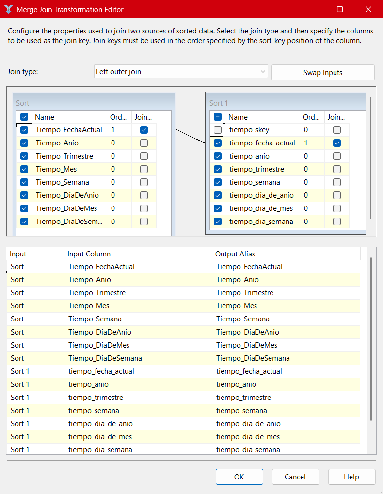
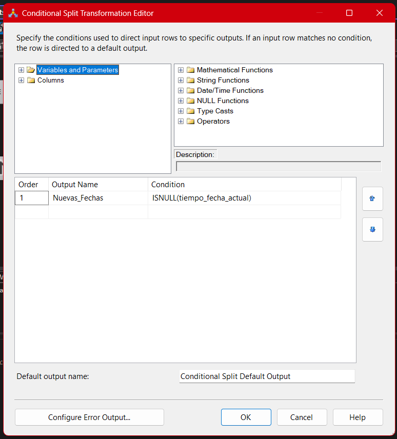
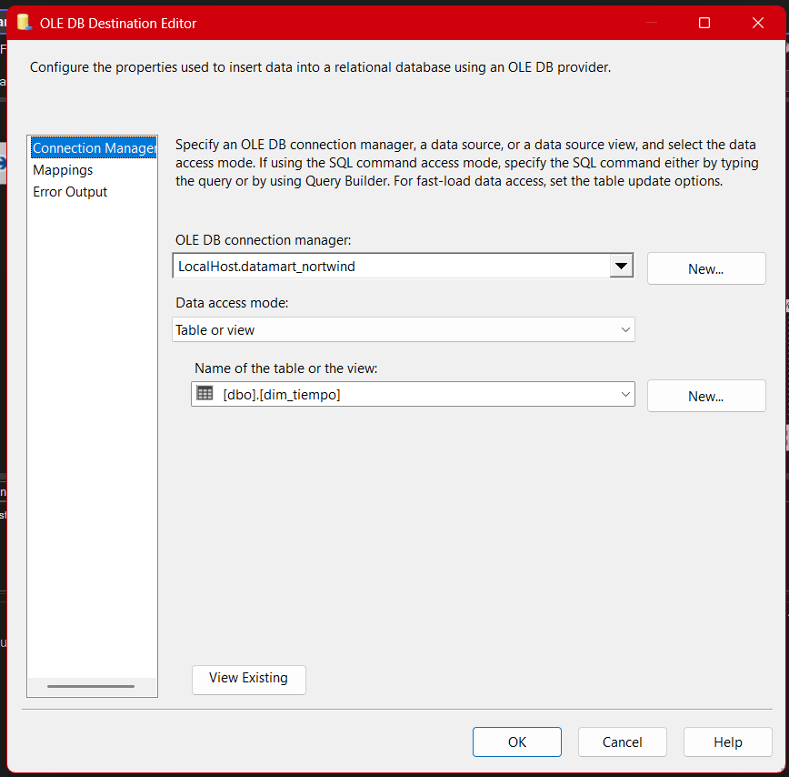
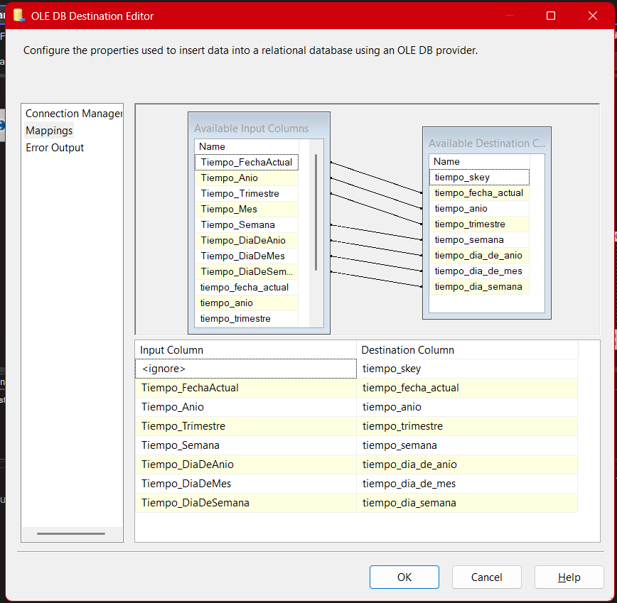

# **Documentación del Proceso ETL para el Paquete Datamart-Tiempo**

## 1. **Introducción Estratégica y Valor del Modelo Temporal**

La **dimensión de tiempo** es el núcleo sobre el que gira cualquier análisis temporal en inteligencia de negocios. Sin una dimensión temporal bien construida, todo análisis de tendencias, estacionalidad, cohortes, periodos fiscales o productividad histórica pierde rigor y profundidad.
La correcta gestión ETL de esta dimensión **no solo habilita los dashboards y comparaciones clásicas (mes contra mes, año contra año), sino que posibilita nuevas formas de análisis**: periodos móviles, marcadores de eventos, días festivos, análisis rolling y segmentación dinámica.
Una carga ETL robusta y auditable es clave para garantizar la calidad, trazabilidad y escalabilidad del Datamart Northwind y de cualquier modelo de BI maduro.

---

## 2. **Arquitectura y Razonamiento del Flujo ETL**

### 2.1. **Extracción de Datos desde Staging**

- **Componente:** OLE DB Source
- **Imagen:**
  
- **Consulta:**

  ```sql
  SELECT Tiempo_FechaActual, Tiempo_Anio, Tiempo_Trimestre, Tiempo_Mes,
         Tiempo_Semana, Tiempo_DiaDeAnio, Tiempo_DiaDeMes, Tiempo_DiaDeSemana
  FROM stage_northwind.dbo.Stage_Tiempo;
  ```

- **Justificación y contexto:**
  Se extraen **todas las granularidades temporales** relevantes (año, trimestre, mes, semana, día) para asegurar flexibilidad analítica.
  Este diseño permite consultas simples (ventas por mes) y análisis complejos (temporada, semana fiscal, patrones semanales).

  > [!NOTE]
  > En ambientes avanzados puedes agregar granularidad horaria o marcar días festivos, fines de semana, cambios de horario, etc.

---

### 2.2. **Extracción del Estado Actual del Datamart (Evitar Duplicados)**

- **Componente:** OLE DB Source (Destino)
- **Imagen:**
  
- **Propósito:**
  Permite detectar cuáles fechas ya existen en la dimensión, asegurando **cargas incrementales** y cero duplicidad.
  Esta comparación evita la sobreescritura de fechas históricas y mantiene la integridad de la tabla, crucial para análisis y dashboards.

---

### 2.3. **Ordenamiento de Registros: Rendimiento y Robustez**

- **Componente:** Sort
- **Justificación técnica:**
  El ordenamiento por la clave temporal (`Tiempo_FechaActual`) es **requisito para el Merge Join** en SSIS.

  > [!TIP]
  > Si el volumen de fechas es muy grande, realiza el `ORDER BY` directamente en la consulta SQL del source para optimizar tiempos y consumo de memoria en SSIS.

---

### 2.4. **Comparación e Integración Incremental (Merge Join)**

- **Componente:** Merge Join

- **Imagen:**
  

- **Tipo de Join:** Left Outer Join

- **Llave de unión:** `Tiempo_FechaActual`

- **Explicación estratégica:**
  Se usa un Left Outer Join para **detectar todas las fechas presentes en Staging que aún NO existen en la dimensión**.
  Este diseño soporta la _idempotencia_ (puedes correr el flujo muchas veces sin crear duplicados), y mantiene un histórico limpio y confiable.

- **Variante para escenarios avanzados:**
  Si implementas cambios en la estructura temporal (por ejemplo, soporte a semanas fiscales o días festivos), puedes extender el join para considerar nuevas columnas y reglas de correspondencia.

---

### 2.5. **Filtrado de Registros Nuevos (Conditional Split)**

- **Componente:** Conditional Split

- **Imagen:**
  

- **Condición:**

  ```plaintext
  ISNULL(tiempo_fecha_actual)
  ```

- **Justificación:**
  Filtra **exclusivamente fechas no existentes** en el destino para mantener la integridad de la dimensión y garantizar cargas limpias e incrementales.

- **Advertencia profesional:**
  Un error en la condición puede llevar a duplicados o a la omisión de registros; valida siempre que la clave utilizada sea realmente única y bien mapeada.

---

### 2.6. **Carga a la Dimensión Tiempo (OLE DB Destination)**

- **Componente:** OLE DB Destination

- **Imagen:**
  

- **Destino:** `[dbo].[dim_tiempo]`

- **Mapeo:**
  Todos los campos temporales van a sus respectivas columnas.
  

- **Consideraciones de escalabilidad:**
  Si más adelante se requiere granularidad horaria, soporte a distintas zonas horarias o marcadores especiales (festivos, cierres, promociones), la estructura de la tabla y los mapeos deberán actualizarse.

## 3. **Buenas Prácticas, Decisiones de Diseño y Riesgos Profesionales**

### 3.1. **Buenas Prácticas:**

- **Carga incremental real:** Solo se insertan fechas nuevas, nunca se sobreescriben registros históricos.
- **Documentación visual y técnica:** Cada paso documentado con imágenes, SQL y lógica de negocio, facilitando auditoría, troubleshooting y onboarding de nuevos miembros.
- **Escalabilidad:** El modelo es adaptable a nuevos requerimientos (ej: granularidad por hora, marcadores de eventos).
- **Preferencia por SQL en grandes volúmenes:** Ordenamiento y limpieza desde la fuente para minimizar cuellos de botella en SSIS.

### 3.2. **Decisiones de Diseño Fundamentales:**

- **Merge Join + Conditional Split:** Transparente, eficiente y fácil de mantener, ideal para ETL incremental. Es preferible sobre Lookups en flujos simples y auditables.
- **Separación de staging y destino:** Garantiza trazabilidad total, permite reejecuciones ante errores y facilita la reconstrucción del histórico.

### 3.3. **Riesgos Técnicos y Cómo Mitigarlos:**

- **Desfase de fechas:** Si hay fechas inesperadas en staging, pueden contaminar la dimensión. Solución: validación previa en SQL y uso de Data Quality Tasks para filtrar outliers.
- **Errores de mapping:** Cambios de estructura en staging o destino deben reflejarse de inmediato en el flujo ETL.
- **Performance:** Para cargas masivas, considera **particionamiento**, **procesamiento por lotes** o cargar solo periodos nuevos según fecha máxima existente.

---

## 4. **Ejemplo de Aplicación Real y Escenarios de Valor**

**Caso profesional:**
Un analista necesita comparar ventas semanales entre distintos años, identificar caídas durante festivos nacionales y analizar la estacionalidad de productos cada trimestre.
La dimensión tiempo construida así permite crear visualizaciones de “calendario de calor”, identificar “días pico” o generar cohortes por mes de compra.

> [!NOTE]
> Integrar marcadores como “es_festivo”, “es_fin_de_mes”, “es_fin_de_semana”, “semana_fiscal”, habilita dashboards aún más potentes y análisis predictivos.

---

## 5. **Recomendaciones Avanzadas de Mejora Continua**

- **Automatizar pruebas unitarias:** Garantiza que cada fecha sea única y que no haya huecos ni superposiciones.
- **Agregar metadata y tracking:** Campos como fecha de inserción, usuario, y origen facilitan auditoría y trazabilidad.
- **Alertas automáticas:** Si la dimensión no crece durante un periodo esperado, dispara una alerta (ejemplo: el mes no cierra por falta de fechas).
- **Soporte multicalendario:** Considera futuro soporte para calendarios fiscal, gregoriano y hasta periodos móviles personalizados.
- **Versionado e historización:** Guarda versiones o snapshots de la dimensión para permitir auditoría retroactiva ante cambios en la lógica temporal.

---

## 6. **Errores Comunes y Solución Profesional**

- **No se cargan fechas nuevas:**

  - Revisa que la clave del staging realmente contenga nuevas fechas.
  - Valida la condición y el mapeo en Merge Join y Conditional Split.
  - Verifica el orden y unicidad de los datos.

- **Se insertan fechas duplicadas:**

  - Confirma que la clave primaria en la dimensión está activa y correctamente configurada.
  - Verifica que la condición ISNULL apunte a la columna correcta y que el Merge Join funcione como esperado.

- **Bajo performance:**

  - Realiza ordenamiento y limpieza en SQL.
  - Reduce columnas a las estrictamente necesarias para la carga.
  - Usa procesamiento por lotes en cargas masivas.

---

## 8. Notas Mentales

- **Una dimensión de tiempo bien diseñada es la columna vertebral del análisis en BI**: afecta desde reportes simples hasta modelos de predicción avanzada.
- **Documenta y revisa periódicamente** la lógica y estructura: los cambios de negocio suelen impactar primero en el calendario.
- **Haz pruebas de integridad frecuentemente** (¿faltan días? ¿hay solapamientos?).
- **Anticipa nuevas necesidades** (festivos, semanas fiscales, granularidad horaria) para que tu modelo no se quede obsoleto ni pierda valor estratégico.

---

## **Resumen Técnico**

El proceso ETL de la dimensión tiempo en el Datamart Northwind implementa un flujo incremental y auditado que garantiza la consistencia temporal y la flexibilidad para análisis avanzados. Se parte de un modelo staging que consolida granularidades temporales relevantes (año, trimestre, mes, semana, día) y se compara contra el estado actual del datamart para identificar e insertar únicamente fechas nuevas.
El flujo técnico consta de extracción (OLE DB Source), ordenamiento, integración (Merge Join), filtrado (Conditional Split) y carga final (OLE DB Destination), siguiendo principios de idempotencia y trazabilidad.
La solución es escalable (permite agregar granularidades o atributos como marcadores festivos), minimiza riesgos de duplicidad y soporta grandes volúmenes mediante optimización SQL aguas arriba.
Las mejores prácticas incluyen documentación visual, validación de unicidad, soporte para pruebas unitarias, y recomendaciones para monitoreo y mejora continua.
