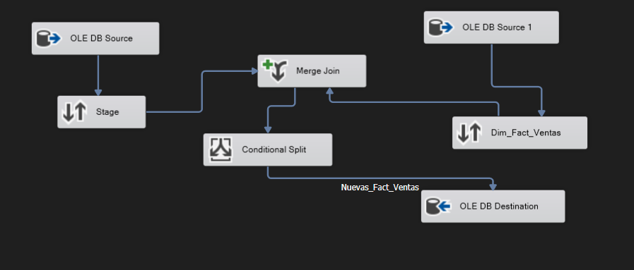
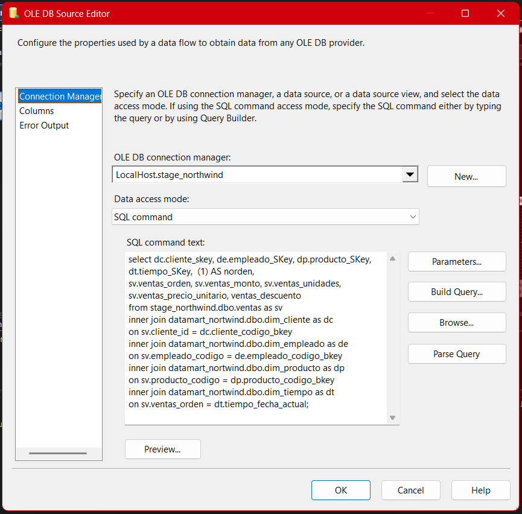
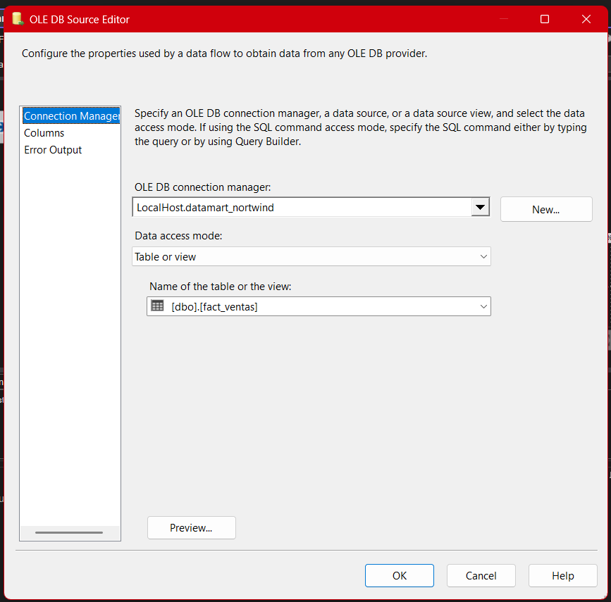
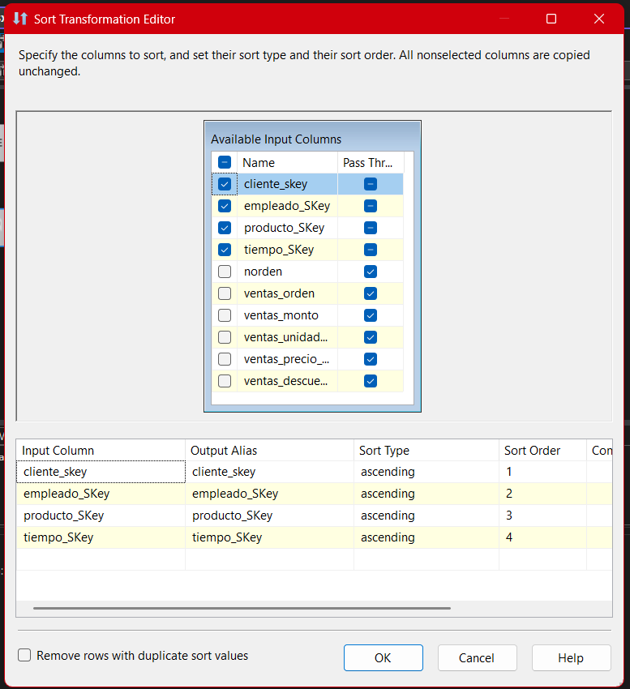
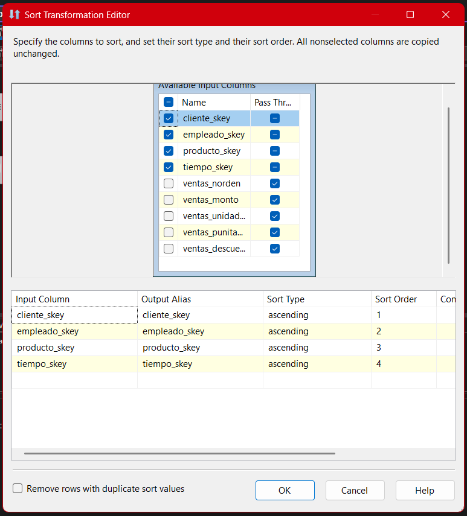
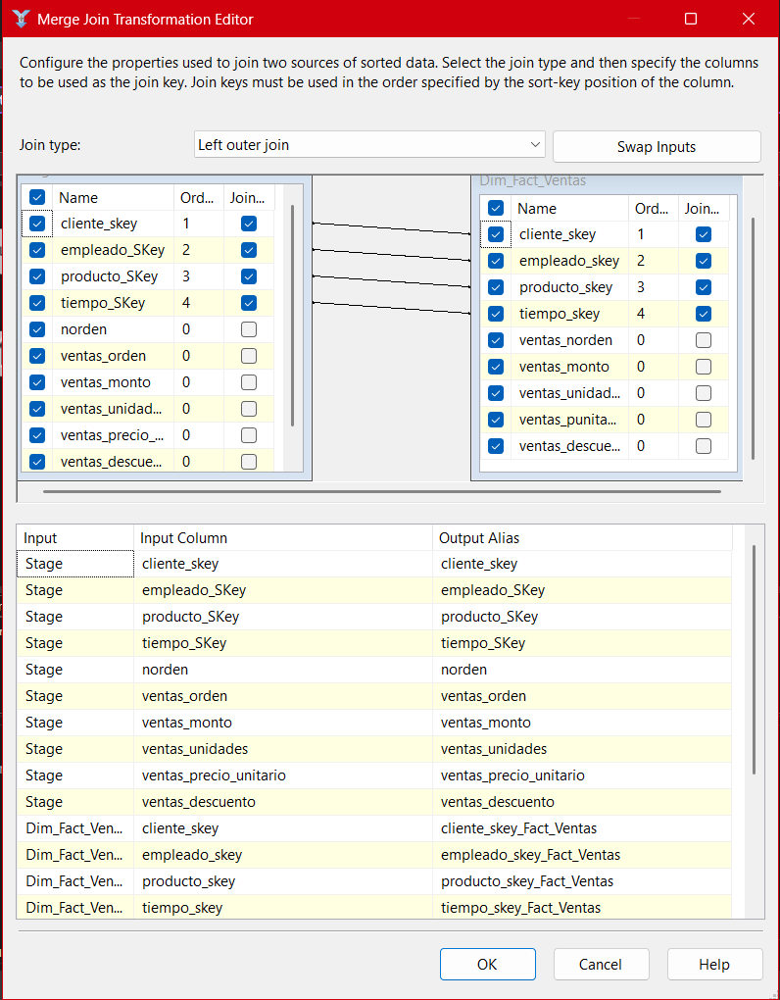
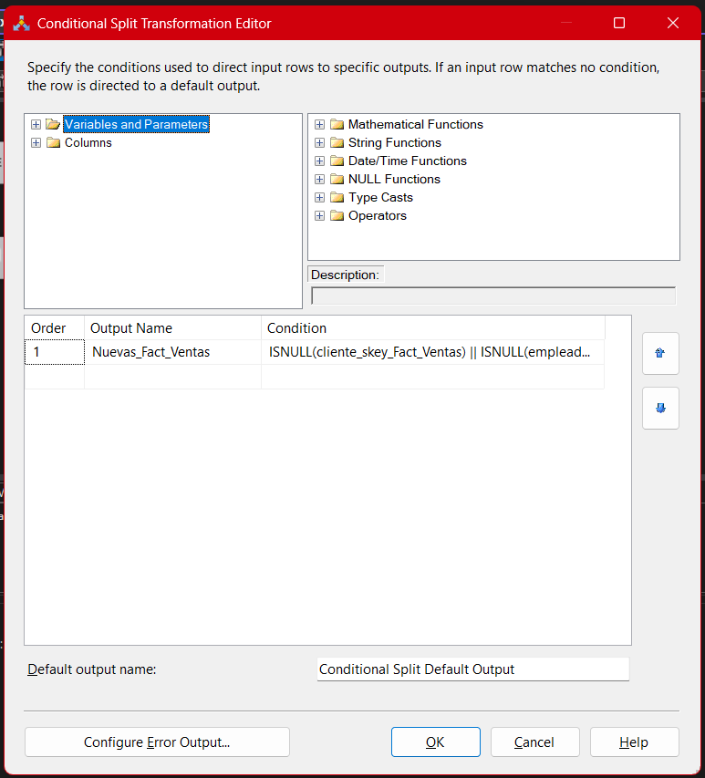
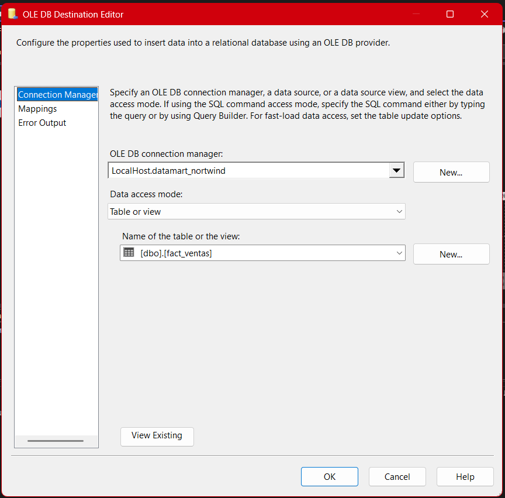
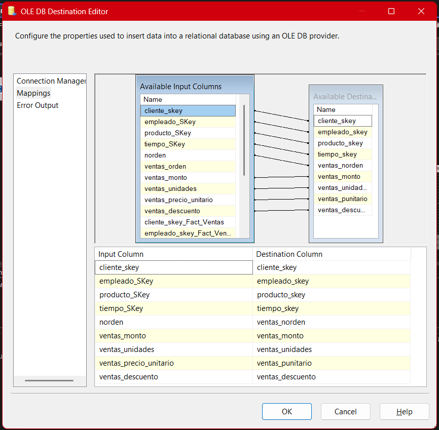

# **Documentación del Proceso ETL para el Paquete Datamart-Fact-Ventas**

## 1. **Introducción**

El paquete **Datamart-Fact-Ventas** constituye la pieza central del Data Mart orientado al análisis de ventas, integrando datos de múltiples dimensiones (clientes, empleados, productos y tiempo) y generando una tabla de hechos (hecha transaccional) con todos los detalles relevantes para análisis multidimensionales. Su objetivo es proporcionar una vista consolidada y optimizada para consultas de BI, dashboards y modelos analíticos.

---

## 2. **Arquitectura General del Flujo ETL**

### 

**(Diagrama: Estructura general del flujo de datos en SSIS para el paquete Fact_Ventas.)**

El flujo se compone de:

- **Fuentes OLE DB**: Extraen datos de staging y de la tabla de hechos actual (para detectar cambios).
- **Transformaciones**: Ordenamientos, uniones, comparación y lógica condicional para detectar nuevas transacciones.
- **Destino OLE DB**: Inserta las nuevas ventas en la tabla de hechos final.

---

## 3. **Extracción de Datos (OLE DB Source)**

### 

- **Conexión**: `LocalHost.stage_northwind`
- **Comando SQL**: Realiza un join entre las tablas de staging y las dimensiones (`dim_cliente`, `dim_empleado`, `dim_producto`, `dim_tiempo`) usando las claves naturales para obtener las claves sustitutas (`_skey`).
- **Campos seleccionados**:

  - Claves foráneas de cada dimensión.
  - Atributos transaccionales: orden de venta, monto, unidades, precio unitario y descuentos.

- **Observación**: Este SQL es fundamental para asegurar la integridad referencial y garantizar que cada registro en la fact table esté correctamente enlazado con sus dimensiones.

---

## 4. **Comparación con la Tabla de Hechos Actual**

### 

- Se utiliza una segunda fuente OLE DB para consultar el estado actual de la tabla de hechos `[fact_ventas]` en el Data Mart.
- El modo de acceso es **Table or View**, recuperando todos los registros para el proceso de comparación.
- Esto permite identificar transacciones nuevas o cambios, evitando duplicados y asegurando solo la carga de datos nuevos.

---

## 5. **Ordenamiento de Datos (Sort)**

### 

### 

- Ambos orígenes se ordenan por las claves compuestas relevantes (cliente, empleado, producto, tiempo) y campos de la transacción.
- **Importancia**: El Merge Join en SSIS requiere que los datos estén ordenados de manera idéntica para realizar el matching correctamente. Un error en el orden puede causar errores sutiles y difíciles de detectar en la carga de datos.

---

## 6. **Merge Join (Unión de Registros)**

### 

- **Tipo de Join**: Left Outer Join.
- **Propósito**: Permite identificar, para cada registro extraído de staging, si ya existe o no en la tabla de hechos.
- **Claves utilizadas para la unión**: cliente_skey, empleado_skey, producto_skey, tiempo_skey, y otros campos clave de la transacción.
- **Resultado**: Registros nuevos quedan con campos NULL del lado de la tabla de hechos, facilitando su detección en el siguiente paso.

---

## 7. **Conditional Split (Identificación de Nuevas Transacciones)**

### 

- **Expresión**:

  ```
  ISNULL(cliente_skey_Fact_Ventas) || ISNULL(empleado_skey_Fact_Ventas) || ISNULL(producto_skey_Fact_Ventas) || ISNULL(tiempo_skey_Fact_Ventas)
  ```

- **Interpretación**: Si alguno de los SKs (claves sustitutas) del lado de la fact table es NULL, significa que es una nueva transacción no presente aún en la tabla de hechos.
- **Ventaja**: Evita duplicidad de datos y asegura cargas incrementales eficientes.

---

## 8. **Carga al Destino (OLE DB Destination)**

### 

### 

- **Destino**: `[fact_ventas]` en el Data Mart Northwind.
- **Mapeo de columnas**: Cada campo fuente se mapea explícitamente a la columna destino correspondiente.
- **Mejores prácticas**:

  - Validar la integridad referencial (todos los SK deben existir en las dimensiones).
  - Usar transacciones o control de errores para evitar cargas parciales.

---

## 9. **Buenas Prácticas, Detalles Avanzados y Optimización**

- **Claves sustitutas (SKs)**:
  El uso de SKs para vincular dimensiones es crítico. Las cargas de datos deben garantizar que cada dimensión esté previamente poblada para evitar referencias inválidas.
- **Control de calidad de datos**:
  Implementar lógicas de control de errores y reportes de registros rechazados para depuración y auditoría.
- **Escalabilidad**:
  En proyectos más grandes, la carga de la tabla de hechos puede requerir optimizaciones adicionales (paralelización, particionamiento, uso de CDC, etc.).
- **Auditoría**:
  Se recomienda llevar bitácoras de cargas y métricas de desempeño para análisis posterior.

---

## **Resumen Tecnico**

El paquete `Datamart-Fact-Ventas` sintetiza las mejores prácticas de integración de datos en BI, garantizando la consistencia, calidad y eficiencia en la carga de grandes volúmenes de datos de ventas. La estructura modular del flujo facilita el mantenimiento y la escalabilidad del Data Mart a futuro.

---
