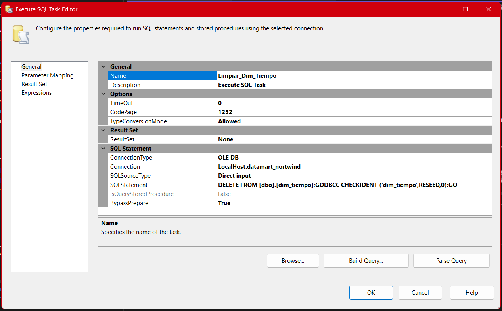

# **Documentación del Proceso ETL para el Paquete Datamart-Limpieza**

## **1. Propósito Estratégico del Paquete**

El paquete `Datamart-Limpieza` está diseñado para **garantizar la idempotencia y consistencia** de los procesos ETL del datamart, eliminando datos previos en las tablas principales de hechos y dimensiones antes de una recarga masiva. Se ejecuta **antes de cualquier proceso de carga** para evitar inconsistencias, duplicados, residuos históricos y errores de llave primaria.

---

## **2. Diagrama General y Orquestación**

A continuación se muestra la orquestación visual del paquete:


> [!Important]
> El flujo secuencial garantiza que los objetos dependientes se limpien en el orden adecuado, minimizando riesgos de errores por restricciones referenciales.

---

## **3. Desglose de Tareas y Explicaciones Técnicas**

### **3.1. Limpieza_Dim_Ventas**


- **Descripción:** Elimina todos los registros de la tabla de hechos principal con `TRUNCATE TABLE`, la opción más eficiente y limpia.
- **Ventajas:**

  - Reinicia el contador de identidad automáticamente.
  - Rápido, ya que borra por páginas, no por filas.
  - No deja registros huérfanos si las relaciones están correctamente definidas.

- **Advertencias:**

  - Requiere que no existan restricciones de clave foránea activas sobre la tabla.
  - No genera registros detallados en el log de transacciones (solo un registro global).

---

### **3.2. Limpieza_Dim_Clientes**


- **Descripción:** Elimina todos los registros de la tabla de dimensiones de clientes utilizando `DELETE FROM`.
- **Consideraciones:**

  - Permite eliminar aunque existan restricciones de clave foránea (si ON DELETE CASCADE está habilitado).
  - Es posible auditar el borrado fila por fila.

- **Práctica recomendada:** Utilizar `DELETE` si necesitas mayor granularidad en el control del log de auditoría.

---

### **3.3. Limpiar_Dim_Empleado**


- **Descripción:** Elimina todos los registros de empleados y **reinicia el contador de identidad** usando la instrucción `DBCC CHECKIDENT`.
- **Ventajas:**

  - Evita saltos en los valores de identidad, manteniendo secuencias limpias para futuras cargas.

- **Advertencias:**

  - El uso de `DBCC CHECKIDENT` requiere permisos elevados.
  - Debes asegurarte de que ninguna operación de carga esté en proceso para evitar colisiones de identidad.

---

### **3.4. Limpiar_Dim_Producto**


- **Descripción:** Idéntica lógica a empleados, orientada a la tabla de productos.
- **Consideración clave:**

  - Si la tabla crece mucho, evalúa el uso de particiones o truncados periódicos.

- **Mejora posible:**

  - Externalizar la lógica de borrado/reseed a un procedimiento almacenado parametrizable.

---

### **3.5. Limpiar_Dim_Tiempo**



- **Descripción:** Borra todos los registros de la tabla de dimensiones de tiempo y reinicia el contador.
- **Escenario típico:**

  - Útil cuando se desea reconstruir la dimensión de tiempo con rangos distintos de fechas o granularidades.

---

## **4. Detalles de Orquestación, Control y Seguridad**

- **Orden de Ejecución:**

  - Se limpia primero la tabla de hechos (`fact_ventas`) para evitar errores de restricciones de clave foránea.
  - Posteriormente, se limpian las dimensiones en un orden seguro y lógico para el modelo (clientes, empleados, productos, tiempo).

- **Validaciones Previas:**

  - Confirmar que no existan procesos ETL concurrentes.
  - Verificar que las dependencias de integridad referencial están controladas o, preferentemente, deshabilitadas temporalmente si es posible.

- **Respaldo Obligatorio:**

  - Realizar un backup de las tablas involucradas antes de ejecutar cualquier limpieza masiva.

- **Bitácoras y Auditoría:**

  - Registrar la ejecución y posibles errores en logs para facilitar el monitoreo y troubleshooting.

---

## **5. Alternativas y Mejores Prácticas**

- **Uso de `TRUNCATE` vs `DELETE`:**

  - `TRUNCATE` es más rápido y eficiente, pero menos flexible ante restricciones de FK.
  - `DELETE` permite mayor control y auditoría, pero es más lento.

- **Transacciones:**

  - Es recomendable agrupar los pasos en una transacción para garantizar atomicidad: si algo falla, todo se revierte.

- **Procedimientos Almacenados:**

  - Externalizar la lógica para mejorar la mantenibilidad y el control de permisos.

- **Automatización:**

  - Este paquete puede ejecutarse automáticamente antes de cargas completas programadas.

---

## **6. Código SQL Típico Utilizado**

```sql
-- Limpieza de tabla de hechos
TRUNCATE TABLE [fact_ventas];

-- Limpieza y reinicio de identidad para dimensiones
DELETE FROM [dim_empleado];
DBCC CHECKIDENT ('dim_empleado', RESEED, 0);

DELETE FROM [dim_producto];
DBCC CHECKIDENT ('dim_producto', RESEED, 0);

DELETE FROM [dim_tiempo];
DBCC CHECKIDENT ('dim_tiempo', RESEED, 0);
```

---

## **7. Escenarios Críticos y de Mejora**

- **Carga Incremental:**
  Si en el futuro decides implementar cargas incrementales, solo deberías borrar/actualizar registros específicos, no truncar tablas completas.
- **Recuperación ante Fallos:**
  Contempla un procedimiento de recuperación basado en logs o backups automáticos.
- **Ejecución Condicionada:**
  Agrega chequeos automáticos para no limpiar si existen cargas en progreso o conexiones abiertas.

---

## **Resumen Tecnico**

El paquete **Datamart-Limpieza** es esencial para la salud, consistencia y predictibilidad de tu datamart. Un control estricto de su ejecución garantiza la calidad de los datos y la estabilidad del ambiente analítico.
