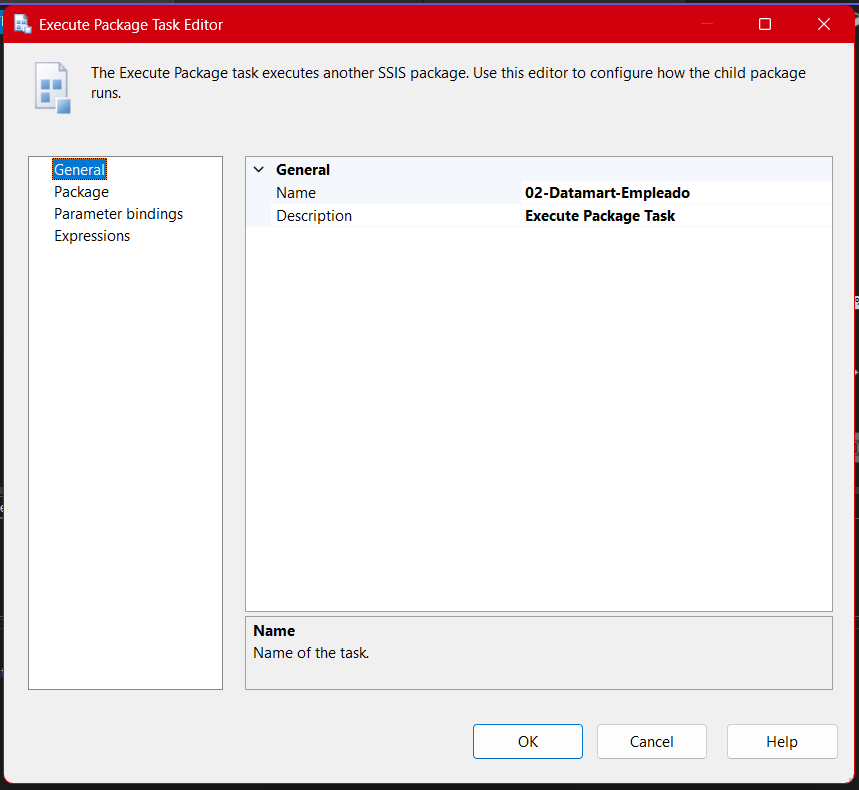
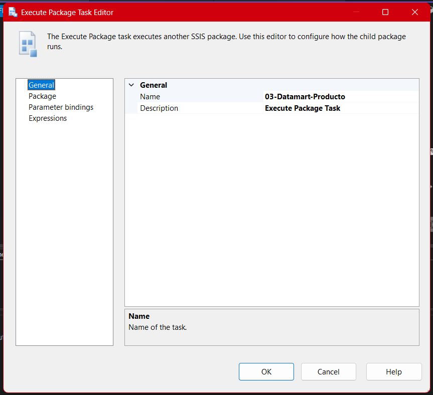
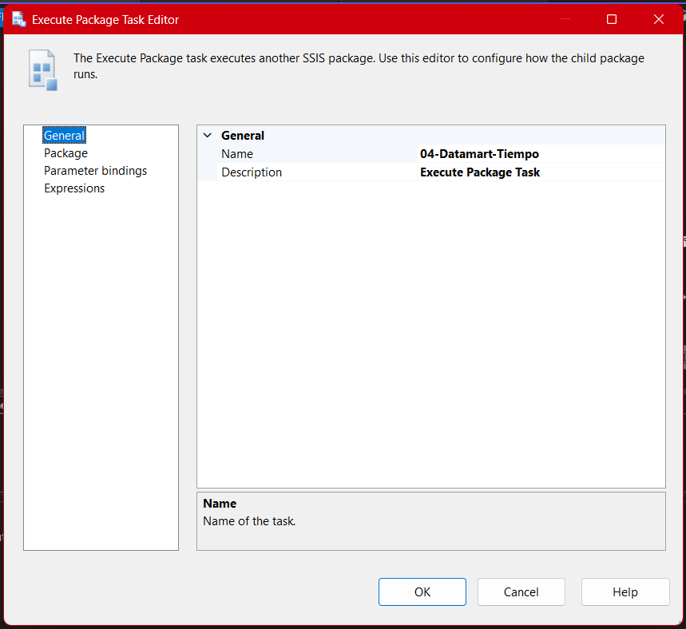
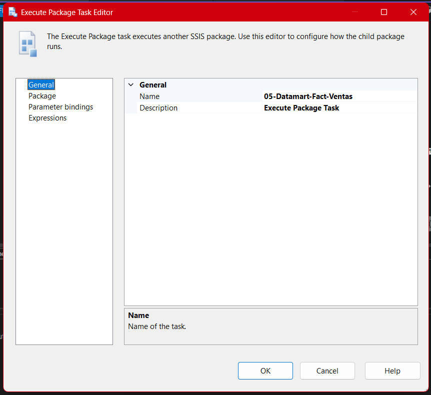

# **Documentación del Proceso ETL para el Paquete Datamart-Carga-Master**

## Descripción General

El **paquete `Carga-Master`** representa el núcleo de la **orquestación ETL** en tu arquitectura de datos. Su propósito es coordinar la ejecución de los paquetes individuales que cargan cada una de las tablas principales (clientes, empleados, productos, tiempo y ventas) asegurando el orden correcto, la consistencia referencial y un flujo controlado de la carga de información en el datamart.
Este paquete no mueve datos directamente, sino que **invoca de forma jerárquica** a los paquetes de carga, convirtiéndose en el punto de entrada ideal para ejecutar el proceso completo de actualización.

---

## Diagrama del Flujo de Control

La lógica de este paquete se puede visualizar en el siguiente diagrama, donde la relación entre las tareas refleja tanto las dependencias naturales entre entidades (por ejemplo, un producto no existe sin cliente, una venta no existe sin sus dimensiones) como las buenas prácticas de orquestación ETL:

---

## Explicación paso a paso de la secuencia

1. **Carga de Clientes**
   
   El proceso inicia con la ejecución del paquete `01-Datamart-Cliente`, el cual alimenta la dimensión de clientes. Esta dimensión es crucial ya que es referencia para empleados, productos y ventas.

2. **Carga de Empleados**
   
   Una vez que los clientes han sido cargados correctamente, se activa el paquete `02-Datamart-Empleado`, asegurando así que los empleados tengan acceso a todas las referencias necesarias de clientes.

3. **Carga de Productos**
   
   El paquete `03-Datamart-Producto` depende de la correcta carga de empleados (y de clientes, indirectamente), pues los productos pueden estar relacionados a empleados responsables o vendedores.

4. **Carga de Tiempo**
   
   La dimensión tiempo (`04-Datamart-Tiempo`) se carga después de productos, garantizando que toda referencia temporal esté disponible y alineada para los hechos.

5. **Carga de Hechos (Ventas)**
   
   Finalmente, la tabla de hechos (`05-Datamart-Fact-Ventas`) se alimenta cuando ya todas las dimensiones necesarias han sido procesadas. Aquí se consolidan las referencias a clientes, empleados, productos y tiempo, garantizando integridad referencial total.

---

## Configuración de cada Execute Package Task

Cada bloque del diagrama corresponde a una tarea del tipo **Execute Package Task**, la cual se configura de forma explícita para invocar el paquete ETL adecuado.
Por ejemplo:

- **Configuración de la tarea para cargar clientes:**
  

- **Configuración de la tarea para cargar empleados:**
  

- **Configuración para cargar productos:**
  

- **Configuración para cargar la dimensión tiempo:**
  

- **Configuración para cargar los hechos de ventas:**
  

---

## Consideraciones Técnicas y Mejores Prácticas

- **Secuenciación y dependencias:**
  El paquete asegura que **ningún paquete de carga de hechos se ejecute sin que antes hayan sido cargadas sus dimensiones**. Esto evita errores de clave foránea y asegura la integridad de los datos.
- **Punto de entrada único:**
  Facilita la administración y monitoreo, ya que todo el proceso de actualización se puede ejecutar, reiniciar o auditar desde un solo paquete.
- **Extensibilidad:**
  Si en el futuro se agregan nuevas dimensiones o hechos, simplemente se añaden nuevas tareas y conexiones en este flujo maestro, sin afectar el resto del sistema.
- **Reusabilidad:**
  Cada paquete individual puede ejecutarse de manera aislada para pruebas o cargas incrementales, pero en operaciones completas, el paquete maestro debe ser el punto de inicio.

---

## **Resumen Tecnico**

El paquete **Carga-Master** es el **corazón del control de cargas ETL**, integrando, secuenciando y asegurando la consistencia de todo el flujo de carga de datos en el datamart Northwind.
Su correcta implementación **simplifica el mantenimiento**, reduce errores operativos y es indispensable para garantizar una actualización robusta y confiable del repositorio de datos.
