# Proyecto ETL Northwind: Transformación y Análisis de Datos para Negocios Digitales

## Contexto del Proyecto

Este proyecto se desarrolló como parte de la asignatura **Analítica de Datos para Negocios Digitales**, con el objetivo principal de aprender y aplicar los procesos **ETL (Extract, Transform, Load)**. Estos procesos son esenciales en el ámbito digital, ya que permiten integrar, limpiar y transformar grandes volúmenes de datos en información confiable, facilitando decisiones estratégicas rápidas y acertadas. Utilizamos la base de datos **Northwind**, reconocida por su estructura clara y orientada a negocios, para ejemplificar distintos conceptos y técnicas analíticas.

## Herramientas y Entorno Tecnológico

Para llevar a cabo este proyecto, se utilizaron las siguientes herramientas:

- **Visual Studio 2022**: Entorno integrado de desarrollo (IDE).
- **SQL Server Integration Services (SSIS)**: Extensión específica de Microsoft que proporciona herramientas avanzadas para realizar operaciones ETL, específicamente:

  - Extracción de datos
  - Transformación de datos
  - Carga de datos

## Organización del Proyecto

El proyecto fue estructurado en carpetas específicas para cada fase del proceso ETL, facilitando así la gestión efectiva del flujo de trabajo:

- **Stage_Northwind**: Contiene la base intermedia que almacena temporalmente los datos extraídos para su posterior transformación.
- **Datamart_Northwind**: Almacena la base final con un modelo dimensional optimizado para análisis profundos y generación ágil de reportes.
- **ETLNortWind.sln**: Solución integral que alberga todos los paquetes ETL utilizados durante el proyecto, permitiendo la gestión completa del proceso de datos.

## Flujo Detallado del Proceso ETL

### Extracción

- Se obtuvieron datos desde la base original **Northwind**.

### Transformación (Stage_Northwind)

- Los datos extraídos fueron almacenados en tablas temporales para su limpieza y transformación, generando así una estructura intermedia más accesible.

**Paquetes ETL específicos:**

- Empleado
- Categoría
- Cliente
- Ventas
- Producto
- Proveedor
- Tiempo
- Limpieza del Stage

### Carga (Datamart_Northwind)

- Tras la transformación, los datos fueron cargados en un modelo dimensional definitivo (base de datos **Datamart_Northwind**).

**Paquetes ETL específicos:**

- Cliente
- Empleado
- Producto
- Tiempo
- Fact Ventas
- Carga Master Datamart
- Limpieza Dimensiones

## Objetivos y Aplicaciones Empresariales

El propósito central del proyecto es demostrar claramente cómo transformar datos en información útil mediante técnicas analíticas avanzadas. Este enfoque facilita considerablemente la toma de decisiones en contextos empresariales digitales. Algunos ejemplos concretos de aplicaciones incluyen:

- Gestión eficiente de inventarios.
- Análisis detallado y predictivo de ventas.
- Mejora en la gestión y fidelización de clientes.
- Desarrollo de estrategias de marketing segmentado.
- Identificación temprana de tendencias de consumo.

En documentos posteriores, cada paquete ETL se abordará de manera detallada, explicando los procesos específicos involucrados.

## Base de Datos Northwind Original

La base de datos **Northwind** cuenta con diversas tablas interrelacionadas que permiten gestionar información esencial para la operación empresarial diaria, tales como:

- Customers (Clientes)
- Employees (Empleados)
- Orders (Pedidos)
- Products (Productos)
- Suppliers (Proveedores)
- Categories (Categorías)
- Order Details (Detalles de pedidos)

## Creación de Nuevas Bases de Datos

Para llevar a cabo correctamente el proceso ETL, se crearon dos bases de datos nuevas:

### Stage_Northwind (Base Intermedia de Transformación)

La base **Stage_Northwind** es una etapa crucial en el proceso ETL, diseñada para almacenar temporalmente los datos extraídos de la fuente original. Su función principal es permitir la limpieza, validación y transformación inicial antes de que los datos sean transferidos a la base definitiva. Esto garantiza que los datos que llegan al destino final estén correctamente estructurados y libres de errores o inconsistencias.

**Tablas creadas:**

- **Categorías**: Clasificación de productos para análisis segmentado.
- **Clientes**: Información básica sobre clientes para análisis de mercado.
- **Empleado**: Datos de los empleados relevantes para gestión interna y desempeño.
- **Producto**: Detalles de productos para análisis de inventario y ventas.
- **Proveedor**: Información de proveedores para evaluar rendimiento y gestión logística.
- **Ventas**: Registros detallados de transacciones para análisis financiero y comercial.
- **Stage_Tiempo**: Tabla especializada para facilitar análisis temporales detallados, permitiendo evaluar patrones y tendencias a lo largo del tiempo.

### Datamart_Northwind (Base Dimensional Definitiva para Analítica Avanzada)

La base **Datamart_Northwind** se estructura siguiendo el modelo dimensional (modelo estrella) para facilitar análisis eficientes y ágiles, generación rápida de informes, y soporte en decisiones estratégicas avanzadas. Su estructura permite la rápida agregación, filtrado y segmentación de los datos.

**Tablas creadas:**

- **Dimensiones**:

  - **dim_cliente**: Atributos detallados de clientes para segmentación avanzada.
  - **dim_empleado**: Datos consolidados sobre empleados para evaluar productividad y desempeño.
  - **dim_producto**: Información descriptiva y categórica de productos para análisis de ventas y tendencias.
  - **dim_tiempo**: Tabla que permite el análisis histórico y comparativo en diferentes intervalos de tiempo (días, semanas, meses, años).

- **Hechos**:

  - **fact_ventas**: Tabla central que registra métricas cuantitativas críticas relacionadas con las ventas, tales como ingresos totales, unidades vendidas y descuentos aplicados, conectando todas las dimensiones y permitiendo análisis multidimensionales profundos.

## Modelo Dimensional (Modelo Estrella)

La base **Datamart_Northwind** adopta una estructura dimensional conocida como **modelo estrella**, ideal para análisis y generación de informes ágiles en contextos empresariales. Este modelo consta principalmente de dos tipos de tablas:

- **Tablas Dimensionales**: Estas tablas almacenan atributos descriptivos que permiten segmentar, filtrar y categorizar los datos fácilmente. Ejemplos comunes son clientes, productos, empleados y fechas. Las dimensiones proporcionan contexto, facilitando consultas rápidas y específicas como análisis de ventas por región, por categoría de producto o por período temporal.

- **Tabla de Hechos**: Es la tabla central del modelo estrella y contiene métricas cuantitativas clave para el negocio, tales como ingresos, unidades vendidas, costos o márgenes de beneficio. La tabla de hechos está diseñada para almacenar datos detallados y relevantes para el análisis, relacionados directamente con las dimensiones mediante claves foráneas, permitiendo así un análisis profundo y multifacético.

La base **Datamart_Northwind** adopta una estructura clara compuesta por:

- **Tablas Dimensionales**: Contienen atributos descriptivos para análisis sencillos y ágiles.
- **Tabla de Hechos**: Contiene métricas cuantitativas relevantes (por ejemplo, ventas totales, unidades vendidas) asociadas a las dimensiones establecidas.

# **Documentación del Proceso ETL para la Tabla de Empleados (Package-01)**

## **Descripción general**

El paquete **01-stage-employee.dtsx** marca el inicio de la cadena de procesos ETL implementada para el proyecto Northwind. En este documento se describe en detalle **todo el flujo ETL aplicado a la tabla de empleados**, abarcando desde la extracción inicial hasta la carga final en la base intermedia. Se explica la función de cada componente, la lógica empleada y los desafíos encontrados durante el diseño de este flujo.

El diseño de este flujo ETL se utilizó para entender conceptos como integración de datos heterogéneos, conversiones de tipo, manejo de duplicados, aplicación de joins, filtrado de datos y automatización de cargas incrementales.

---

## Arquitectura General del Paquete (SSIS)

El flujo de datos de este paquete fue concebido con un enfoque didáctico, buscando ilustrar las mejores prácticas del desarrollo ETL en SSIS. A continuación, se describen los pasos principales:

1. **Extracción de datos desde dos orígenes** (OLE DB Source)
2. **Conversión de tipos de datos** (Data Conversion)
3. **Ordenamiento de datos** (Sort, si es necesario para el Merge Join)
4. **Comparación con la tabla destino usando Join** (Merge Join)
5. **Filtrado de nuevos registros** (Conditional Split)
6. **Carga de datos en la tabla Stage** (OLE DB Destination)

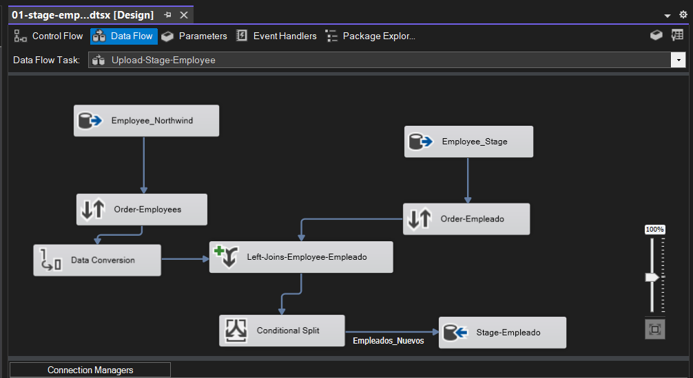

A continuación, explico cada componente y etapa del flujo, integrando la lógica, buenas prácticas y problemas comunes.

---

## 1. Extracción de datos (OLE DB Source)

### a) Conexión al origen Northwind

Se utiliza un **OLE DB Source** conectado a la base de datos **Northwind** para extraer los registros de empleados. Aquí se configura una consulta SQL personalizada:

```sql
SELECT EmployeeID, FirstName, LastName, HireDate
FROM Northwind.dbo.Employees;
```

- **¿Por qué se usa una consulta personalizada?** Esto permite seleccionar únicamente las columnas que realmente se necesitan, lo cual mejora el rendimiento del proceso, reduce la carga sobre la red y evita el procesamiento innecesario de datos irrelevantes.
- **Errores comunes:** No filtrar columnas puede traer datos innecesarios y afectar la velocidad del ETL.

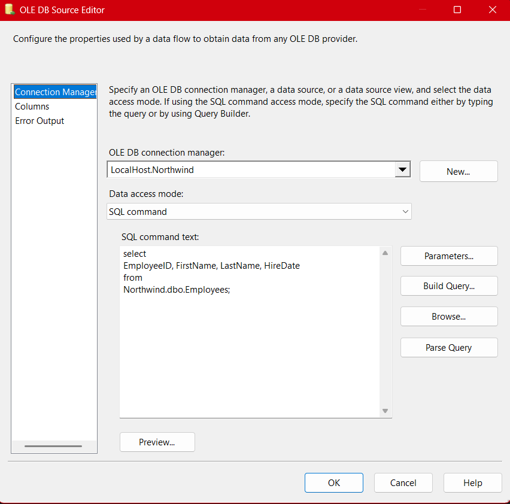

### b) Conexión al destino Stage_Northwind

El segundo **OLE DB Source** se conecta a la tabla `empleado` de **Stage_Northwind**, obteniendo el estado actual de la tabla destino.

- **¿Por qué?** Esto permite comparar los datos de origen con los existentes y evitar duplicados en la carga.
- **Práctica recomendada:** Seleccionar las mismas columnas clave y de control.

## 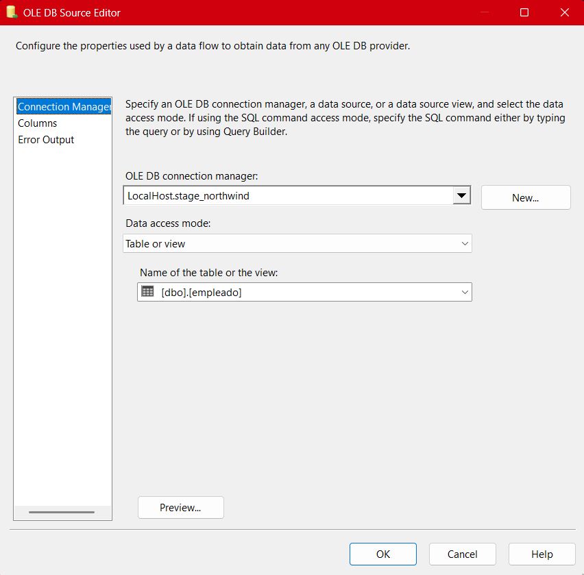

## 2. Conversión de Tipos de Datos (Data Conversion)

En esta etapa, el componente **Data Conversion** se emplea para transformar los tipos de datos provenientes de la fuente al formato exacto que requiere la tabla destino. Un ejemplo común es la conversión de campos `nvarchar` a `varchar`, o el ajuste de la longitud de cadenas de texto para que coincidan con la definición en la base de destino.

- **¿Por qué es importante?** Si los tipos no coinciden, el paquete fallará al intentar insertar los datos en el destino.
- **Aprendizaje en clase:** Los profesores deliberadamente pusieron tipos distintos para enseñarnos la importancia y la técnica de las conversiones.
- **Errores comunes:** No mapear adecuadamente los tipos o la longitud de cadenas, lo que genera truncamientos o errores de incompatibilidad.

## 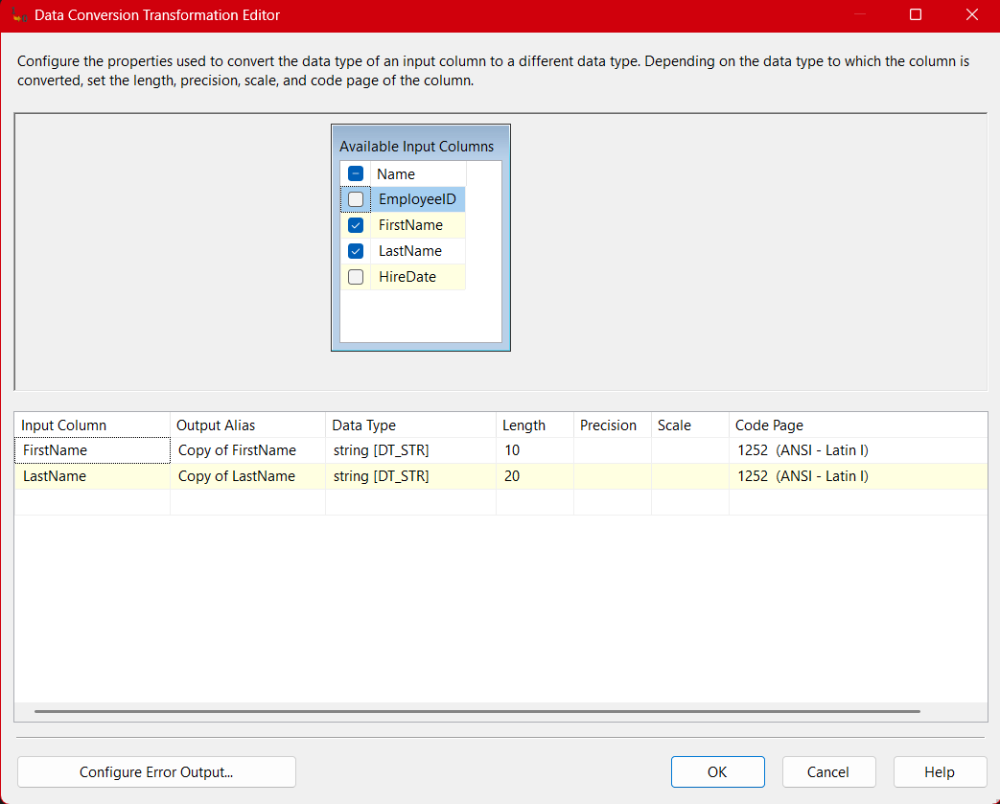

## 3. Ordenamiento de Datos (Sort, opcional pero recomendado)

Para que el componente **Merge Join** funcione correctamente, ambas fuentes de datos deben estar ordenadas por las claves que se utilizarán en la unión. Si alguna fuente no llega ordenada, es necesario incluir un componente **Sort** antes del Merge Join para garantizar la integridad del proceso.

- **¿Por qué ordenar?** Sin orden, el Merge Join arrojará error y no funcionará.
- **Recomendación:** Ordenar por `EmployeeID` o la clave primaria relevante.

---

## 4. Comparación y Unión de Datos (Merge Join / Left Join)

El componente **Merge Join** es fundamental para comparar los registros del origen con los existentes en la Stage. En este caso, se suele utilizar un **Left Outer Join** para identificar nuevos registros.

- **Motivo:** Nos interesa saber qué empleados existen en Northwind que aún **no** están en Stage.
- **Aplicación de conocimientos:** Durante las prácticas en clase, experimentamos con distintos tipos de joins (left, right e inner) para cubrir diversos escenarios. En este caso particular, el left join resulta fundamental para detectar y cargar únicamente los registros nuevos. Tambien aplicamos los conocimientos obtenidos en el curso anterior (Base de Datos para Negocios Digitales).
- **Errores comunes:** No ordenar las fuentes previamente, no mapear correctamente las columnas de unión.

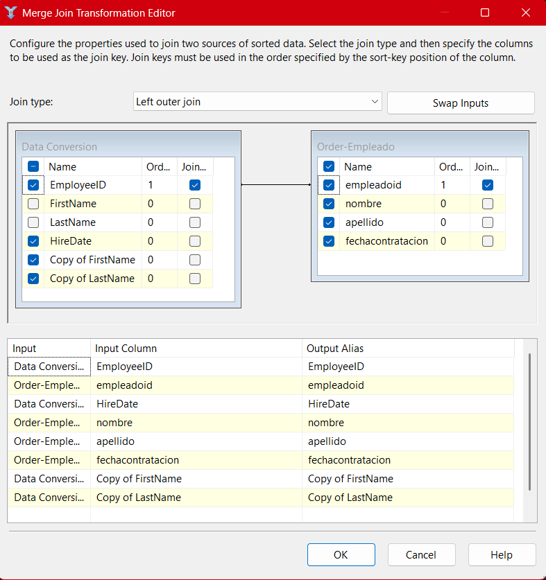

---

## 5. Filtrado de Nuevos Registros (Conditional Split)

Una vez combinados los datos, se utiliza el **Conditional Split** para filtrar **sólo** los registros nuevos (por ejemplo, aquellos donde el `empleadoid` en Stage es `NULL`).

- **Ejemplo de condición:**
  `ISNULL(Stage_empleadoid)`
  > [!Note]
  > Asegúrate que el campo corresponda al del Stage; especificar el prefijo puede evitar confusiones si las columnas tienen el mismo nombre en ambos orígenes
- **¿Por qué hacerlo?** Así evitamos sobrescribir registros existentes y sólo insertamos los nuevos.
- **Mejor práctica:** Documentar siempre la lógica de tus splits para facilitar mantenimiento futuro.

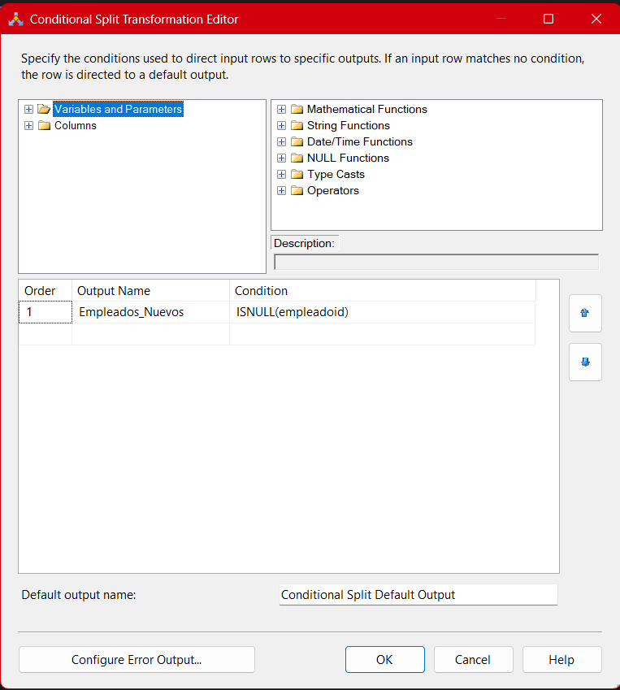

---

## 6. Carga de Datos en Stage (OLE DB Destination)

Finalmente, los registros filtrados como nuevos se cargan en la tabla `empleado` de **Stage_Northwind** usando un **OLE DB Destination**.

- **Mapeo de columnas:** Debes asegurarte de que cada campo del flujo de datos corresponda al campo correcto en la tabla destino.
- **Validación:** Es recomendable probar el proceso primero en modo test (utilizando Data Viewer o el modo de depuración de SSIS), para asegurarte de que los registros se insertan correctamente y que los datos mapeados coinciden con la estructura de la tabla destino.

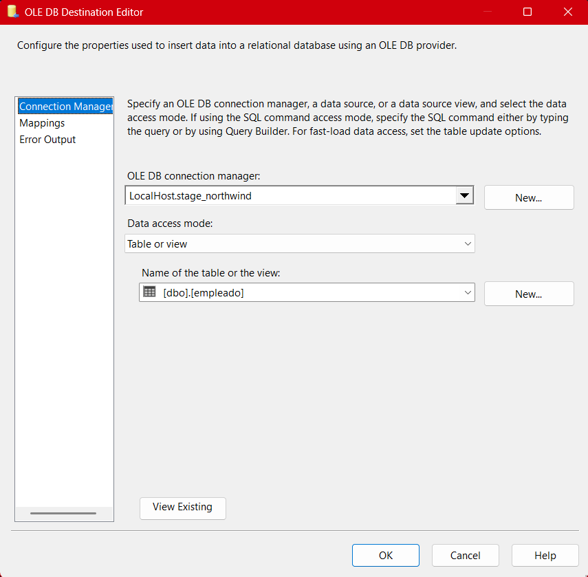

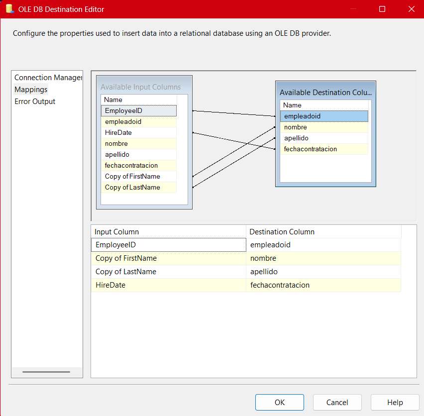

---

## 7. Resumen Visual del Flujo Completo

El **Data Flow** completo del paquete, tal como se visualiza en SSIS, permite apreciar de un vistazo cada uno de los componentes y la trayectoria que sigue la información desde el origen hasta el destino:


---

## Buenas Prácticas y Observaciones

- **Control de errores:** Configura salidas de error en los componentes críticos (Data Conversion, Merge Join) para capturar y analizar posibles fallos de datos.
- **Documentación:** Usa los descriptores y notas en cada componente dentro de SSIS para dejar clara la intención de cada paso.
- **Reusabilidad:** La estructura de este paquete puede servir como modelo para desarrollar otros flujos ETL similares (por ejemplo, para las tablas de productos, clientes o ventas), facilitando la estandarización y mantenimiento del proyecto.
- **Optimización:** Si el volumen de datos es grande, analiza la posibilidad de particionar cargas o usar Bulk Insert.

---

## Mental Notes

- **Diferencias de tipos de datos:** La intención didáctica de poner tipos incompatibles es que los estudiantes comprendan la importancia de planear y documentar la estructura de sus bases de datos desde el diseño.
- **Uso de SQL para consultas:** Realizar las extracciones mediante consultas SQL permite personalizar los datos, agregar filtros y reducir el consumo de recursos.
- **Merge Join como ejercicio práctico:** Aprender a usar distintos tipos de join (left, right, inner) es clave para el manejo avanzado de datos.
- **Conditional Split y cargas incrementales:** Aprender a implementar cargas incrementales mediante filtrado condicional es fundamental en entornos de ETL profesional, ya que permite mantener las tablas actualizadas sin necesidad de sobrescribir todo su contenido en cada ciclo de carga.

---

## **Resumen Técnico**

El paquete **01-stage-employee.dtsx** ejemplifica el flujo ETL que caracteriza todo el proyecto Northwind. Su objetivo principal es **garantizar la integridad, consistencia y actualización de los datos de empleados en la base Stage**, aplicando técnicas fundamentales de integración y manejo de datos, útiles y adaptables para cualquier entorno profesional de analítica o gestión empresarial.

---

# **Documentación del Proceso ETL para la Tabla de Categorías (Package-02)**

## **Descripción general**

El paquete **02-stage-categoria.dtsx** corresponde al proceso ETL diseñado para la tabla **Categorías** del proyecto Northwind. En este documento se describe paso a paso el flujo, desde la extracción inicial de los datos hasta su transformación y posterior carga en la base intermedia. Además, se pone especial énfasis en la lógica utilizada para integrar, comparar y actualizar los registros, así como en las mejores prácticas para una migración eficiente y sin duplicados.

---

## Arquitectura General del Paquete (SSIS)

Este paquete utiliza la estructura estándar desarrollada en las prácticas de clase, lo que garantiza integridad de los datos y claridad en cada etapa. Los pasos principales del flujo son:

1. **Extracción de datos desde dos orígenes** (OLE DB Source)
2. **Conversión de tipos de datos** (Data Conversion)
3. **Ordenamiento de datos** (Sort, si es necesario para el Merge Join)
4. **Comparación con la tabla destino usando Join** (Merge Join)
5. **Filtrado de nuevos registros** (Conditional Split)
6. **Carga de datos en la tabla Stage** (OLE DB Destination)


---

## 1. Extracción de datos (OLE DB Source)

### a) Conexión al origen Northwind

Se utiliza un **OLE DB Source** conectado a **Northwind** para extraer los registros actuales de categorías.
Aquí se configura la siguiente consulta SQL:

```sql
SELECT CategoryID, CategoryName
FROM Northwind.dbo.Categories;
```

- **¿Por qué usar una consulta específica?** Permite obtener únicamente los campos relevantes, lo que agiliza el proceso ETL, reduce el volumen de datos procesados y facilita el trabajo en las etapas posteriores.
- **Errores comunes:** Traer columnas innecesarias puede complicar la transformación y enlentecer el flujo.

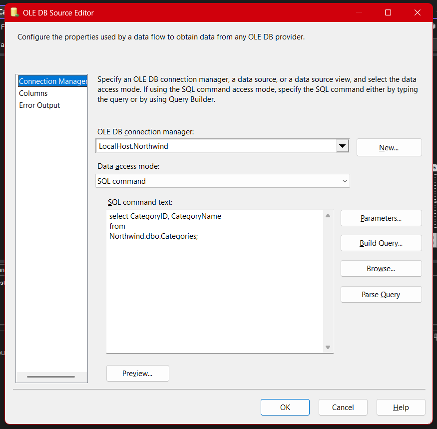

### b) Conexión al destino Stage_Northwind

El segundo **OLE DB Source** se conecta a la tabla `[categorias]` de **Stage_Northwind**, obteniendo el estado actual de la tabla destino.

- **¿Por qué?** Esto permite comparar los datos nuevos contra los ya existentes y así evitar duplicados.
- **Práctica recomendada:** Seleccionar siempre los mismos campos clave para la comparación.


---

## 2. Conversión de Tipos de Datos (Data Conversion)

El componente **Data Conversion** se emplea para ajustar los tipos de datos extraídos, asegurando que coincidan exactamente con la definición de la tabla de destino. Por ejemplo, es posible que se tenga que modificar el tipo o la longitud de `CategoryName` para evitar errores de inserción o pérdida de información.

- **¿Por qué?** Si el tipo no coincide exactamente, la inserción puede fallar o truncar datos.
- **Errores comunes:** No ajustar el tamaño de los strings puede cortar nombres largos o generar incompatibilidad.

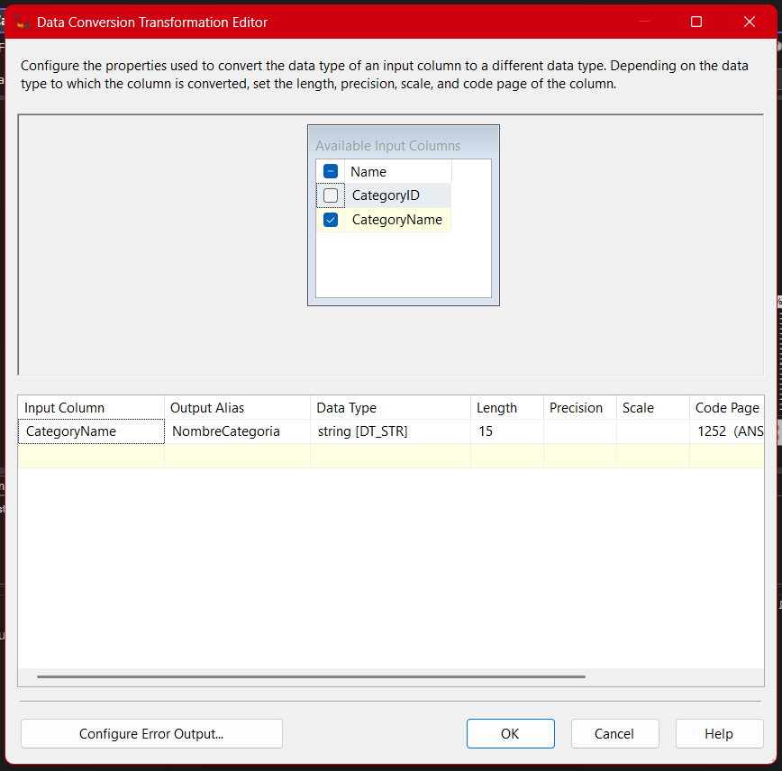

---

## 3. Ordenamiento de Datos (Sort, opcional pero recomendado)

Para que el componente **Merge Join** funcione correctamente, es imprescindible que ambos conjuntos de datos estén ordenados por la clave de unión, que en este caso suele ser `CategoryID`.

- **¿Por qué ordenar?** Es requisito del Merge Join en SSIS.
- **Recomendación:** Asegúrate de que ambas fuentes usen el mismo criterio de orden.

---

## 4. Comparación y Unión de Datos (Merge Join / Left Join)

El componente **Merge Join** se utiliza aquí con un **Left Outer Join** para comparar los registros extraídos de Northwind contra los de Stage y así identificar cuáles son nuevos.

**Motivo:** El objetivo principal es insertar únicamente las nuevas categorías, evitando así duplicados en la base de datos intermedia.
**Aplicación práctica:** La utilización del Left Join facilita la identificación de registros presentes en Northwind pero ausentes en Stage, lo que permite enfocarse en la carga incremental.

- **Errores comunes:** No ordenar las fuentes, o mapear mal los campos clave.


---

## 5. Filtrado de Nuevos Registros (Conditional Split)

Se emplea **Conditional Split** para filtrar solo las categorías nuevas, es decir, donde el campo clave `categoriaid` en Stage es NULL.

- **Ejemplo de condición:**
  `ISNULL(Stage_categoriaid)`
  (Sugerencia: Especificar el prefijo o el origen ayuda a evitar confusiones si hay nombres repetidos entre fuentes.)
- **¿Por qué?** Para no sobrescribir categorías existentes y solo insertar las que realmente son nuevas.
- **Tip:** Documenta la lógica de cada split para facilitar el mantenimiento futuro.

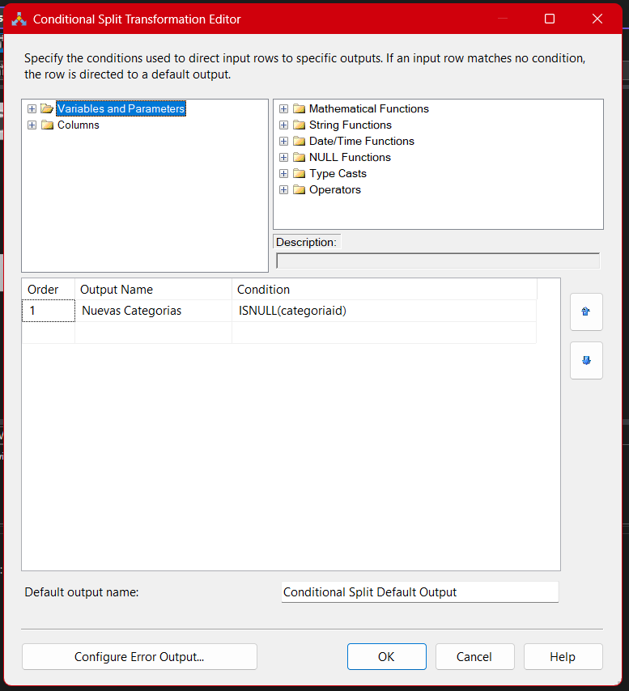

---

## 6. Carga de Datos en Stage (OLE DB Destination)

Las nuevas categorías se cargan en la tabla `[categorias]` de **Stage_Northwind** usando un **OLE DB Destination**.

**Mapeo de columnas:** Es fundamental revisar que cada columna del flujo de datos esté correctamente alineada con la columna correspondiente en la tabla de destino.
**Validación:** Antes de realizar cargas masivas, se recomienda ejecutar pruebas con un subconjunto reducido de registros para verificar que la inserción es correcta y evitar errores mayores.


## 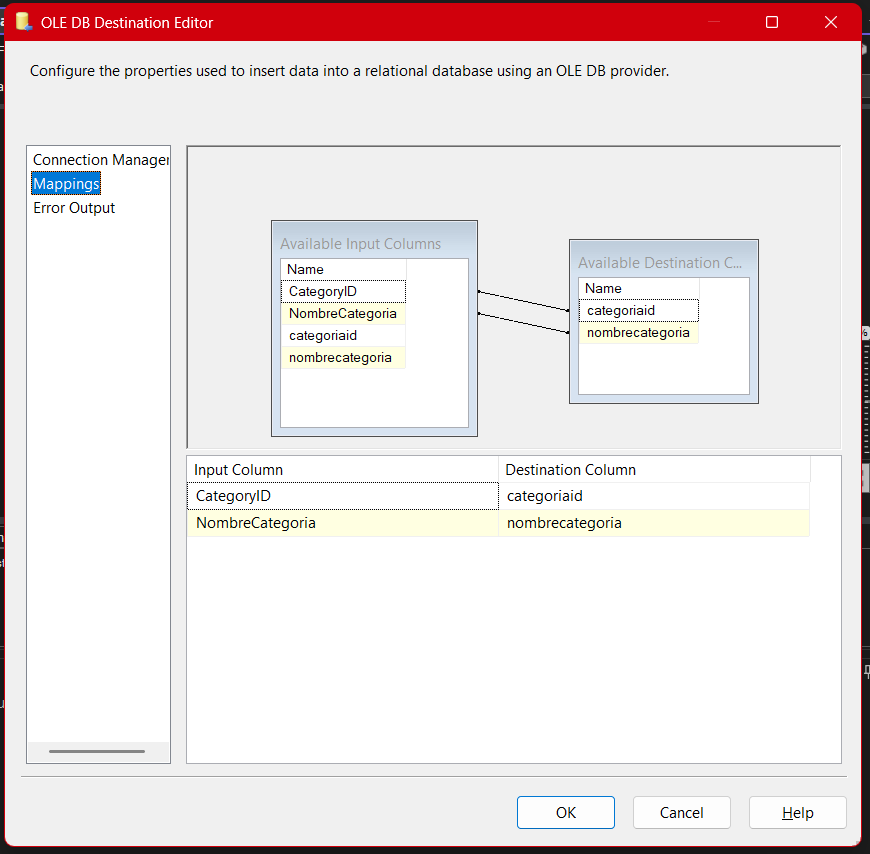

## 7. Flujo Completo

El **Data Flow** de este paquete en SSIS muestra todos los componentes conectados, facilitando la comprensión del proceso.


---

## Buenas Prácticas y Observaciones

- **Control de errores:** Usa las salidas de error de los componentes (especialmente Data Conversion y Merge Join) para capturar datos problemáticos.
- **Documenta tus flujos:** Escribe comentarios o notas en los componentes de SSIS.
- **Reutilización:** Esta estructura de paquete puede adaptarse fácilmente para cualquier dimensión que requiera una lógica de actualización incremental.
- **Pruebas incrementales:** Antes de ejecutar el paquete a gran escala, valida el flujo y la lógica con un grupo pequeño de datos para detectar posibles problemas a tiempo.

---

## Consideraciones Didácticas y Experiencia de Aprendizaje

- **Conversión de tipos:** Te ayudará a comprender los problemas típicos de integración de datos entre sistemas distintos.
- **Left Join vs Inner Join:** Comprender las diferencias y usos de cada tipo de join es fundamental, ya que permite definir si el objetivo es detectar nuevos registros, actualizar existentes o realizar eliminaciones lógicas.
- **Uso de Conditional Split:** Es clave para realizar cargas incrementales, evitando sobrescribir o duplicar datos.

---

## **Resumen Técnico**

El paquete **02-stage-categoria.dtsx** ilustra la lógica de integración incremental y controlada aplicada a la dimensión de categorías. Es un modelo útil para automatizar la migración y actualización de datos esenciales, asegurando la calidad de la información y evitando la duplicidad de registros.

---

# **Documentación del Proceso ETL para la Tabla de Clientes (Package 03)**

## **Descripción general**

El paquete **03-Stage-Cliente.dtsx** corresponde al proceso ETL para la tabla de **clientes**, y su objetivo es extraer los registros actualizados desde la base de datos Northwind, limpiar y transformar los datos necesarios, identificar los registros nuevos y cargarlos en la tabla intermedia de Stage. Este proceso, además de consolidar buenas prácticas de integración de datos, ilustra técnicas clave como la conversión de tipos de datos, manejo de valores nulos y cargas incrementales de información.

---

## Arquitectura General del Paquete (SSIS)

El flujo de este paquete sigue la arquitectura didáctica estándar:

1. **Extracción de datos desde dos orígenes** (OLE DB Source)
2. **Conversión de tipos de datos** (Data Conversion)
3. **Ordenamiento de datos** (Sort)
4. **Comparación y unión de datos** (Merge Join)
5. **Filtrado de nuevos registros** (Conditional Split)
6. **Carga en la tabla destino Stage** (OLE DB Destination)


---

## 1. Extracción de Datos (OLE DB Source)

### a) Conexión al origen Northwind

Se utiliza un componente **OLE DB Source** para extraer los datos de la tabla `Customers` en Northwind. Aquí, además de seleccionar los campos clave (CustomerID, CompanyName, City, Region, PostalCode, Country), se realiza un manejo de valores nulos usando `ISNULL` para asignar valores por defecto en los campos `City` y `Region`.

```sql
SELECT CustomerID, CompanyName, ISNULL(City, 'SC') AS City, ISNULL(Region, 'SR') AS region, PostalCode, Country
FROM Northwind.dbo.Customers;
```

- **Motivación didáctica:** El uso de `ISNULL` enseña cómo evitar problemas de nulos en los siguientes pasos del flujo ETL.


### b) Conexión al destino Stage_Northwind

El segundo **OLE DB Source** se conecta a la tabla `clientes` en Stage_Northwind, para obtener el estado actual y comparar si existen clientes nuevos que aún no han sido cargados.

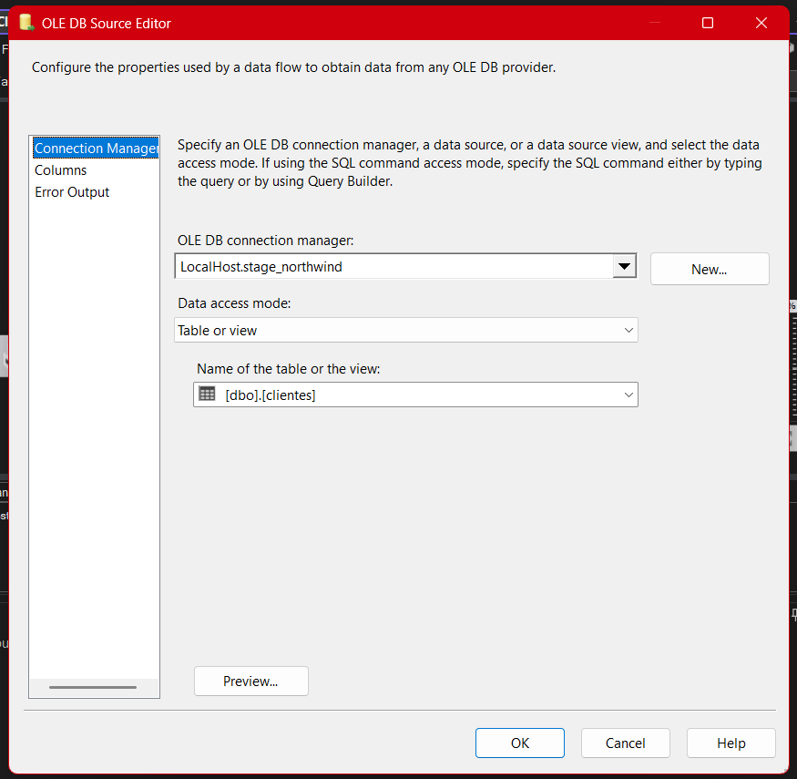

---

## 2. Conversión de Tipos de Datos (Data Conversion)

El componente **Data Conversion** convierte los campos del origen a los tipos requeridos por el destino (por ejemplo, de `nvarchar` a `char`, ajuste de longitud de cadenas, etc.).
En este paquete se hace una conversión explícita en los siguientes campos:

- CustomerID → CustomerID_CHAR (string de 5)
- CompanyName → CompanyName_CHAR (string de 40)
- City → City_CHAR (string de 15)
- Region → Region_CHAR (string de 15)
- PostalCode → PostalCode_CHAR (string de 10)

Esto es fundamental para evitar incompatibilidades y errores en la carga.


---

## 3. Ordenamiento de Datos (Sort)

Para poder realizar correctamente el **Merge Join**, ambos conjuntos de datos deben estar ordenados por la clave primaria (`CustomerID`/`clienteid`). Por ello, se utiliza un componente **Sort** para ordenar los datos antes de unirlos.

---

## 4. Comparación y Unión de Datos (Merge Join)

Se utiliza un **Merge Join** tipo **Left Outer Join** para comparar los registros del origen Northwind con los ya existentes en Stage.

- **Objetivo:** Detectar clientes nuevos que aún no existen en la tabla destino.
- **Uniones:** Se unen por `CustomerID_CHAR` (origen) con `clienteid` (destino).

Este paso es clave para garantizar cargas incrementales, evitando duplicados y sobrescritura de datos.

## 

## 5. Filtrado de Nuevos Registros (Conditional Split)

Con el **Conditional Split** se filtran aquellos registros donde el cliente no existe todavía en Stage, es decir, donde el campo `clienteid` es NULL tras el Merge Join.

- **Condición utilizada:** `ISNULL(clienteid)`
- **Resultado:** Solo los clientes nuevos pasan al siguiente paso del flujo.

---

## 6. Carga de Datos en Stage (OLE DB Destination)

Los registros nuevos se insertan en la tabla `clientes` de **Stage_Northwind** a través de un componente **OLE DB Destination**.

- **Mapeo:** Es imprescindible mapear correctamente cada campo transformado hacia su destino correspondiente para evitar errores en la carga.

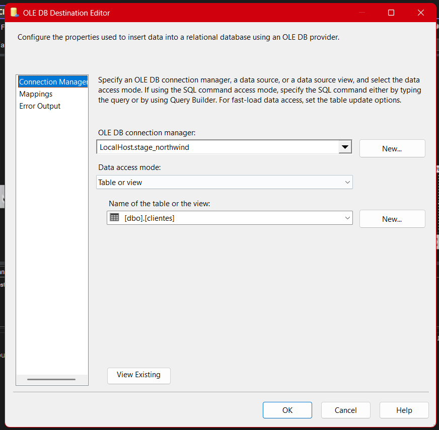

## 

## 7. Resumen Visual del Flujo Completo

El flujo completo del paquete puede visualizarse en SSIS, mostrando la secuencia de componentes y el trayecto de los datos:


---

## Buenas Prácticas y Observaciones

- **Manejo de nulos y tipos:** Utilizar funciones SQL (`ISNULL`) y conversiones explícitas previene fallos durante la carga y mantiene la calidad de los datos.
- **Documentación interna:** Aprovechar los descriptores en cada componente para que cualquier persona pueda entender la lógica del flujo.
- **Cargas incrementales:** Implementar filtrado mediante joins y splits permite actualizar solo los datos nuevos o modificados, aumentando eficiencia y evitando sobrescritura.
- **Depuración:** Es recomendable probar cada componente por separado antes de ejecutar el flujo completo, para detectar problemas en conversiones o mapeos.

---

## Consideraciones Didácticas y Experiencia de Aprendizaje

- **Ejemplo realista:** El proceso integra buenas prácticas utilizadas en entornos empresariales reales, como la normalización, limpieza y carga incremental de clientes.
- **Manejo de valores faltantes:** Aprender a prevenir problemas futuros de calidad de datos desde el ETL.
- **Flexibilidad del paquete:** Esta plantilla puede adaptarse fácilmente para otras tablas, cambiando las columnas, claves y condiciones de comparación.

---

## **Resumen Técnico**

El paquete **03-Stage-Cliente.dtsx** ejemplifica el proceso ETL ideal para la tabla de clientes: desde la extracción, limpieza, comparación y carga incremental, garantizando datos precisos y actualizados en el entorno de Stage. Esta arquitectura es fundamental en cualquier proyecto profesional de integración de datos y analítica para negocios digitales.

---

# **Documentación del Proceso ETL para la Tabla de Ventas (Package-04)**

## **Descripción general**

El paquete **04-Stage-Ventas.dtsx** implementa el flujo ETL para la integración y carga incremental de los datos de ventas en el proyecto Northwind. Este flujo está orientado a la extracción de información de ventas distribuida en múltiples tablas del origen transaccional, la transformación de tipos de datos y la detección precisa de nuevas ventas, para su carga en la base intermedia de Stage.

En este documento se explican **todas las etapas y componentes** del flujo de datos, desde la consulta SQL de extracción hasta el mapeo final en la tabla destino, así como los aprendizajes y retos clave del proceso.

---

## Arquitectura General del Paquete (SSIS)

La arquitectura de este paquete sigue el diseño estándar didáctico para cargas incrementales:

1. **Extracción de datos combinados del origen (OLE DB Source con SQL personalizado)**
2. **Conversión de tipos de datos (Data Conversion)**
3. **Ordenamiento previo a la unión (Sort)**
4. **Comparación con la tabla destino mediante Join (Merge Join)**
5. **Filtrado de nuevas ventas (Conditional Split)**
6. **Carga en la tabla Stage (OLE DB Destination)**


A continuación se explica el rol y detalle de cada componente, incluyendo buenas prácticas y errores frecuentes a evitar.

---

## 1. Extracción de datos (OLE DB Source)

### a) Conexión al origen Northwind - Ventas

Se utiliza un **OLE DB Source** para conectar a la base de datos Northwind y extraer la información de ventas mediante una consulta SQL avanzada que realiza varios joins. Así obtenemos un dataset enriquecido con información de clientes, empleados, productos y detalle de cada venta.

```sql
SELECT
  c.CustomerID,
  e.EmployeeID,
  p.ProductID,
  o.OrderDate,
  (od.Quantity * od.UnitPrice) as Monto,
  od.Quantity,
  od.UnitPrice,
  od.Discount
FROM Northwind.dbo.Customers as c
INNER JOIN Northwind.dbo.Orders as o ON c.CustomerID = o.CustomerID
INNER JOIN Northwind.dbo.Employees as e ON e.EmployeeID = o.EmployeeID
INNER JOIN Northwind.dbo.[Order Details] as od ON o.OrderID = od.OrderID
INNER JOIN Northwind.dbo.Products as p ON od.ProductID = p.ProductID;
```

- **Ventaja:** Nos permite extraer todos los datos relevantes de una venta en un solo paso, optimizando la transformación posterior.
- **Aprendizaje:** Se refuerza el uso de SQL para explotar relaciones y reducir la complejidad dentro de SSIS.
- **Error común:** Malos joins pueden provocar duplicados o pérdidas de información.


### b) Conexión al destino Stage_Northwind - Ventas

Un segundo **OLE DB Source** se conecta a la tabla `ventas` en la base intermedia de Stage. Esto es clave para realizar la comparación y así identificar ventas nuevas y evitar duplicados en la carga.

- **Práctica recomendada:** Extraer solo las columnas clave de la tabla destino para una comparación eficiente.

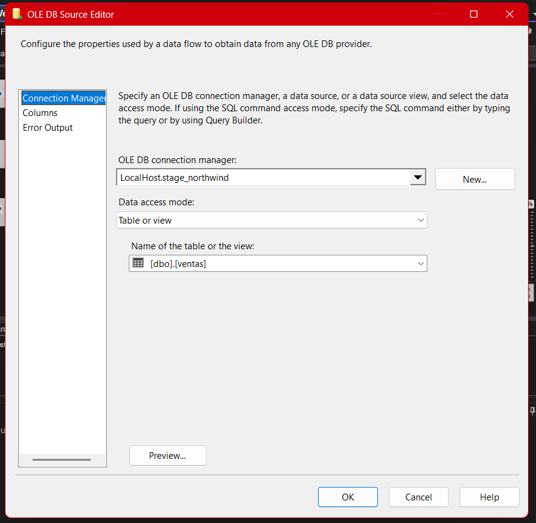

---

## 2. Conversión de Tipos de Datos (Data Conversion)

En este paso se realiza la conversión de los tipos de datos provenientes del origen a los formatos requeridos por la tabla destino. Por ejemplo:

- `CustomerID` a string de longitud fija
- `Quantity` a entero
- `UnitPrice` y `Discount` a decimal con la precisión necesaria

Esto evita errores de incompatibilidad al momento de la carga.

- **Errores comunes:** Truncamiento de datos por longitudes insuficientes, errores por diferencias de tipo numérico.
- **Aprendizaje:** La práctica de conversión es esencial para garantizar integridad y compatibilidad entre sistemas heterogéneos.

## 

## 3. Ordenamiento de Datos (Sort, indispensable para Merge Join)

El componente **Sort** ordena los datos por las columnas clave antes de realizar el join. Esto es un requerimiento para que el **Merge Join** funcione correctamente.

- **Recomendación:** Ordenar siempre por las claves de comparación (`CustomerID`, `ProductID`, `OrderDate`, etc.).
- **Error frecuente:** No ordenar provoca que el Merge Join arroje error o resultados inconsistentes.

---

## 4. Comparación y Unión de Datos (Merge Join / Left Join)

El **Merge Join** implementa un **left outer join** entre los datos recién extraídos y los existentes en la tabla Stage. Esto permite comparar ambos conjuntos y encontrar las ventas nuevas que aún no han sido cargadas.

- **Ventaja:** El left join garantiza que solo se identifiquen y carguen registros nuevos.
- **Error común:** No mapear correctamente las columnas de unión lleva a falsos positivos o negativos en la detección de cambios.


---

## 5. Filtrado de Nuevas Ventas (Conditional Split)

El **Conditional Split** filtra los registros que corresponden a nuevas ventas, normalmente utilizando una condición sobre columnas nulas (por ejemplo, cuando alguna clave en el Stage es NULL, indica que el registro es nuevo):

```
ISNULL(empleado_codigo) || ISNULL(producto_codigo)
```

- **Motivo:** Así se asegura que sólo se insertarán ventas no existentes previamente, evitando duplicados.
- **Aprendizaje:** Filtrado incremental, esencial para ETLs robustos y eficientes.


---

## 6. Carga de Datos en Stage (OLE DB Destination)

Los registros nuevos identificados se cargan en la tabla `ventas` de **Stage_Northwind** utilizando el componente **OLE DB Destination**. Es crucial mapear correctamente cada columna de entrada con la correspondiente columna de destino.

- **Sugerencia:** Siempre validar el mapeo y hacer pruebas con pocos registros antes de procesar cargas masivas.

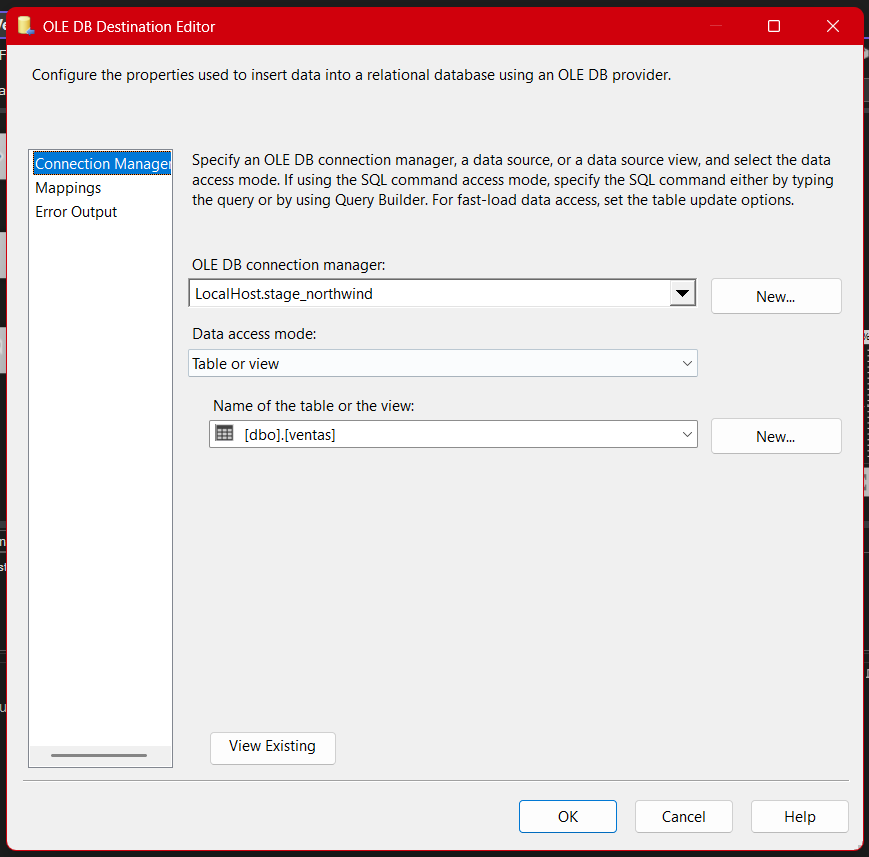

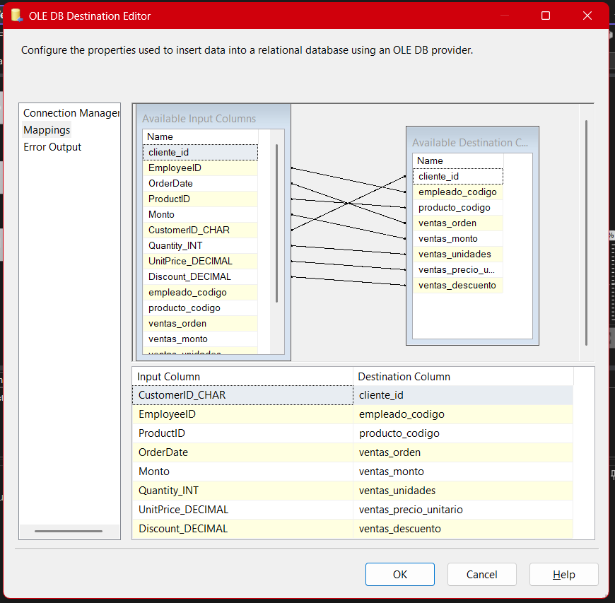

---

## 7. Resumen Visual del Flujo Completo

El flujo general es visualizado directamente en SSIS, mostrando claramente cómo fluyen los datos a través de cada transformación hasta llegar a la tabla destino.


---

## Buenas Prácticas y Observaciones

- **Control de errores:** Configura rutas de error en Data Conversion y Merge Join para capturar filas problemáticas.
- **Documentación interna:** Usa descripciones en los componentes para facilitar el mantenimiento y auditoría.
- **Reusabilidad:** El diseño modular permite replicar el flujo para otras tablas transaccionales o dimensiones.
- **Optimización:** Analiza el uso de índices en las tablas de origen y destino para acelerar el proceso ETL.

---

## Consideraciones Didácticas y Experiencia de Aprendizaje

- **Consultas SQL complejas:** Aprender a combinar múltiples tablas y entender la relación entre entidades es esencial para procesos ETL avanzados.
- **Conversión de tipos:** La variedad de tipos en los orígenes obliga a dominar la conversión y validación de datos.
- **Carga incremental:** El uso de joins y splits incrementales es clave en ambientes reales donde no se pueden sobrescribir datos constantemente.

---

## **Resumen Técnico**

El paquete **04-stage-ventas.dtsx** es un ejemplo completo de integración y transformación de datos complejos en un entorno empresarial. Este proceso asegura la **actualización eficiente y confiable** de la información de ventas en la base Stage, permitiendo análisis precisos y soporte a la toma de decisiones.

# **Documentación del Proceso ETL para la Tabla de Poducto (Package 05-Stage-Producto)**

## **Descripción general**

El paquete **05-Stage-Pro.dtsx** es parte fundamental en la cadena de integración de datos del proyecto Northwind. En este documento se explica, paso a paso, **cómo se realiza el flujo ETL sobre la tabla de productos**, desde la extracción hasta la carga en la base intermedia (Stage), detallando la lógica de cada componente, retos comunes, buenas prácticas y aprendizajes clave del proceso.

Este paquete se diseñó para consolidar la información relevante de los productos, manejar conversiones de datos, prevenir duplicados y garantizar la integridad de la información al ser cargada en la Stage, permitiendo un análisis confiable y estructurado para futuros procesos.

---

## Arquitectura General del Paquete (SSIS)

El flujo de datos sigue una arquitectura clara, modular y basada en buenas prácticas de ETL, lo que facilita su comprensión, auditoría y reutilización. Los pasos esenciales son:

1. **Extracción de datos desde el origen principal** (OLE DB Source - Northwind)
2. **Extracción del estado actual de Stage** (OLE DB Source - Stage_Northwind)
3. **Conversión de tipos de datos** (Data Conversion)
4. **Ordenamiento previo al Merge Join** (Sort)
5. **Comparación de registros entre origen y Stage** (Merge Join)
6. **Filtrado de nuevos productos** (Conditional Split)
7. **Carga de nuevos registros en Stage** (OLE DB Destination)

---

### Esquema visual general del paquete

## 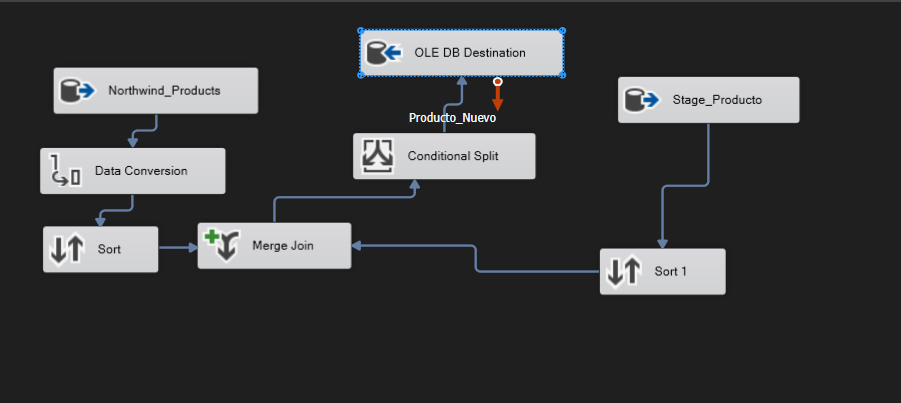

## 1. Extracción de Datos (OLE DB Source)

### a) Origen Northwind (productos)

Se utiliza un **OLE DB Source** para conectarse a la base Northwind y extraer sólo las columnas relevantes de la tabla de productos.

**Consulta SQL utilizada:**

```sql
SELECT SupplierID, CompanyName, ContactName, ContactTitle, Country
FROM Northwind.dbo.Suppliers;
```

- **¿Por qué una consulta específica?** Limitar las columnas extraídas reduce el volumen de datos, mejora el desempeño y simplifica los siguientes pasos del flujo.
- **Errores frecuentes:** Olvidar filtrar columnas puede traer información irrelevante o hacer más lento el ETL.

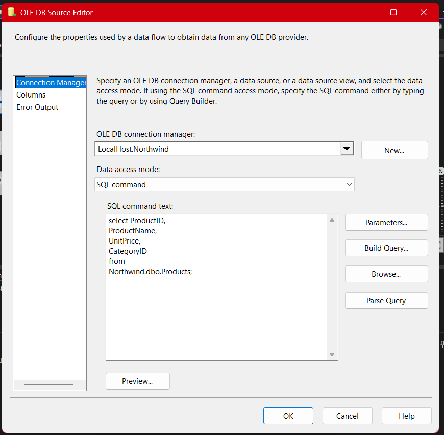

### b) Origen Stage_Northwind (productos)

Un segundo **OLE DB Source** obtiene el estado actual de la tabla `producto` en la base intermedia, para permitir la comparación y prevención de duplicados.

- **Práctica recomendada:** Seleccionar las columnas clave necesarias para identificar registros únicos.

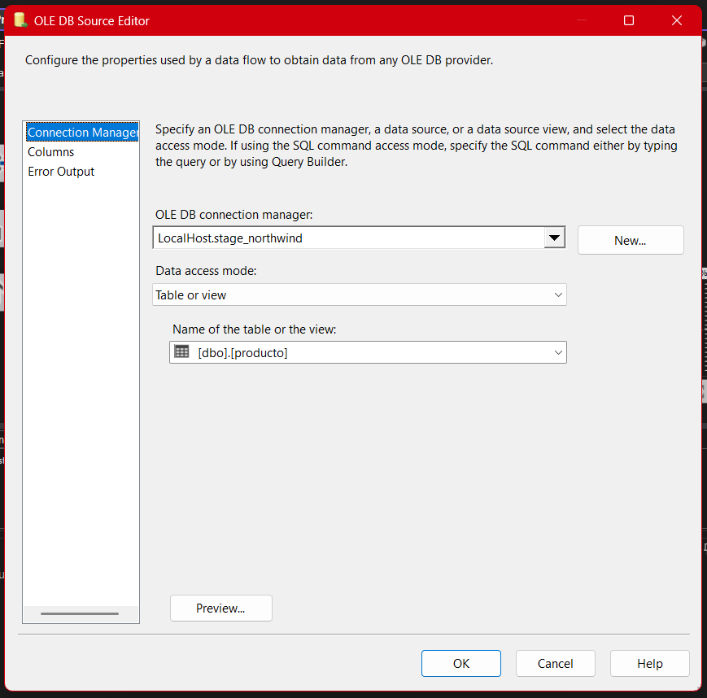

---

## 2. Conversión de Tipos de Datos (Data Conversion)

En este paso, el componente **Data Conversion** transforma los tipos de datos obtenidos del origen a los requeridos por la tabla destino en Stage. Esto puede incluir cambios de `nvarchar` a `varchar`, limitaciones de longitud o conversión de tipos numéricos.

> **[!important]**
> Las discrepancias entre los tipos de datos del origen y el destino suelen ser una de las causas más comunes de errores en los procesos ETL, como fallos en la carga o datos truncados

- **Aprendizaje clave:** Los profesores insisten en practicar conversiones para desarrollar el criterio técnico necesario y prever errores en ambientes productivos.

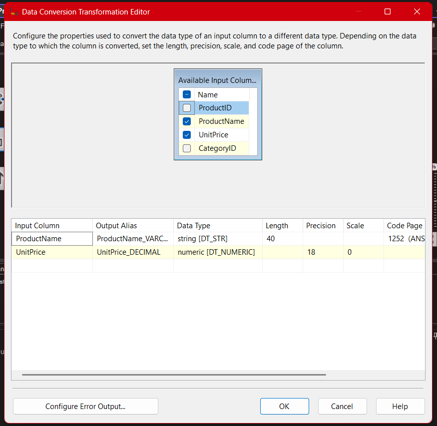

---

## 3. Ordenamiento de Datos (Sort)

El componente **Sort** es fundamental antes de aplicar un **Merge Join**, ya que ambos flujos de datos deben llegar ordenados por la(s) clave(s) principal(es), en este caso, probablemente `SupplierID`.

- **Motivo técnico:** El Merge Join falla si no encuentra ambos flujos ordenados de forma idéntica.
- **Recomendación:** Asegura siempre el orden en ambos lados y documenta el campo de ordenación.

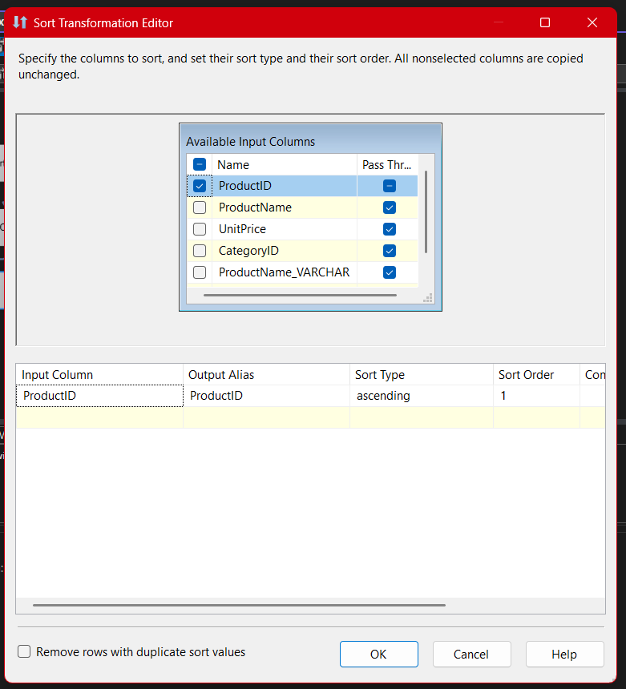

---

## 4. Comparación de Datos (Merge Join / Left Outer Join)

Mediante el **Merge Join**, se comparan los productos extraídos del origen con los ya existentes en Stage, utilizando un **Left Outer Join**. Esto permite identificar qué registros son nuevos (existen en el origen pero no en Stage).

- **Claves para unir:** Se utiliza la clave primaria (`SupplierID`) y, si es necesario, columnas de control adicionales.
- **Errores comunes:** No mapear correctamente las columnas de unión, o tener diferencias en la capitalización/nombres.

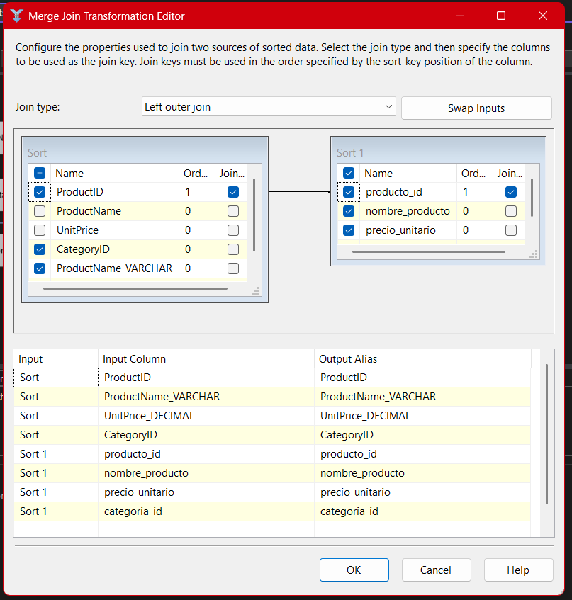

---

## 5. Filtrado de Nuevos productos (Conditional Split)

El **Conditional Split** filtra aquellos registros que **no existen en Stage**, es decir, donde la clave en Stage es `NULL`. De este modo, se evitan duplicados y sólo se insertan productos realmente nuevos.

- **Condición ejemplo:** `ISNULL(producto_id)`
- **Importancia:** Así aseguramos que la Stage sólo crece con datos nuevos, manteniendo la integridad y evitando redundancia.


---

## 6. Carga de Datos en Stage (OLE DB Destination)

Finalmente, los productos filtrados como nuevos se insertan en la tabla `producto` de Stage_Northwind mediante un **OLE DB Destination**.

- **Mapeo de columnas:** Es clave validar que cada campo del flujo corresponde exactamente al campo en la tabla de destino.
- **Validación previa:** Se recomienda hacer pruebas con el Data Viewer para verificar que sólo llegan los registros esperados.


---

## 7. Resumen Visual del Flujo Completo

El **Data Flow** del paquete puede observarse claramente en SSIS, mostrando cada etapa desde la extracción hasta la carga:

**Imagen sugerida:**


---

## Buenas Prácticas y Observaciones

- **Gestión de errores:** Configura las salidas de error en Data Conversion y Merge Join para detectar filas con problemas y analizar la causa.
- **Documentación en SSIS:** Agrega descripciones y notas en cada componente, especialmente en los splits y joins.
- **Plantilla reutilizable:** El flujo y lógica de este paquete son una plantilla perfecta para otros flujos de Stage con estructura similar (categorías, productos, clientes, etc.).
- **Optimización:** Para grandes volúmenes de productos, considera particionar o aplicar cargas en bloques.

---

## Consideraciones Didácticas y Experiencia de Aprendizaje

- **Importancia de conversiones:** El proceso intencional de trabajar con tipos incompatibles refuerza la planeación previa del modelo de datos.
- **SQL personalizado:** Permite extraer datos limpios y filtrados, agilizando el flujo.
- **Uso de joins:** Dominar left/right/inner joins es vital para manejar comparaciones avanzadas de datos.
- **Conditional Split:** Filtrar por existencia de datos previos es la clave para cargas incrementales reales en ETL profesional.

---

## **Resumen Técnico**

El paquete **05-Stage-producto.dtsx** es representativo de los flujos ETL modernos, enfocándose en la limpieza, integración y actualización incremental de datos. Aplicando estas técnicas, aseguramos que la tabla Stage de productos siempre contenga información precisa y útil para análisis posteriores y toma de decisiones empresariales.

---

# **Documentación del Proceso ETL para la Tabla de Proveedores (Package 06-Stage-Proveedor)**

## **Descripción general**

El paquete **06-Stage-Proveedor.dtsx** es el encargado de garantizar la integración incremental, la calidad y la estandarización de los datos de proveedores desde Northwind hacia el entorno de staging. Su arquitectura está diseñada para asegurar idempotencia, escalabilidad y trazabilidad, permitiendo una carga robusta, libre de duplicados y alineada a las mejores prácticas de modelado dimensional.

- **Carga incremental:** Solo se insertan nuevos proveedores, preservando la integridad y evitando sobreescrituras.
- **Normalización:** Todos los campos relevantes se estandarizan en formato, longitud y codificación.
- **Escalabilidad:** Adaptable para agregar nuevos atributos y validaciones.
- **Trazabilidad:** Permite auditoría de cambios y troubleshooting eficiente gracias a su estructura modular y pasos documentados.

---

## **Arquitectura General del Paquete**

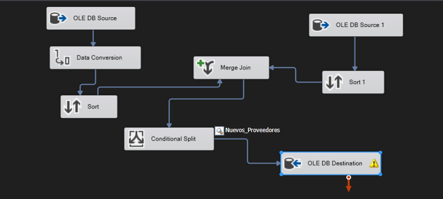

La correcta gestión ETL de proveedores es crítica para mantener la integridad referencial y la calidad analítica del datamart.
El diseño incremental —basado en comparación de orígenes y staging, con detección y carga de solo registros nuevos— es fundamental en entornos donde los proveedores pueden cambiar, actualizarse o ser agregados frecuentemente, y donde la robustez frente a duplicados es esencial para análisis posteriores y cumplimiento de normativas de calidad de datos.

---

## **1. OLE DB Source — Extracción de Proveedores Northwind**

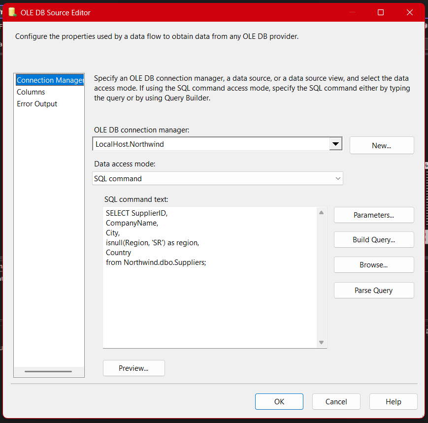

- **Conexión:** `LocalHost.Northwind`
- **Consulta SQL:**

  ```sql
  SELECT SupplierID,
         CompanyName,
         City,
         ISNULL(Region, 'SR') as region,
         Country
  FROM Northwind.dbo.Suppliers;
  ```

- **Propósito estratégico:**
  Se extraen todos los proveedores actuales, garantizando que ningún campo relevante (como `region`) quede nulo, lo que protege la integridad y previene rechazos o inconsistencias aguas abajo.

> [!NOTE]
> La normalización inmediata (relleno de nulos con ‘SR’) reduce la necesidad de validaciones posteriores y acelera la integración de datos en sistemas productivos.

---

## **2. OLE DB Source 1 — Extracción de Proveedores Stage**

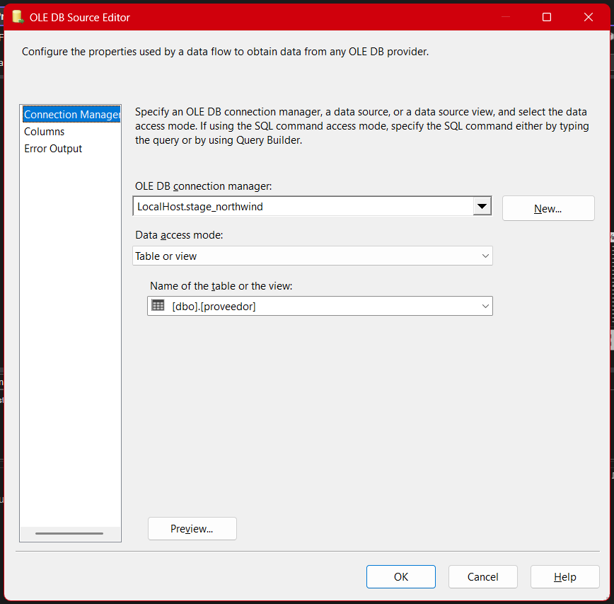

- **Conexión:** `LocalHost.stage_northwind`
- **Tabla:** `[dbo].[proveedor]`
- **Propósito:**
  Permite comparar el universo actual de proveedores ya cargados en staging para asegurar cargas estrictamente incrementales (evitando duplicados).

---

## **3. Data Conversion — Normalización de Tipos de Dato**

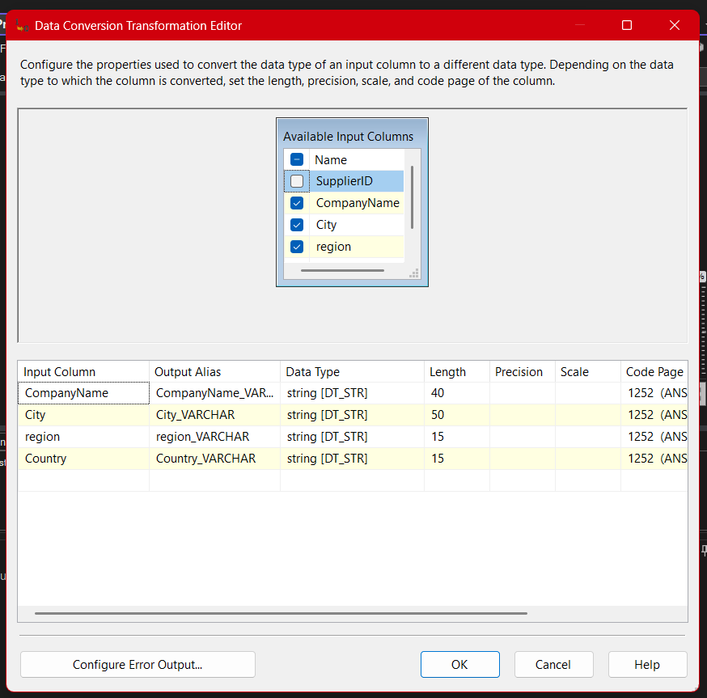

- **Propósito técnico:**
  Convierte los campos extraídos a tipos y longitudes compatibles con la tabla de staging, previniendo errores de formato, encoding o truncamiento.
- **Campos clave:**

  - `CompanyName` → `CompanyName_VARCHAR` (`string[DT_STR]`, 40)
  - `City` → `City_VARCHAR` (`string[DT_STR]`, 50)
  - `region` → `region_VARCHAR` (`string[DT_STR]`, 15)
  - `Country` → `Country_VARCHAR` (`string[DT_STR]`, 15)

- **Riesgo mitigado:**
  Las diferencias en longitud/codificación entre origen y destino son causa común de rechazos y errores silenciosos en cargas masivas. Normalizar desde el origen asegura robustez.

---

## **4. Sort — Ordenamiento para el Merge**

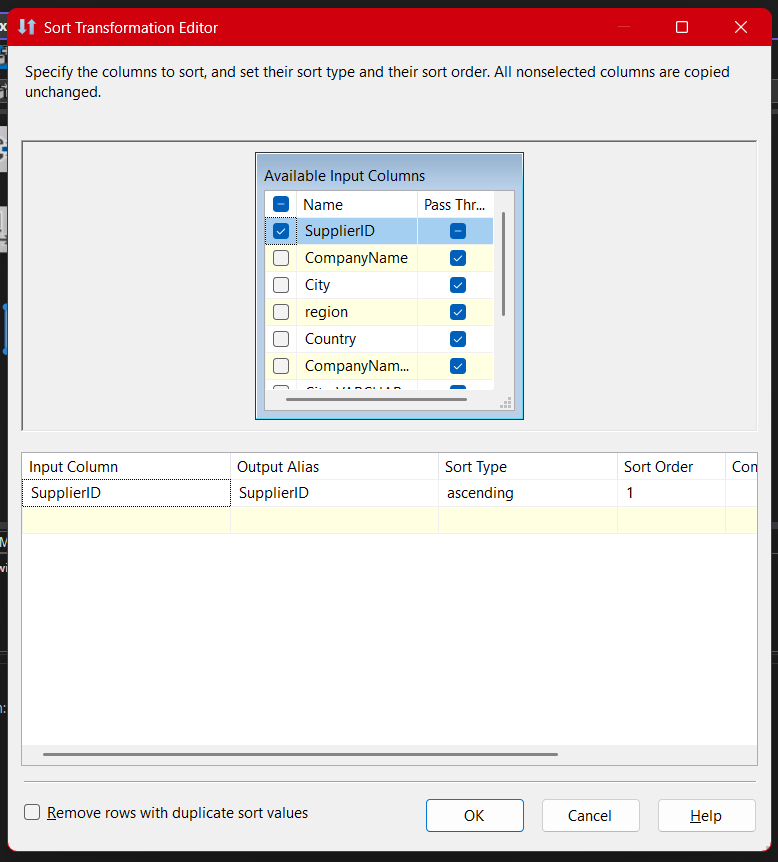

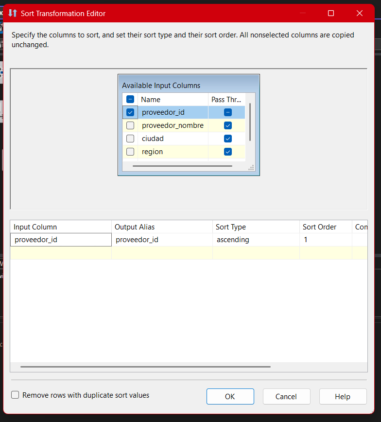

- **Sort (Northwind):** Ordena por `SupplierID`.
- **Sort 1 (Stage):** Ordena por `proveedor_id`.
- **Justificación:**
  El **Merge Join** en SSIS requiere conjuntos ordenados por la clave de unión para garantizar comparaciones válidas y reproducibles.
- **Recomendación avanzada:**
  Para grandes volúmenes, considera ordenar desde SQL para optimizar rendimiento y memoria.

---

## **5. Merge Join — Detección de Registros Nuevos**

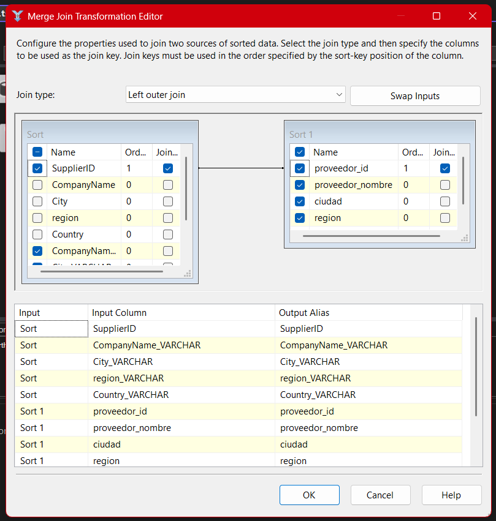

- **Tipo:** Left Outer Join (de Northwind a Stage)
- **Claves de unión:** `SupplierID` ↔ `proveedor_id`
- **Propósito clave:**
  Detectar registros presentes en Northwind pero ausentes en staging, permitiendo cargas realmente incrementales.
- **Valor agregado:**
  La idempotencia de este flujo garantiza que la integración pueda ejecutarse múltiples veces sin crear duplicados ni perder trazabilidad.

---

## **6. Conditional Split — Filtrado de Nuevos Proveedores**

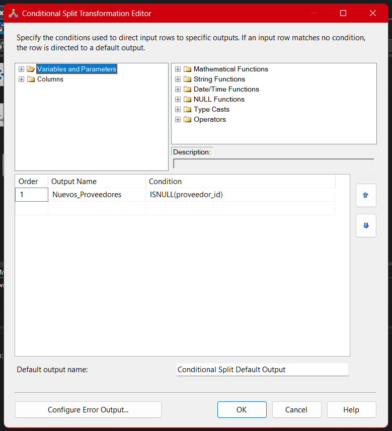

- **Condición:**

  ```sql
  ISNULL(proveedor_id)
  ```

- **Salida:** `Nuevos_Proveedores`

* **Propósito:**
  Solo se seleccionan para carga aquellos proveedores que no existen aún en la tabla de staging (detectados por la ausencia de `proveedor_id` tras el join).

---

## **7. OLE DB Destination — Carga de Nuevos Proveedores**

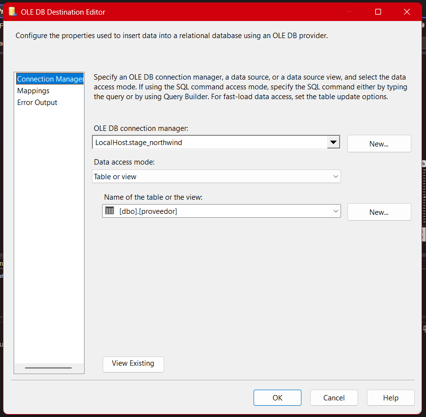

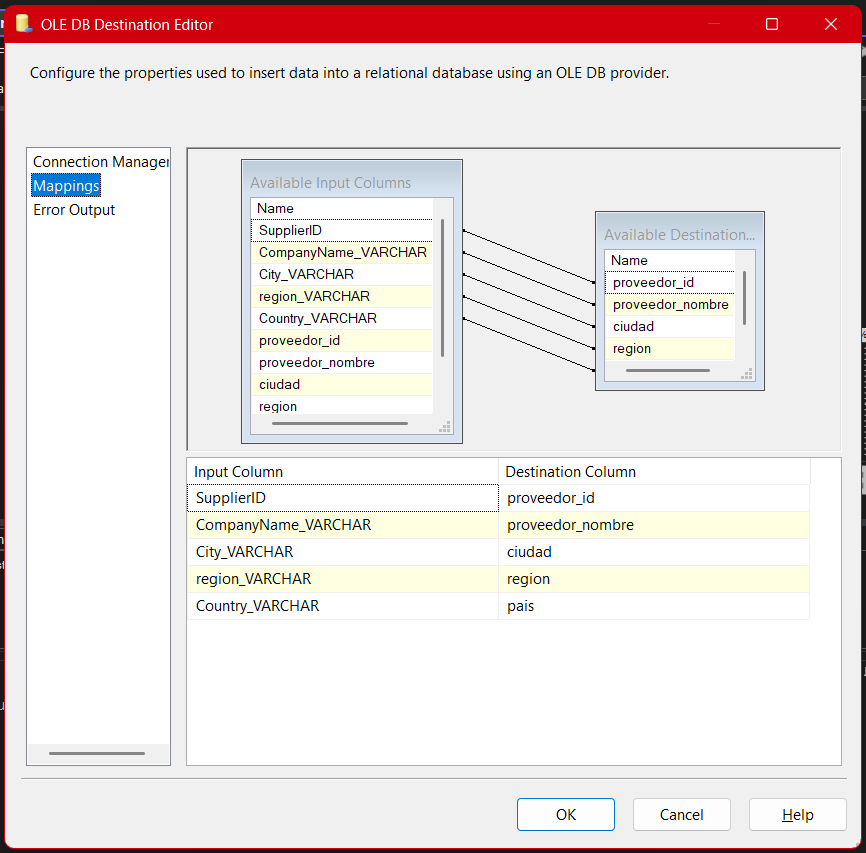

- **Conexión:** `LocalHost.stage_northwind`
- **Tabla de destino:** `[dbo].[proveedor]`
- **Mapeo de columnas:**

  - `SupplierID` → `proveedor_id`
  - `CompanyName_VARCHAR` → `proveedor_nombre`
  - `City_VARCHAR` → `ciudad`
  - `region_VARCHAR` → `region`
  - `Country_VARCHAR` → `pais`

- **Propósito:** Inserta únicamente los proveedores detectados como nuevos en la tabla de staging, evitando duplicados.

---

## **8. Buenas Prácticas, Riesgos y Escenarios de Mejora**

### Buenas Prácticas:

- **Carga estrictamente incremental:** Solo se insertan proveedores nuevos.
- **Normalización inmediata:** Evita errores por nulos o diferencias de formato.
- **Documentación visual y técnica:** Facilita el mantenimiento y auditoría.

### Riesgos y cómo mitigarlos:

- **Cambios de estructura:** Si el modelo de proveedor cambia en origen o destino, actualiza de inmediato las conversiones y mapeos para evitar rechazos silenciosos.
- **Performance:** Ordena en SQL para grandes volúmenes y monitorea la carga para prevenir cuellos de botella.
- **Errores de mapeo:** Realiza pruebas unitarias de inserción y valida la unicidad de la clave primaria.

## **Resumen Técnico Final**

El proceso ETL implementado en el paquete **06-Stage-Proveedor** asegura la integración incremental y la calidad de los datos de proveedores, alineando el entorno de staging con el origen transaccional Northwind bajo criterios de eficiencia, idempotencia y trazabilidad.
Mediante la comparación ordenada de registros, la normalización temprana de datos y la carga exclusiva de proveedores nuevos, el flujo minimiza riesgos de duplicidad y errores de formato, a la vez que prepara la infraestructura para una futura evolución del modelo (como el manejo de actualizaciones, bajas o metadata avanzada).

# **Documentación Detallada del Proceso ETL para la Tabla de Dimensión Tiempo (Package 07 - Stage_Tiempo)**

## **Descripción general**

El paquete **07-Stage-Tiempo.dtsx** implementa el flujo ETL para la dimensión temporal, uno de los ejes transversales de todo análisis de datos profesional. La existencia de una tabla de tiempo bien poblada y estructurada permite análisis comparativos, generación de tendencias, periodización flexible y la correcta integración de toda la información transaccional de Northwind, garantizando escalabilidad y profundidad en el Business Intelligence.

Este paquete asegura la actualización incremental de la dimensión tiempo en el entorno de **Stage**, evitando duplicados, permitiendo integraciones futuras, y preparando el terreno para una analítica temporal sólida.

---

## Arquitectura General del Paquete (SSIS)

El flujo sigue la metodología estándar de integración para dimensiones tipo 0 (estáticas e incrementales).
Los pasos clave son:

1. **Extracción de fechas de las órdenes (Northwind)**
2. **Desglose de atributos temporales relevantes**
3. **Obtención del catálogo actual de fechas en Stage**
4. **Ordenamiento para operaciones de comparación**
5. **Comparación incremental (Merge Join)**
6. **Filtrado de fechas nuevas (Conditional Split)**
7. **Carga incremental a la dimensión tiempo en Stage**

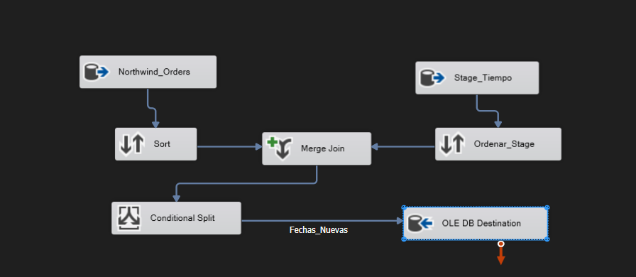

---

## 1. Extracción y Desglose de Fechas Únicas (OLE DB Source Northwind_Orders)

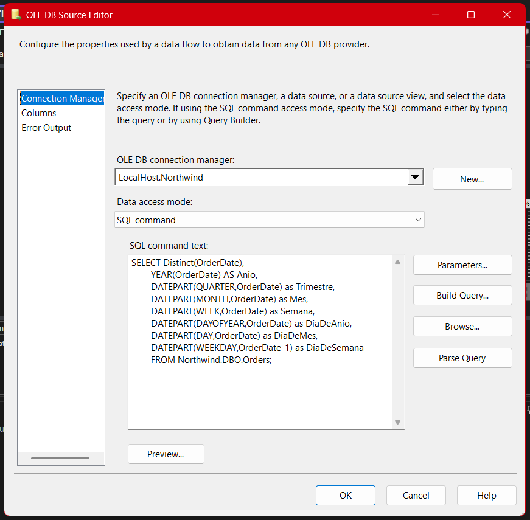

- **Consulta SQL utilizada:**

  ```sql
  SELECT DISTINCT(OrderDate) AS Fecha,
      YEAR(OrderDate) AS Anio,
      DATEPART(QUARTER, OrderDate) AS Trimestre,
      DATEPART(MONTH, OrderDate) AS Mes,
      DATEPART(WEEK, OrderDate) AS Semana,
      DATEPART(DAYOFYEAR, OrderDate) AS DiaDeAnio,
      DATEPART(DAY, OrderDate) AS DiaDeMes,
      DATEPART(WEEKDAY, OrderDate) - 1 AS DiaDeSemana
  FROM Northwind.DBO.Orders;
  ```

- **Propósito:**

  - Extraer **todas las fechas de órdenes** de manera única (DISTINCT), desglosando cada fecha en sus atributos temporales clásicos.
  - Permite crear una dimensión tiempo granular, capaz de soportar análisis por año, trimestre, mes, semana, día, y día de la semana.

- **Valor empresarial:**

  - Sin una dimensión tiempo robusta, los informes pierden capacidad de segmentación temporal y se limita la comparabilidad histórica.

---

## 2. Consulta de Fechas Existentes en Stage (OLE DB Source Stage_Tiempo)

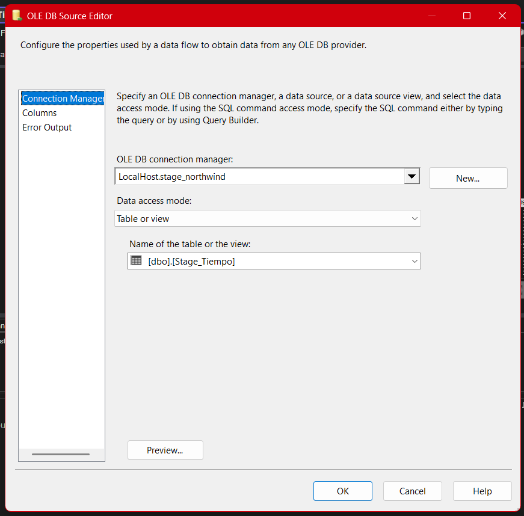

- **Propósito:**

  - Obtener todas las fechas ya presentes en la dimensión tiempo de Stage, para evitar duplicados y garantizar cargas incrementales idempotentes.
  - Facilita auditoría y control de calidad.

---

## 3. Ordenamiento de Fechas (Sort)

- **Ambos datasets (Northwind y Stage) deben ser ordenados por la clave de comparación (fecha)**.
- **Importancia:**

  - El componente `Merge Join` requiere que ambas fuentes estén perfectamente ordenadas para comparar correctamente los registros.
  - Minimiza riesgos de errores silenciosos en la carga.

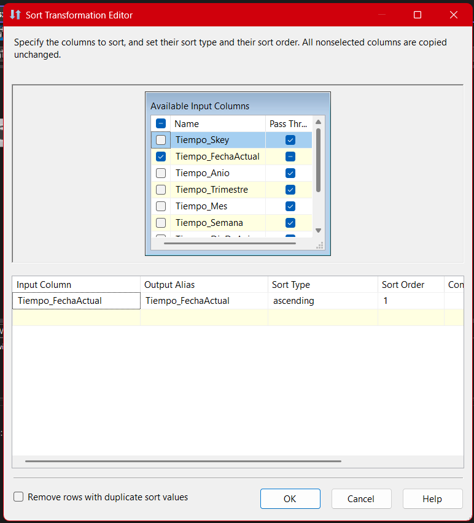

---

## 4. Comparación de Fechas - Merge Join

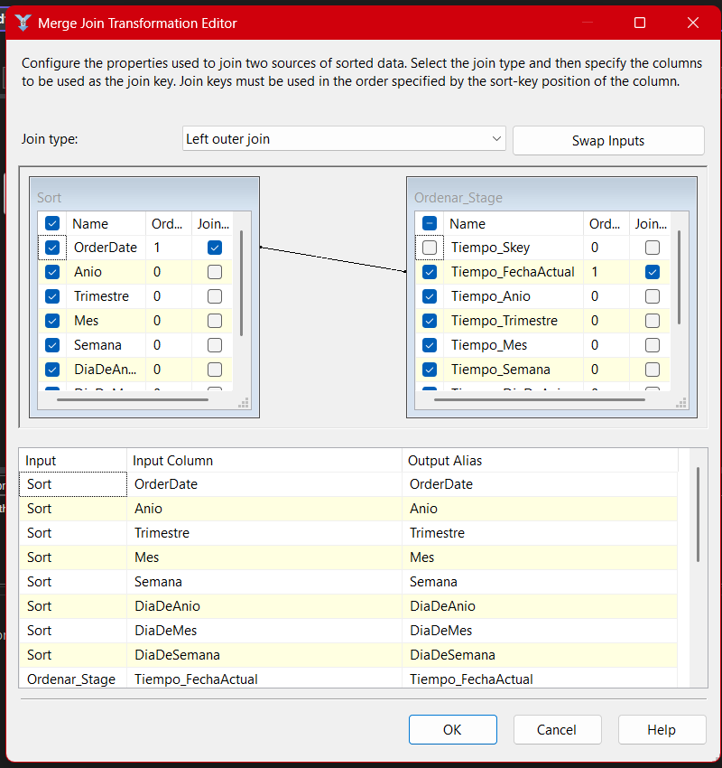

- **Tipo de unión:** Left Outer Join (todas las fechas de Northwind y las correspondientes de Stage si existen).

- **Claves de comparación:** Fecha (OrderDate) ↔ Tiempo_FechaActual.

- **Propósito:**

  - Identificar fechas presentes en Northwind pero no en Stage.
  - Permitir la actualización incremental de la dimensión.

- **Errores comunes:**

  - No alinear el tipo de datos o formato de fecha causa que el join falle silenciosamente.
  - Olvidar el orden previo impide el correcto funcionamiento del Merge Join.

---

## 5. Filtrado de Fechas Nuevas - Conditional Split

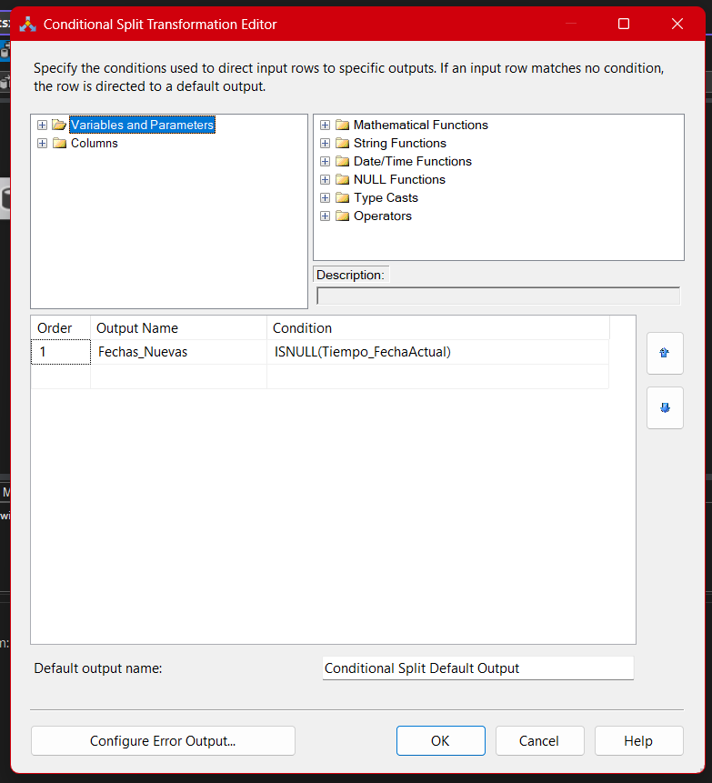

- **Condición de filtrado:**

  ```
  ISNULL(Tiempo_FechaActual)
  ```

  Solo las fechas no presentes en Stage avanzan en el flujo.

- **Justificación profesional:**

  - Evita cargas duplicadas, asegura integridad, mantiene la dimensión limpia y actualizada.
  - Permite que el proceso sea ejecutado repetidamente sin riesgo de sobrescritura o inconsistencias.

---

## 6. Carga Incremental a la Dimensión Tiempo - OLE DB Destination

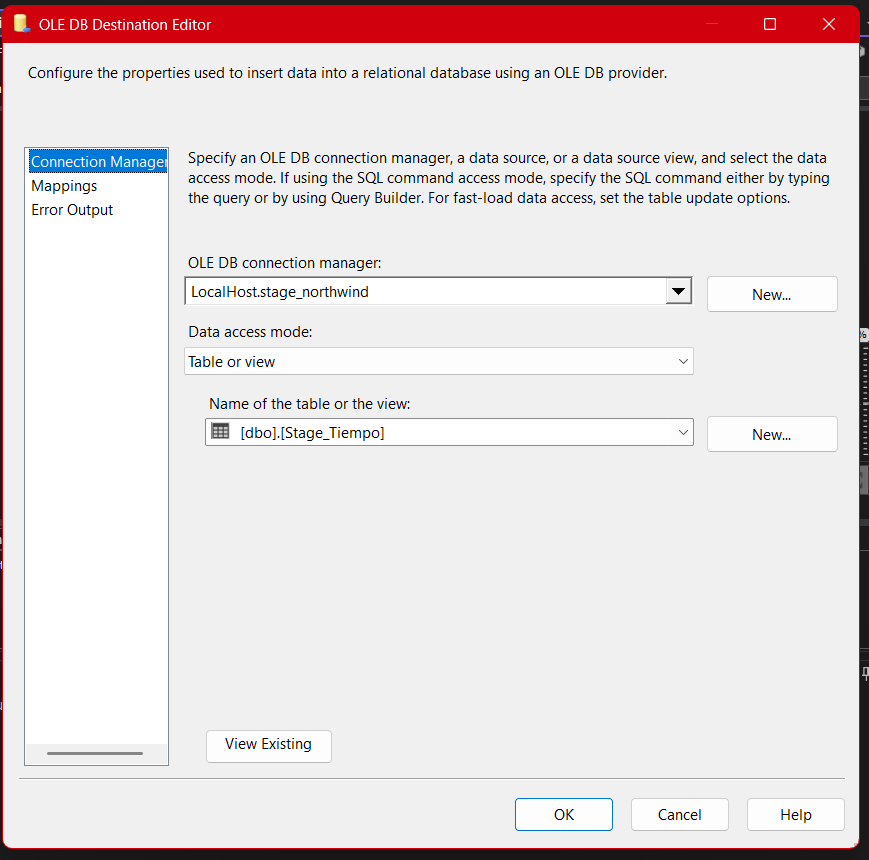
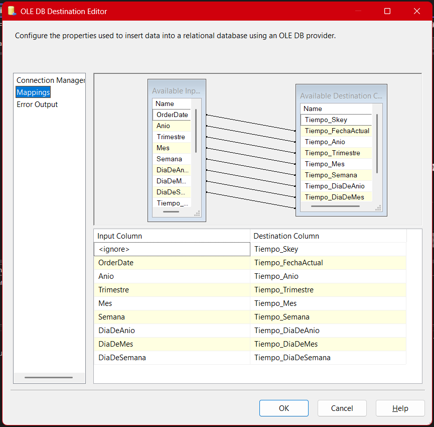

- **Propósito:**

  - Insertar solo fechas nuevas en la tabla `[Stage_Tiempo]`.
  - Mantener la integridad y evolución cronológica de la dimensión.

- **Buenas prácticas:**

  - Valida el mapeo de cada columna (FechaActual, Anio, Trimestre, Mes, Semana, Día del Año, Día del Mes, Día de la Semana).
  - Configura el destino para manejo eficiente de errores y bulk insert si el volumen lo requiere.

---

## 7. Valor Añadido y Buenas Prácticas

- **Idempotencia y control:**

  - Este patrón de comparación y filtrado asegura que nunca existan duplicados, independientemente de cuántas veces se ejecute el ETL.

- **Flexibilidad y escalabilidad:**

  - El diseño permite añadir nuevos atributos temporales en el futuro (semestre, fin de semana, festivo, etc.) sin rediseñar el flujo.

- **Valor empresarial:**

  - Habilita análisis como ventas por mes, por trimestre, estacionalidad, días laborables vs. fin de semana, tendencias a lo largo del año, y más.

- **Recomendación:**

  - Documenta cada cambio o ampliación futura (ejemplo: nuevos cálculos de atributos temporales), para mantener el flujo transparente y auditable.

---

## 8. Errores frecuentes y troubleshooting

- **Error:** Fechas no insertadas aunque sean nuevas.

  - _Solución:_ Revisa tipos de dato, formato y timezone en ambos orígenes.

- **Error:** Merge Join muestra filas inesperadas.

  - _Solución:_ Verifica el ordenamiento previo y que las claves estén alineadas.

- **Error:** Columnas en destino desordenadas o sin mapear.

  - _Solución:_ Revisa y valida el mapeo columna a columna antes de correr el ETL en producción.

---

## **Resumen Técnico**

El paquete **07-Stage-Tiempo** es la base de cualquier análisis temporal dentro del ecosistema Northwind y un estándar que puedes replicar para cualquier dimensión de tipo estático en futuros proyectos de analítica empresarial. Su diseño incremental, su foco en la calidad y su facilidad de extensión lo convierten en una pieza clave tanto para aprendizaje como para ambientes productivos.

---

# **Documentación del Proceso ETL para el Paquete Limpiar-Stage**

## Paquete: Limpiar Stage

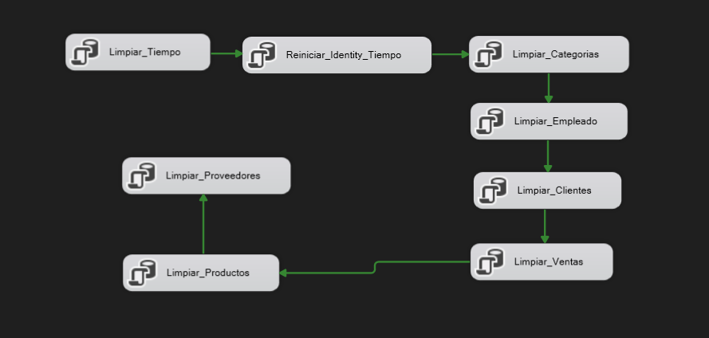

### 1. Propósito General del Paquete

El paquete **Limpiar Stage** tiene como función principal **eliminar todos los registros** existentes en las tablas de la base de datos _stage_, devolviéndolas a un estado vacío y reiniciando los identificadores automáticos (_identities_) en las tablas donde aplica. Este procedimiento es **crítico en arquitecturas ETL** porque asegura la **integridad, consistencia y repetibilidad** de los procesos de carga, permitiendo múltiples ejecuciones controladas y garantizando que los datos a analizar o transferir sean siempre el resultado de la última ejecución de carga.

---

### 2. Justificación y Contexto

**¿Por qué es necesario un paquete de limpieza como este?**

- **Ambientes de staging**: En ETL, la capa _stage_ es un área temporal donde los datos son depositados antes de ser transformados o cargados al destino final (Data Warehouse, Data Mart, etc). Si estos datos persisten entre ejecuciones, existe el riesgo de:

  - **Duplicidad de registros**
  - **Errores de integridad** (por referencias cruzadas)
  - **Resultados inconsistentes** al comparar ejecuciones

- **Automatización y pruebas**: El paquete permite que los procesos de carga sean **repetibles y testeables** desde cero, sin residuos de ejecuciones anteriores.

- **Control en pipelines orquestados**: Al ejecutar el proceso de limpieza justo antes de la carga principal (por ejemplo, desde el _paquete maestro "Carga Master"_), se garantiza un **ciclo de carga limpio** y auditado, facilitando la trazabilidad y recuperación ante errores.

---

### 3. Arquitectura Visual del Paquete


---

### 4. Descripción Detallada de Componentes

| Tarea (Task)              | Tipo             | Propósito                                                                       | Comando SQL o Acción Principal                 |
| ------------------------- | ---------------- | ------------------------------------------------------------------------------- | ---------------------------------------------- |
| Limpiar_Tiempo            | Execute SQL Task | Elimina todos los registros de la tabla Stage_Tiempo                            | `TRUNCATE TABLE Stage_Tiempo;`                 |
| Reiniciar_Identity_Tiempo | Execute SQL Task | Reinicia el contador de identidad (ID autoincremental) en la tabla Stage_Tiempo | `DBCC CHECKIDENT ("Stage_Tiempo", RESEED, 0);` |
| Limpiar_Categorias        | Execute SQL Task | Elimina todos los registros de la tabla \[categorias]                           | `TRUNCATE TABLE [dbo].[categorias];`           |
| Limpiar_Empleado          | Execute SQL Task | Elimina todos los registros de la tabla \[empleado]                             | `TRUNCATE TABLE [dbo].[empleado];`             |
| Limpiar_Clientes          | Execute SQL Task | Elimina todos los registros de la tabla \[clientes]                             | `TRUNCATE TABLE [dbo].[clientes];`             |
| Limpiar_Ventas            | Execute SQL Task | Elimina todos los registros de la tabla \[ventas]                               | `TRUNCATE TABLE [dbo].[ventas];`               |
| Limpiar_Productos         | Execute SQL Task | Elimina todos los registros de la tabla \[producto]                             | `TRUNCATE TABLE [dbo].[producto];`             |
| Limpiar_Proveedores       | Execute SQL Task | Elimina todos los registros de la tabla \[proveedor]                            | `TRUNCATE TABLE [dbo].[proveedor];`            |

> [!NOTE]
>
> La secuencia y dependencias de ejecución garantizan que primero se limpian tablas sin dependencias y se reinician los IDs antes de limpiar aquellas con referencias.

---

### 5. Secuencia de Ejecución

- El flujo del paquete sigue una lógica **jerárquica** y de **dependencias**.
- Comienza limpiando la tabla de tiempo, resetea su identity, y luego limpia las tablas dependientes (_categorías_, _empleado_, _clientes_, _ventas_, _productos_, _proveedores_).
- Esto evita conflictos por claves foráneas en tablas relacionadas.

---

### 6. Razones de Diseño y Mejores Prácticas

- **Uso de TRUNCATE**: El comando `TRUNCATE` es preferible sobre `DELETE` para limpieza total, ya que es más eficiente y reinicia los _identities_ automáticamente (salvo excepciones como la tabla tiempo donde se hace explícito).
- **Reset de identidad**: Es fundamental para evitar que los identificadores crezcan innecesariamente con pruebas o cargas repetidas.
- **No deja residuos**: La limpieza completa elimina cualquier residuo de pruebas, datos corruptos o inconsistentes.

---

### 7. Escenarios de Uso

- **Antes de ejecutar una nueva carga completa (full load)** para garantizar que solo se tengan datos actualizados.
- **Durante pruebas de desarrollo**, para verificar la funcionalidad repetida del ETL.
- **Como paso previo en pipelines orquestados** para asegurar consistencia en entornos de QA o producción.

---

### 8. Riesgos y Consideraciones

- **Irreversibilidad:** El proceso borra todos los datos de las tablas _stage_. Asegúrate de tener respaldos o mecanismos de recuperación si fuera necesario.
- **Dependencias:** Si existen restricciones de integridad referencial, el orden de limpieza debe respetar la jerarquía de dependencias entre tablas.
- **Bloqueos:** Si hay cargas concurrentes, este proceso puede provocar bloqueos de tabla mientras se ejecuta.

---

### 9. Relación con Otros Paquetes

- Este paquete **no transfiere datos**, solo limpia y reinicia tablas de _stage_.
- Es **complementario al "Carga Master"** que orquesta la ejecución de todos los paquetes de carga, pero lo hace sobre una base limpia.

---

### 10. Referencias Visuales y de Código

- **Diagrama del paquete:**
  
- **Evidencia visual de configuración de cada tarea:**

  - Limpiar_Tiempo: 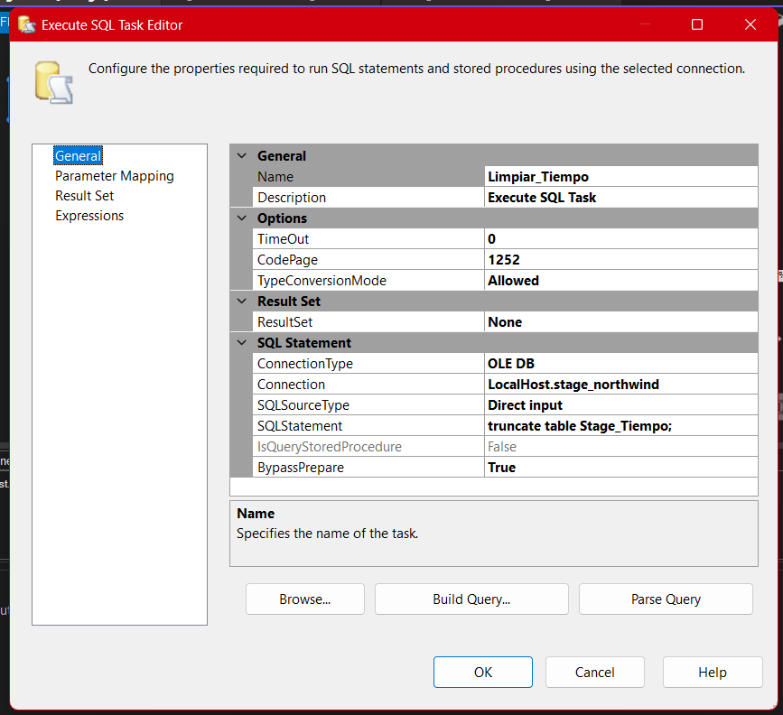

  - Reiniciar_Identity_Tiempo: 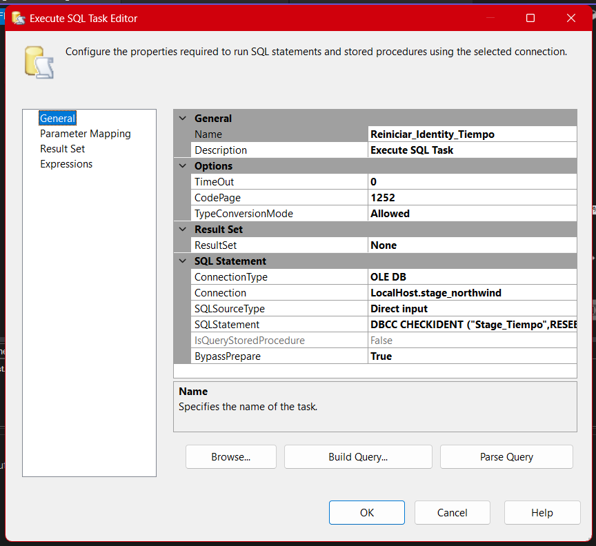

  - Limpiar_Categorias: 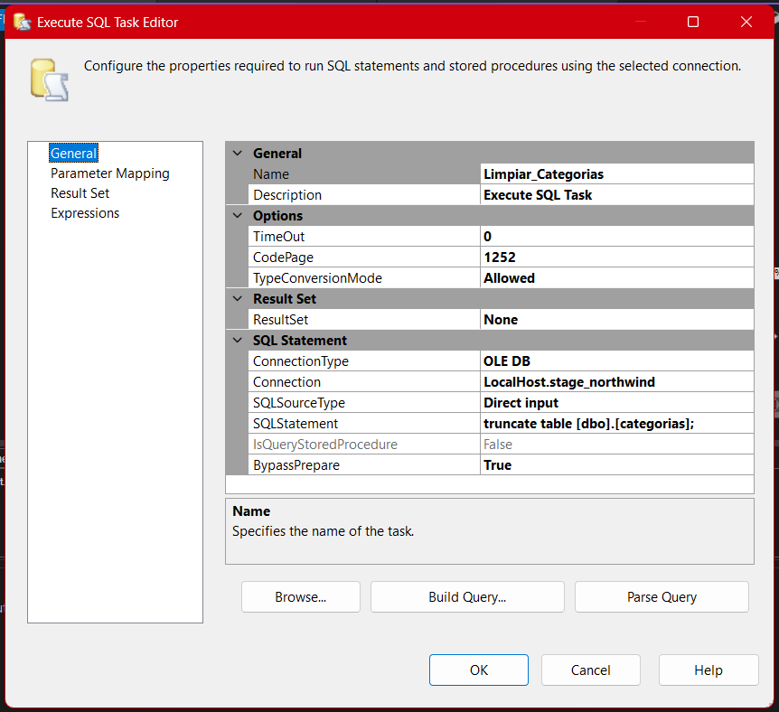

  - Limpiar_Empleado: 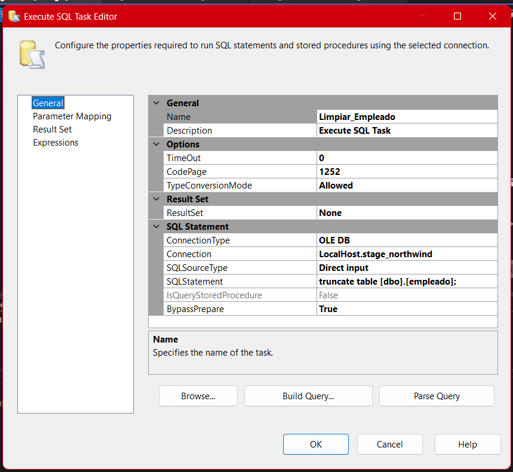

  - Limpiar_Clientes: 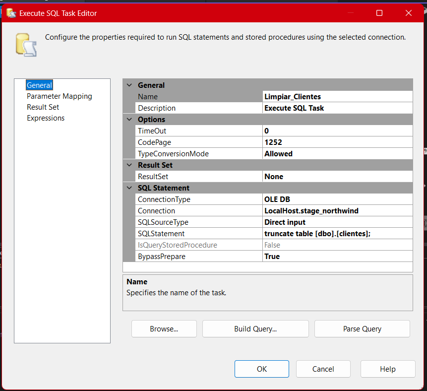

  - Limpiar_Ventas: 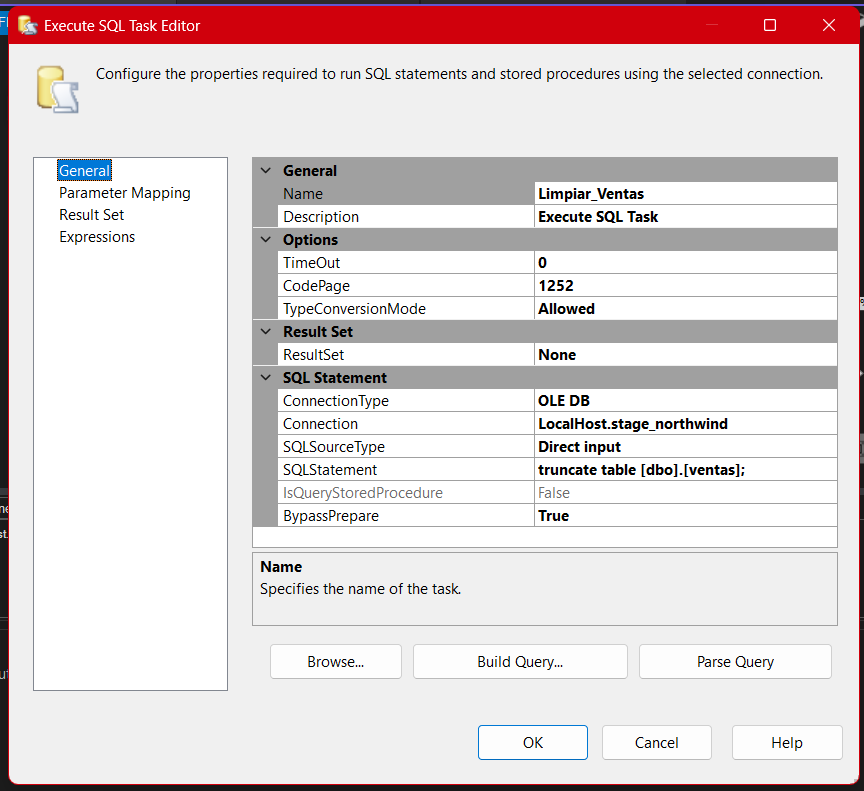

  - Limpiar_Productos: 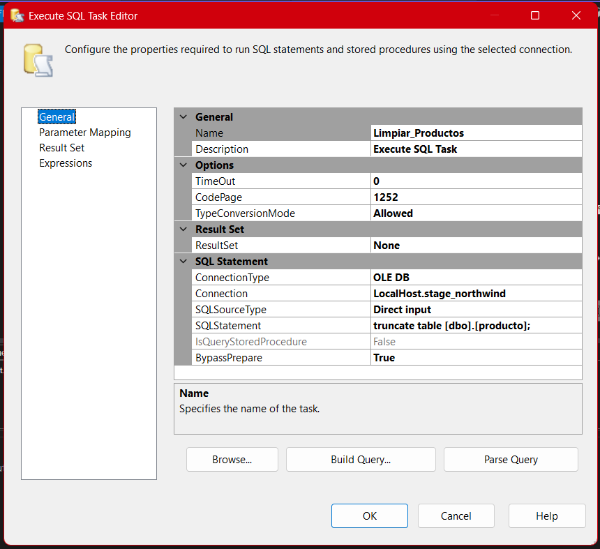

  - Limpiar_Proveedores: 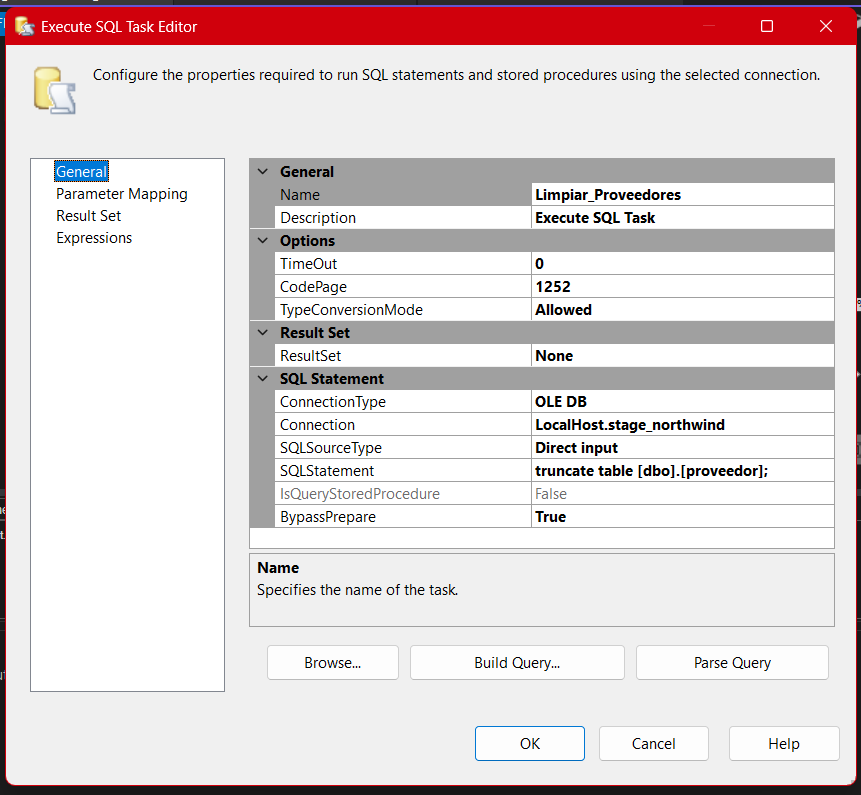

---

## **Resumen Técnico**

El paquete **Limpiar Stage** es un componente **fundamental en cualquier arquitectura ETL profesional** orientada a mantener la calidad y confiabilidad de los datos durante ciclos repetidos de carga. Su correcta implementación permite que el entorno de staging cumpla con su propósito: ser **transitorio, confiable y siempre preparado** para recibir datos frescos, eliminando riesgos de corrupción, duplicidad o contaminación de información.

---

# **Documentación del Proceso ETL – Paquete Carga-Master**

## Descripción General

El paquete **Carga-Master** funciona como el cerebro operativo de la solución `Stage_Northwind`. Básicamente, es quien coordina —de forma ordenada, automática y con muy poca tolerancia a errores— la ejecución secuencial de todos los paquetes de carga hacia las tablas de staging (`stage`) del modelo Northwind. Su propósito es simple, pero vital: asegurar que los procesos de carga sigan el orden lógico que exige la integridad de los datos, considerando las dependencias entre empleados, categorías, clientes, ventas, productos, proveedores y tiempo.

Sin esta orquestación centralizada, el riesgo de ejecutar paquetes en el orden incorrecto (o de manera manual y fragmentada, como suele ocurrir en ambientes menos disciplinados) se multiplica, y con ello las posibilidades de inconsistencias, duplicidades o errores referenciales. La automatización aquí no es solo un “nice to have”, sino un escudo real contra muchos problemas operativos que en la práctica terminan por quitarte más tiempo del que imaginas.

Aunque sigue los principios clásicos del ETL (Extract, Transform, Load), aquí la clave está en la **coordinación** más que en la transformación. Más de una vez, tras algún despliegue, se detectaban fallos en la secuencia y había que retroceder —una situación poco agradable cuando tienes deadlines ajustados.

Este diseño responde, sobre todo, a la necesidad de contar con cargas repetibles, fiables y fáciles de auditar, ideales tanto para pruebas integrales como para escenarios de recarga masiva o migración.

---

### **Problema Central que Resuelve**

A lo largo de la implementación, el reto más frecuente fue evitar el famoso “efecto dominó” cuando una entidad crítica no estaba disponible a tiempo. Por ejemplo:

1. **Las ventas fallarían sistemáticamente** si intentaban referenciar clientes o empleados que aún no habían sido cargados, generando registros huérfanos difíciles de rastrear y que afectan la confiabilidad de los reportes comerciales.
2. **Los productos quedarían incompletos** si sus categorías asociadas no existieran previamente, lo que rompe la jerarquía de inventarios y complica la gestión.
3. **Los reportes financieros mostrarían inconsistencias** irreparables por referencias rotas entre transacciones y dimensiones de soporte.

Dicho en palabras simples: sin una orquestación que asegure la secuencia adecuada, el staging es una receta para el caos.

---

## Estructura del Paquete

### Diagrama de Flujo de Control

El diseño visual del flujo de control, además de ser casi “lineal”, incorpora condiciones que validan la correcta preparación de cada entidad antes de continuar:

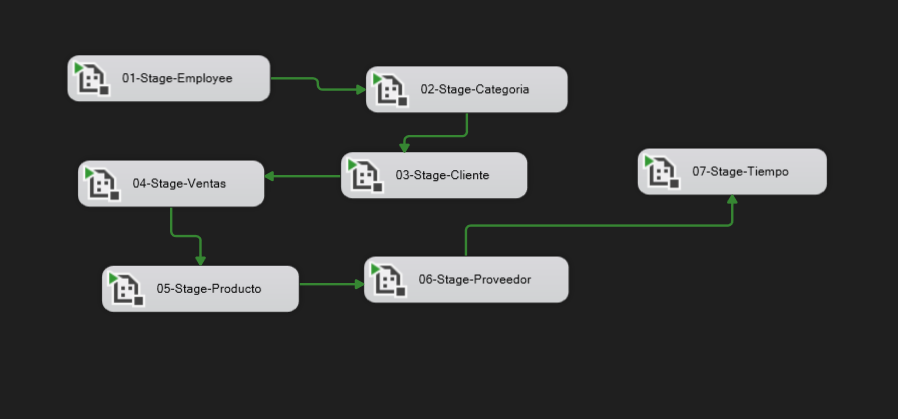

### Flujo Secuencial Detallado

El flujo de trabajo está compuesto por tareas del tipo **Execute Package Task**, cada una responsable de ejecutar un paquete individual en el orden que dictan las dependencias. El razonamiento detrás de la secuencia es producto de pruebas, errores y lecciones aprendidas:

1. **01-Stage-Employee:** Siempre primero. Los empleados son referencia clave en casi todo el modelo —ventas, operaciones, hasta bitácoras.
2. **02-Stage-Categoria:** Fundamental para la correcta clasificación de productos; si falla aquí, los productos quedan “colgados”.
3. **03-Stage-Cliente:** Los clientes deben estar antes que cualquier transacción. Sin clientes, simplemente no hay ventas que tengan sentido.
4. **04-Stage-Ventas:** Depende directamente de empleados y clientes ya cargados. Si detecta alguna inconsistencia, el proceso aborta, y sí, esto ha pasado.
5. **05-Stage-Producto:** Solo se carga después de categorías. Así se mantiene la estructura de inventarios alineada.
6. **06-Stage-Proveedor:** Aunque podría parecer menos crítico, complementa la información de productos y se programa tardío para evitar bloqueos.
7. **07-Stage-Tiempo:** Cierra la secuencia, generando la dimensión temporal según las ventas cargadas previamente. Es el broche final antes de considerar el staging como “listo”.

Este orden, validado empíricamente, **reduce a prácticamente cero** los errores de claves foráneas ausentes.
(Confieso que antes de afinar la secuencia, llegamos a perder varias horas en debugging por no respetar estas dependencias).

---

## Análisis Estratégico de Dependencias

No es un orden arbitrario ni “por costumbre”, sino producto de análisis, pruebas y —por qué no decirlo— algunos errores cometidos. Así se ve el mapa real de dependencias:

| Orden | Componente  | Dependencia Crítica            | Impacto de Fallo                   | Mecanismo de Contención           |
| ----- | ----------- | ------------------------------ | ---------------------------------- | --------------------------------- |
| 1     | Empleados   | Base para asignación ventas    | Transacciones sin responsable      | Rollback completo + notificación  |
| 2     | Categorías  | Precondición para productos    | Productos no clasificables         | Pausa carga productos             |
| 3     | Clientes    | Requisito transaccional        | Ventas con clientes inexistentes   | Aborto automático de ventas       |
| 4     | Ventas      | Consume empleados y clientes   | Datos financieros incompletos      | Reintentos programados (3 ciclos) |
| 5     | Productos   | Requiere categorías existentes | Inventario sin jerarquía           | Cuarentena datos inválidos        |
| 6     | Proveedores | Complemento de productos       | Información de cadena incompleta   | Carga diferida sin bloqueo        |
| 7     | Tiempo      | Necesita fechas de ventas      | Imposibilidad de análisis temporal | Generación automática de respaldo |

---

## Mecanismos Técnicos de Control

### Configuración de Ejecución en Cascada

Cada **Execute Package Task** se configura de modo que maximice la robustez y facilite el debugging, además de optimizar el rendimiento.
No tiene sentido complicarse con rutas absolutas, así que:

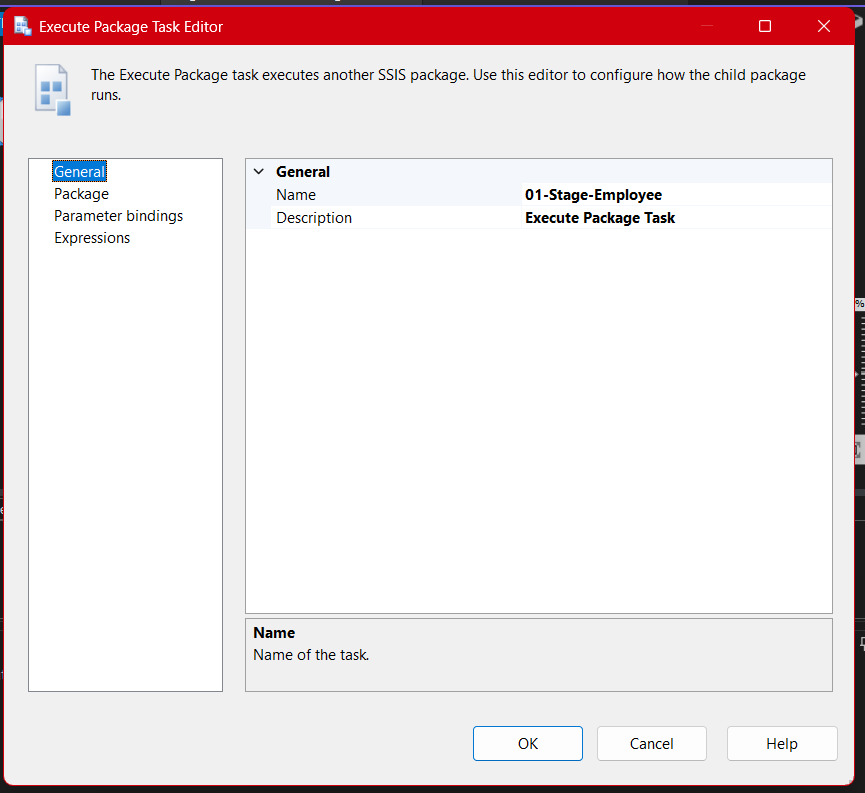

- **ReferenceType:** `Project Reference` — Portabilidad asegurada.
- **ExecuteOutOfProcess:** `False` — Aumenta la velocidad, ejecutando en memoria.
- **MaximumErrorCount:** `0` — Si algo falla, el proceso se detiene para evitar que se propague el error.

### Sistema de Monitorización Integrado

No todo lo que puede fallar, falla… pero es mejor estar preparados:

1. **Bitácora de Ejecución:** Cada paquete registra inicio, fin, duración y estado. La granularidad a nivel de milisegundos realmente ayuda al buscar cuellos de botella.
2. **Umbrales de Rendimiento:**

   - Si ventas supera los 8 minutos, dispara una alerta.
   - Si productos tarda 200% más de lo esperado, se activa el diagnóstico automático.

3. **Traza de Errores Jerarquizada:**
   Captura excepciones técnicas con suficiente contexto para resolver rápido. Aquí sí aprendimos a documentar el contexto de cada error para no perdernos en logs infinitos.

### Protocolo de Manejo de Errores

```plaintext
WHEN paquete_actual.falla:
   LOG error_detallado CON contexto_transaccional
   SEND alerta_tecnica TO equipo_soporte
   EXECUTE limpieza_estado_parcial
   ABORT proceso_global
   WAIT intervención_manual
```

---

## Componentes y Configuración

### 1. **Tareas Execute Package Task**

Cada instancia de “Execute Package Task” está configurada para asegurar la máxima coherencia operativa:

| Parámetro            | Valor        | Propósito Técnico                                  |
| -------------------- | ------------ | -------------------------------------------------- |
| DelayValidation      | True         | Previene errores por dependencias no inicializadas |
| DisableEventHandlers | False        | Permite manejo personalizado de eventos            |
| FailPackageOnFailure | True         | Parada inmediata ante fallos                       |
| IsolationLevel       | Serializable | Máxima consistencia transaccional                  |
| MaximumErrorCount    | 0            | Cero tolerancia a errores no controlados           |

- **ReferenceType:** `Project Reference` (centraliza el mantenimiento)
- **PackageNameFromProjectReference:** Nombre del paquete SSIS (ejemplo: `01-stage-employee.dtsx`)
- **ExecuteOutOfProcess:** `False` (se ejecuta en el mismo proceso para mayor eficiencia)

Ejemplo de configuración:


### 2. **Manejo de Errores y Registro**

- El **logging** es imprescindible. Es recomendable tener configurado el registro para detectar cualquier etapa problemática, facilitando la depuración y corrección.
- La integración con **Event Handlers** de SSIS permite notificaciones automáticas y rollback en caso de incidentes graves.

### Integración con Subsistema de Logging

Se utiliza:

1. **SSIS Log Provider for SQL Server:** Centraliza bitácoras en una tabla dedicada.
2. **Eventos Capturados:** OnError, OnWarning, OnTaskFailed, OnInformation.
3. **Campos Personalizados:** MachineName, UserName, TaskName, PackageID.
   (En lo personal, agregar un campo “Comentario” ayuda para rastrear pruebas especiales o cargas fuera de calendario).

---

## Justificación de la Estrategia de Orquestación

### ¿Por qué centralizar la carga con un paquete maestro?

- **Automatización real:** Permite disparar la carga con un solo comando o desde el SQL Agent/Azure Data Factory. Mucho más práctico.
- **Reducción de errores humanos:** Se elimina la incertidumbre y el “orden manual” (que ya nos jugó malas pasadas).
- **Mantenimiento y escalabilidad:** Modificar el orden o agregar nuevas entidades es cuestión de minutos.
- **Consistencia transaccional:** Aunque SSIS no soporta transacciones distribuidas puras, esta secuenciación minimiza riesgos de inconsistencia parcial.

### Integración con el Paquete Limpiar-Stage

Siempre —y aquí no hay debate— antes de correr **Carga-Master** conviene ejecutar **Limpiar-Stage** para vaciar las tablas de staging. Así evitas duplicados, datos residuales y otras sorpresas desagradables.
(A mí una vez me pasó que olvidé limpiar antes de una recarga masiva y terminé con cifras infladas en el reporte mensual).

---

## Integración con Limpieza de Stage

La dinámica entre limpieza y carga es la base para mantener la calidad:

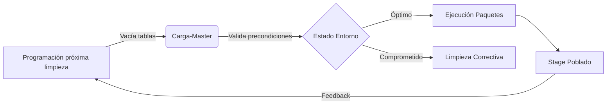
```mermaid
graph LR
    A[Limpieza-Stage] -->|Vacía tablas| B(Carga-Master)
    B -->|Valida precondiciones| C{Estado Entorno}
    C -->|Óptimo| D[Ejecución Paquetes]
    C -->|Comprometido| E[Limpieza Correctiva]
    D --> F[Stage Poblado]
    F -->|Feedback| A[Programación próxima limpieza]
```

**Ventaja real**: Se elimina el riesgo de “doble carga” que distorsionaba los análisis mensuales y, de paso, te permite saber que siempre partes de un entorno controlado.

---

## Buenas Prácticas Implementadas

- **Referencias de proyecto:** Nada de rutas absolutas que rompen la portabilidad.
- **Separación de responsabilidades:** Cada paquete se encarga de una sola cosa (Single Responsibility Principle, tal cual).
- **Nomenclatura estándar:** Nombres claros y consistentes para todos los paquetes y tareas.
- **Documentación visual:** Diagramas y capturas de configuración incluidos, porque una imagen vale mil palabras.
- **Preparado para CI/CD:** El flujo es apto para automatización y pruebas integrales.
- **Escalabilidad:** Agregar nuevas entidades o procesos es rápido y limpio.

---

## Escenarios Críticos de Fallo y Mitigación

| Escenario                    | Consecuencia                    | Mecanismo Defensa               |
| ---------------------------- | ------------------------------- | ------------------------------- |
| Caída de BD durante Ventas   | 2,000 registros inconsistentes  | Rollback transaccional + alerta |
| Paquete Productos corrupto   | Bloqueo en cascada              | Ejecución aislada en contenedor |
| Timeout en Tiempo            | Reportes históricos incompletos | Reintentos programados          |
| Error humano en programación | Fallo en la secuencia de carga  | Validaciones previas + dry run  |

---

## Próximos Pasos y Oportunidades de Mejora

| Mejora                     | Impacto Esperado                                |
| -------------------------- | ----------------------------------------------- |
| Paralelismo controlado     | Reduce hasta un 40% el tiempo de carga          |
| Validación previa de datos | Evita el 99% de rechazos por errores de calidad |
| Integración CI/CD completa | Permite despliegues automáticos nocturnos       |

---

## Capturas de Referencia

### Flujo General del Paquete Carga-Master


### Configuración de Ejecución de un Paquete Hijo


---

## **Resumen Técnico**

En resumen, el paquete **Carga-Master** es el corazón de la operación de staging para Northwind. No solo permite mantener sincronía e integridad, sino que agiliza las pruebas, migraciones y mantenimiento, facilitando la vida de todos los que interactúan con el Data Warehouse.

Cualquier sugerencia, comentario o ajuste será bien recibido. Al final del día, la documentación perfecta no existe: siempre hay algo que mejorar… y lo importante es que cualquiera que lea esto, pueda ejecutarlo sin tropezar con los mismos errores que nosotros enfrentamos la primera vez.

---

# **Documentación del Proceso ETL para el Paquete Datamart-Cliente**

## Propósito y Rol Estratégico

El **paquete "01-Datamart-Cliente"** es el primer componente de la arquitectura Datamart del proyecto Northwind ETL. Su función principal es transformar y cargar la información de clientes desde el área de staging hacia la dimensión cliente del datamart, bajo un modelo robusto y preparado para análisis avanzado.

Esto permite garantizar un entorno de **datos confiables y consistentes**, clave para la toma de decisiones empresariales, generación de reportes, segmentación, análisis de comportamiento de clientes y construcción de tableros ejecutivos. La dimensión de clientes es, junto con la de productos, una de las piedras angulares en cualquier proyecto de analítica de negocios.

---

## Visión General del Flujo ETL

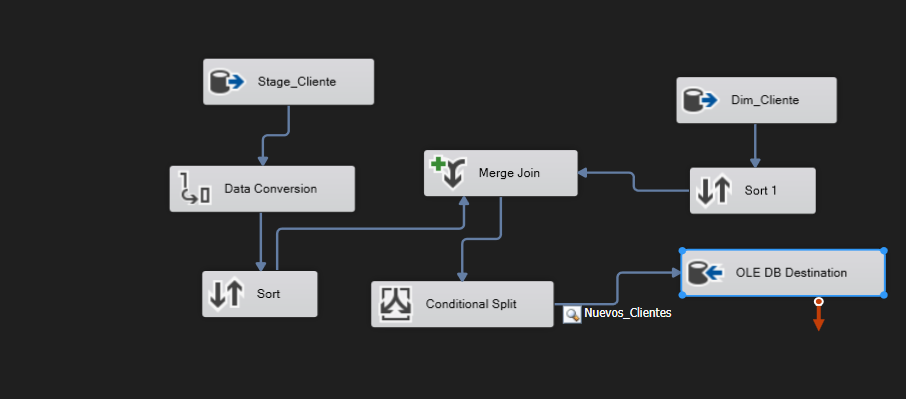

El flujo de este paquete sigue los principios **Extract-Transform-Load (ETL)** de manera orquestada y con controles de calidad de datos, distribuidos en varias etapas críticas:

1. **Extracción:** Lectura de datos “crudos” desde la zona de staging, asegurando disponibilidad y exactitud de la información base.
2. **Transformación:** Limpieza, tipificación y estandarización de atributos, garantizando calidad y alineación con el modelo de la dimensión destino.
3. **Enriquecimiento y Control de Incrementalidad:** Identificación de registros nuevos o modificados respecto a la tabla destino, usando lógica de joins y splits condicionales para eficiencia y precisión.
4. **Carga Controlada:** Inserción eficiente y segura en la dimensión cliente (`dim_cliente`), con mapeos explícitos y mecanismos para manejar errores y rechazos.

---

## 1. Extracción: Conexión y Consulta al Área de Staging

### Objetivo Técnico

Se utiliza una fuente OLE DB para conectar con la base de staging, específicamente sobre la tabla `stage_northwind.dbo.clientes`. En esta área, los datos ya han pasado por procesos previos de depuración y homogenización, pero **no necesariamente tienen la estructura ni los tipos de la dimensión analítica**.

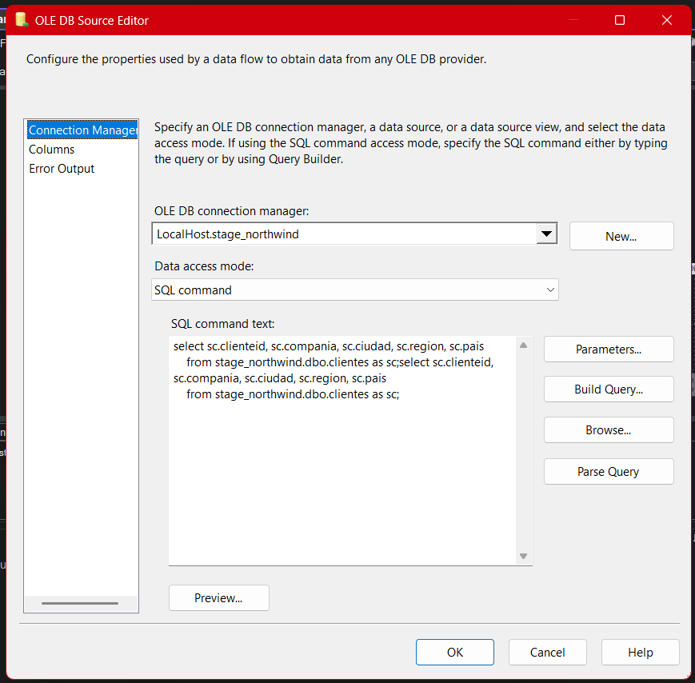

#### Consulta SQL Ejecutada

```sql
SELECT
    sc.clienteid,
    sc.compania,
    sc.ciudad,
    sc.region,
    sc.pais
FROM stage_northwind.dbo.clientes AS sc;
```

#### Detalles a Resaltar

- **No hay filtrado por fechas ni restricciones:** Se busca obtener todo el set de clientes, para garantizar que la tabla de dimensión refleje la base de clientes completa y actualizada.
- **Estrategia incremental:** En flujos posteriores se filtran los registros ya existentes, optimizando la carga.
- **Posibles mejoras:** Si la tabla de staging contiene registros históricos, sería ideal incluir columnas de auditoría (fecha de carga, estatus) para estrategias de control más avanzadas.

---

## 2. Conversión y Normalización de Tipos de Datos

### Justificación

El área de staging puede contener tipos de datos heterogéneos o definidos para operatividad, pero el datamart debe ser **estrictamente tipado**. Por ejemplo, la columna `pais` debe adaptarse a un formato estándar definido en la tabla destino.

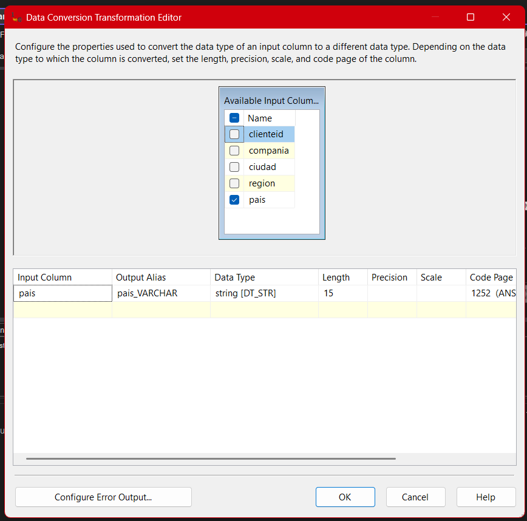

- **Tipo de conversión aplicado:** Se transforma `pais` a `string [DT_STR]` de longitud 15. Esto se realiza para asegurar compatibilidad con el modelo dimensional y evitar rechazos en la carga.
- **Prevención de errores:** Este paso previene errores de truncamiento, incompatibilidad de caracteres o problemas de collation al insertar en SQL Server.
- **Validación de datos:** Se recomienda (como mejora) implementar lógicas de validación de nulos o valores atípicos en esta etapa.

---

## 3. Extracción de Dimensión de Clientes en el DataMart

### Fundamento

Para evitar duplicidades y permitir cargas incrementales, es fundamental extraer el estado actual de la dimensión en el DataMart.

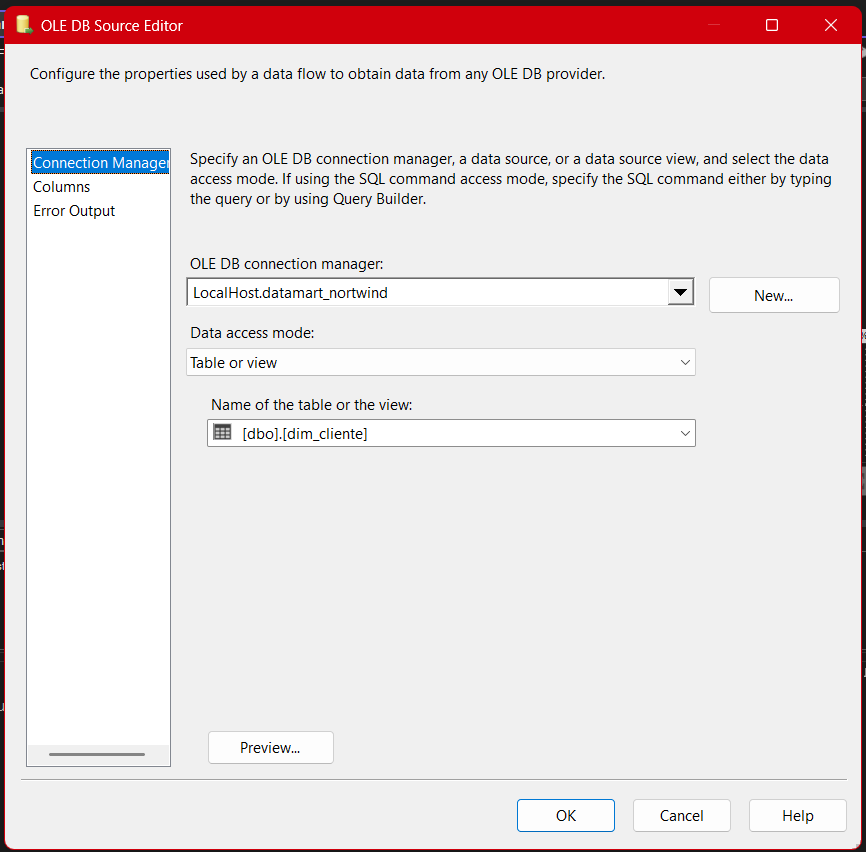

- **Conexión a DataMart:** `LocalHost.datamart_northwind`
- **Consulta:** `SELECT * FROM [dbo].[dim_cliente]`
- **Propósito:** Habilitar una comparación efectiva mediante un `Merge Join` y así solo insertar registros que sean realmente nuevos.

---

## 4. Enriquecimiento y Comparación con Merge Join

### Explicación de la Estrategia

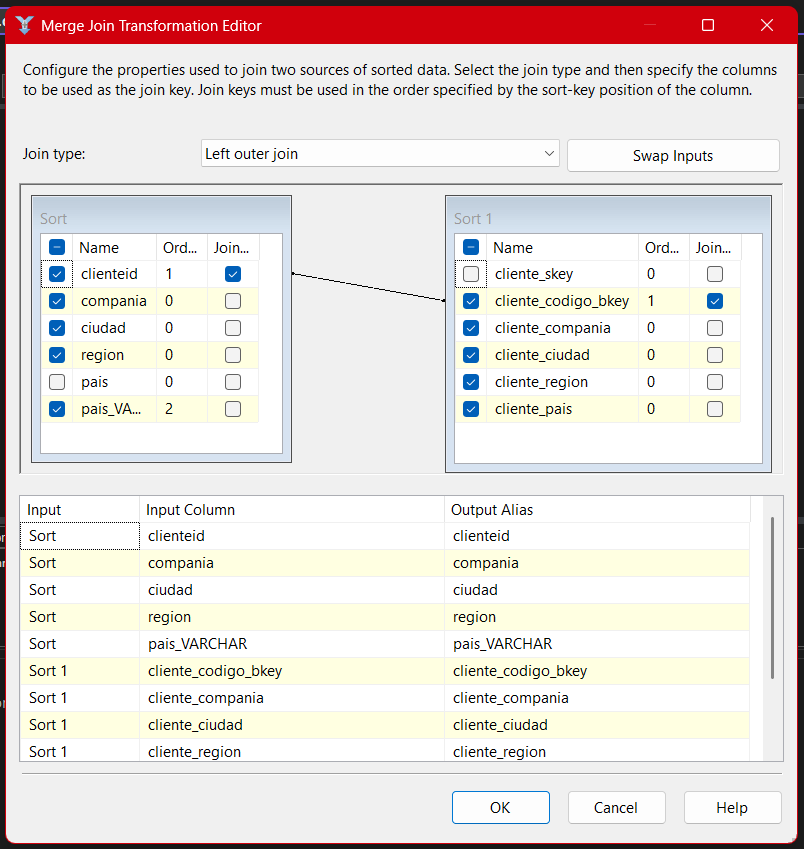

- **Tipo de Join:** `Left Outer Join` entre los datos del staging y la dimensión de clientes.
- **Clave de Unión:** `clienteid` (en staging) vs `cliente_codigo_bkey` (en la dimensión).
- **Atributos de Comparación:** Se pueden usar también compañía, ciudad, región y país para estrategias de control de cambios en atributos no clave (ideal para SCD tipo 2 en implementaciones más avanzadas).
- **Resultado:** Todos los clientes de staging, junto con los datos equivalentes (si existen) en la dimensión. Esto permite identificar cuáles registros aún no están presentes en el datamart.

#### Detalles Técnicos

- **Ordenamiento:** Antes del merge join, ambos conjuntos deben estar ordenados por la clave de unión para cumplir con los requerimientos de SSIS.
- **Prevención de duplicidad:** Si un registro ya existe (la clave está presente en la dimensión), no se vuelve a cargar.

---

## 5. Identificación de Nuevos Registros (Conditional Split)

### Detalle y Justificación

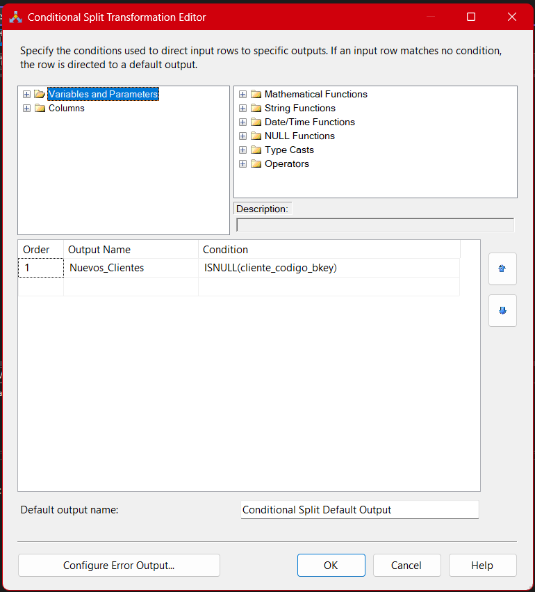

- **Condición usada:** `ISNULL(cliente_codigo_bkey)`
- **Salida:** Solo pasan los clientes que no existen en la tabla destino, es decir, clientes realmente nuevos o que han cambiado su clave.
- **Prevención de cargas innecesarias:** Esta lógica reduce el uso de recursos y mejora la eficiencia, además de mantener la integridad de la tabla de dimensiones.

#### Mejora sugerida

- Para una implementación tipo Slowly Changing Dimension (SCD), podría agregarse lógica para actualizar atributos cambiantes, no solo nuevos registros.

---

## 6. Carga de Datos en la Dimensión

### Configuración Detallada

#### OLE DB Destination

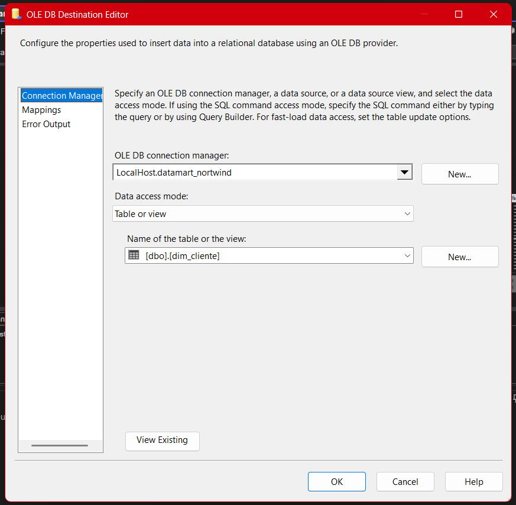

- **Destino:** `datamart_northwind.dbo.dim_cliente`
- **Modo de carga:** `Table or View - Fast Load` (altamente recomendado para cargas masivas).

#### Mapeo de Columnas

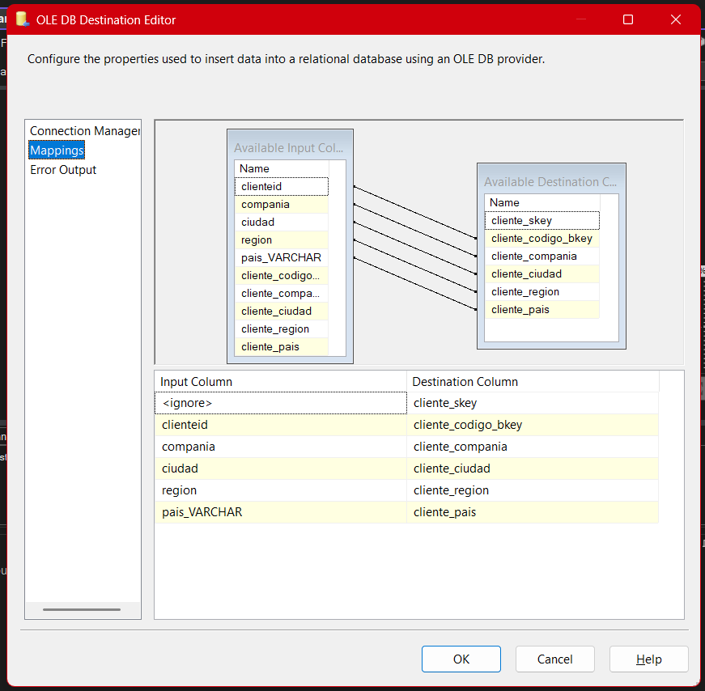

| Input Column | Destination Column  | Descripción                     |
| ------------ | ------------------- | ------------------------------- |
| clienteid    | cliente_codigo_bkey | Identificador único del cliente |
| compania     | cliente_compania    | Nombre o razón social           |
| ciudad       | cliente_ciudad      | Ciudad del cliente              |
| region       | cliente_region      | Región o estado                 |
| pais_VARCHAR | cliente_pais        | País (tipificado y normalizado) |

- **Prevención de errores:** El mapeo explícito garantiza integridad de datos y previene errores comunes de carga, como “truncamiento” o “conversion failed”.

---

## 7. Gestión de Errores y Buenas Prácticas

- **Manejo de Errores:** Se recomienda configurar el flujo para redirigir errores a un destino alternativo, permitiendo la revisión de registros problemáticos sin interrumpir todo el proceso.
- **Auditoría:** Agregar logs sobre el número de registros insertados, errores y advertencias para facilitar la trazabilidad.
- **Automatización y Modularidad:** Este paquete está diseñado para ser ejecutado de forma autónoma o como parte de un proceso maestro (por ejemplo, un “Carga-Master”), lo que permite flexibilidad y escalabilidad.
- **Control de Versiones:** Se recomienda versionar los scripts SQL y plantillas SSIS para garantizar replicabilidad y facilitar la recuperación ante fallos.

---

## 8. Consideraciones Avanzadas

- **Estrategias SCD (Slowly Changing Dimensions):** En implementaciones futuras, se podría añadir lógica para detectar y manejar cambios en atributos no clave mediante SCD tipo 1 o 2, enriqueciendo el análisis histórico.
- **Integridad referencial:** Validar que los clientes cargados mantengan consistencia con otras dimensiones (países, regiones, ciudades).
- **Pruebas y QA:** Ejecutar pruebas de integración y validación después de cada carga para asegurar que no hay duplicidades ni pérdidas de información.

---

## **Resumen Técnico**

El **paquete 01-Datamart-Cliente** no solo implementa un flujo de ETL eficiente y escalable, sino que también incorpora controles de calidad y buenas prácticas para asegurar que la información de clientes, clave para cualquier análisis de negocio, sea confiable y esté siempre actualizada. Es un componente fundamental para la **inteligencia de negocios y la analítica avanzada** en la organización, facilitando desde reportes ejecutivos hasta análisis predictivo y segmentaciones.

# **Documentación Detallada del Proceso ETL para el Paquete Datamart-Empleado**

---

## 1. Rol Estratégico y Propósito del Paquete

El paquete **02-Datamart-Empleado.dtsx** cumple una función fundamental en la arquitectura del datamart: **transformar y poblar la dimensión de empleados (`dim_empleado`)** de manera incremental, confiable y alineada a las mejores prácticas de ingeniería de datos. Esta dimensión es esencial para el análisis avanzado de recursos humanos, desempeño organizacional, generación de KPIs y cruce de información transaccional, como ventas o incidencias.

- **Importancia analítica:** Permite analizar el desempeño por empleado, identificar tendencias internas, correlacionar resultados con periodos, y facilita la segmentación de reportes por áreas, cargos o equipos.
- **Integración:** Sirve como nexo entre el área operativa (Stage) y el modelo analítico final (Datamart), garantizando que sólo los registros válidos, nuevos y bien estructurados se inserten en el sistema.

---

## 2. Arquitectura General y Flujo Lógico

El diseño de este paquete sigue un flujo **ETL incremental y controlado**, minimizando riesgos de duplicidad y degradación de datos. El proceso puede visualizarse de la siguiente manera:

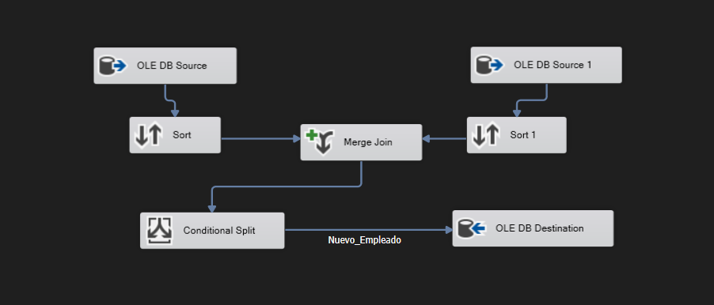

### **Resumen del Flujo:**

1. **Extracción:** Recupera empleados desde Stage y la dimensión destino en Datamart.
2. **Preparación:** Ordena los datasets para garantizar una comparación eficiente.
3. **Comparación (Merge Join):** Detecta registros ya existentes vs. nuevos.
4. **Filtrado:** Identifica empleados que aún no existen en la dimensión.
5. **Carga controlada:** Inserta únicamente los nuevos empleados en `dim_empleado`.

---

## 3. Desglose Paso a Paso

### 3.1. Extracción desde Stage

**Fuente:** `stage_northwind.dbo.empleado`
**Consulta utilizada:**

```sql
SELECT empleadoid, CONCAT(nombre, ' ', apellido) AS NombreCompleto
FROM stage_northwind.dbo.empleado;
```


- **Racionalidad:** Se unifican nombre y apellido en un solo campo (`NombreCompleto`) desde el origen, centralizando la lógica de negocio y manteniendo la flexibilidad analítica en la dimensión destino.
- **Mejores prácticas:** Si existen reglas de normalización o limpieza (acentos, mayúsculas, caracteres especiales), es preferible aplicarlas aquí para evitar errores posteriores en el datamart.

---

### 3.2. Extracción desde la Dimensión Empleado (Datamart)

**Fuente:** `datamart_northwind.dbo.dim_empleado`
**Propósito:**
Permite comparar y detectar únicamente los empleados que aún no están presentes, **evitando duplicados y asegurando cargas incrementales idempotentes**.


- **Buenas prácticas:** Esta consulta debe extraer tanto la clave de negocio (`empleado_codigo_bkey`) como el nombre completo, permitiendo posibles controles adicionales para Slowly Changing Dimensions en el futuro.

---

### 3.3. Ordenamiento para Merge Join

Ambos conjuntos de datos (Stage y Datamart) deben ser ordenados por la clave de unión (`empleadoid` y `empleado_codigo_bkey` respectivamente), pues SSIS requiere datasets ordenados para realizar el Merge Join.

- **Imagen - Ordenamiento Stage:**
  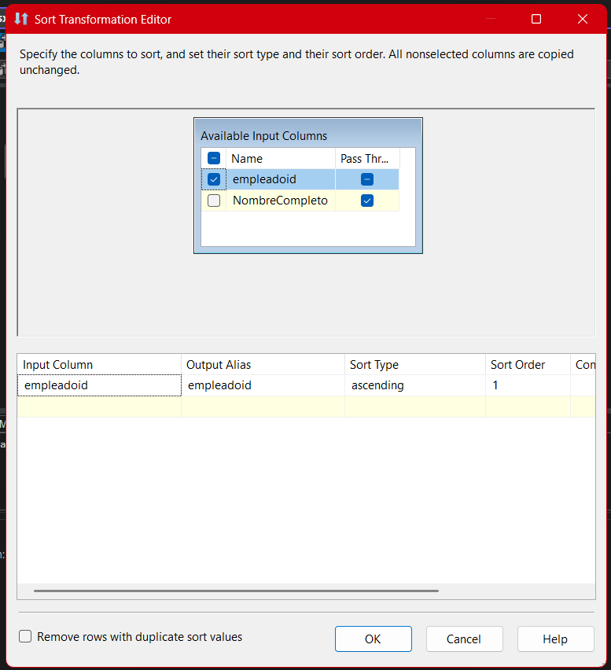
- **Imagen - Ordenamiento Datamart:**
  

---

### 3.4. Comparación y Unión de Datos (Merge Join)

**Tipo de unión:** Left Outer Join
**Claves:** `empleadoid` (Stage) ↔ `empleado_codigo_bkey` (Datamart)

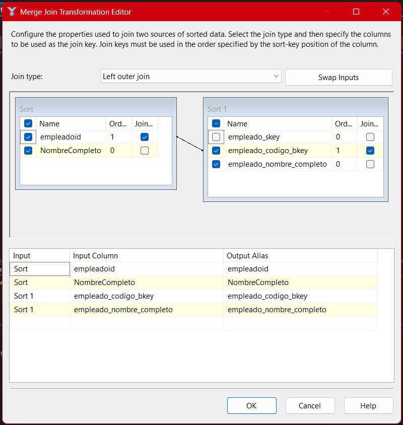

- **Objetivo:** Identificar los empleados que están en Stage pero no en el Datamart.
- **Valor agregado:** Se puede expandir esta lógica para detectar cambios en otros atributos y así implementar SCD (Slowly Changing Dimensions) en futuras versiones.

---

### 3.5. Filtrado de Nuevos Registros (Conditional Split)

**Condición utilizada:**

```sql
ISNULL(empleado_codigo_bkey)
```

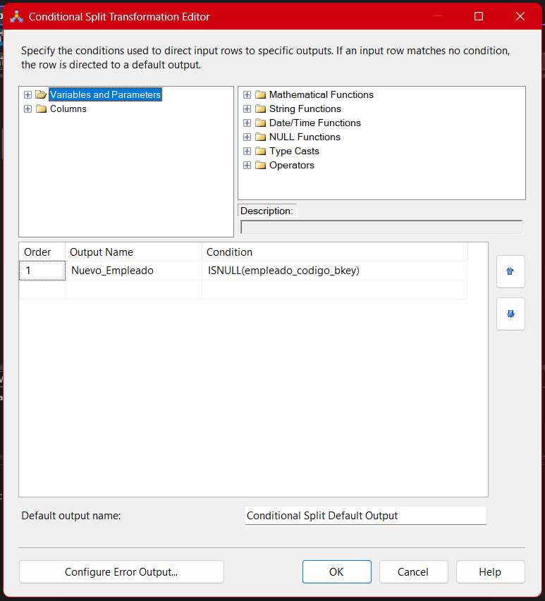

- **Lógica:** Solo pasan los empleados que no existen en la dimensión de destino, evitando duplicidades.
- **Relevancia profesional:** Esta lógica asegura la calidad y escalabilidad del datamart, ya que previene la generación de “ruido” analítico y facilita auditoría y control de versiones.

---

### 3.6. Carga de Datos a la Dimensión (`OLE DB Destination`)

**Destino:** `datamart_northwind.dbo.dim_empleado`
**Modo de carga:** `Table or View - Fast Load`

- **Columnas mapeadas:**

  - `empleado_codigo_bkey` ← `empleadoid`
  - `empleado_nombre_completo` ← `NombreCompleto`

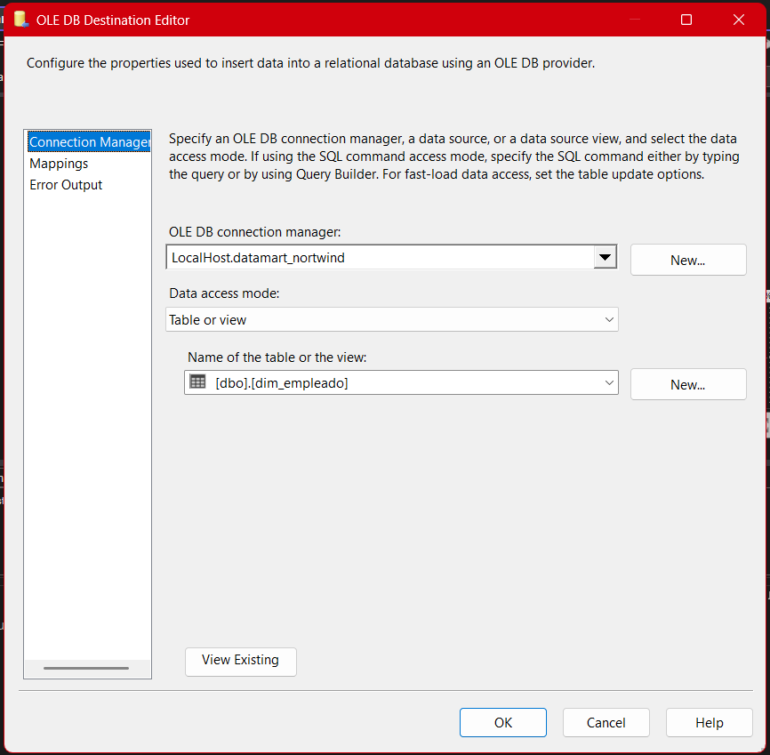


- **Control de calidad:** Siempre validar que el mapeo de columnas sea exacto, para evitar errores de carga o truncamiento de datos.
- **Recomendaciones:** Configurar la salida de errores para registrar filas con problemas y facilitar troubleshooting.

---

## 4. Buenas Prácticas, Aprendizajes y Retos del Proyecto

- **Idempotencia:** El patrón de comparación y filtrado garantiza que el ETL puede ejecutarse múltiples veces sin generar duplicados.
- **Flexibilidad:** Si se requieren futuras ampliaciones (manejo de cambios históricos, campos adicionales), la arquitectura permite adaptaciones rápidas.
- **Trazabilidad y auditoría:** Se recomienda documentar cada cambio y registrar los resultados de cada ejecución para mantener el flujo transparente y auditable.
- **Prevención de errores frecuentes:**

  - No ordenar correctamente los datasets provoca errores silenciosos en el Merge Join.
  - Cambios en los metadatos de Stage deben replicarse en el datamart para evitar incompatibilidades.
  - Mantener la consistencia de nombres y claves entre fuentes es fundamental para evitar corrupción de datos.

- **Optimización:** Para grandes volúmenes, realizar profiling previo y analizar la posibilidad de índices o particionamiento en la base de datos destino.

---

## 5. Valor Empresarial y Ejemplo Práctico

**Ejemplo real:**
Un nuevo empleado es contratado y su información se ingresa al sistema operativo.

- En la siguiente ejecución del paquete, el ETL detecta que `empleadoid` no existe en la dimensión y sólo este nuevo registro es insertado, asegurando la integridad del historial de empleados.

**Beneficio:**
Esto permite analizar el crecimiento del personal, identificar rotaciones, evaluar desempeño por periodo y construir tableros que integren datos de empleados con ventas, incidencias, o campañas.

---

## 6. Imágenes Referenciadas

- [Diagrama General del Paquete](../../../Imgs/02-Datamart/Diagrama_Flujo_Empleado.png)
- [OLE DB Source - Stage](../../../Imgs/02-Datamart/OLEDBSource_Stage.png)
- [OLE DB Source - Datamart](../../../Imgs/02-Datamart/OLEDBSource_Datamart.png)
- [Sort - Stage](../../../Imgs/02-Datamart/Sort_Stage.png)
- [Sort - Datamart](../../../Imgs/02-Datamart/Sort_Datamart.png)
- [Merge Join Empleado](../../../Imgs/02-Datamart/Merge_Join_Empleado.png)
- [Conditional Split Empleado](../../../Imgs/02-Datamart/Conditional_Split_Empleado.png)
- [OLE DB Destination General](../../../Imgs/02-Datamart/OLEDBDestination_Empleado.png)
- [Mapping Empleado](../../../Imgs/02-Datamart/Mapping_Empleado.png)

---

## 7. Recomendaciones y Sugerencias de Mejora

- **Implementar Slowly Changing Dimensions (SCD)** en futuras iteraciones para registrar cambios históricos relevantes (por ejemplo, cambios de nombre, puesto, área, etc.).
- **Automatizar el monitoreo de errores y métricas** para facilitar la operación en ambientes de producción.
- **Expandir la auditoría** incluyendo logs de ejecuciones, usuarios y conteo de registros afectados en cada corrida.

---

## **Resumen Técnico**

El **paquete Datamart-Empleado** implementa un flujo ETL robusto, escalable y alineado a las mejores prácticas de la analítica empresarial, asegurando la calidad, confiabilidad y crecimiento ordenado de la dimensión empleado en el modelo Datamart_Northwind. Su diseño modular y documentado facilita la adaptación y extensión futura conforme las necesidades de la organización evolucionan.

# **Documentación del Proceso ETL para el Paquete Datamart-Producto**

## Objetivo General

El objetivo principal de este paquete es garantizar la construcción y la carga de la dimensión `dim_producto` en el modelo `Datamart_Northwind` bajo un enfoque que privilegia la precisión, la integridad referencial y la capacidad de evolución. La dimensión producto no es solo una lista de artículos o bienes, sino el eje estructural que vincula inventarios, ventas, rentabilidad y análisis por categoría.
Por lo tanto, cada decisión de diseño en este flujo ETL —desde la extracción hasta la validación final— está alineada con el objetivo de mantener una base de productos consistente, auditable y alineada a los estándares de calidad de datos requeridos en ambientes empresariales.

El flujo se diseña para que cada producto cargado tenga correspondencia clara con su categoría, evitando registros huérfanos y minimizando el riesgo de duplicidades. Esta arquitectura soporta la escalabilidad, permite realizar análisis históricos y contribuye directamente a la confiabilidad de los tableros ejecutivos y modelos predictivos en el negocio.

## Descripción General del Proceso

El flujo que implementa este paquete dentro de SSIS (SQL Server Integration Services) se basa en una arquitectura de integración incremental y modular, construida bajo el principio de que cada paso agrega una capa adicional de calidad y control a los datos que transitan desde el área de staging hasta el datamart.
A diferencia de una simple migración masiva, aquí se busca que **solo los productos que no existen en la dimensión, o que han sido modificados de forma relevante, sean incorporados o actualizados**, lo que garantiza eficiencia, minimiza tiempos de proceso y permite auditoría de los cambios.

La arquitectura se estructura de la siguiente forma:
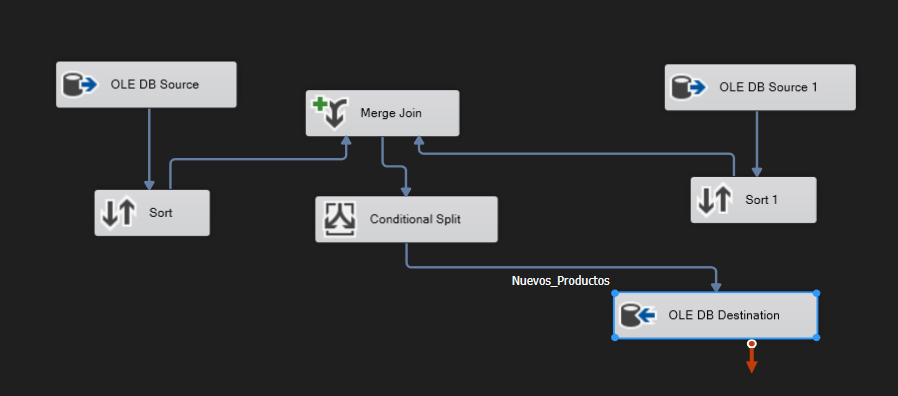

### **Pasos principales del proceso:**

**Extracción de productos y categorías desde Stage:**
El primer paso consiste en obtener los datos brutos tanto de productos como de sus categorías asociadas desde el entorno de staging. La extracción está diseñada para que cada producto solo se considere si tiene una categoría válida y existente.
Esto no solo protege la integridad del modelo relacional, sino que es un filtro esencial para la calidad de los análisis posteriores. Por ejemplo, si un producto no tiene categoría o la categoría no está registrada, podría quedar fuera de agrupaciones en los reportes o incluso generar errores en modelos de BI avanzados.

**Ordenamiento previo para combinación (Merge Join):**
Antes de poder comparar productos nuevos contra los ya existentes, es obligatorio que los conjuntos de datos estén perfectamente ordenados por su clave principal.
Este ordenamiento no es un mero requerimiento técnico de SSIS: asegura que las comparaciones sean válidas y reproducibles.
Ordenar por `producto_id` garantiza que cada registro de producto se pueda mapear uno a uno con su contraparte, minimizando riesgos de desfases o emparejamientos erróneos.

**Extracción de la dimensión producto en el Datamart:**
Aquí se consulta el estado actual de la dimensión de producto en el datamart. Esta operación permite identificar el universo de productos ya registrados y sirve como base para la comparación incremental.
El objetivo es detectar solo productos nuevos, evitando la sobreescritura o el ingreso redundante de registros existentes. Esto es crítico para la idempotencia, asegurando que el proceso pueda ejecutarse múltiples veces sin alterar indebidamente los datos.

**Ordenamiento de la dimensión destino:**
Al igual que con los productos extraídos desde el Stage, los datos de la dimensión producto deben ser ordenados por la clave primaria.
Esto es indispensable para la correcta operación del Merge Join, y su omisión puede llevar a errores sutiles pero devastadores en los resultados.
Mantener este orden es uno de los pasos más importantes para garantizar integridad en los procesos de comparación.

**Comparación e identificación de registros nuevos (Merge Join):**
La transformación Merge Join permite unir, comparar y analizar los productos provenientes del Stage con los ya presentes en la dimensión destino, utilizando un Left Outer Join para asegurar que todos los productos del Stage sean analizados, independientemente de si ya existen o no en la dimensión.
El propósito de este paso es, de manera explícita y controlada, determinar cuáles productos requieren ser cargados y cuáles deben ser omitidos por ya existir en la dimensión.

**Filtrado y carga final (Conditional Split y OLE DB Destination):**
El resultado de la comparación se filtra usando un Conditional Split, que únicamente selecciona los productos no encontrados en la dimensión destino, es decir, aquellos que realmente deben insertarse.
Finalmente, los productos filtrados se cargan a la dimensión producto a través del componente OLE DB Destination, con el mapeo adecuado de columnas y bajo las restricciones de unicidad necesarias.

**Validación, control de errores y mejores prácticas:**
Al finalizar la carga, se implementan mecanismos de validación que revisan la cantidad de registros cargados, la correspondencia de claves, la integridad referencial y posibles errores o rechazos durante el proceso.
Esto puede incluir revisión de logs, auditoría de errores, comparaciones entre Stage y Datamart, y la aplicación de pruebas unitarias sobre los registros nuevos.

## **Componentes y Detalle Técnico**

### 1. **OLE DB Source: Extracción de Productos y Categorías**

El primer paso del flujo ETL consiste en obtener la información relevante de productos y sus respectivas categorías desde el entorno de staging. Para ello se hace uso de una fuente OLE DB configurada para consultar dos tablas principales: `stage_northwind.dbo.producto` y `stage_northwind.dbo.categorias`.

La consulta SQL utilizada establece una relación explícita entre productos y categorías por medio de un **INNER JOIN**. El objetivo de esta consulta no es únicamente combinar datos, sino garantizar que **solo se seleccionen productos que tengan una categoría válida y registrada**. Esto responde a un principio fundamental del modelado dimensional: **toda clave foránea en una dimensión o tabla de hechos debe existir previamente en la dimensión referenciada**, para evitar registros huérfanos, inconsistencias en reportes y quiebres en la navegación de datos de BI.

**Consulta SQL:**

```sql
SELECT
    sp.producto_id,
    sp.nombre_producto,
    sc.nombrecategoria
FROM
    stage_northwind.dbo.categorias AS sc
INNER JOIN
    stage_northwind.dbo.producto AS sp
    ON sp.categoria_id = sc.categoriaid
```

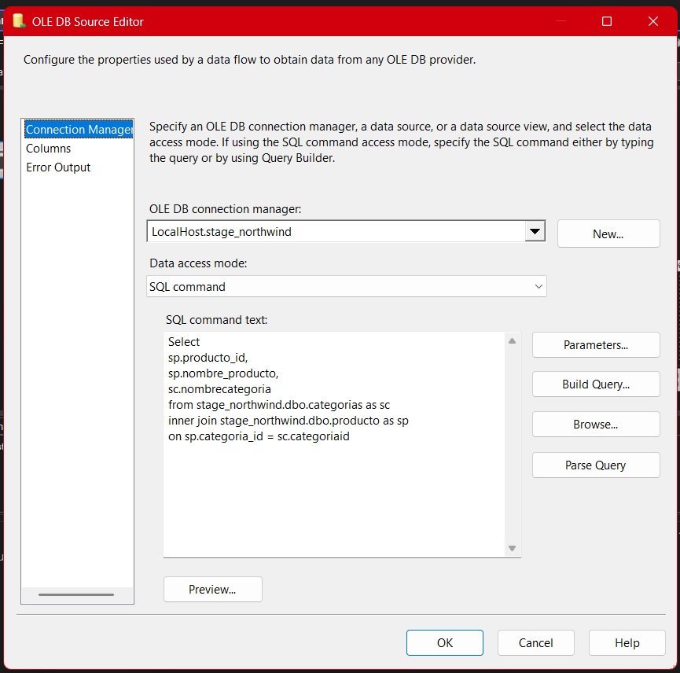

**Justificación técnica:**
Se utiliza un `INNER JOIN` para asegurar que **solo se integren productos con categoría válida**. Esto evita la carga de registros huérfanos y garantiza integridad referencial desde la extracción.
Este JOIN fuerza la correspondencia entre productos y categorías. Si un producto tuviera una categoría no registrada, simplemente no aparecería en la extracción y, por lo tanto, tampoco en la dimensión producto.
La razón de esta estrategia es doble: primero, previene la creación de registros que puedan romper la lógica de análisis por categoría (por ejemplo, sumar ventas por categoría o calcular rentabilidad por línea de producto); segundo, garantiza que cualquier análisis posterior que dependa de jerarquías o agrupaciones esté basado en datos completos y confiables.

- Si por error administrativo en el área de staging se insertan productos con categorías nulas o mal referenciadas, esos productos se excluirán del análisis.
  Por eso, **antes de cada carga** es importante validar la consistencia de las relaciones en staging, asegurándose que todos los productos tengan categoría y que todas las categorías estén actualizadas.
- En el contexto de modelos de BI y reportes empresariales, la ausencia de productos por falta de categoría puede causar distorsiones en indicadores clave, ya que algunos artículos quedarían fuera de los agregados o segmentaciones.

**Relevancia para BI y auditoría:**
Implementar la validación desde la extracción te permite garantizar que cualquier inconsistencia detectada en reportes (como ventas que no cuadran por categoría) pueda rastrearse hasta el origen, facilitando la depuración de errores y el cierre del ciclo de calidad de datos.

### 2. **Sort: Ordenamiento Previo al Merge Join**

El segundo componente del flujo es el **ordenamiento de los productos extraídos** antes de ser comparados contra la dimensión destino. Este paso es crucial, ya que el componente Merge Join de SSIS requiere que ambos conjuntos de datos (Stage y Datamart) estén ordenados exactamente por la(s) clave(s) de unión.

La lógica de negocio aquí es simple pero poderosa: **el ordenamiento previo es lo que garantiza que la comparación entre productos sea válida y reproducible**.
En ambientes empresariales con grandes volúmenes de datos, un desfase en el orden puede significar uniones incorrectas, productos emparejados erróneamente o incluso la omisión inadvertida de registros relevantes.

En este caso, el ordenamiento se realiza sobre la columna `producto_id`, que es la clave principal del producto en Stage. Este mismo criterio de ordenamiento debe aplicarse en ambos flujos que se van a comparar (Stage y Dimensión Producto del Datamart) para que cada fila en una fuente corresponda a la fila equivalente en la otra fuente.

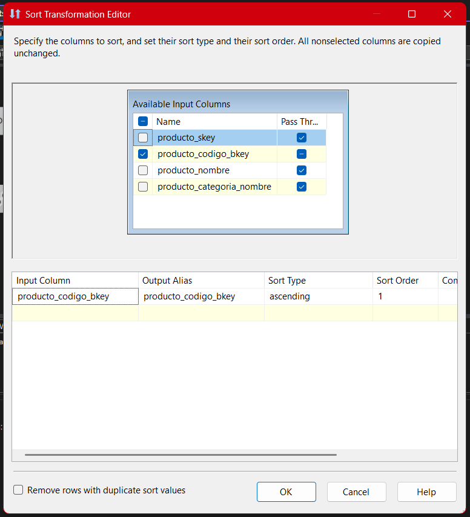

**Fundamento técnico y riesgos:**

- **El Merge Join en SSIS depende 100% del orden**. Si uno de los flujos está desordenado, los resultados del join serán erráticos y difíciles de depurar, ya que no siempre se arrojarán errores explícitos.
- El ordenamiento puede realizarse en el flujo de datos mediante el componente `Sort` de SSIS, o directamente en la consulta SQL de la fuente (`ORDER BY producto_id`).
  En ambientes con grandes datasets, es preferible realizar el ordenamiento desde SQL para aprovechar los índices y reducir el uso de memoria y procesamiento en el servidor de integración.

**Consideraciones de performance:**

- El componente Sort en SSIS puede consumir recursos significativos y ser un cuello de botella si el volumen de datos es elevado.
  Por ello, **siempre evalúa si puedes realizar el ordenamiento aguas arriba** (en el query de la fuente) antes de dejar la tarea a SSIS.

---

### 3. **OLE DB Source 1: Extracción desde el Datamart**

En este tercer paso se configura una nueva fuente OLE DB para consultar la dimensión de producto ya existente en el Datamart.
El propósito aquí es obtener el estado actual de la dimensión, permitiendo así realizar una **comparación incremental**. Esta es la clave para asegurar que el flujo sea idempotente: que la misma carga pueda ejecutarse varias veces sin crear duplicados ni sobreescribir información ya existente.

La consulta utilizada generalmente es un simple SELECT sobre la tabla de destino (`datamart_northwind.dbo.dim_producto`), extrayendo como mínimo las claves necesarias para la comparación (como `producto_codigo_bkey`), pero es recomendable extraer todos los campos relevantes para permitir auditoría o futuras implementaciones de Slowly Changing Dimensions (SCD).

- **Fuente:** `datamart_northwind.dbo.dim_producto`

- **Modo de acceso:** `Table or View`

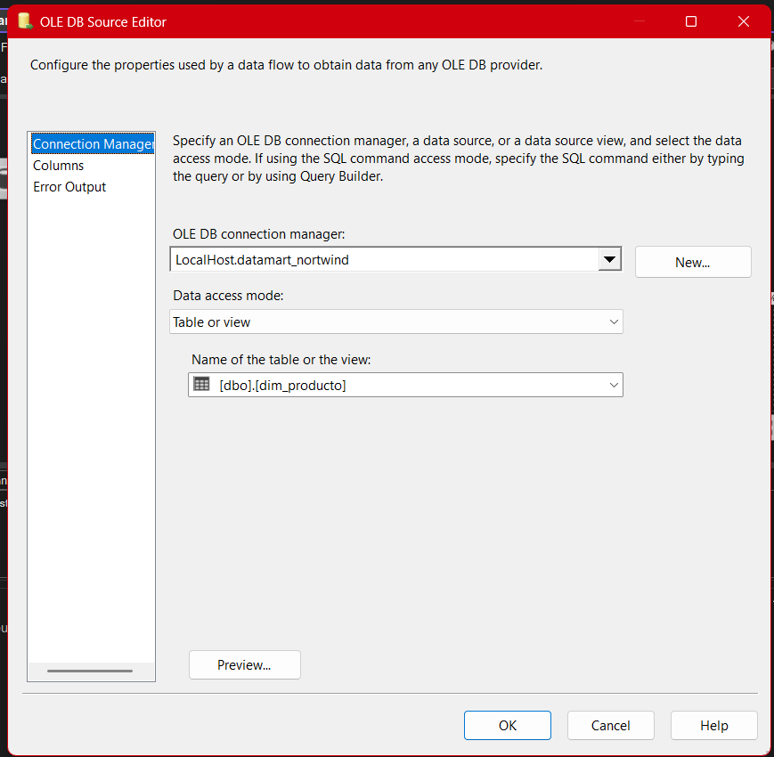

**Importancia del alineamiento de estructura:**

- Si la estructura de la tabla en el datamart cambia (por ejemplo, se añade una columna), es fundamental actualizar también el flujo ETL y la consulta de extracción para evitar errores de mapeo o pérdida de información.
- Desalineaciones entre Stage y Datamart pueden provocar errores de carga, rechazos de registros o, peor aún, inserciones incorrectas y silenciosas.

**Ejemplo concreto de riesgo:**
Si se actualiza la definición de la tabla destino pero no se actualiza la fuente en el flujo ETL, podrías terminar con registros incompletos o errores difíciles de rastrear. Por eso, es buena práctica documentar y versionar tanto el modelo físico como el flujo de integración.

---

### 4. **Sort 1: Ordenamiento de Dimensión Producto**

Así como se ordenaron los productos extraídos del Stage, es obligatorio ordenar los registros obtenidos de la dimensión producto en el datamart usando la misma clave (`producto_codigo_bkey`).
Este paso mantiene la simetría y la validez en la comparación de ambos flujos.

**Justificación profunda:**
El orden es lo que permite la unión secuencial, registro a registro, asegurando que los algoritmos de comparación y join de SSIS operen correctamente.
Un flujo desordenado, aunque sólo sea en uno de los extremos, puede provocar que los registros no se emparejen correctamente, generando comparaciones fallidas o incluso omitiendo productos que deberían cargarse.

**Advertencia técnica:**
Un error muy común es olvidar ordenar uno de los flujos, especialmente cuando se realizan cambios en la estructura del ETL.
La consecuencia puede ser difícil de detectar porque SSIS no siempre alerta explícitamente sobre el desorden, pero los resultados (productos no cargados o duplicados) pueden ser graves para la calidad del datamart y la confiabilidad de los reportes.

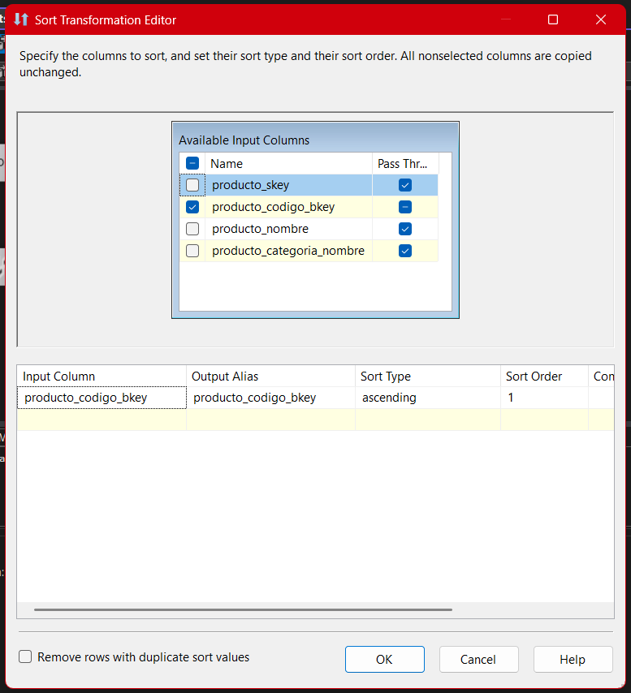

---

### **5. Merge Join: Comparación e Identificación de Registros Nuevos y Existentes**

Una vez que los flujos de productos provenientes de Stage y los productos ya existentes en la dimensión del Datamart han sido extraídos y ordenados, se procede a la fase de comparación mediante el componente **Merge Join** en SSIS. Este componente permite realizar una unión de ambos conjuntos de datos utilizando la clave de producto (`producto_id` del Stage y `producto_codigo_bkey` del Datamart) como criterio de correspondencia.

Para este flujo, se utiliza un **Left Outer Join**, lo que significa que todos los productos extraídos de Stage serán comparados contra la dimensión destino, y si no existe coincidencia (es decir, si el producto no está registrado en el Datamart), la salida del join contendrá nulo en los campos provenientes del Datamart.

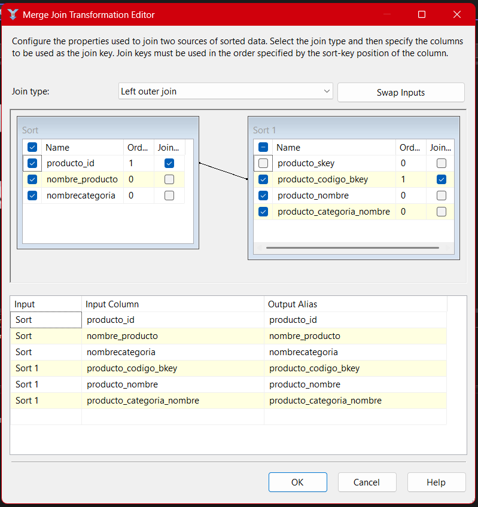

**Razón técnica y de negocio de esta estrategia:**
La elección del Left Outer Join obedece a la necesidad de identificar **productos nuevos o previamente ausentes** en la dimensión. Si se utilizara un Inner Join, se obtendrían únicamente los productos presentes en ambas fuentes, perdiendo la posibilidad de detectar registros que deben insertarse por ser realmente nuevos.
Además, este enfoque permite construir flujos idempotentes: solo se cargan los productos que no existen aún en la dimensión, minimizando la posibilidad de duplicados o sobreescrituras no deseadas.

**Fundamento de calidad y control:**
Esta comparación asegura que, aunque el proceso ETL se ejecute varias veces (por ejemplo, en cargas diarias o semanales), los productos ya existentes no sean afectados, y sólo los nuevos se agreguen.
En la práctica, esto reduce drásticamente los tiempos de procesamiento y evita inconsistencias que puedan impactar los análisis posteriores (por ejemplo, evitar que un producto con ventas históricas se duplique y genere distorsiones en los reportes de ventas, inventarios o rotación).

**Puntos críticos a considerar:**

- **Mapeo de columnas:** Es esencial mapear correctamente las columnas de ambas fuentes para que la comparación sea válida. Un error común es utilizar nombres de columnas similares pero con contenidos distintos, lo que puede llevar a uniones incorrectas.
- **Campos utilizados:** Generalmente basta con la clave de producto, pero en escenarios futuros podrías comparar también otros atributos (por ejemplo, nombre del producto o categoría) si decides implementar Slowly Changing Dimensions (SCD).

**Ejemplo de funcionamiento:**
Supón que tienes tres productos en Stage: P1, P2 y P3. En la dimensión del Datamart sólo existe P1 y P3.

- El resultado del Merge Join será:

  - P1 (existe en ambos: no se carga)
  - P2 (existe solo en Stage: debe cargarse)
  - P3 (existe en ambos: no se carga)
    De este modo, únicamente P2 será procesado en los pasos siguientes para ser insertado como nuevo registro.

---

### **6. Conditional Split: Filtrado y Carga de Productos Nuevos**

Tras realizar la comparación mediante el Merge Join, es necesario separar los registros que realmente requieren ser insertados en la dimensión destino.
Para esto se emplea el componente **Conditional Split** en SSIS, cuyo propósito es analizar cada fila resultante del join y decidir, con base en una condición lógica, cuáles pasarán a la siguiente etapa.

La condición típica utilizada en este escenario es:

```sql
ISNULL(producto_codigo_bkey)
```

Esto significa que solo pasarán a la carga final aquellos productos cuyo identificador proveniente del Datamart está nulo, es decir, productos que no existen aún en la dimensión destino.

**Por qué es crítica esta lógica:**
Este filtro permite que el proceso sea **totalmente incremental**: sólo los productos ausentes serán cargados, y no se tocan los ya existentes.
Así, la dimensión producto puede crecer con nuevos registros sin riesgo de sobrescribir, duplicar o eliminar información previa.
Esta idempotencia es fundamental en ambientes productivos, donde el mismo flujo puede ejecutarse varias veces en un periodo de tiempo sin afectar la calidad ni la consistencia del modelo.

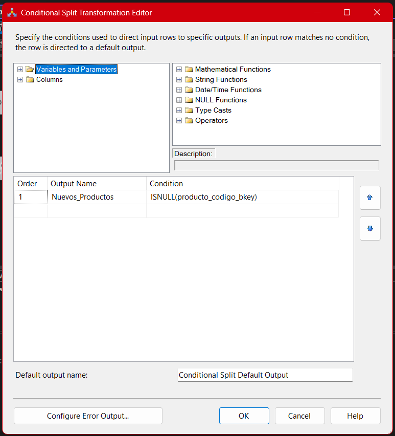

**Riesgos y validaciones:**

- Si la condición de split está mal definida, podrías dejar fuera productos válidos (por ejemplo, si la columna de comparación no corresponde a la clave única) o, peor aún, cargar duplicados.
- Siempre valida la lógica del split con pruebas controladas y revisa el resultado en una corrida inicial antes de activar el flujo en ambientes productivos.

**Relación con futuras mejoras (SCD):**
En implementaciones avanzadas, podrías expandir la lógica del split para detectar no solo productos nuevos, sino también aquellos cuyas propiedades han cambiado (por ejemplo, cambio de nombre o categoría), permitiendo la actualización controlada de registros y soportando historización.

---

### 7. **OLE DB Destination: Carga en la Dimensión Producto**

Una vez filtrados los productos que realmente deben cargarse, estos se dirigen al componente **OLE DB Destination**.
Aquí, los productos seleccionados son insertados en la tabla `datamart_northwind.dbo.dim_producto`. Es fundamental que el mapeo de columnas se realice de forma precisa y que las restricciones del modelo dimensional (como unicidad, tipos de dato y relaciones referenciales) sean respetadas para evitar rechazos o inconsistencias.

**Explicación de mapeo:**

- La columna `producto_id` del Stage se almacena como `producto_codigo_bkey` en la dimensión destino, asegurando la unicidad y correspondencia entre Stage y Datamart.
- `nombre_producto` se mapea directamente al campo correspondiente en la dimensión.
- `nombrecategoria` se almacena como atributo descriptivo de producto, permitiendo consultas y segmentaciones por categoría en modelos analíticos.

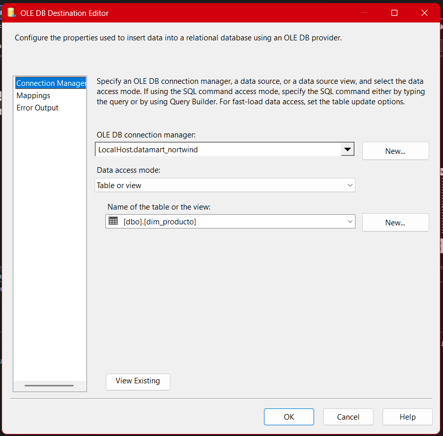

**Aspectos técnicos y recomendaciones:**

- Se recomienda utilizar el modo `Fast Load` para mejorar la eficiencia de las cargas masivas, especialmente en procesos recurrentes o con alto volumen de productos.
- Configura el manejo de errores y rechazos, de modo que cualquier registro problemático sea redirigido a un destino alternativo o registrado en logs, facilitando su análisis y corrección.
- Realiza validaciones cruzadas al finalizar la carga, comparando la cantidad de productos en Stage contra los efectivamente insertados para detectar posibles omisiones o inconsistencias.

**Riesgos frecuentes y cómo mitigarlos:**

- Un mapeo incorrecto puede causar fallos silenciosos (por ejemplo, insertar el nombre del producto en la columna equivocada) que luego se manifiestan como errores en los reportes.
- Si la tabla destino no tiene una clave única o un índice adecuado, pueden generarse duplicados, dificultando los análisis posteriores y generando problemas de rendimiento en las consultas.

---

### **8. Validación, Control de Errores y Buenas Prácticas**

Esta etapa es esencial para asegurar la robustez, auditabilidad y mantenibilidad del proceso ETL.
No basta con que los datos sean cargados: es indispensable implementar mecanismos que permitan identificar, rastrear y corregir errores antes de que impacten el negocio.

**Validaciones recomendadas:**

- **Control de duplicados:**
  Asegúrate de que la clave primaria de la dimensión (`producto_codigo_bkey`) sea única y que la lógica de carga nunca inserte dos veces el mismo producto.
  Una verificación manual de los registros insertados en la última carga, comparando contra Stage y Datamart, es una práctica recomendable.
- **Auditoría de registros y logs:**
  Implementa logs que registren cada inserción, con información como fecha/hora de carga, usuario o proceso que ejecutó el flujo, número de registros procesados y errores encontrados.
  Esto facilita tanto la auditoría como el troubleshooting en caso de incidentes.
- **Pruebas unitarias y de integración:**
  Antes de ejecutar el proceso en producción, realiza pruebas con datos de ejemplo que cubran casos borde (productos sin categoría, productos duplicados, cambios de nombre, etc.).
  Esto ayuda a detectar lógicas incorrectas y a anticipar escenarios problemáticos que puedan surgir a futuro.

**Gestión de errores y resiliencia:**

- Configura el flujo ETL para redirigir filas problemáticas (errores de tipo, mapeo o violaciones de unicidad) a destinos alternativos para revisión, evitando que un error bloquee la carga completa.
- Implementa alertas automáticas para que, si la cantidad de nuevos productos varía inesperadamente respecto al histórico, puedas analizar rápidamente si se trata de un cambio real en el negocio o de un error en la integración.

**Mejoras y evolución futura:**

- En implementaciones avanzadas, puedes considerar el uso de upserts (actualización e inserción) para manejar cambios en productos existentes (por ejemplo, cuando cambia la categoría de un producto).
- Integra reglas de validación de calidad de datos (ejemplo: nombres de productos no nulos o únicos, categorías válidas, etc.) directamente en el flujo, previniendo errores aguas arriba.
- Automatiza pruebas periódicas que validen la correcta correspondencia entre el área de staging y la dimensión de producto, y que alerten si hay desalineación estructural entre ambas.

---

## Mental Notes

- **Upserts:** Para futuras versiones, integrar lógica de actualización (`Update`) para productos que cambien de nombre o categoría.
- **Validaciones adicionales:** Incorporar reglas de validación de datos (por ejemplo, que el nombre no sea nulo/vacío, categorías válidas).
- **Alertas y Monitoreo:** Automatizar alertas en caso de registros rechazados o errores de consistencia.
- **Pruebas unitarias:** Construir paquetes de prueba para verificar el correcto funcionamiento de cada transformación y destino.

---

## **Resumen Técnico**

El diseño, construcción y operación de la dimensión producto en un datamart empresarial es mucho más que una tarea técnica; representa el punto de convergencia entre la calidad del dato y el valor estratégico para el negocio.
Un flujo ETL cuidadosamente orquestado, como el aquí documentado, permite a cualquier organización responder ágilmente a preguntas críticas sobre ventas, inventarios, tendencias de consumo y rentabilidad, apoyando la toma de decisiones tanto operativas como tácticas y estratégicas.

Durante la implementación de este flujo, cada etapa —desde la validación de categorías en Stage, pasando por la comparación incremental, hasta la gestión de errores y auditoría— cumple un papel irremplazable en la construcción de un entorno confiable y escalable. El rigor aplicado en la validación, la gestión de errores y la garantía de idempotencia no solo evitan errores visibles, sino que previenen problemas sutiles que pueden escalar hasta impactar la credibilidad de todo el modelo de BI.

# **Documentación del Proceso ETL para el Paquete Datamart-Tiempo**

## 1. **Introducción Estratégica y Valor del Modelo Temporal**

La **dimensión de tiempo** es el núcleo sobre el que gira cualquier análisis temporal en inteligencia de negocios. Sin una dimensión temporal bien construida, todo análisis de tendencias, estacionalidad, cohortes, periodos fiscales o productividad histórica pierde rigor y profundidad.
La correcta gestión ETL de esta dimensión **no solo habilita los dashboards y comparaciones clásicas (mes contra mes, año contra año), sino que posibilita nuevas formas de análisis**: periodos móviles, marcadores de eventos, días festivos, análisis rolling y segmentación dinámica.
Una carga ETL robusta y auditable es clave para garantizar la calidad, trazabilidad y escalabilidad del Datamart Northwind y de cualquier modelo de BI maduro.

---

## 2. **Arquitectura y Razonamiento del Flujo ETL**

### 2.1. **Extracción de Datos desde Staging**

- **Componente:** OLE DB Source
- **Imagen:**
  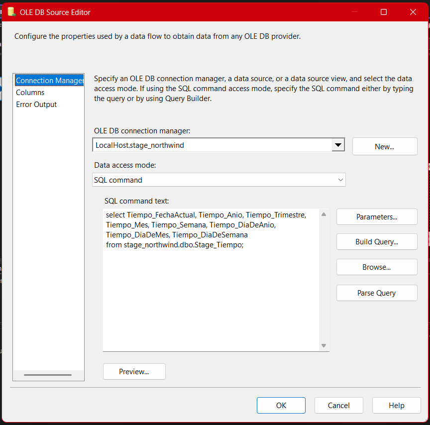
- **Consulta:**

  ```sql
  SELECT Tiempo_FechaActual, Tiempo_Anio, Tiempo_Trimestre, Tiempo_Mes,
         Tiempo_Semana, Tiempo_DiaDeAnio, Tiempo_DiaDeMes, Tiempo_DiaDeSemana
  FROM stage_northwind.dbo.Stage_Tiempo;
  ```

- **Justificación y contexto:**
  Se extraen **todas las granularidades temporales** relevantes (año, trimestre, mes, semana, día) para asegurar flexibilidad analítica.
  Este diseño permite consultas simples (ventas por mes) y análisis complejos (temporada, semana fiscal, patrones semanales).

  > [!NOTE]
  > En ambientes avanzados puedes agregar granularidad horaria o marcar días festivos, fines de semana, cambios de horario, etc.

---

### 2.2. **Extracción del Estado Actual del Datamart (Evitar Duplicados)**

- **Componente:** OLE DB Source (Destino)
- **Imagen:**
  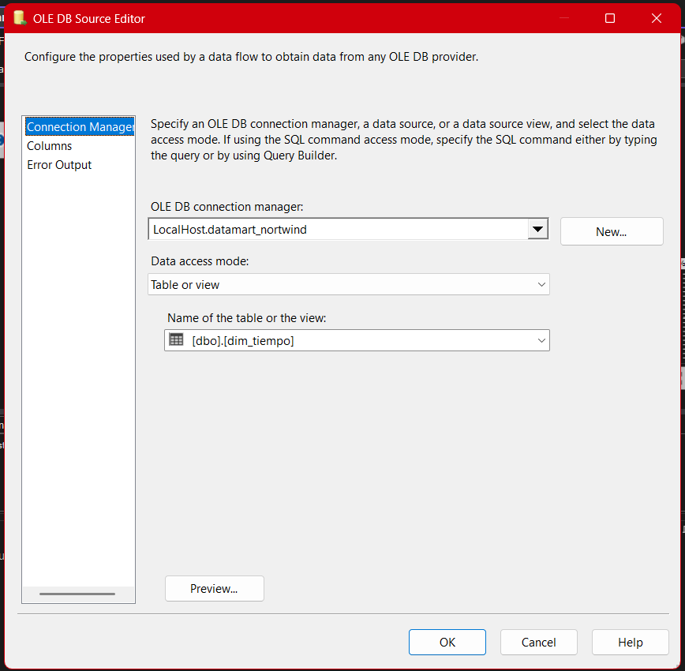
- **Propósito:**
  Permite detectar cuáles fechas ya existen en la dimensión, asegurando **cargas incrementales** y cero duplicidad.
  Esta comparación evita la sobreescritura de fechas históricas y mantiene la integridad de la tabla, crucial para análisis y dashboards.

---

### 2.3. **Ordenamiento de Registros: Rendimiento y Robustez**

- **Componente:** Sort
- **Justificación técnica:**
  El ordenamiento por la clave temporal (`Tiempo_FechaActual`) es **requisito para el Merge Join** en SSIS.

  > [!TIP]
  > Si el volumen de fechas es muy grande, realiza el `ORDER BY` directamente en la consulta SQL del source para optimizar tiempos y consumo de memoria en SSIS.

---

### 2.4. **Comparación e Integración Incremental (Merge Join)**

- **Componente:** Merge Join

- **Imagen:**
  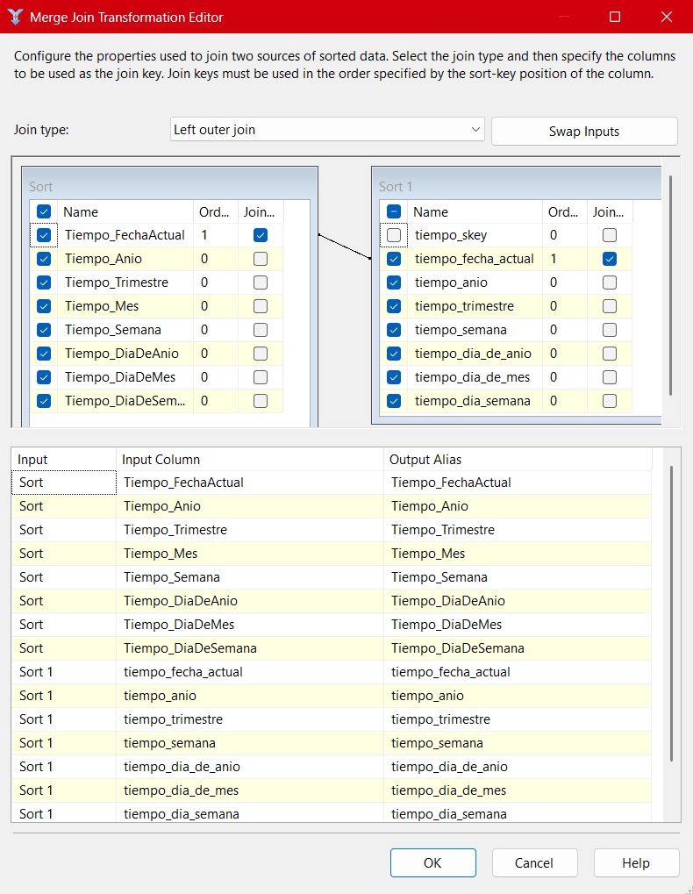

- **Tipo de Join:** Left Outer Join

- **Llave de unión:** `Tiempo_FechaActual`

- **Explicación estratégica:**
  Se usa un Left Outer Join para **detectar todas las fechas presentes en Staging que aún NO existen en la dimensión**.
  Este diseño soporta la _idempotencia_ (puedes correr el flujo muchas veces sin crear duplicados), y mantiene un histórico limpio y confiable.

- **Variante para escenarios avanzados:**
  Si implementas cambios en la estructura temporal (por ejemplo, soporte a semanas fiscales o días festivos), puedes extender el join para considerar nuevas columnas y reglas de correspondencia.

---

### 2.5. **Filtrado de Registros Nuevos (Conditional Split)**

- **Componente:** Conditional Split

- **Imagen:**
  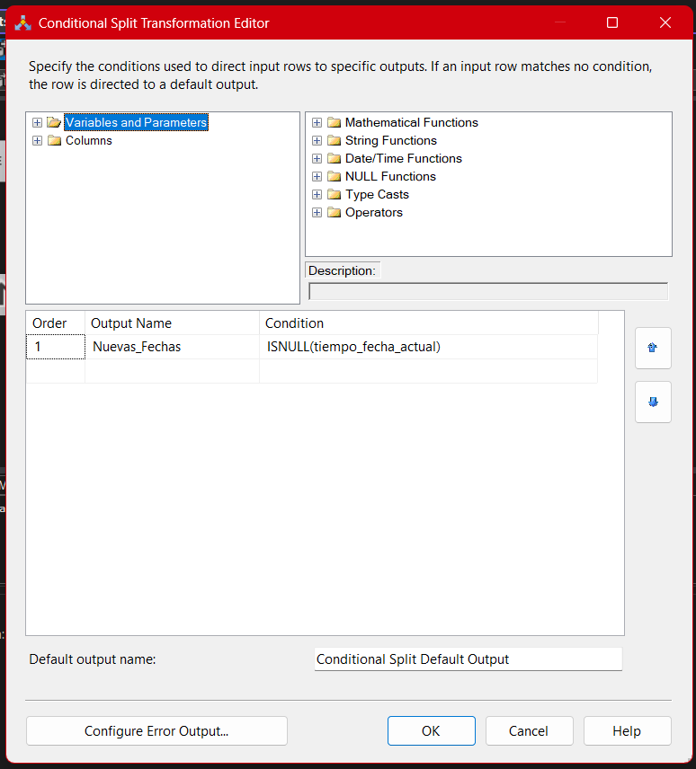

- **Condición:**

  ```plaintext
  ISNULL(tiempo_fecha_actual)
  ```

- **Justificación:**
  Filtra **exclusivamente fechas no existentes** en el destino para mantener la integridad de la dimensión y garantizar cargas limpias e incrementales.

- **Advertencia profesional:**
  Un error en la condición puede llevar a duplicados o a la omisión de registros; valida siempre que la clave utilizada sea realmente única y bien mapeada.

---

### 2.6. **Carga a la Dimensión Tiempo (OLE DB Destination)**

- **Componente:** OLE DB Destination

- **Imagen:**
  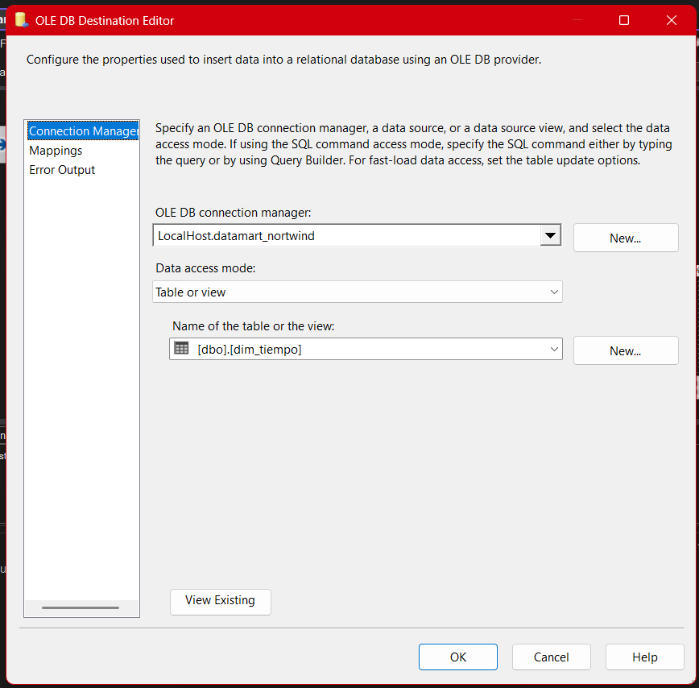

- **Destino:** `[dbo].[dim_tiempo]`

- **Mapeo:**
  Todos los campos temporales van a sus respectivas columnas.
  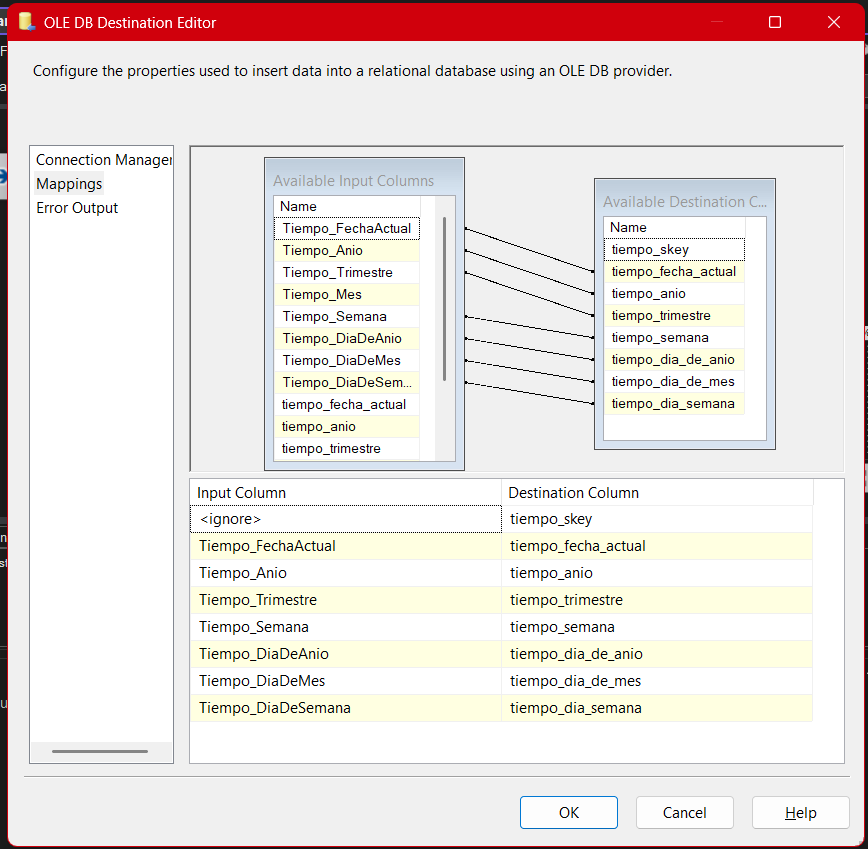

- **Consideraciones de escalabilidad:**
  Si más adelante se requiere granularidad horaria, soporte a distintas zonas horarias o marcadores especiales (festivos, cierres, promociones), la estructura de la tabla y los mapeos deberán actualizarse.

## 3. **Buenas Prácticas, Decisiones de Diseño y Riesgos Profesionales**

### 3.1. **Buenas Prácticas:**

- **Carga incremental real:** Solo se insertan fechas nuevas, nunca se sobreescriben registros históricos.
- **Documentación visual y técnica:** Cada paso documentado con imágenes, SQL y lógica de negocio, facilitando auditoría, troubleshooting y onboarding de nuevos miembros.
- **Escalabilidad:** El modelo es adaptable a nuevos requerimientos (ej: granularidad por hora, marcadores de eventos).
- **Preferencia por SQL en grandes volúmenes:** Ordenamiento y limpieza desde la fuente para minimizar cuellos de botella en SSIS.

### 3.2. **Decisiones de Diseño Fundamentales:**

- **Merge Join + Conditional Split:** Transparente, eficiente y fácil de mantener, ideal para ETL incremental. Es preferible sobre Lookups en flujos simples y auditables.
- **Separación de staging y destino:** Garantiza trazabilidad total, permite reejecuciones ante errores y facilita la reconstrucción del histórico.

### 3.3. **Riesgos Técnicos y Cómo Mitigarlos:**

- **Desfase de fechas:** Si hay fechas inesperadas en staging, pueden contaminar la dimensión. Solución: validación previa en SQL y uso de Data Quality Tasks para filtrar outliers.
- **Errores de mapping:** Cambios de estructura en staging o destino deben reflejarse de inmediato en el flujo ETL.
- **Performance:** Para cargas masivas, considera **particionamiento**, **procesamiento por lotes** o cargar solo periodos nuevos según fecha máxima existente.

---

## 4. **Ejemplo de Aplicación Real y Escenarios de Valor**

**Caso profesional:**
Un analista necesita comparar ventas semanales entre distintos años, identificar caídas durante festivos nacionales y analizar la estacionalidad de productos cada trimestre.
La dimensión tiempo construida así permite crear visualizaciones de “calendario de calor”, identificar “días pico” o generar cohortes por mes de compra.

> [!NOTE]
> Integrar marcadores como “es_festivo”, “es_fin_de_mes”, “es_fin_de_semana”, “semana_fiscal”, habilita dashboards aún más potentes y análisis predictivos.

---

## 5. **Recomendaciones Avanzadas de Mejora Continua**

- **Automatizar pruebas unitarias:** Garantiza que cada fecha sea única y que no haya huecos ni superposiciones.
- **Agregar metadata y tracking:** Campos como fecha de inserción, usuario, y origen facilitan auditoría y trazabilidad.
- **Alertas automáticas:** Si la dimensión no crece durante un periodo esperado, dispara una alerta (ejemplo: el mes no cierra por falta de fechas).
- **Soporte multicalendario:** Considera futuro soporte para calendarios fiscal, gregoriano y hasta periodos móviles personalizados.
- **Versionado e historización:** Guarda versiones o snapshots de la dimensión para permitir auditoría retroactiva ante cambios en la lógica temporal.

---

## 6. **Errores Comunes y Solución Profesional**

- **No se cargan fechas nuevas:**

  - Revisa que la clave del staging realmente contenga nuevas fechas.
  - Valida la condición y el mapeo en Merge Join y Conditional Split.
  - Verifica el orden y unicidad de los datos.

- **Se insertan fechas duplicadas:**

  - Confirma que la clave primaria en la dimensión está activa y correctamente configurada.
  - Verifica que la condición ISNULL apunte a la columna correcta y que el Merge Join funcione como esperado.

- **Bajo performance:**

  - Realiza ordenamiento y limpieza en SQL.
  - Reduce columnas a las estrictamente necesarias para la carga.
  - Usa procesamiento por lotes en cargas masivas.

---

## 8. Notas Mentales

- **Una dimensión de tiempo bien diseñada es la columna vertebral del análisis en BI**: afecta desde reportes simples hasta modelos de predicción avanzada.
- **Documenta y revisa periódicamente** la lógica y estructura: los cambios de negocio suelen impactar primero en el calendario.
- **Haz pruebas de integridad frecuentemente** (¿faltan días? ¿hay solapamientos?).
- **Anticipa nuevas necesidades** (festivos, semanas fiscales, granularidad horaria) para que tu modelo no se quede obsoleto ni pierda valor estratégico.

---

## **Resumen Técnico**

El proceso ETL de la dimensión tiempo en el Datamart Northwind implementa un flujo incremental y auditado que garantiza la consistencia temporal y la flexibilidad para análisis avanzados. Se parte de un modelo staging que consolida granularidades temporales relevantes (año, trimestre, mes, semana, día) y se compara contra el estado actual del datamart para identificar e insertar únicamente fechas nuevas.
El flujo técnico consta de extracción (OLE DB Source), ordenamiento, integración (Merge Join), filtrado (Conditional Split) y carga final (OLE DB Destination), siguiendo principios de idempotencia y trazabilidad.
La solución es escalable (permite agregar granularidades o atributos como marcadores festivos), minimiza riesgos de duplicidad y soporta grandes volúmenes mediante optimización SQL aguas arriba.
Las mejores prácticas incluyen documentación visual, validación de unicidad, soporte para pruebas unitarias, y recomendaciones para monitoreo y mejora continua.

# **Documentación del Proceso ETL para el Paquete Datamart-Fact-Ventas**

## 1. **Introducción**

El paquete **Datamart-Fact-Ventas** constituye la pieza central del Data Mart orientado al análisis de ventas, integrando datos de múltiples dimensiones (clientes, empleados, productos y tiempo) y generando una tabla de hechos (hecha transaccional) con todos los detalles relevantes para análisis multidimensionales. Su objetivo es proporcionar una vista consolidada y optimizada para consultas de BI, dashboards y modelos analíticos.

---

## 2. **Arquitectura General del Flujo ETL**

### 

**(Diagrama: Estructura general del flujo de datos en SSIS para el paquete Fact_Ventas.)**

El flujo se compone de:

- **Fuentes OLE DB**: Extraen datos de staging y de la tabla de hechos actual (para detectar cambios).
- **Transformaciones**: Ordenamientos, uniones, comparación y lógica condicional para detectar nuevas transacciones.
- **Destino OLE DB**: Inserta las nuevas ventas en la tabla de hechos final.

---

## 3. **Extracción de Datos (OLE DB Source)**

### 

- **Conexión**: `LocalHost.stage_northwind`
- **Comando SQL**: Realiza un join entre las tablas de staging y las dimensiones (`dim_cliente`, `dim_empleado`, `dim_producto`, `dim_tiempo`) usando las claves naturales para obtener las claves sustitutas (`_skey`).
- **Campos seleccionados**:

  - Claves foráneas de cada dimensión.
  - Atributos transaccionales: orden de venta, monto, unidades, precio unitario y descuentos.

- **Observación**: Este SQL es fundamental para asegurar la integridad referencial y garantizar que cada registro en la fact table esté correctamente enlazado con sus dimensiones.

---

## 4. **Comparación con la Tabla de Hechos Actual**

### 

- Se utiliza una segunda fuente OLE DB para consultar el estado actual de la tabla de hechos `[fact_ventas]` en el Data Mart.
- El modo de acceso es **Table or View**, recuperando todos los registros para el proceso de comparación.
- Esto permite identificar transacciones nuevas o cambios, evitando duplicados y asegurando solo la carga de datos nuevos.

---

## 5. **Ordenamiento de Datos (Sort)**

### 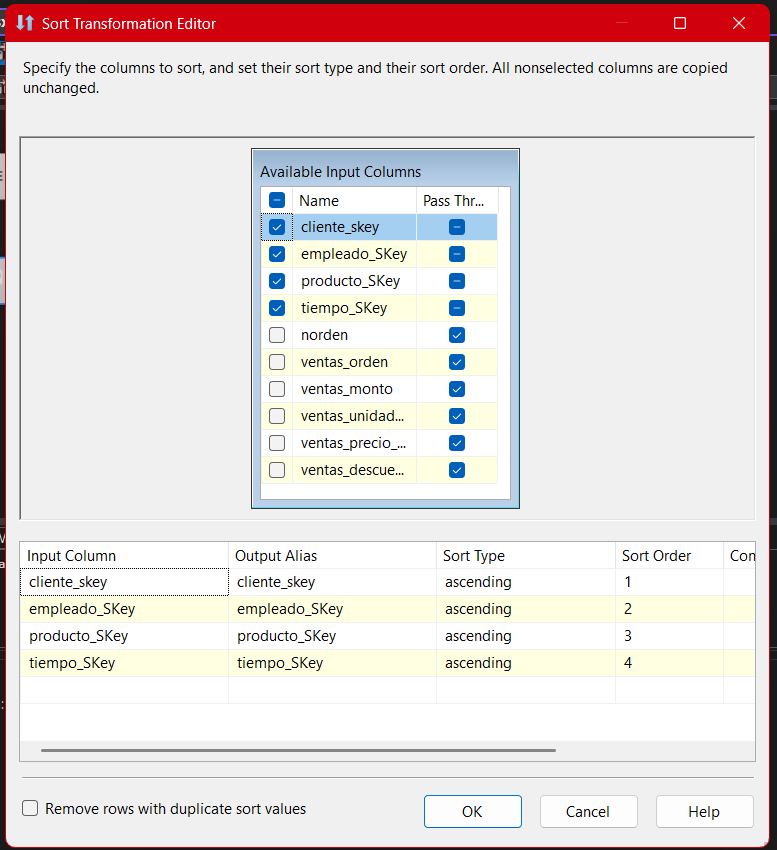

### 

- Ambos orígenes se ordenan por las claves compuestas relevantes (cliente, empleado, producto, tiempo) y campos de la transacción.
- **Importancia**: El Merge Join en SSIS requiere que los datos estén ordenados de manera idéntica para realizar el matching correctamente. Un error en el orden puede causar errores sutiles y difíciles de detectar en la carga de datos.

---

## 6. **Merge Join (Unión de Registros)**

### 

- **Tipo de Join**: Left Outer Join.
- **Propósito**: Permite identificar, para cada registro extraído de staging, si ya existe o no en la tabla de hechos.
- **Claves utilizadas para la unión**: cliente_skey, empleado_skey, producto_skey, tiempo_skey, y otros campos clave de la transacción.
- **Resultado**: Registros nuevos quedan con campos NULL del lado de la tabla de hechos, facilitando su detección en el siguiente paso.

---

## 7. **Conditional Split (Identificación de Nuevas Transacciones)**

### 

- **Expresión**:

  ```
  ISNULL(cliente_skey_Fact_Ventas) || ISNULL(empleado_skey_Fact_Ventas) || ISNULL(producto_skey_Fact_Ventas) || ISNULL(tiempo_skey_Fact_Ventas)
  ```

- **Interpretación**: Si alguno de los SKs (claves sustitutas) del lado de la fact table es NULL, significa que es una nueva transacción no presente aún en la tabla de hechos.
- **Ventaja**: Evita duplicidad de datos y asegura cargas incrementales eficientes.

---

## 8. **Carga al Destino (OLE DB Destination)**

### 

### 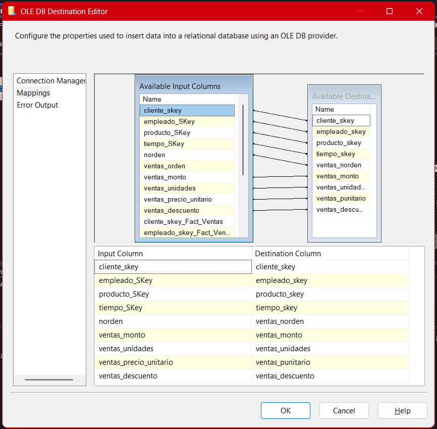

- **Destino**: `[fact_ventas]` en el Data Mart Northwind.
- **Mapeo de columnas**: Cada campo fuente se mapea explícitamente a la columna destino correspondiente.
- **Mejores prácticas**:

  - Validar la integridad referencial (todos los SK deben existir en las dimensiones).
  - Usar transacciones o control de errores para evitar cargas parciales.

---

## 9. **Buenas Prácticas, Detalles Avanzados y Optimización**

- **Claves sustitutas (SKs)**:
  El uso de SKs para vincular dimensiones es crítico. Las cargas de datos deben garantizar que cada dimensión esté previamente poblada para evitar referencias inválidas.
- **Control de calidad de datos**:
  Implementar lógicas de control de errores y reportes de registros rechazados para depuración y auditoría.
- **Escalabilidad**:
  En proyectos más grandes, la carga de la tabla de hechos puede requerir optimizaciones adicionales (paralelización, particionamiento, uso de CDC, etc.).
- **Auditoría**:
  Se recomienda llevar bitácoras de cargas y métricas de desempeño para análisis posterior.

---

## **Resumen Tecnico**

El paquete `Datamart-Fact-Ventas` sintetiza las mejores prácticas de integración de datos en BI, garantizando la consistencia, calidad y eficiencia en la carga de grandes volúmenes de datos de ventas. La estructura modular del flujo facilita el mantenimiento y la escalabilidad del Data Mart a futuro.

---

# **Documentación del Proceso ETL para el Paquete Datamart-Limpieza**

## **1. Propósito Estratégico del Paquete**

El paquete `Datamart-Limpieza` está diseñado para **garantizar la idempotencia y consistencia** de los procesos ETL del datamart, eliminando datos previos en las tablas principales de hechos y dimensiones antes de una recarga masiva. Se ejecuta **antes de cualquier proceso de carga** para evitar inconsistencias, duplicados, residuos históricos y errores de llave primaria.

---

## **2. Diagrama General y Orquestación**

A continuación se muestra la orquestación visual del paquete:

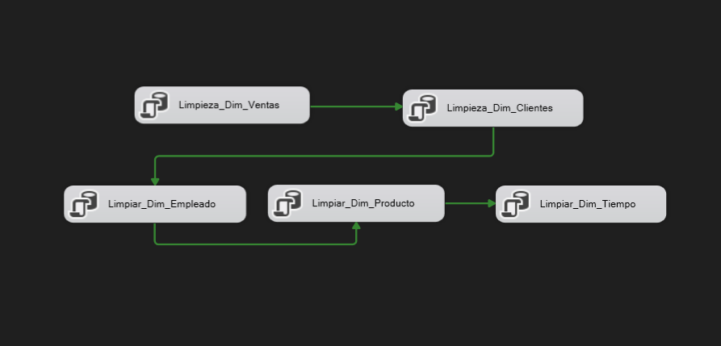

> [!Important]
> El flujo secuencial garantiza que los objetos dependientes se limpien en el orden adecuado, minimizando riesgos de errores por restricciones referenciales.

---

## **3. Desglose de Tareas y Explicaciones Técnicas**

### **3.1. Limpieza_Dim_Ventas**

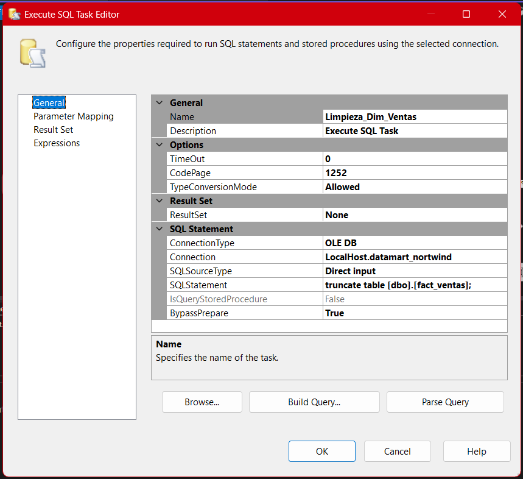

- **Descripción:** Elimina todos los registros de la tabla de hechos principal con `TRUNCATE TABLE`, la opción más eficiente y limpia.
- **Ventajas:**

  - Reinicia el contador de identidad automáticamente.
  - Rápido, ya que borra por páginas, no por filas.
  - No deja registros huérfanos si las relaciones están correctamente definidas.

- **Advertencias:**

  - Requiere que no existan restricciones de clave foránea activas sobre la tabla.
  - No genera registros detallados en el log de transacciones (solo un registro global).

---

### **3.2. Limpieza_Dim_Clientes**

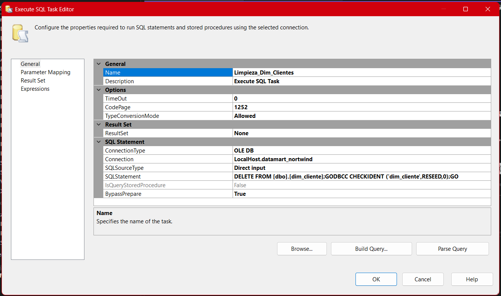

- **Descripción:** Elimina todos los registros de la tabla de dimensiones de clientes utilizando `DELETE FROM`.
- **Consideraciones:**

  - Permite eliminar aunque existan restricciones de clave foránea (si ON DELETE CASCADE está habilitado).
  - Es posible auditar el borrado fila por fila.

- **Práctica recomendada:** Utilizar `DELETE` si necesitas mayor granularidad en el control del log de auditoría.

---

### **3.3. Limpiar_Dim_Empleado**

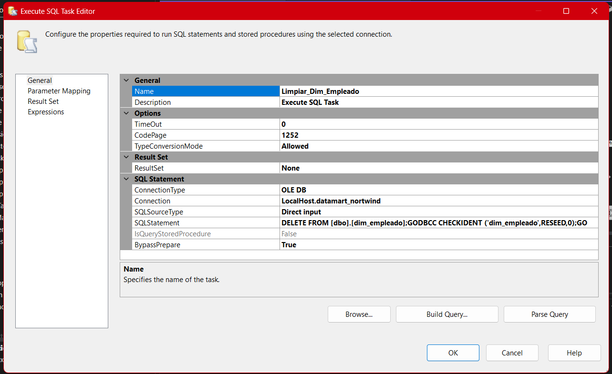

- **Descripción:** Elimina todos los registros de empleados y **reinicia el contador de identidad** usando la instrucción `DBCC CHECKIDENT`.
- **Ventajas:**

  - Evita saltos en los valores de identidad, manteniendo secuencias limpias para futuras cargas.

- **Advertencias:**

  - El uso de `DBCC CHECKIDENT` requiere permisos elevados.
  - Debes asegurarte de que ninguna operación de carga esté en proceso para evitar colisiones de identidad.

---

### **3.4. Limpiar_Dim_Producto**

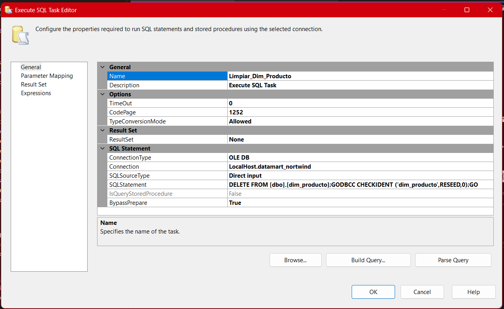

- **Descripción:** Idéntica lógica a empleados, orientada a la tabla de productos.
- **Consideración clave:**

  - Si la tabla crece mucho, evalúa el uso de particiones o truncados periódicos.

- **Mejora posible:**

  - Externalizar la lógica de borrado/reseed a un procedimiento almacenado parametrizable.

---

### **3.5. Limpiar_Dim_Tiempo**

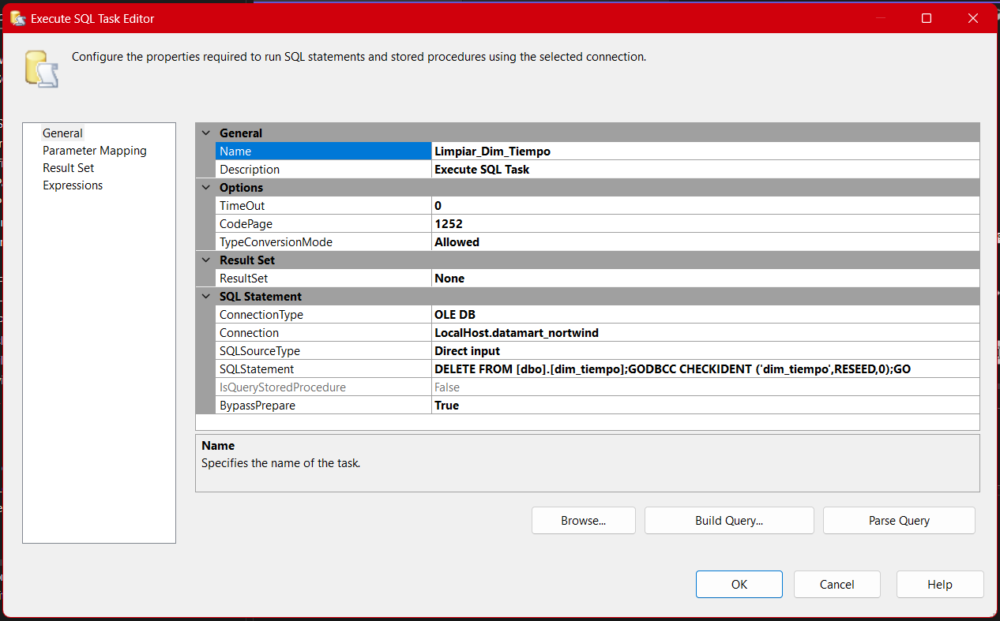

- **Descripción:** Borra todos los registros de la tabla de dimensiones de tiempo y reinicia el contador.
- **Escenario típico:**

  - Útil cuando se desea reconstruir la dimensión de tiempo con rangos distintos de fechas o granularidades.

---

## **4. Detalles de Orquestación, Control y Seguridad**

- **Orden de Ejecución:**

  - Se limpia primero la tabla de hechos (`fact_ventas`) para evitar errores de restricciones de clave foránea.
  - Posteriormente, se limpian las dimensiones en un orden seguro y lógico para el modelo (clientes, empleados, productos, tiempo).

- **Validaciones Previas:**

  - Confirmar que no existan procesos ETL concurrentes.
  - Verificar que las dependencias de integridad referencial están controladas o, preferentemente, deshabilitadas temporalmente si es posible.

- **Respaldo Obligatorio:**

  - Realizar un backup de las tablas involucradas antes de ejecutar cualquier limpieza masiva.

- **Bitácoras y Auditoría:**

  - Registrar la ejecución y posibles errores en logs para facilitar el monitoreo y troubleshooting.

---

## **5. Alternativas y Mejores Prácticas**

- **Uso de `TRUNCATE` vs `DELETE`:**

  - `TRUNCATE` es más rápido y eficiente, pero menos flexible ante restricciones de FK.
  - `DELETE` permite mayor control y auditoría, pero es más lento.

- **Transacciones:**

  - Es recomendable agrupar los pasos en una transacción para garantizar atomicidad: si algo falla, todo se revierte.

- **Procedimientos Almacenados:**

  - Externalizar la lógica para mejorar la mantenibilidad y el control de permisos.

- **Automatización:**

  - Este paquete puede ejecutarse automáticamente antes de cargas completas programadas.

---

## **6. Código SQL Típico Utilizado**

```sql
-- Limpieza de tabla de hechos
TRUNCATE TABLE [fact_ventas];

-- Limpieza y reinicio de identidad para dimensiones
DELETE FROM [dim_empleado];
DBCC CHECKIDENT ('dim_empleado', RESEED, 0);

DELETE FROM [dim_producto];
DBCC CHECKIDENT ('dim_producto', RESEED, 0);

DELETE FROM [dim_tiempo];
DBCC CHECKIDENT ('dim_tiempo', RESEED, 0);
```

---

## **7. Escenarios Críticos y de Mejora**

- **Carga Incremental:**
  Si en el futuro decides implementar cargas incrementales, solo deberías borrar/actualizar registros específicos, no truncar tablas completas.
- **Recuperación ante Fallos:**
  Contempla un procedimiento de recuperación basado en logs o backups automáticos.
- **Ejecución Condicionada:**
  Agrega chequeos automáticos para no limpiar si existen cargas en progreso o conexiones abiertas.

---

## **Resumen Tecnico**

El paquete **Datamart-Limpieza** es esencial para la salud, consistencia y predictibilidad de tu datamart. Un control estricto de su ejecución garantiza la calidad de los datos y la estabilidad del ambiente analítico.

# **Documentación del Proceso ETL para el Paquete Datamart-Carga-Master**

## Descripción General

El **paquete `Carga-Master`** representa el núcleo de la **orquestación ETL** en tu arquitectura de datos. Su propósito es coordinar la ejecución de los paquetes individuales que cargan cada una de las tablas principales (clientes, empleados, productos, tiempo y ventas) asegurando el orden correcto, la consistencia referencial y un flujo controlado de la carga de información en el datamart.
Este paquete no mueve datos directamente, sino que **invoca de forma jerárquica** a los paquetes de carga, convirtiéndose en el punto de entrada ideal para ejecutar el proceso completo de actualización.

---

## Diagrama del Flujo de Control

La lógica de este paquete se puede visualizar en el siguiente diagrama, donde la relación entre las tareas refleja tanto las dependencias naturales entre entidades (por ejemplo, un producto no existe sin cliente, una venta no existe sin sus dimensiones) como las buenas prácticas de orquestación ETL:

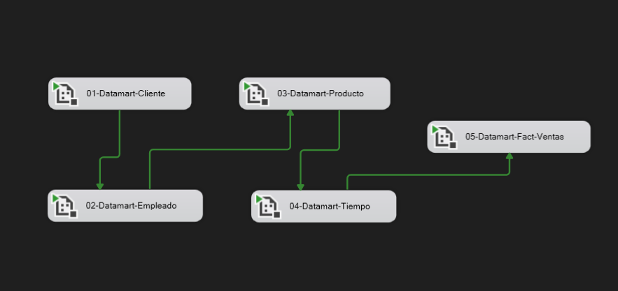

---

## Explicación paso a paso de la secuencia

1. **Carga de Clientes**
   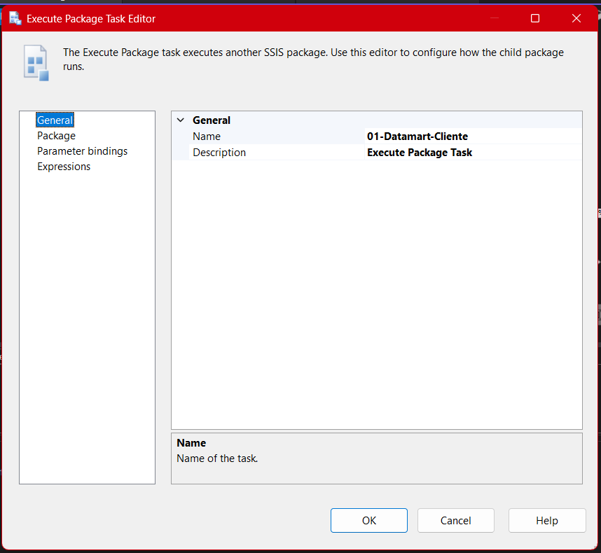
   El proceso inicia con la ejecución del paquete `01-Datamart-Cliente`, el cual alimenta la dimensión de clientes. Esta dimensión es crucial ya que es referencia para empleados, productos y ventas.

2. **Carga de Empleados**
   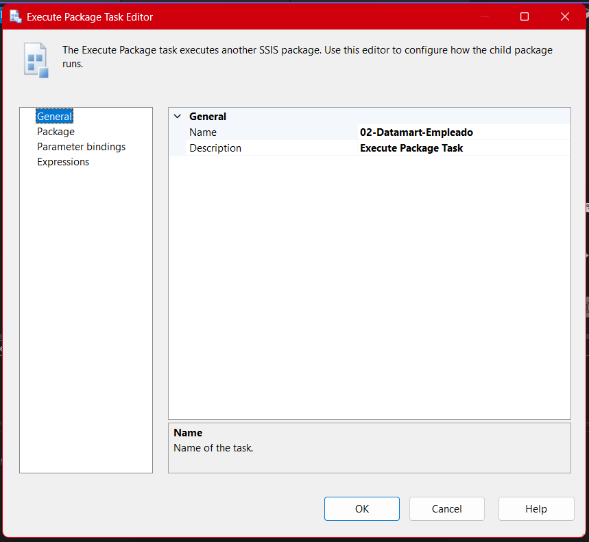
   Una vez que los clientes han sido cargados correctamente, se activa el paquete `02-Datamart-Empleado`, asegurando así que los empleados tengan acceso a todas las referencias necesarias de clientes.

3. **Carga de Productos**
   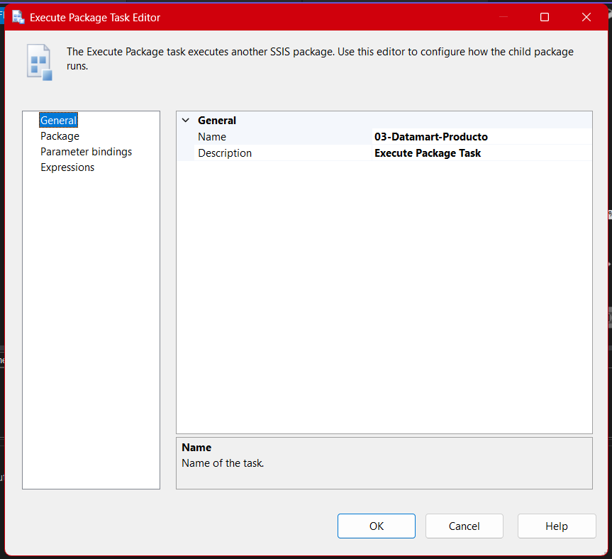
   El paquete `03-Datamart-Producto` depende de la correcta carga de empleados (y de clientes, indirectamente), pues los productos pueden estar relacionados a empleados responsables o vendedores.

4. **Carga de Tiempo**
   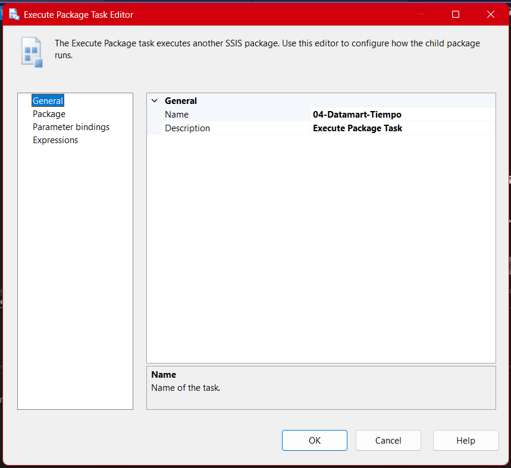
   La dimensión tiempo (`04-Datamart-Tiempo`) se carga después de productos, garantizando que toda referencia temporal esté disponible y alineada para los hechos.

5. **Carga de Hechos (Ventas)**
   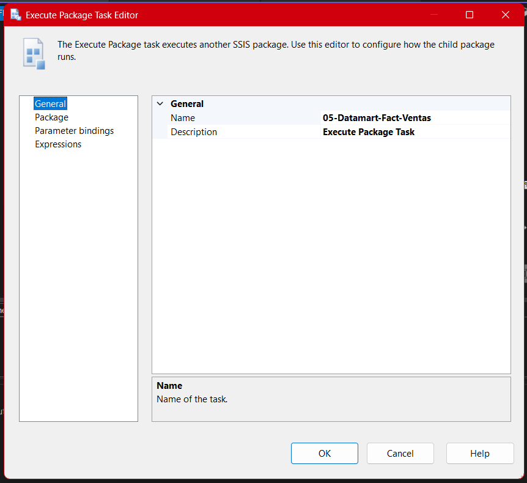
   Finalmente, la tabla de hechos (`05-Datamart-Fact-Ventas`) se alimenta cuando ya todas las dimensiones necesarias han sido procesadas. Aquí se consolidan las referencias a clientes, empleados, productos y tiempo, garantizando integridad referencial total.

---

## Configuración de cada Execute Package Task

Cada bloque del diagrama corresponde a una tarea del tipo **Execute Package Task**, la cual se configura de forma explícita para invocar el paquete ETL adecuado.
Por ejemplo:

- **Configuración de la tarea para cargar clientes:**
  

- **Configuración de la tarea para cargar empleados:**
  

- **Configuración para cargar productos:**
  

- **Configuración para cargar la dimensión tiempo:**
  

- **Configuración para cargar los hechos de ventas:**
  

---

## Consideraciones Técnicas y Mejores Prácticas

- **Secuenciación y dependencias:**
  El paquete asegura que **ningún paquete de carga de hechos se ejecute sin que antes hayan sido cargadas sus dimensiones**. Esto evita errores de clave foránea y asegura la integridad de los datos.
- **Punto de entrada único:**
  Facilita la administración y monitoreo, ya que todo el proceso de actualización se puede ejecutar, reiniciar o auditar desde un solo paquete.
- **Extensibilidad:**
  Si en el futuro se agregan nuevas dimensiones o hechos, simplemente se añaden nuevas tareas y conexiones en este flujo maestro, sin afectar el resto del sistema.
- **Reusabilidad:**
  Cada paquete individual puede ejecutarse de manera aislada para pruebas o cargas incrementales, pero en operaciones completas, el paquete maestro debe ser el punto de inicio.

---

## **Resumen Tecnico**

El paquete **Carga-Master** es el **corazón del control de cargas ETL**, integrando, secuenciando y asegurando la consistencia de todo el flujo de carga de datos en el datamart Northwind.
Su correcta implementación **simplifica el mantenimiento**, reduce errores operativos y es indispensable para garantizar una actualización robusta y confiable del repositorio de datos.
