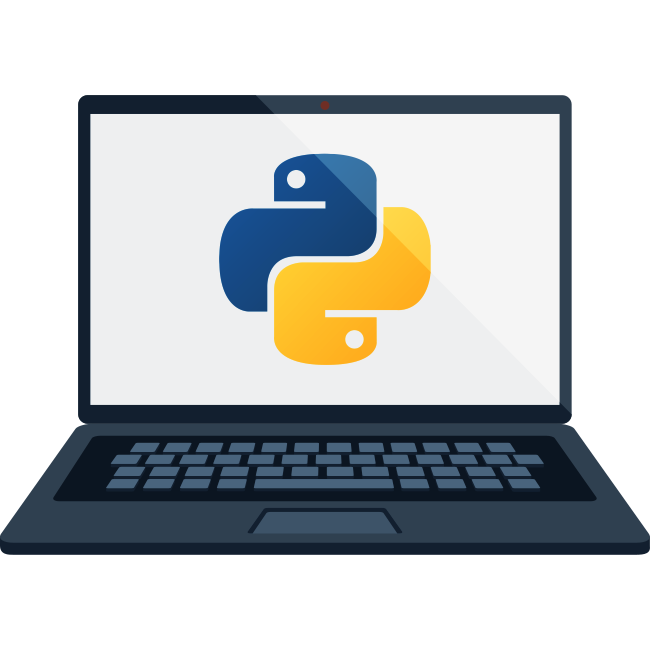

# Analítica de Datos para Negocios Digitales

> [!IMPORTANT] > **Repositorio académico y profesional**
> Universidad Tecnológica de Tula-Tepeji – Ingeniería en Entornos Virtuales y Negocios Digitales

---

## Descripción General

Este repositorio recopila y documenta a fondo los aprendizajes y desarrollos realizados en la asignatura **Analítica de Datos para Negocios Digitales**. Aquí encontrarás ejemplos prácticos, documentación técnica, scripts y soluciones completas para procesos de análisis, integración y explotación de datos utilizando **Python** y herramientas de integración empresarial como **SQL Server Integration Services (SSIS)**.

El objetivo es demostrar, con casos reales, cómo los datos pueden transformarse en valor de negocio mediante técnicas modernas de procesamiento, análisis y automatización.

---

## Temas y Contenido Principal

- **Introducción a la Analítica de Datos y Big Data**
- **Tratamiento y Exploración de Datos**
- **Análisis Estadístico y Visualización**
- **Fundamentos de Python para Data Science**
- **Procesos ETL (Extract, Transform, Load) con Northwind y SSIS**
- **Modelado Dimensional y Data Warehousing**
- **Automatización de Flujos de Datos Empresariales**

---

## Estructura del Repositorio

```
/
├── Imgs/                         # Imágenes de apoyo, diagramas y capturas de flujos SSIS
├── 01-First-Steps-Python         # Scripts y notebooks de Python
├── Documentation/                # Documentación extendida (archivos .md)
│   ├── 01-Introduction.md
│   ├── 01-01-Package-Stage-Employee.md
│   ├── 01-02-Package-Stage-Categoria.md
│   ├── 01-03-Package-Stage-Clientes.md
│   ├── 01-04-Package-Stage-Ventas.md
│   ├── 01-05-Package-Stage-Producto.md
│   ├── 01-06-Package-Stage-Proveedor.md
│   ├── 01-07-Package-Stage-Tiempo.md
│   ├── 01-08-Package-Stage-Limpieza.md
│   ├── 01-09-Package-Stage-Carga-Master.md
│   └── ...otros módulos
└── README.md
```

---

## Proyecto Destacado: ETL Northwind con SSIS

La columna vertebral del repositorio es la **documentación y modelado del proceso ETL sobre la base Northwind**, incluyendo:

- **Diseño y creación de bases intermedias (Stage) y Data Mart**
- **Automatización del pipeline de integración de datos con SSIS**
- **Explicaciones detalladas de cada paquete ETL, con diagramas y fragmentos SQL**
- **Buenas prácticas empresariales y didácticas en ingeniería de datos**

Puedes consultar cada módulo en los archivos Markdown bajo `/docs/`, siguiendo el flujo sugerido desde la introducción hasta la orquestación final (`Carga-Master`).

---

## Recursos Python y Data Science

El repositorio también incluye notebooks y scripts para:

- Limpieza y exploración de datos en Python (pandas, numpy)
- Visualización con matplotlib y seaborn
- Ejercicios prácticos de análisis y preprocesamiento

---

## ¿Cómo usar este repositorio?

1. **Clona o descarga el repositorio** para explorar la documentación y los ejemplos.
2. Accede a la carpeta `/docs/` y sigue la secuencia de archivos `.md` para entender el ciclo completo de integración ETL.
3. Consulta los notebooks y scripts en `/src/` para ejemplos prácticos de análisis de datos en Python.
4. Apóyate en la carpeta `/Imgs/` para visualizar diagramas y procesos.

---

## Créditos y Licencia

Proyecto académico desarrollado por **\JoshTVR**

---

## Vista previa



---
